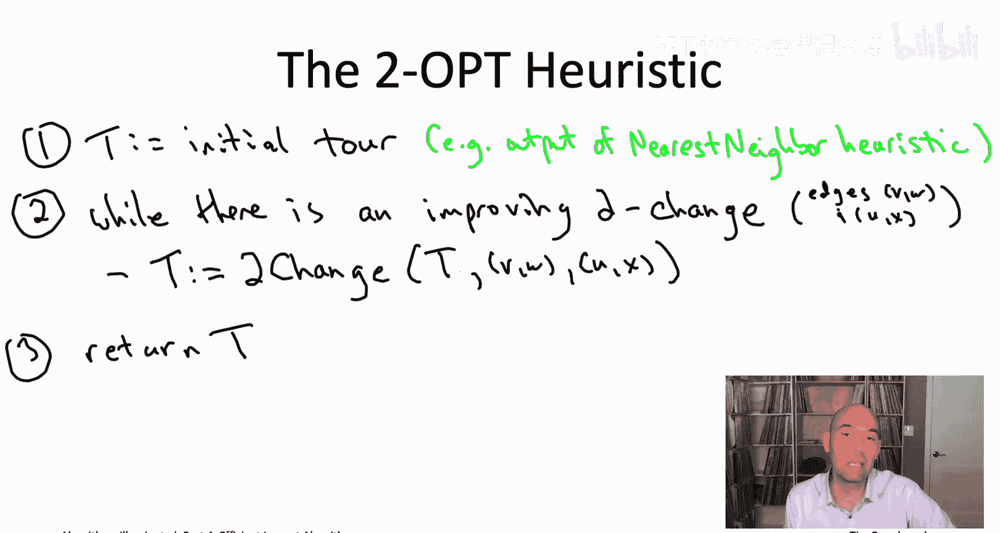
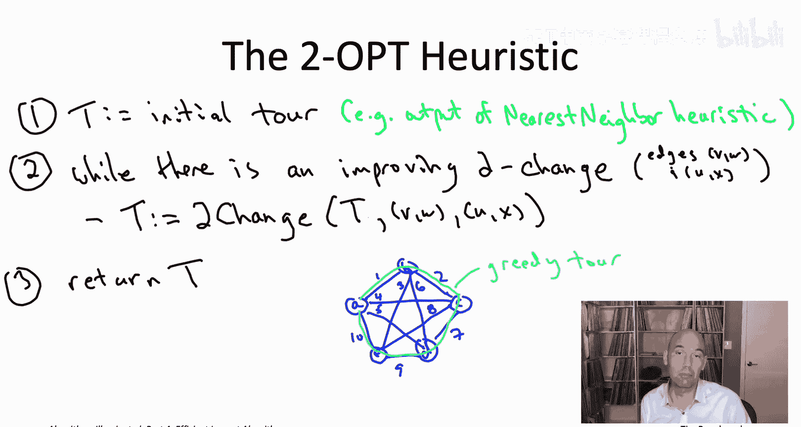
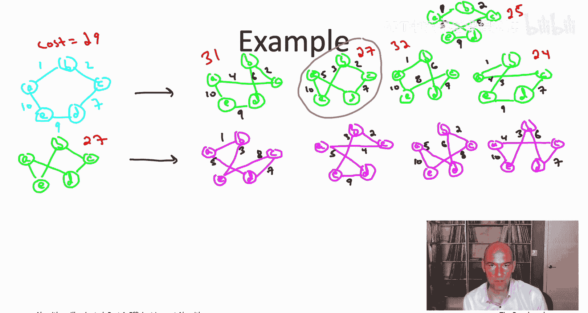
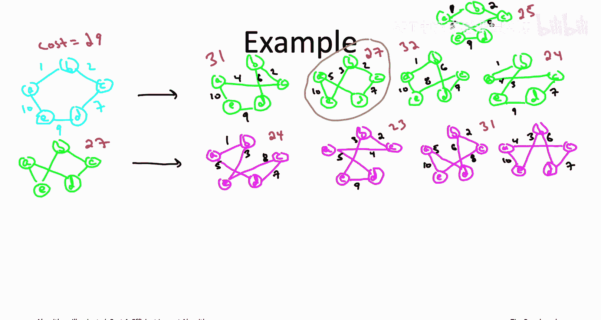
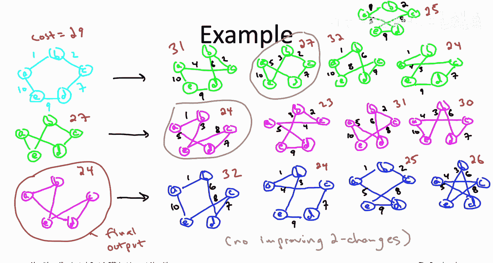
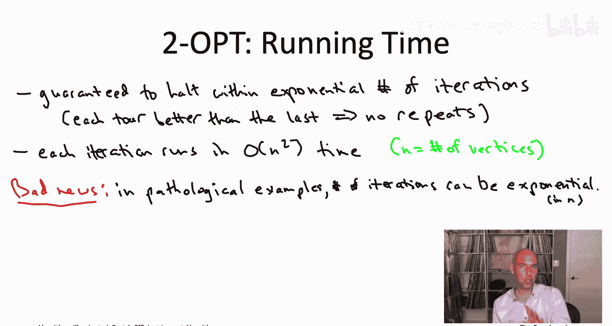
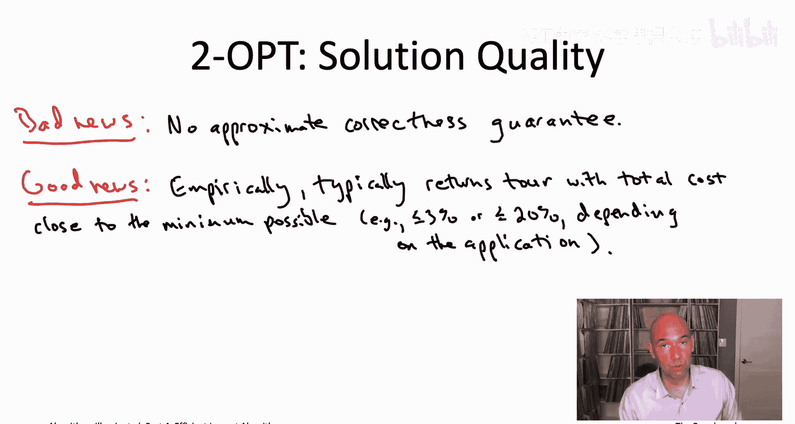

# 斯坦福大学《算法启蒙（第4册）：NP难｜Part 4 Algorithms for NP-Hard Problems》中英字幕（deepseek-R1） p15 -15-20.4_ The 2-OPT Heuristic for the TSP)  -Part 2_2-.zh_en -BV1FAVUzXEum_p15-

So let's see how the two optturistic might work in an example。

 and let's use the same example that we had in a previous quiz。

 I'll draw it again here on the slide to jog your memory。

Let me also remind you that if we run the nearest neighbor heuristic starting from the vertex A。

 what the heuristic winds up doing is up with the tor that traverses the perimeter。

 so that'll be the starting point for our two hop heuristic。

So let's initialize the two optturistic with this light blue tour it has total cost 29。

 we want to know can we make it better with a two change and so one way we can check that is by just enumerating all of the two changes and seeing what each of them do。

How many two change are there Well it turns out that there are five two changes we can mix to this tour turns out in general if you have n vertices the right number is n times n minus3 divided by2 So an n equals 5 that's five times 2 divided by 2 also known as5 so let's go ahead and check what are the five different tours that we can get from one two change from this initial tour that just goes around the perimeter。

You'll notice that each of these green tos shares exactly three out of the five edges of the light blue tour。

 what each of them has three edges along the perimeter and then the two remaining cross edges to connect those three edges into a tor。

So those are the five options。 If we want to make a two change to our current tour。

 And so now the question is， are any of those improving two changes do any of those two changes results in a tour that has strictly less total cost。

 Well， let's just look at the five cases and let's just see what the total cost is of all the tours we could get。

 So， for example， if you look at the first of the two changes， we wind up with a tour with cost 31。

 So that's even worse。 So that's not an improving to change。On the other hand， the second example。

 we wind up with a tour with costst 27， and that is an improvement over the 29 that we started with。

So that's an option to take in the two opturistic。 Are there any others， Well in the third tour。

 the sum of the edge costs is 34。So that's no good， that's a worse tour， sorry 32， excuse me。

 but still a worse tour。The fourth option looks really good right so with that to change。

 we get the total cost all the way down to 24。And the fifth and final two changes also an improving two change it would decrease the cost from 29 to 25。

So in other words， the two opt heuristic has three different options about how to make the tour better。

 the second， the fourth or the fifth of the two changes。

 the Sukobe wrote down was agnostic as to which improving two change you pick when there are many so we're going have to make some decision we'll discuss this again in the next pair of videos but one natural heuristic is just start enumerating the two changes one by one and as soon as you find an improving two change。

 go ahead and execute it， so if we followed that approach in this example we would make the first two changes that improves the second two change and we would move to this tour that has cost 27。

So now we go to the next iteration of the while loop and we repeat the whole process again starting from our new cost 27 tour。

 so we want to examine the five possible two changes from this tour and again see if any of them are improving and then if so improve the tour accordingly Now there are five two changes from this tour but one of them actually just undoes the one we just did one of them just goes straight back to the five cycle so let me just show the four other new tours that we could get to from this one using a single two change。

So those are the four two changes worth looking at the four two changes that will give us new tours and the question now is is any of those four tours still better than the cost 27 tour we're currently working with and again。

 let's just add up the cost for each of them and see what we've got。

Already the first tour we can see has cost 24。 so that actually is an improving two change right there。

 that's less than 27。 The second two change would give us something with still better cost than that23。

Which if you remember back from the quiz， that's actually the cost of an optimal tour。

 that's the best tour of them mall cost 23， the third of the two changes that gives us a tour which has total cost 29。

 so that would not be better， not an improving to change。Excuse me， 31。Well， meanwhile。

 the fourth of the two changes would give us a tour with cost 30。

So once again， the two opt heuristic has two possible options。

 two different improving two changes either or the first two。

 if we're again using this approach where as soon as you find one you go ahead and execute it。

 then we would move next to this cost 24 tour。And now we go to the third iteration of the while loop so we again ask can we make this tour even better through a two change there's again five two changes we could look at and again one of those five is going to take us straight back to the tour we just came from。

 so let me just show you the results of the four other two changes。

So let's again check the cost of each of these four tours， see if any of them are better。

 if any of them are less costly than 24 or current tour。

So the first of those tours has total cost 32， so that's definitely not an improvement。

The second one is actually a tie with the one we've currently got。

 so this is a different tour that also has total cost 24。

 but remember to qualify as an improving to change。

 you need to strictly decrease the objective function， the total cost。

 so this would not actually count as an improving to change。Meanwhile。

 the other two tours are strictly worse， So the third of them has total cost 25。

 and the fourth of them has total cost 26。And so that means this is where the two opt heuristic stops when there's no improving two changes to be made。

 whatever your current tour is， you return that as your final tour so for this particular example。

 this cost 24 tour would be the algorithm's final output。As I'm sure many of you will have noticed。

 this cost 24 tour is not the best possible one， It's close， certainly improvement over the cost 29。

 that was the output of the nearest neighbor heuristic。

 but this algorithm did get stuck at a tour with cost only 24 when a different tour not reachable by one2 change from this one。

 a different tour actually has the smaller cost of 23。

So as always with algorithms you want to discuss what is the running time and to what extent is the algorithm correct。

 so let's start with the running time of the two optimistictistic。First question you might ask is。

 you， is this even going to terminate in finite time or could this wild loop just run forever？

Well remember there's a lot of travelingutling salesman tours as we saw on a quiz a few videos ago it's one half times quantity n minus1 factorial。

 so it's an exponential number of tours， but there's only a finite number of tours Moreover by definition each iteration of the two opt heuristics while loop will strictly decrease the total cost of the current tour remember we went from 29 down to 27 down to 24 So that means you're never going to see a tour more than once because each tour is strictly better than all the previous ones that you've seen so if nothing else even in the doomsday scenario where this algorithm iterates through every single tour it will still terminate in a finite amount of exponential amount of time。

Of course， we've never been satisfied with exponential running time bounds。

 so we have to wonder you know hopefully the two opturistic is faster than that。

 hopefully even it runs in polynomial time。Well whatever the running time is it's going to be the number of iterations of its main while loop times the amount of time you need to execute one of those iterations Now in one of those iterations basically what you do is you search through all of the possible two changes looking for an improving one and that's going to take quadratic time if you implement it appropriately remember the exact number of two changes is n times at quantity n minus3 divided by2 so that's O of n squared possibilities and that'll be the per iteration running time。

So the question then is the number of iterations because there're always guaranteed to be a polynomial number of iterations here I've got some good news and some bad news for you。

 let me start with the bad news， the bad news is that there are in fact a very cleverly constructed pathological examples in which the two opturistic will actually execute an exponential number of iterations of its main while loop。

 those instances really do exist。So that sounds like a disaster that the worst case running time of the two opturistic is exponential。

 sounds like it's a useless algorithm， but actually this is one of those cases where you shouldn't really worry about this at all。

 so let me tell you the two pieces of good news。

The first piece of good news is that you pretty much never see these pathological examples in actual applications on realistic inputs。

 the two opturistic almost always converges reasonably quickly。

 say in a sub quadratic in n number of iterations。So the second piece of good news is you know who said we had to run the two opt heuristic all the way to completion If you look at the pseudocode。

 you realize actually you can interrupt this algorithm whenever you want right it's maintaining a feasible tour throughout execution So for example。

 maybe you initialized it with the output of the nearest neighbor heuristic it's always going to have a tour in hand and that tour will only be getting better it'll always be better than the one that you started with。

So you can just pick how long you're willing to wait for this algorithm to run。

 maybe it's 10 minutes， maybe it's an hour， maybe it's a day， whatever。

 you set a timer and when the timer goes off， if the algorithm hasn't already halted， it'll just say。

 oh， well I didn't converge， but let me tell you about the most recent and best tour that I found。

 here's your final output。Sometimes you hear algorithms of this type called anytime algorithms。

Finally， let's talk about the quality of the solution returned by the two opt heuristic Now it's definitely only going to improve over whatever tour you initialize it with。

 so that's good news that we also know from that example that it's not necessarily going to compute to the best possible tour right in our example it output a tour with Cos 24 but there was a different tour that had cost 23 So once again on solution quality I've got some bad news and then some good news。

Let me again start with the bad news， the bad news is that unlike for the make expand minimization problem。

 maximum coverage and influence maximization where we had fastturistic algorithms with provable approximateimate correctness guarantees。

 two opturistic does not have any approximate correctness guarantee of that form there are in fact。

 you know somewhat complicated and contrived examples where the output of the two optt algorithm is going to be an arbitrarily worse tour than the one that is the best possible。

So the good news is that once again empirically the performance of the two optturistic algorithm is pretty impressive。

 so you know its performance depends a little bit on the application and the types of instances that you're dealing with。

 but it's very， very common that it will return tours that are within say 10 to 20% of the minimum cost to and in many applications actually gets within a few percent quite reliably。

So that's very encouraging obviously it would be nice if we had one of these insurance policies like we had for our greedy heuristic algorithms。

 but at least empirically on the types of instances that show up in real world applications。

 the two opttruistic reliably does quite well outputs tours with total cost not much more than the minimum possible。

And indeed， when someone from industry asks me for help on a problem that looks more or less like the TSP。

 I'll usually recommend to them that they start with the two optruistic augmented with some of the bells and whistles that we'll talk about in the next video so if you find yourself having to tackle a TSB type problem in one of your own projects。

 this is an excellent starting point。In the next video。

 let's move on to zooming out and I'll show you how this too optt exemplifies the principles of local search。

 see you then。

