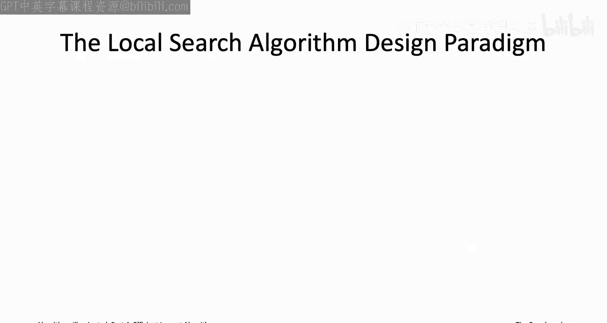
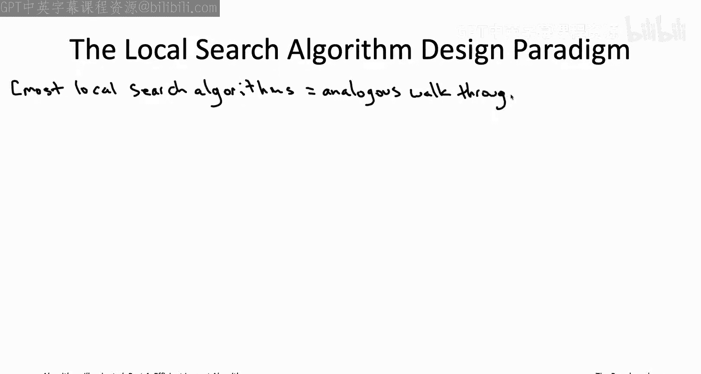
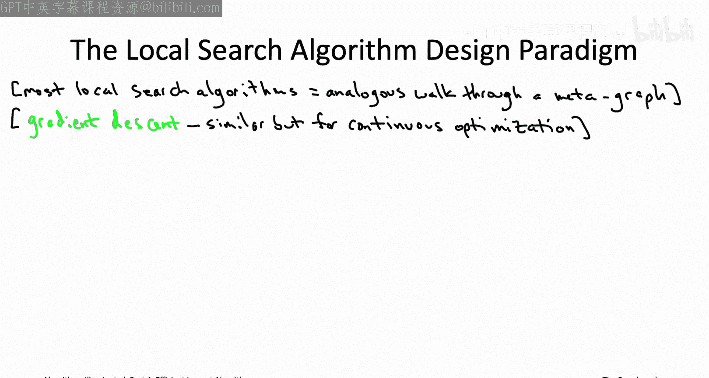
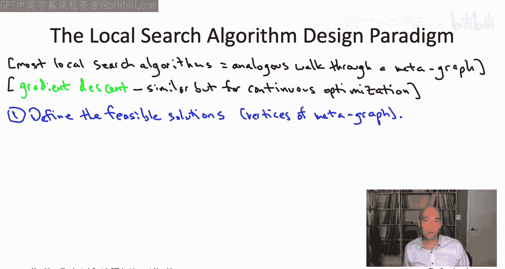
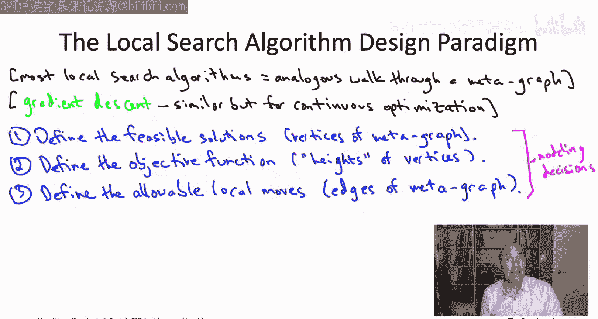
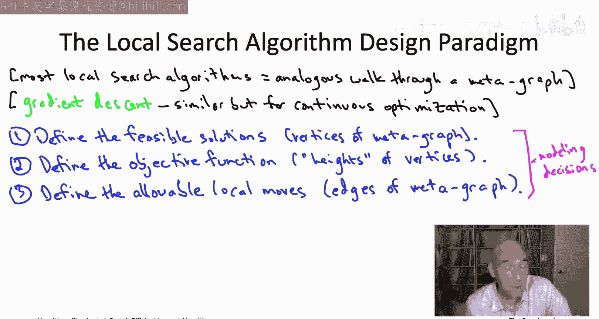
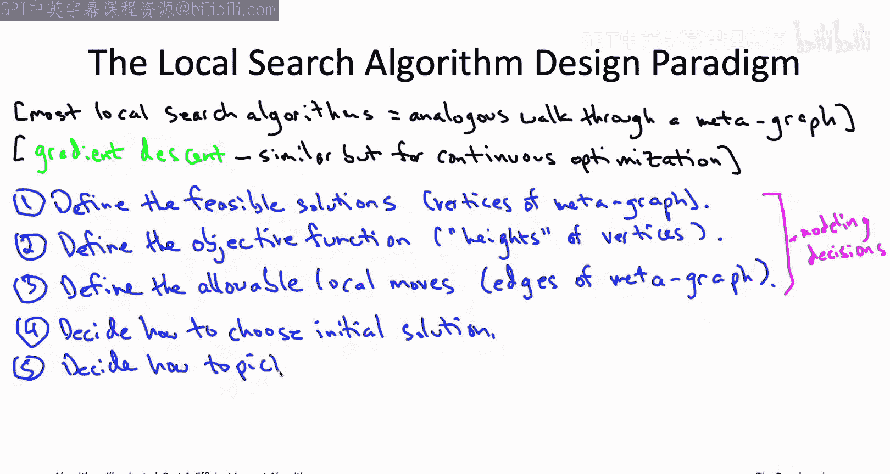
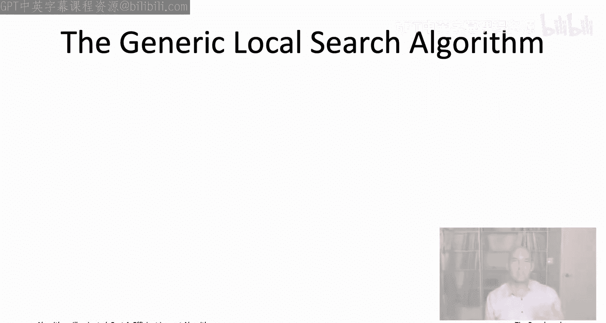

# 斯坦福大学《算法启蒙（第4册）：NP难｜Part 4 Algorithms for NP-Hard Problems》中英字幕（deepseek-R1） p16 -16-20.5_ Principles of Local Search)  -Part 1 of 2-.zh_en -BV1FAVUzXEum_p16-

Hi and welcome to this video that accompanies Section 20。5 of the bookArithms illuminated Part four。

Arithms for A Hard Pro。So this section is about the principles of local search so a local search algorithm is an algorithm that explores a space of feasible solutions via local moves。

 successively improving an objective function value So the twoh heuristic for the TSP that we saw on the last couple videos that's a totally canonical example of the local search algorithm where the local moves corresponded to the two changes discussed in that video so what I want to do now is zoom out and isolate the essential features of the local search algorithm design paradigm together with the key algorithmic and modeling decisions that you need to make in order to apply this technique effectively in your own work。

So with an eye toward explaining to local search in general。

 let's quickly revisit that twoopturistic for the traveling salesman problem that we discussed in the last couple videos in particular。

 I want to think about the two optturistic as a walk through a really big graph I'm going to explain to you this really big graph which I'm going to call the metagraph in terms of the five vertex TSP instance we had running through the last couple videos so let me just remind you about that five vertex instance putting it in the upper right of this slide So the vertices of the metagraph are going to correspond to the traveling salesman tours of this instance Now this is a five vertex instance and so if you remember the formula for the number of tours was one half times quantity n minus1 factorial so n minus1 factorial is 24 half that is 12 so that means this metagraph is going to have 12 vertices in this case for this five vertex TSP instance。

So let me arrange these 12 tours into four rows at the top we're going to have that perimeter tour。

 the same one that was the output of the nearest neighbor heuristic at the bottom we're going to have the complement tour that has none of those five edges and all of the other five so sort of looks like a star and then the other 10 tours I'll put in the middle two rows and you'll see in a second why I'mrranging them in this way。

So those are the 12 traveling salesman tours of this instance。

 let me now annotate each of those 12 with their cost。

So finally let me tell you about the edges of the metagraph so the edges of the metagraph will correspond to two changes so in other words。

 two tours of the metagraph they will be connected by an edge of the metagraph if and only if you can get from one to the other using a two change equivalently two tours are connected if they share three out of their five edges So for example。

 consider the to on top so of the cycle around the perimeter remember this was the output of the nearest neighbor heuristic on this particular instance and this is also where we started our example tracing through the two opturistic to see what it would do on this example。

So if the patterns in the second row， those that first list of five tours， if that looks familiar。

 that's because those are exactly the five tours that we examined in the first iteration of the two optistic when we ran through that example in the previous video so in other words the five neighboring tours of this top tour are exactly the five tours in the second row。

So the bottom half， the bottom six tours are in some sense a reflection of the top six where we just toggle which edges are in and which are out。

 so the tourr on the bottom that's all the edges missing from the top tour and correspondingly it's connected by a two change to each of the five tours in the third row。

All right so how about the rest of the edges Well you might remember that you know there was always five two changes you could take from a tour and a five vertex instance so we should expect to have five incident edges around each of these tours so we're all set for the top all'll set for the bottom but we expect each of the tours in the second and third rows to have four more edges incident to them and I've drawn the tos in such a way that those four incident tours there're going to be tos in the other row so if you're in the third row you'll be adjacent to ones in the second row and vice versa and moreover the four out of the five that you're adjacent to are all of those that are not in your same column so for example the third tor on the second row it's going to be adjacent to all of the tos on the third row except for the one immediately below it。

And now we see that indeed that costs 32 tour the middle one in the second row now it has five edges around it so it's exactly the same for all the other tours in the second and third rows。

 I'll fill in some of those edges I'll also leave some of those edges out because it would just clutter the picture too much to have them all in there So that's the definition of the metagraph associated with an instance of the traveling salesman problem the vertices of the metagraph correspond to tours of the TSB instance and two tours are adjacent in the metagraph if and only if they differ in only two edges。

Why am I torturing you with this metagraph Well we can actually visualize the two opturistic really。

 really nicely in terms of this meta。So remember in our running example。

 we started with the output of the nearest neighbor heuristic， and that was this tour on the top。

And then the way the two opturistic worked is we were going to take a two change so in other words the next thing the algorithm is going to do is it's going to follow a one hop path in this metagraph to one of the neighboring tours like in the example there are five options。

 five different tours you can reach by a two change and as you saw in that example three of those five tours have strictly smaller total cost so three of these two changes are improving the ones corresponding to the cost 27 costt 24 costt 25 tours。

So the two opuristic could have picked any of those three that would have been a valid execution We dealt with the variant where it takes the first improving two change that it finds so that led it to follow the second incident edge out of that top tour winding up at the cost 27 tour the second one in the second row so we've taken one hop in the graph we've gotten do a new tour that was exactly the second tour adopted by the two optistic in our example now we just do it again we're going take a walk of one more hop in this graph there's again five options。

 five neighboring tours we check if any of them are improving and indeed there are as we saw there were two improving two changes corresponding to the first and third tours in the third row so again if we just take the first one that we find then we're going to wind up walking in the metagraph from the cost 27 tour to the cost 24 tour。

So after making these two two changes that is after taking two steps in this metagraph we wind up at this cost 24 tour and now we do it again we say okay those's five places we could go to from here are any of them improving and here the answer is no In fact there's only one better tour of them all。

 the cost 23 tour but that's in the same row as the tour we're at and remember no two tours in the same row turn out to be adjacent the way I've drawn the picture so the cost 24 tour is not adjacent to the cost 23 tour。

 all of the adjacent tours have cost 24 or more which means this is exactly where the two opturistic is going to stop。

So more generally any execution of the two opuristic for any TSP instance can be viewed as a walk just like this in a suitable metagraph。

 vertices correspond to tours， Tos are adjacent if they're connected by a twoed。

 what is two opts really doing it's following a path through this metagraph is at tour after tour after tour with the property that each one has strictly smaller cost and the previous one until it can't continue the walk any further so this metagraph is going to be very important in this pair of videos so let's have a quiz to just make sure that the definition is crystal clear。

So the question then is， suppose I give you a TSP instance with some number n of vertices where it is at least four say。

 how many vertices and edges does that metagraph actually have？All right。

 so the correct answer is the first one， answer A。I guess one way you could figure out the answer is just by counting up the number of vertices and edges in our n equals five example and seeing which of these is consistent with that。

 but let's have a more general argument about why this is true so the easier question is the number of vertices from vertices of the metagraph correspond to tours in the TSB instance and actually you might recall that we had a quiz back when we were first talking about TSB where we counted up the number of different traveling salesman tours and that number was one half times quantity n minus one factorial that's the number of tours towardss correspond to vertices of the metagraph so that's the number of vertices in the metagraph。

So that narrows it down to either answer A or answer B So how about the number of edges and this is what's a little more interesting So one way to count up the number of edges in a graph is to go through the vertices one by one。

 see how many edges are incident to that vertex and add up the results。

And then you also have to remember to divide by two at the end because that process counts each edge twice once from either endpoints。

So let's do that here。 So how many vertices do we have， Well we already solved that。

 we know the number of vertices is one half and minus1 factorial。

How many edges are incidents to a given vertex that is for a given tourr。

 how many incident tours are there， how many different tours can you get to via a two change Well we already saw that in the case where n equals5。

 the number is5 adjacent tours and in general， if you do the counting you will see that there is n times n minus3 over two adjacent tours in an n vertex TSP instance。

So we multiply those two numbers together， the number of vertices times the number of edges incident to each vertex。

 remember that we're double counting because each edge gets counted once from each of its two endpoints so we divide back by two and we get the final answer and if you sort of look at that expression。

 it's going to be able to n factorial times n minus3 over8。

So now I want to move on from the specific case study of the traveling Salman problem in the twoopturistic and discuss local search algorithms much more generally。

What's cool is that most local search algorithms can be viewed just like what we just saw。

 it's literally just a walk through a meta of the feasible solutions。

If you want you can even add a third dimension to the visualization where sort of the heights or the altitude at a given point at a given feasible solution corresponds to that solution's objective function value so in a minimization problem like the TSP that we were just looking at this walk is always going down it's going to feasible solutions that are lower altitude if it was a maximization problem you'd be climbing up and indeed it's very common to hear local search known as hill climbing and it's because of this visualization for a maximization problem you're taking steps through this metagraph always going higher and higher。

So most local search algorithms can be visualized exactly like this as a walk in a metagraph of feasible solutions。

 the different local search algorithms differ primarily in their choice of the metagraph。

 so obviously for different problems you're going to have different feasible solutions or different vertex sets。

 but even for a fixed problem， you can have different local search algorithms define the edges of the metagraph differently。

 that is they can have different definitions of which feasible solutions get to be adjacent in the metagraph。

And then the second main way that different local search algorithms differ is the way in which they explore the graph。

 and we'll have a lot more to say about that in the next video。

You're also likely to come across local search algorithms in the context of continuous optimization as opposed to the discrete optimization problems that we're talking about here。

 and the most famous of those is an ancient algorithm known as gradient descent。

 which is really just hill climbing， but we you're doing hill climbing over all points in Euclidean space。

 rather than over this finite set of discrete solutions。

One reason you're likely to be hearing about gradient descent these days or perhaps its stochastic gradient descent variant is that that algorithm is really the workhorse behind how modern machine learning works。

 so specifically supervised machine learning likes say training a neural network to make good predictions that neural network training is done using variants of gradient descent that's another famous local search algorithm doesn't quite fit into our paradigm but it's very much in the same spirit。

So let's now really spell out what are the details of the local search algorithm design paradigm。

 how would you apply this to a problem coming up in your own work。

 let me break it down into six steps。

So the first three steps all involve defining the appropriate meta for your application so we start with the vertices ver vertices are supposed to correspond to feasible solutions。

 so step one is just figure out what feasible solutions means in the problem that you care about for the kind of cut and dried problems we're talking about in these videos this answer is usually straightforward if you're working on the TSP the feasible solutions are going to be the Tos if you're looking at makepan minimization the feasible solutions are going to be the possible schedules。

Step number two， remember in our metagraph for the TSP we didn't just have vertices and edges Also each vertex was labeled with its total cost。

 that is we had an objective function that we wanted to minimize and in general to apply local search you need to articulate what it is you want to either maximize or minimize that is what is your objective function or what are the heights if you're thinking about that 3D visualization of the various vertices in your meta again for the kinds of problems we're going be looking at the answer will usually be obvious so traveling salesman problem it's part of the problem definition you care about total cost Makepan minimization it's again part of the problem definition you care about minimizing the makepan and applications this can sometimes be a tricky step and you mean need to experiment with different objectives to see what gives you the best results。

And finally to complete the description of the metagraph。

 you of course have to say what the edges are， that is which feasible solutions are you going to deem as adjacent。

 that is what are your local moves， remember edges of the metagraph correspond exactly to the allowable local moves。

So these three steps are really modeling decisions and you have to make them before you even sort of start thinking about implementing your local search algorithm right your first two steps are basically defining the problem precisely what's allowable so what are the feasible solutions and what is it you want。

 what are you trying to maximize or minimize and then of course before running local search you have to say what local searches allowed to do that is what are the allowable local moves。

Now， even after you fully defined your meta， you have a couple of decisions you need to make that are more algorithmic in nature。

So step four is just you need to answer the question of how are you going to initialize the local search algorithm that is from which feasible solution are you going to start this walk through this meta graph？

For example， in our TSP case study， we normally thought of starting from the output of the nearest neighbor heuristic。

 of course we could have made other decisions， but that was the particular initialization step that we made in the last couple videos。

So step  five is again an algorithmic question to concern sort of the details of how you implement your local search algorithm。

 which is you know as we saw in our TP examples， you might have multiple improving local moves available from a feasible solution and you then need to make some decision about which of those you're going to actually perform for example in our TSP running example。

 we always just picked the first improving local move that we found once you've answered all five of these questions。

 you're good to go now just your local search algorithm writes itself you've got your metagraph that's what you defined in steps one through three you know where to start that the answer to step4 and you know how to take each step among all of the steps that you could take among all of the improving local moves。

 your answer to step5 tells you exactly which one to take。

So just to make sure this is crystal clear， let me give you some pseudocode for the generic local search algorithm so the algorithm which you can just run after you've made your decisions in steps one through five of the paradigm。

 the pseudocode is going to look exactly like the two opuristic for the TSP just for sort of a generic problem and a generic notion of improving local move。

So first you just start from some arbitrary feasible solution and the whole point with step4 is to figure out exactly how you're going to do this initialization。

 then you just again have a main while loop where as long as there's an improving local move。

 a local move you can take from the current solution that gives you a strictly better objective function value。

 bigger for a maximization problem smaller for a minimization problem as long as you can do that you continue to do it you take an improving local move as long as you can there may be many from a given feasible solution。

 but the whole point of step5 is to resolve the ambiguity when there's multiple moves。

 which one should you pick so in the main while loop you just invoke whatever decision you made in step5。

Eventually local search will terminate because the objective function value keeps improving with every iteration and at the end you will have a solution from which there is no improving local move。

 every local move either keeps the objective function the same or makes it worse that type of solution is something known as a local optimum a local optimum is one that cannot be improved by any local move。

So at an abstract level that is exactly local search so you have to make these three modeling decisions and steps1 through three。

 the two algorithm decisions and steps4 and5， and then boom you've got your generic local search algorithm which you can simply apply So this discussion may all feel a little abstract we do have the oneK study with the two opturistic for the TSB but still I want to spend the next few minutes giving you a bunch of concrete examples of how steps1 through five might work out。

Let's start with the first three steps where you are defining your meta of feasible solutions。

 and let's look not only at our running TSP example。

 but also at two other problems that we design fastturistics for the Makepan minimization problem and the maximum coverage problem。

So how about step one finding your feasible solutions well for the TSP of course this would just be the tours so there'd be one half times quantity n minus1 factorial feasible solutions for an n vertex instance make span minimization well they're the feasible solutions are going to be schedules so if you have n jobs and M machines then there's M different places you can put each of the n jobs so that's going to give you a total of M raised to the n different schedules so those are going to be the vertices of the metagraph if you were applying local search to make span minimization and maximum coverage where you're given a collection of M subsets of some ground set and you have to pick K of them to maximize the coverage they are feasible solutions would just correspond to subsets of Carinal be K of size K from those M subsets you're given so that would be M choose K different feasible solutions for maximum coverage。

Step two， defining your objective function， not much to say in our running examples。

 TSP by definition it's the total cost to make expand minimization。

 so to make expand objective and maximum coverage， it's the coverage objective that you want to maximize。

Now notice once you've made these first two decisions。

 what are the vertices of your metagraph and what's the objective function value at this point you already know what the Holy Gil solution is。

 that is you already know the global optimum of an instance。

 that is just the feasible solution with the best possible objective function value。

 like in our5 vertex TSP example， the To with costs 23。

We're only going to be able to speak about local Opima after we answer the question to step three after we define what are the allowable local moves So we've seen one example of a choice of allowable local moves that was the two optturistic for the TSB where local moves correspond to two changes when we talked about make expand minimization or maximum coverage we weren't actually using local search so there was no need to define allowable local moves but we could now step back and say well I suppose we did want to approach those problems by local search how would we do it so for make expand minimization or feasible solutions or schedules probably the simplest local move you could imagine is just reassigning one job so you take a job that's on some machine and you just reassign it to one of the other M minus1 machines。

That would mean from each schedule， there would be N。

 the number of jobs times quantity M minus1 or M is the number of machines。

 n times quantity M minus1， different neighboring schedules。

 different schedules you could go to via a local move。

For the maximum coverage problem or feasible solutions correspond to collections of k of the given subsets。

 probably the simplest local move would just be a swap so if you have a current collection of K subsets you would take one of them out and replace it with some different one and now you'd have a new collection of K subsets hopefully with more coverage so there you have a K different choices of which subset to take out and you have M minus K choices for which one to put in so there you'd have K times M minus K neighboring solutions from each feasible solution。

And so once you've answered step three， you've now fully specified what are the local optima of the instance of the problem that you care about so like in our running five vertex TSP example。

 we had two local Opima， the first and third tours from the third row。

 the first of those was not a global optimum， not a global minimum but the third one in the third row was a global minimum。

In the context of make expand minimization， if local moves are just reassigning one job。

 then a locally optimal solution is one where any single job reassignment fails to make the makepan smaller okay so every job reassignment makes the makepan either stay the same or get bigger。

 similarly a locally optimal solution in maximum coverage if we're using swaps for local moves。

 that's going to be a collection of K subsets where swapping in any new subset for one of your own fails to increase the coverage。

 leaves the coverage the same or makes it even smaller。

So we saw a number of examples through quizzes of makepan minimization and maximum coverage feasible solutions。

 I encourage you to go back and revisit the examples that we saw and examine which ones are in fact locally optimal and which ones could be improved by doing further local search on top of it you will find examples of both types and actually this is touching on one of the sort of really no brainer uses of local search which is as a postproces step to further improve the output of some heuristic algorithm like for example。

 a greedy algorithm so back when we were doing Graham's algorithm or LPT or the maximum coverage algorithm we didn't do it but we could have tacked on at the end a postproces step that then did further local search to give us a still better solution that's something you might want to consider when you're implementing those algorithms in practice。

