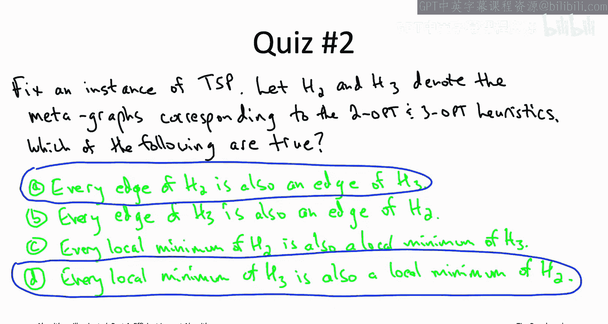
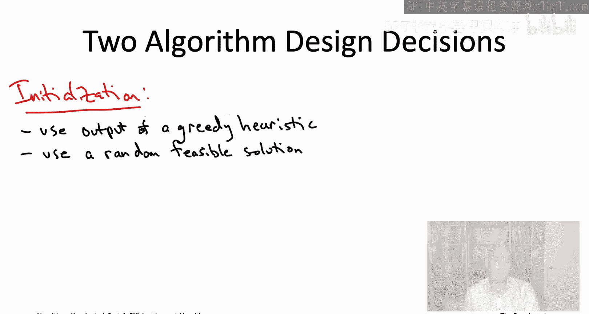
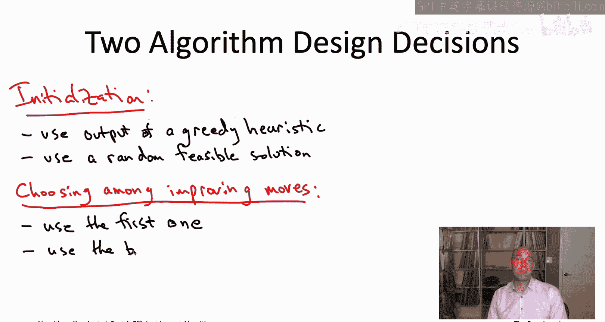
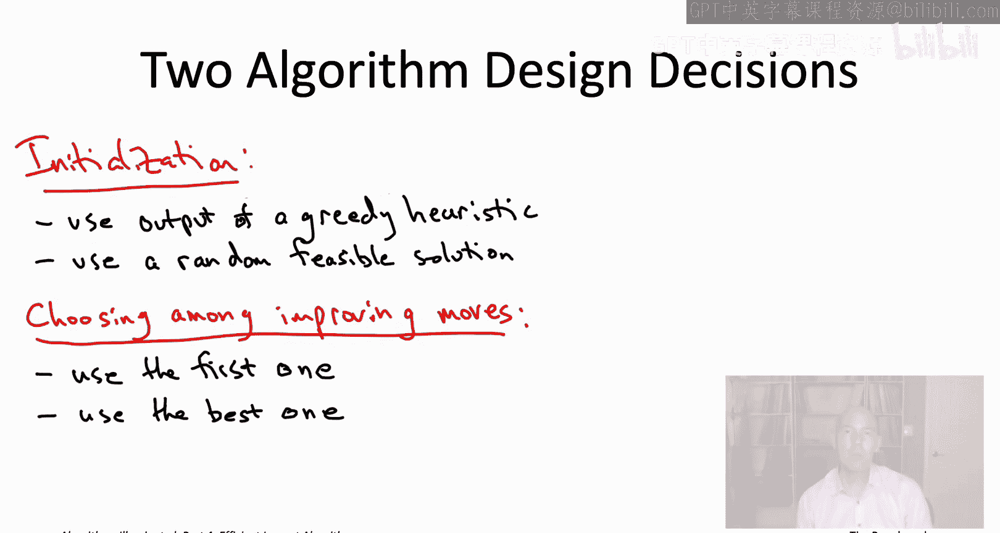
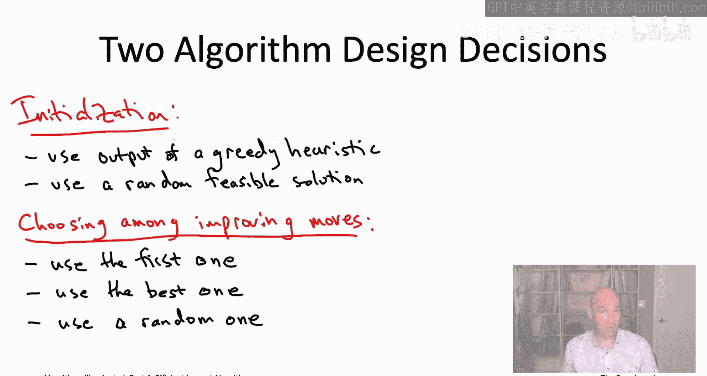
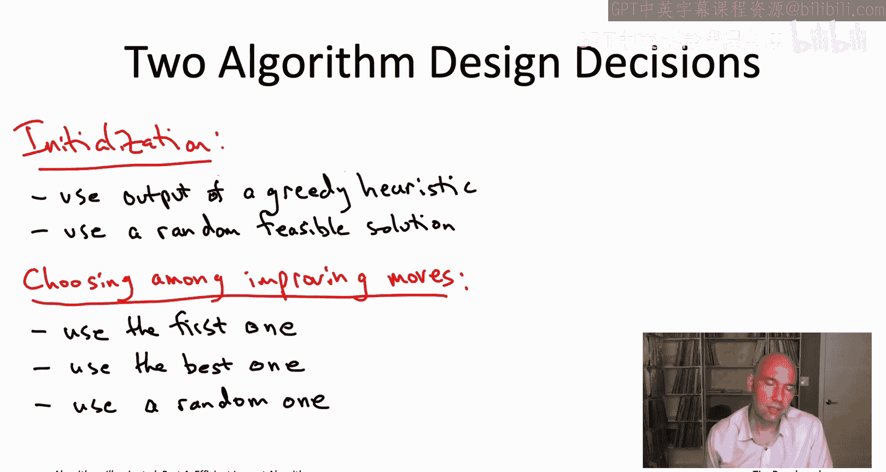
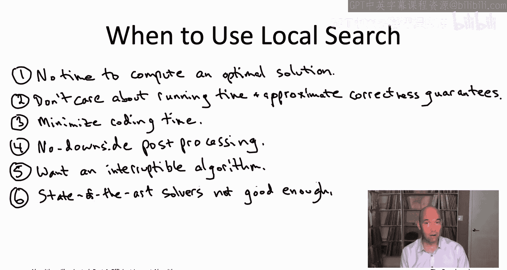

# 斯坦福大学《算法启蒙（第4册）：NP难｜Part 4 Algorithms for NP-Hard Problems》中英字幕（deepseek-R1） p17 -17-20.5_ Principles of Local Search)  -Part 2 of 2-.zh_en -BV1FAVUzXEum_p17-

So there are different ways to apply local search to the same problem。 In other words。

 even once you know the answers to step 1 and2。 so you know what your problem is and you know what the global optima are。

 there's different reasonable choices of step3 to illustrate this let's go back yet again to the traveling salesman problem So we looked at two changes is allowable local moves where we take out two edges and then put two back in。

 who says we can only swap pairs of edges at a time。

 Why not three edges at a time or maybe even more let's start with the three op heuristic where you take three edges out of a tour and then put three back in in each iteration of local search。

 So for example， we can look at this cartoon and the light blue tour So here where I've identified three different edges all the distinct endpoints。

 the edge v comma W Y comma Z and U comma X。 So those are going to be the three edges that are removed So we're still going to be left with a path from U to V a path from W to Y and a。

From x to Z but now we reconnect to those six vertices in a different way so that we get a new tour What I've shown in the cartoon is we connect V and Z directly by an edge and similarly W and X and U and Y and as you can see this gives us a tour and it's certainly a different tour than the one we started with。

Now interestingly， with three changes， unlike two changes with two changes。

 whatever pair of edges you removed it uniquely forced what your new tourre was going to be and that is not the case with three changes so even after you've committed to which three edges that you want to remove。

 there's actually seven different ways to reconnect those six vertices that will lead to different tours than what you started with so when you're using three changes in your local search algorithm you actually have seven possibilities for a three change for each triple of edges so you're improving move is just going to be any way to remove three edges and reconnect things into a tor so that the total cost goes down。

So no prizes for guessing the formal definition of the three opt heuristic。

 it's the same as two opt except you allow three changes in addition to two changes。

Now we have two bona fide local search algorithms for a common problem for the TSP right we've got the two opuristic and the three opturistic they're both local search algorithms but they are not the same because in three opt you're allowed to use this richer family of three changes to make improvements so let's in the next quiz develop a better understanding of how are these two different local search algorithms going to compare to each other。

So fix any instance of the traveling salesman problem。

 okay so fix your in vertices and fix all the edge costs we've got these two local search algorithms two opt in three opt each with its own metagraph。

So which of the following statements are true about those metas。

 and let me just warn you that it's possible more than one of these answers is correct。All right。

 so the correct answer is the first one， A， and also the last one， D。So to see why。

 remember that the three opturistic has only more options of local moves than the two optistic two Op has to only use two changes。

 three opts can use a two change or it could also use a three change if it wants so because edges of the metagraphs correspond to the allowable local moves and the three opt has only more of them it also has only more edges so that's why answer a is correct if you're an edge of H2 for two opt then you're also an allowable local move for three opts。

And then if you think about it， that means that answer D is correct as well because if you have a vertex of the metagraph that has a neighbor in H2 with better objective function value。

 meaning that if you have a vertex which is not a local minimum in H2。

 then this exact same local move， this exact same neighbor shows that the vertex isn't a local minimum of the graph H3 either。

 so turning that around that means every local minimum of H3 is definitely also a local minimum of H2。

Sat another way， if you look at all the tours which might plausibly be the output of the three optistic。

 all the places where it might get stuck， those are also all tours where the two optistic might get stuck as well there may be other tours which are locally optimal for two opts so there's no improving two change but on their hand are not locally optimal for three opt because there is an improving three change。

So whenever someone gives you more than one algorithm for the same problem。

 you want to sort of press that person for guidance about which algorithm should you use and when so that's what I've done here right I've shown you you could apply local search to the TSP in multiple ways and so if you were going to attack TSP with local search。

 which is a pretty good idea you might be asking does it make sense to allow three changes or should I not bother sort of what are the tradeoffs and honestly with local search usually those kinds of questions are best answered empirically by trying out several options on data that you think is representative for your application but this quiz and specifically answer D it does sort of indicate a general advantage of the large neighborhood sizes。

 which is as you allow more and more local moves， there are fewer and fewer local optima and so local search is less prone to halting at a local optimum that is much worse than a global optima。

The primary downside of larger neighborhood sizes is that it slows down the sort of test in the wild loop when you're checking for an improving local move。

 so for example， in the traveling salesman problem。

 checking for an improving two change takes quadratic time and the number of vertices while checking for an improving three change takes cubic time because there's a cubic number of potential three changes you could make。

So one approach you could take as a heuristic to balancing the pros and cons of large neighborhood sizes as you could imagine using the largest neighborhood size possible subject to having a target per iteration running time。

 it's like maybe you want to say， okay， I want every iteration of my local search algorithm to you know run almost always in it most a second or almost always in at most 10 seconds and then subject to that budget just sort of use the biggest neighborhood that you can so that you'll have the fewest poor local optimo。

So now that we've gone very thoroughly through the modeling decisions。

 steps one through three of applying local search， let's proceed to the algorithmic decisions in steps four and5。

 where we need to finish specifying exactly how the generic local search algorithms going to work。

 specifically how is it going to be initialized， and secondly。

 when there are multiple improving moves， how are you going to choose among them？

So let's start with the first question， how do you initialize well， in our TSP example。

 we kind of already suggested what might be a natural thing to do。

 which is just you know initialize with the output of a greedy heuristic。

 like the nearest neighbor heuristic。Right and it's not just TSP that we can apply this idea to so for example。

 if you want to tackle Makepan minimization using local search。

 you could initialize it with the schedule output by the LPT longest processing time first algorithm because then least you're starting from a schedule whose makes span is the most 33% more than the minimum possible after local search it's only going to get better。

Similarly， if you wanted to do maximum coverage using local search。

 you could initialize it with the output of the greedy algorithm that we studied。

So greedy initialization is often worth trying， actually a second。

 often really good idea for initialization is just to choose the feasible solution randomly。

And at least for the problems we've been using as running examples it's quite straightforward to see what a random solution would mean So for example。

 in the TSP rather than doing anything greedy or clever。

 you would literally just pick a random ordering of the vertices and then look at the tour that visits the vertices in that order coming back to where it started it's even simpler and makes band minimization so for each of the n jobs just independently assign it uniformly at random to each of the M machines so each job is equally likely to be initially on each machine and you do it independently for all n jobs same thing with maximum coverage the feasible solutions or all subsets are all collections of K of the subsets so you just pick that collection of K subsets at random。

So I sympathize if this kind of bothers you a little bit， you know。

 so we worked really hard to analyze these greedy algorithms。

 improve they have these really nice approximate correctness guarantees。

 why would you want to throw them out and just do something sort of silly and random instead？

But it's important to realize that just because you start local search at a better solution。

 that doesn't mean that local search will end at a better solution。

 so in fact an ideal initialization procedure is one that quickly finds a starting solution that is not too bad but also has lots of room for local improvement and in many cases random solutions fit the bill。

So the other algorithmic decision is as we've seen， there may be multiple competing。

 improving local moves from a given feasible solution。

 and for your local search algorithm to be fully specified。

 you need to say which one you're going to use and there's several approaches we've touched on a couple so the first thing which is what we did in a running example is you could just sort of enumerate all of the possible local moves and as soon as you find one which is improving you take it。

So that rule makes a lot of sense if you want to make sure that each iteration of the main while loop is as fast as possible。

 because if you're enumerating all of the local moves and if you find an improving local move early on in that enumeration。

 boom， you can stop， you can just move on to the next feasible solution and start all over again。

If you wanted to prioritize how rapidly the objective function improves iteration to iteration as opposed to the running time spent per iteration。

 a different thing you can do is you could be patient and you could look at all of the local moves。

 for example in two opts you'd be looking at all roughly n squared the possible two changes and you would pick the local move that is the best。

 that is that improves the objective function by the largest amounts。

So the second rule will definitely give you a slower per iteration running time than the first rule。

 but you might hope that you wind up executing fewer iterations because you're aggressively making progress in the objective function iteration to iteration。

One third thing you might want to do that we didn't mention before。

 especially if you want to encourage your local search algorithm to kind of explore the solution space is amongst all the improving local moves you could pick one at random。

So I get it if this third rule kind of strikes you with the worst of both worlds of the first two right it seems like it might be as slow per iteration as with the second rule and then as slow with the improvement and objective function as with the first rule so that seems kind of bad it'll make more sense in a couple minutes when we start talking about avoiding local optima by injecting randomization into your local search algorithm and running multiple independent trials so that's kind of the context in which this third rule makes the most sense。

How about performance， so if you run a local search algorithm。

 should you expect it to run quickly and should you expect it to output high quality solutions？Well。

 for many local search algorithms， the answers and trade offs are basically the same as what we already saw in the too opttistic for the TSP。

 so let me just recap what those properties were。So first we're not worried about local search getting into an infinite loop and that's because each feasible solution it considers is strictly better than the previous one。

 so if you only have a finite number of feasible solutions like in all of the applications we're talking about。

 that means eventually local search is going to halt necessarily at a locally optimal solution。

And like with the two opturistic， most local search algorithms unfortunately do not have a provable running time guarantee。

 there are going to be pathological cases where they need a tremendous number of iterations before they halted a locally optimal solution。

 there are some exceptions， there's some local search algorithms which you can guarantee will halt in a polynomial number of iterations。

 but they really be exceptions that prove the rule。

So the good news is that's not actually much of an impediment to applying local search to real world problems and that's because the instances that tend to show up in realistic applications。

 local search tends to halt necessarily super quickly but in a tolerable amount of time like too often we said it often takes a super linear but subcodratic number of iterations to reach a locally optimal tour and that's roughly characteristic of what you see with lots of other local search algorithms as well。

Another reason it's not that big a deal that local search。

 at least in principle could take a lot of iterations to halt at a local optimum is you can always stop the algorithm early。

 so you can set a timer after an hour or after a day and when the timer goes off， you just say， hey。

 local search algorithm， give me the most recent and therefore the best solution that you ever managed to find。

So let's move on to the quality of the solution you can expect from the output of a local search algorithm。

 so like with the two appturistic it's very common that local search algorithms have no provable approximate correctness guarantees。

 like the ones that we saw for the first three greedity algorithms in this section。Again。

 there are a few exceptions， there are local search algorithms that do have provable approximate correctness guarantees。

 but they're again sort of the exceptions that prove the rule。

Again， the good news is that empirically local search algorithms seem to do surprisingly well。

 it is very common for local search to return a really quite good locally optimal solution it's not too much worse than a global optimum that said you know for the running time you pretty much will never in your life see iterations where local search needs an exponential number of number of iterations to converge you certainly will see in your life cases where local search outputs are really crappy locally optimal solution that can happen and we're going to talk next about how do you tweak local search to minimize the chance that you get stuck at these bad local optimum so very frequently local search gives you a high quality solution but you cannot count on it it will sometimes give you poor ones as well。

Low quality local optima really can be an impediment to applying local search and real applications。

 so it's definitely worth knowing various bells and whistles that you can layer on top or inject into the basic local search algorithm with the goal of making it less common that you will wind up at these bad local optima。

 so let's look at a number of ways you might go about that。

So one thing you can do we've already touched on， which is is that if you're finding too many lousy solutions are locally optimal。

 just allow more local moves and some of them will stop being locally optimal remember just because you're a local minimum for the two optistic there's no improving two change。

 you may not be locally locally optimal for the three opttruistic there may be an improving three change so in general increasing the number of local moves decreases the number of local optima so you're less likely to be in any of the poor local optima。

But actually， the first thing you should try and the very simplest thing you can do that can sometimes make a big difference is to inject randomization into your local search algorithm。

So we've already touched on two kind of very easy places to inject randomization into your local search algorithm。

 one is in the initialization， so for example， instead of using the nearest neighbor heuristic to pick an initial tour。

 you could just pick an initial tour uniformly at random。

 and then the other places is when doing when you're choosing among multiple improving moves。

 you could pick one of those at random。Now once you have a randomized version of your local search algorithm。

 this is great you can start exploring the space of local Opima you're right just run your local search algorithm over and over again。

 independent trials run it 100 times you'll get back 100 local optima。

 there'll be some duplicates but generally speaking you will see different local optima across the different runs of your local search algorithm and in most applications all you need is one of them to be good right 99 of them are bad local optima but one of thems a good one。

 that's the one you're going to be using。If you're really desperate to inject more randomization into your local search algorithm。

 you can even consider allowing with some probability the algorithm to take moves that make the objective function worse。

So for example， here's one simple way you could go about this。

 this will sort of loosely correspond to simulated andneling if that's something that you've heard of。

 so imagine you're at some feasible solution， so like in the TSP you're at some traveling salesman。

The first thing you can do is you're going to pick a local move uniformly a random and I may or may not be improving right so like in the TSB there's n times n minus3 over two different two changes you could make。

 you're going to pick one of those uniformly a random。Then you say， okay。

 so what's going to happen to the objective function if I actually make this local move？

If the objective function value stays the same or goes down。

 then there's no reason not to just do this move， so just go for it。

The issue is what if this is a local move that would actually make the objective function worse。

 Well， now you're going to flip a coin and you're going to decide probabilistically whether to make this move。

And if the move only makes the objective function value a little bit worse。

 then the probability that you'll make the move is going to be pretty close to one again in the interest of random exploration。

 but if the move would make the objective function value a lot worse。

 then it's going to be a very low probability that you'll actually sort of have the courage to execute that local move right now。

 if you don't execute that local move， you stay at exactly the same feasible solution in the next iteration。

 where you're going to make a new random choice about which local move to consider。

Let me point out that when you allow non improvingroving moves like this。

 a local search algorithm is generally not going to halt， it's going to run forever。

 so that's definitely a kind of algorithm you want to interrupt after a target amount of computation time。

So there's any number of additional bells and whistles you can add to your local search algorithm。

 let me just mention sort of two genres of them that at least in some corners are pretty popular。

So the first idea is to use neighborhoods that are history dependent。

 that is rather than fixing the allowable local moves once and for all。

 the allowable local moves could depend on the trajectory so far of the local search algorithm。

Why would you want to do that Well， for example， you might disallow local moves that seem to partially reverse the previous move and undo what you just did so for example。

 in a TSP context you might want to rule out using a two change that uses some of the same endpoints as the previous one。

So if you've heard of either a taboo search or the Lyn Knegan heuristic。

 both are related to this idea and maybe one of the strongest motivations for history dependentent neighborhoods comes from the previous points for local search algorithms that allow moves that make the objective function worse in addition to better because as soon as you allow non-improving local moves。

 you have to be worried about cycles and that your local search won't make any progress and won't explore a different part of the solution space。

 and so history dependent neighborhoods can be particularly effective at sort of preventing the local search from sort of immediately going back to where it just was。

Finally， while the local search algorithms we've discussed so far just maintain a single feasible solution throughout the entire execution。

 there's also a variance where you maintain a population of feasible solutions。

 so for some parameter K at least two， the algorithm will maintain K feasibleas solutions at all times each iteration of the algorithm is now responsible for generating K new feasible solutions from K old ones。

 for example， like keeping only the K best neighbors of the current K solutions。

 or maybe by combining pairs of current solutions to produce new ones So if you've ever heard of genetic algorithms or beam search both of those are based on this kind of idea。

So as someone who's made it this far into algorithms illuminated chapter 20 of part4。

 you're someone who knows a lot of algorithm design paradigms and here I'm giving you yet another one so the question you should be asking me is when is local search the first thing you should try so let me give you a list of reasons why you might want to use local search if your application checks several of these boxes I would give it a shot So first of all local searches relevant when you don't have enough computational power to solve the problem optimally like maybe it's an NP hard problem and the instances are a reasonably large size。

That is， you should consider local search primarily when you're committed to the approach of fast heuristic algorithms。

So second， provable guarantees are not really the strong suit of local search algorithms as we've discussed in many cases you can't prove that they're guaranteed to halt quickly because there will be pathological examples that you'll never see but there will be pathological examples where they don't converge quickly and you won't be able to prove guarantees generally about the solution quality because even empirically you will see cases where local search algorithms output very low quality solutions The one exception to that second point is we mentioned that you can use local search as a post-processing step after using some other heuristic algorithm so if the heuristic algorithm you start with has an approximate correctness guarantee like the first three greedy algorithms that we studied in this chapter then of course you tacking on local search at the end not only makes things even better so you inherit the approximate correctness guarantee from whatever heuristic generated the starting solution for your local search algorithm。

But still， generally speaking， if you're looking for provable running time guarantees。

 provable correctness properties， generally this is not going to be the first design paradigm you look to。

One nice thing about local search algorithms is at least in their most basic version they're quite simple。

 quite easy to code up so if you need a quick and dirty heuristic stat for a problem。

 local search is often a good place to get started now mind you to sort of squeeze all the possible performance out of local search you generally have to do a lot of experiment and that can actually take quite a bit of time but just to get basic versions up and running that's a relatively easy implementation project。

Then as we've mentioned， one really almost no brainer use for local search is to improve on solutions that you may have gotten from a different heuristic algorithm。

 again as long as you have some additional computation time you can throw it making the problem better。

 why not， why not use local search and see how it does。

So another unusual benefit of local search algorithms is that you can stop them at any time。

 they are quote unquoteantime algorithms and a lot algorithms are not like this。

 so for example later when we talk about state of the art solvers for mixed integer programming say it is not the case that if you just terminate after five minutes it gives you something useful whereas a local search algorithm does。

Speaking of state of the art solvers for mixed integer programming and satisfiability。

 which we'll talk about in quite a bit more detail a few lectures from now。

 those are probably the stiffest competition for local search when tackling NP hard problems in practice and if you're in a scenario where those solvers are working for you then great use them if you can specify your problem and a format that they can handle and your instances are small enough or structured enough that they can solve them the optimality more power to you so local search becomes really relevant when those solvers are not working for you so one reason for that might be that your your inputs are just too big so the solvers are choking on them mean local search is kind of a simpler algorithm has the potential to scale to bigger input sizes。

A second reason might just be if your optimization problem is kind of weird like you can't just write down the objective function in a very simple way。

 which is what say a mixed integer programming solver would expect Notice local search it needs very little information about your objective function all you need to be able to do is evaluate the objective function efficiently for a given feasible solution if you can do that you can run local search whereas the state of the art solvers require much more much stricter formats for objective functions。

So those are some of the features of an application where， you know， if you see them。

 kind of a light bulb should go off in your head， you should say， wellow， you know。

 this kind of seems like the classic scenario well local search is a good technique to use。

The final thing I'll say on the topic is that to get the most out of the local search algorithm design paradigm。

 it's crucial that you experiment As we've seen local search it' not only just an algorithm。

 it's really a whole collection of algorithms， there's a million bells and whistles you can throw in and which bells and whistles are the right ones you're going to depend on the details of your application so I really encourage you to get some representative instances for your application。

 code up a bunch of different versions of local search。

 see which one works the best and go with that。So that wraps up chapter 20 that's everything I wanted to tell you about fast heuristic algorithms so coming up next are the videos corresponding to chapter 21 and so now we're going to switch gears and instead of compromising on running on correctness we're going to be compromising on speed so we're gonna to be looking at algorithms which are exact which really always solve the problem correctly for N hard problems that means you got to be expecting the running time to be exponential in some cases but you'd still like to have algorithms which would beat something naive like exhaustive search by as much as possible as much of the time as possible so there's a lot of cool techniques for designing those kinds of algorithms that's coming up next I'll see you then。

