# 斯坦福大学《算法启蒙（第4册）：NP难｜Part 4 Algorithms for NP-Hard Problems》中英字幕（deepseek-R1） p18 -18-21.1_ The Bellman-Held-Karp Algorithm for TSP) -Part 1_2-.zh_en -BV1FAVUzXEum_p18-

Hi everyone and welcome to this portion of the playlist that accompanies Chapter 21 of the bookArithms illuminated part4Arithms for NP Hard Proble Chapter 21 is all about exact inefficient algorithms。

So as we've seen， unfortunately， you can't have it all with NPp hard problems and when you're unwilling to compromise on correctness。

 you have no choice but to compromise on speed So the goal here is going to be to design exact algorithms always correct if it's an NP hard problem we expect it's probably going to run an exponential time at least in some cases So our goal is algorithm designers is to come up with something which is certainly better than naive solutions like exhaustive search by as much as possible as much of the time as possible So we'll start in this video with section 21。

1 we're going to apply an old friend dynamic programming and we're going to apply it to the traveling salesman problem So that'll give us an algorithm which while exponential is indeed quite a bit better than exhaustive searchll look at a second case study of dynamic programming this time also involving randomization it's going to be an algorithm for finding long paths in networks which is of interest in a bioinformatics context then we'll turn to。

Tools which are super useful even if they don't have provable running time guarantees。

 namely state of the art solvers for problems that can be encoded as mixed integer programs and also for problems that can be encoded as satisfiability those despite the lack of provable guarantees constitute cutting edge technology for solving NP hard problems in practice so let's get started and revisit our old friend the traffic sales problem。

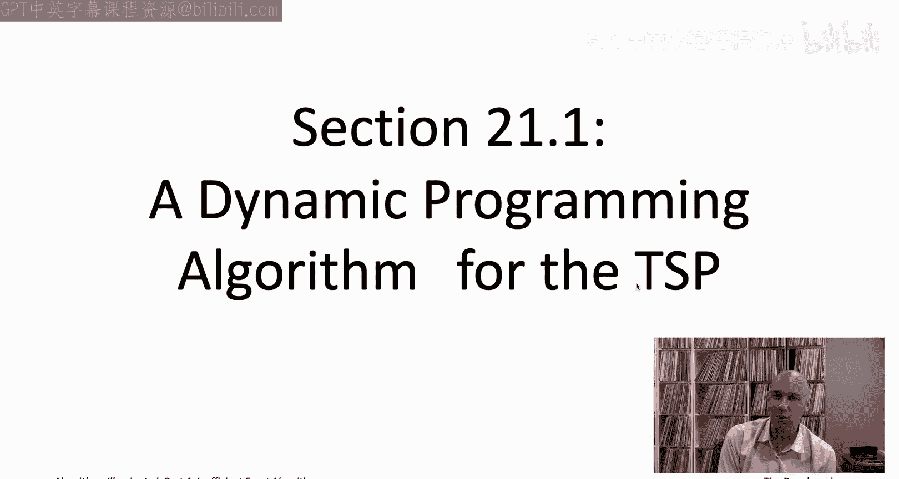

So let me begin just by quickly reminding you about the definition of the traveling salesman problem plus how long it takes to solve it using exhaustive search。

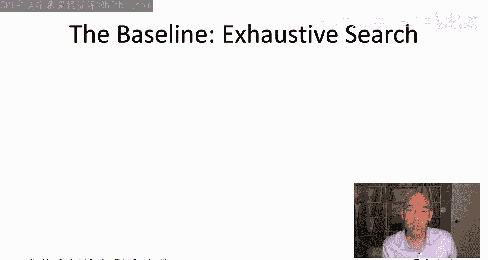

So in the TSP， the input is a complete graph on some number n of vertices。

 each of the n choose two undirected edges in the graph and each of them has a real valued cost denoted C sub E the goal is to compute a traveling salesman that means it's a cycle that visits each vertex exactly once so it starts somewhere and then an n minus one hops it visits all the rest of the vertices and then finally comes back to where it began and among all the tours you'd like to find the one that minimizes the sum of the edge costs that's the TSP。

So as mentioned， the TSP is unfortunately an NP hard problem。

 so if we want an exact algorithm for it， we're going to expect it to have to run an exponential time at least in some cases so the question then is you know can we have some kind of you know nice algorithmic idea that at least allows us to improve over just naive exhaustive search so to benchmark ourselves let's just remember exactly how long exhaustive search takes for the TSP。

Well， we had a quiz on this in the very first video about how many traveling salesmans are there and it's n minus1 factorial okay n minus1 factorial times a half。

 but basically n minus1 factorial so if you're going to enumerate each of those tours and then you're going to compute the cost and remember the best one。

 you're going to be spending O of n time for each of the n minus1 factorial tours for an overall running time of n factorial。

And this is really bad right we already are very unhappy with running times of the form2 to the N。

 but n factorial is quite a bit bigger than that right so2 to the n that's just a string of N2 is multiplied together and factorial that's n terms multiplied together most of which are way bigger than two so n factorial is clearly a bigger number to answer the question how much bigger is n factorial than two to the n let me tell you about a famous approximation result known as Sterling's approximation。

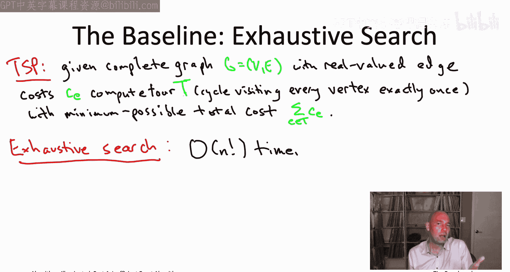

So Sterling's approximation gives us an incredibly accurate estimate of how the factorial function grows。

 so specifically n factorial grows is more or less you should think of it as n over E here E is indeed the constant 2。

718 dot dot dot n over e raised to the n so there's also a leading term root 2 pi n that's less important。

 what's more important to notice is this n over E raised to the n。

And notice that you know as soon as n gets even modestly big right multiplying a bunch of n over ease times each other。

 that's going to be a much， much much bigger exponential than multiplying a bunch of twos together so that shows that n factorial really is drawing much。

 much much faster than 2 to the n as n grows large。So for example。

 if you had an algorithm with running time scaling like n factorctorial on modern computers。

 Crca 2020， you could probably handle input sizes up to maybe 15 or so whereas with an algorithm with running time two to the N。

 you can handle problem sizes more than twice as large all the way up to maybe around 40。

 which I know does not sound that impressive but remember these are and be hard problems and we have to show them some respect。

 so two to the n is a lot better than n factorctorial。

So that then is going to be our goal for the TSP naive exhaustive search runs in time n factorial2 to the n would be much faster while still being exponential as we expect。

 so we're going to shoot for a TSP algorithm running in time you know ballpark2 to the N All right so I'm telling you about stone's approximation right now because I wants you to appreciate how much bigger n factorial is than two to the N as n grows large turns out we're actually going to use this approximation quite directly and our analysis of the next algorithm that we're going to discuss for finding long paths in graphs。

I'm not going to prove Sterling's approximation to you pretty much nobody remembers the proof。

 the proof is calculus， but nobody remembers it so it's not important you remember the proof。

 it's not even really important you remember the statement。

 honestly it's not even really important you remember the name。

 but what you really should remember is that there's a super accurate estimate of the factorial function if you ever need it then you'll be able to look it up easily on Google and then on Wikipedia and you'll just be able to get this exact same formula I've written down on this slot。

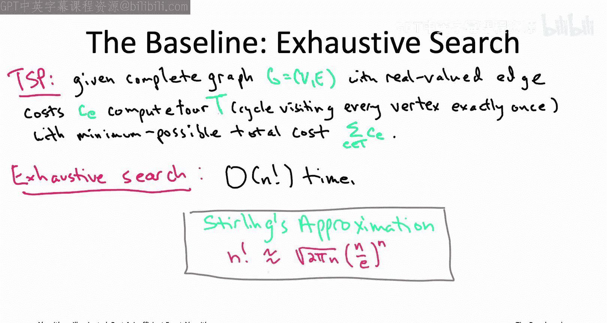

So in the last chapter we revisited a familiar old algorithm design paradigm greedy algorithms。

 we saw their nice application to the design of fastturistic algorithms for NP hard problems so in this chapter we're again going to revisit one of our tools from the old toolbox but it's going to be a different one it's gonna to be dynamic programming Now a lot of the killer applications of dynamic programming are to polynomial timeslvable problems as you've seen in previous books of the series previous videos of this video list you did actually already see an application of dynamic programming to an NP hard problem because it' the Napsack problem actually is NP hard but that's something we gave a dynamic programming algorithm for which was nice and now we're going to see another example to the traveling salesman problem so before we go into that let me just quickly jog your memory about how dynamic programming works。

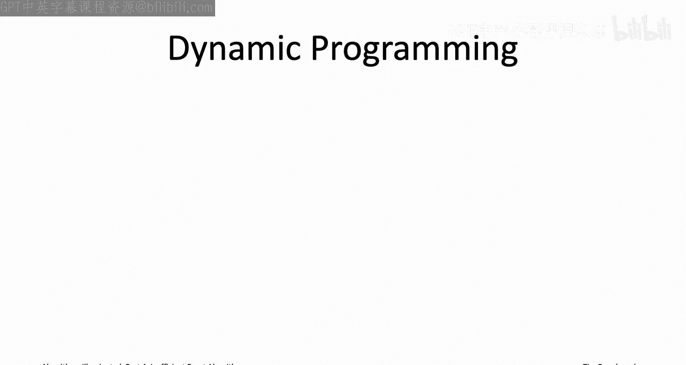

So the whole key in coming up with a dynamic programming algorithm is to figure out the right collection of subproble one of the properties we want of these subpro where there should be not too many of them because we're going to wind up solving each of the subproble it shouldn't take too long to solve the subproble at least given the ones that we've already solved and then after we have solved out the subproblem it should be easy to read off what is the actual answer to the original problem that we care about So for example。

 some algorithms you may remember so like in the dynamic programming Napsack algorithm there was one subset for each prefix of the first I out of the n items that was one dimension of dynamic programming table and the other dimension was the residual capacity So for each possible prefix of items and each possible integer amount of residual Napsack capacity you had a separate subproble or in the Belman Ford algorithm for the single source shortest path problem So there subproblem were parameterized by how many hops you were allowed to have in a path So given subproblem would ask you for the length of the shortest path from the starting vertex。

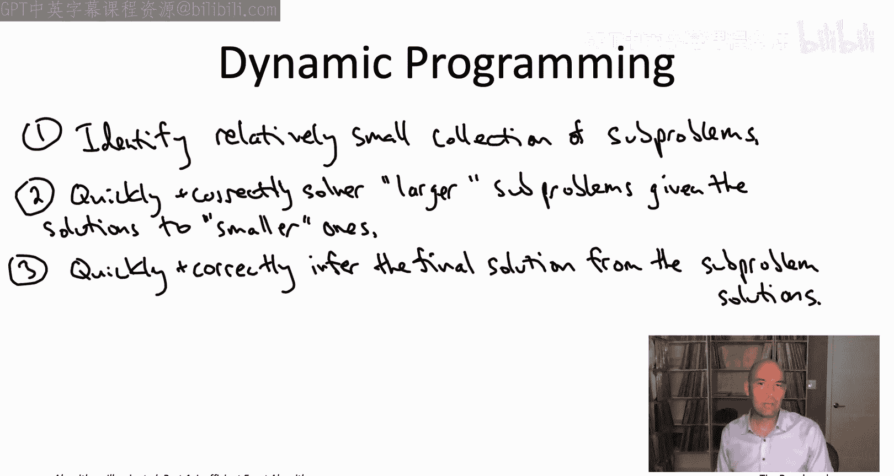

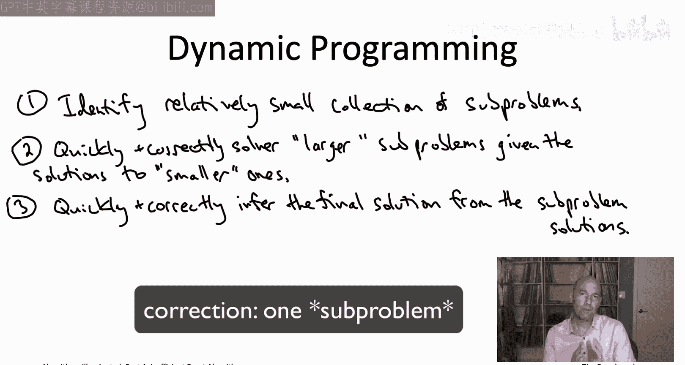

Some destination vertex V that has at most eye edges in the path。

It takes a lot of practice to figure out how to come up with these magical collections of subproblem。

 but of course you now being here in part4 have already had quite a bit of practice and we're gonna to get some more practice in the next couple of videos just to remind you the way you usually come up with the subproble is you do this thought experiment about what the optimal solution has to look like So someone hands you an optimal solution on a silver platter and you want to prove that it has to be composed built up from solutions to smaller subproblem。

 optimal solutions to smaller subproblem in a limited number of ways and then you can do exhaustive search over the limited number of things that it might possibly look like again will make this concrete starting on the next slide point being is once you have a collection of subproble with all these properties you're pretty much done the dynamic dynamic programming algorithm just writes itself you systematically solve all of the subproblem starting with the easiest ones and ending up with the most difficult ones and then you just infer the final solution from your subproblem solutions that last step is usually trivial because usually。

Problem is one of your sub problems。In many cases， the running time analysis of a dynamic programming algorithm is quite straightforward。

 so for example， suppose that the number of subproble you have is F of N。

Where n here denotes the input size knows so this could be linear in n or quadratic in n or even worse anyways。

 some function of the input size。Suppose you have a running time bound of G of N for solving each of your subproble given the solutions to the easier sub problemsm that you already solved and suppose it takes you H of n time to extract the final solutions from the solutions to all of the subproblem Well then we get a sort of obvious running time bound。

 which is just the number of subproble F of N times the time per subproblem G of N plus the postproces sort of extraction step H of N So when we apply dynamic programming to an NP hard problem like the TSB。

 we got to expect at least one of the functions FG or H to be exponential in N。

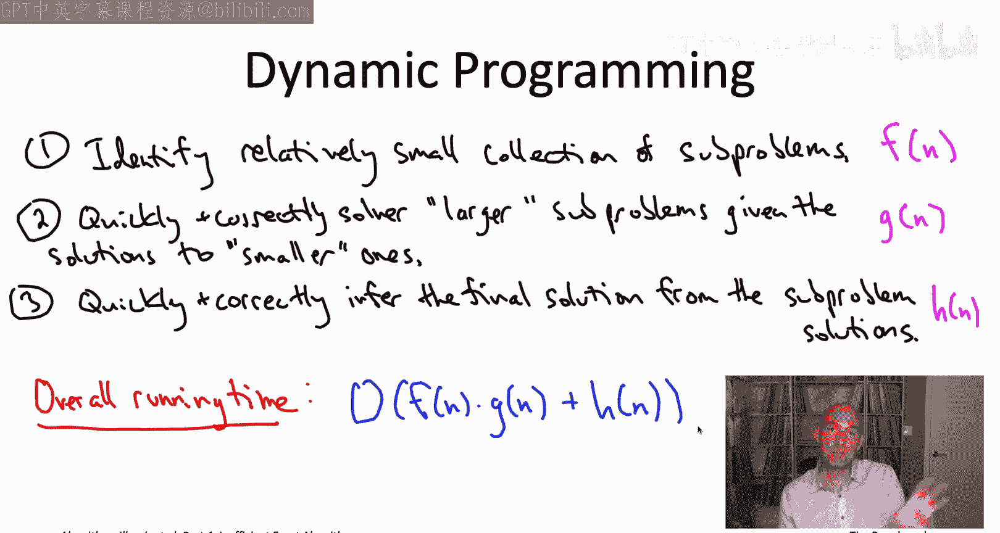

Looking back at some canonical dynamic programming algorithms， for example。

 for the NApsack problem for sequence alignment or Belman Ford and Floyd Warshholll algorithms。

 what you'll notice is that the functions G and H， so the time to solve each subproblem in the postprocess work。

 they are never large， they're always either O of1 constant or O of n linear。

Whereas the number of subproblem F of N has been very different in the different dynamic programming algorithms that we've consider So if we're going to apply dynamic programming to the TSP。

 we need to expect one of these functions to be exponential and thinking about a little bit it's really F of N we expect to be exponential we're going to be looking to see an exponential number of subproblem in our dynamic programming algorithm。

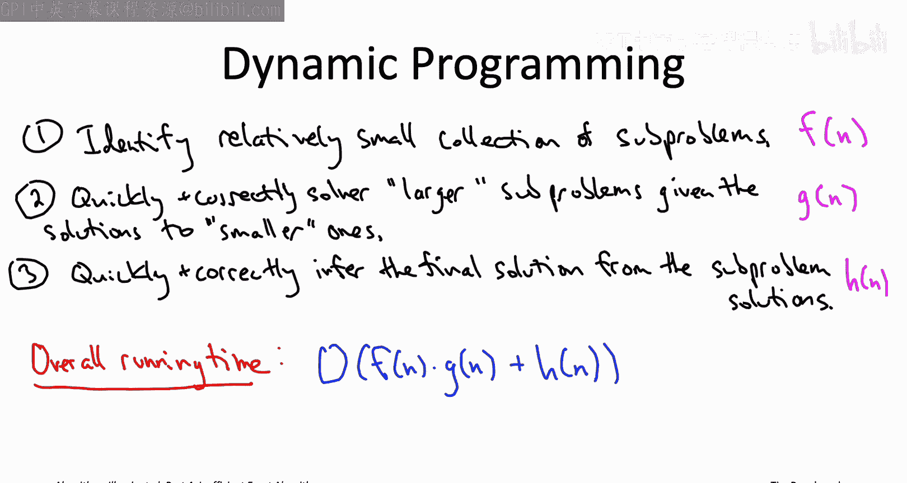

So let's now go through this thought experiment to identify the right collection of sub problems。

 so let's really reason about how optimal traveling sales mentors must be composed of optimal solutions to smaller sub problems。

In other words， suppose someone handed you on a silver platter， an optimum traveling salesman tour。

 what must it look like？So this tour right it visits all of the vertices and if we want。

 we can think of it as starting at the vertex labeled number one。

 let's assume the vertices are just numbered from one to N。

 we can think of this tour as starting at the vertex 1 and then eventually coming back to it。

And a trick we've seen works really well in these dynamic programming thought experiments is to reason about the very last decision made by an optimal solution so in this context。

 right the edges of the tour， we can think of them as being ordered and we can look at the last hop so we can look at the edge that goes from some vertex J back to one at the end of the tour。

So now what we imagine we do is we undo that final decision of the optimal solution。

 we see what we get， and then we try to understand for what subproblem is that optimal？

So if we remove this final edge， this edge between1 and J from the optimal tour。

 what do we get Well now we have a path， it goes between1 and J and it visits every vertex exactly once Moreover there's no cycles in it because we started with a tour。

And the green path between1 and J， that's not just any old path between1 andJ that visits every vertex。

 if you think about it， it's got to be the minimum cost such path。

There's no shorter way to get between1 and J visiting every vertex exactly once。

 because if there were， then we could get a better tour of the original instance just by plugging that edge between1 and J back in between the allegedly better path。

So this is good news what this means is that if we only knew the identity of this vertex J。

 then we would know what the entire tour looks like。

 it would be the edge between1 and J plus a path between1 and J a path that visits every vertex exactly once and subject to that has the minimum possible cost that's what the optimal tour has to look like so there's really only n different candidates vying to be an optimal traveling salesman tour。

 one for each possibility for this penultimate vertex J。Now， of course we do not。

 priori know what J is， we do not know what is the last vertex visited by an optimal tour。

 but again there's only a linear number of possibilities so we can just do exhaustive search over the N different candidates for that last vertex。

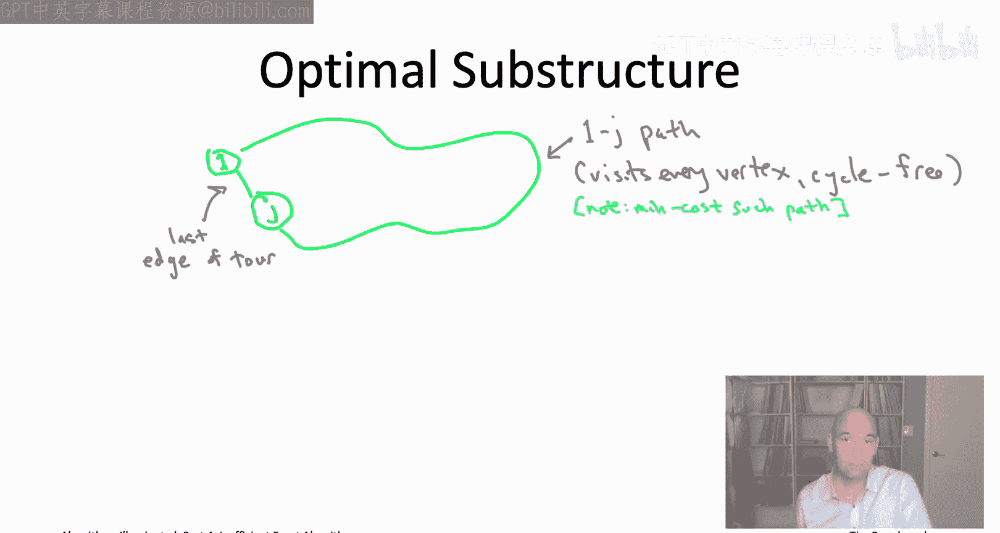

So're writing that down in math， we can just write down an exhaustive search over the possibilities for J so that's what this min over j equal 2 to n is doing Okay lie a little bit it's not n candidates it's n minus1 candidates for the optimal tour because one can't also be the second to last vertex and then for a given guess of what j is you just look at the cost of the edge between1 and J plus the minimum cost of any cyclefree path going between1 and j and visiting all the vertices exactly once。

So if you prefer to think about dynamic programming recursively。

 the approach here would be we try all possibilities for J and for each choice of J。

 we recursively compute the minimum cost path between1 and J visiting all of the vertices。

So that all sounds you know fine and good， I mean so this tells us how to compute the optimal tor cost using n minus1 recursive cause to a subroutine that can compute these 1J cycle free paths that visit all vertices and the next question is how do we do that？

And here， things get a little trickier。 Let's think that through in the following quiz。

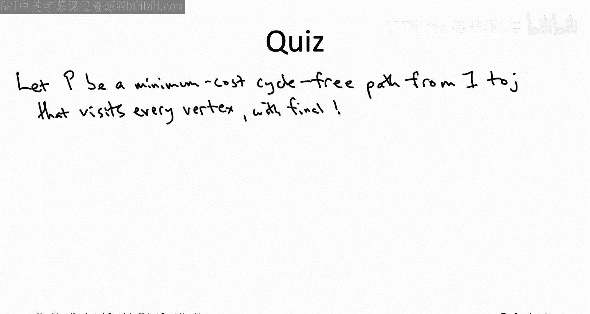

So we're going to ask the same type of question so suppose we've now fixed J and suppose someone handed you on a silver platter。

 the minimum cost path from1 to J of the type that we want， so cycle free and visiting every vertex。

Again， we want to think about the last decision made by this optimal solution。

 so that's going to be the final hop which ends at the vertex J。So， you know。

 there's some penultimate vertex call it K， so the path ends with the edge K comma J。

Now we want to think about plucking off that last edge， seeing the subpath that we have left。

 and we want to ask the question for what subpro is that subpath an optimal solution？

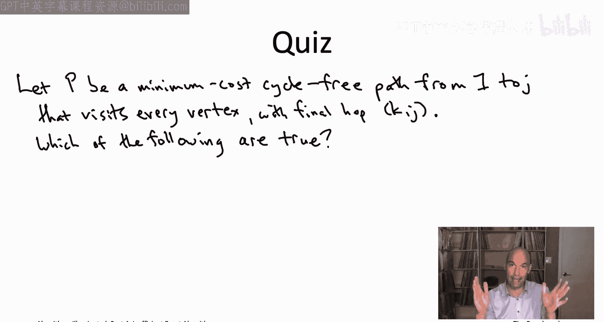

All right so let's talk through this solution to this quiz。

 this is an important quiz for understanding the algorithm in this section so first of all。

 because we started with this path P that cyclefree goes from one to J visits every vertex and has spinal hop going from K to J the subpath P prime well it certainly still cyclefr。

 it certainly goes from one to K because we plucked off the last edge that went from K to J and it visits all the vertices except for J so every P visit every vertex。

 we plucked off the KJ hop so the remaining path P prime visits everybody in V minus J。Crucially。

 it is also true that this path subpath P prime does not visit J right。

 because P visited J only once in its final endpoints and P prime we've removed that final hop so it does not visit J。

So that means answers A and C are both correct。Answer B， meanwhile， is incorrect。

 While P prime is indeed some cycle free path from1 the K that visits all the vertices and v minus J。

 it need not be a minimum cost such path because who's to say that there isn't some other path。

 also cycle free， also starting at1 and ending a K。

 also visiting all the vertices of v minus J and also visiting the vertex J。

And to see that I'm not just making of this possibility。

 consider the following three vertex counter example。RightSo in this example。

 as you can see the length of a shortest path between 1 and K gets smaller if you allow it to use the vertex J as well。

 if all it can do is use 1 and K it has to pick the one hop cost5 path。

 if it's also allowed to use J， then it can do better。

 it can have the two hop path with overall cost4。So in other words。

 P prime being a path that is precluded from using vertex J。

 that potentially cannot compete with other paths that are allowed to use vertex J。

The good news is that P Prime still is an optimal solution to a suitable sub problem。

 namely the type of subproblem mentioned in the second two answers， so in other words。

 D is in fact a correct answer。The way you' prove this is exactly the same kind of proof by contradiction。

 cut and paste argument that we've seen in many， many other dynamic programming algorithms。

So start from an optimal path from1 to J psychofree visiting every vertex once。

 that's this light blue path in the upper left corner。

Now we're thinking about plucking off that final hop K comma J so that leaves us with the residual light blue path from 1 to K and we want to argue that that's a minimum cost path of the given type。

 so one that goes from1 to K visits every vertex other than J once and does not visit vertex J at all。

So suppose for contradiction that wasn't the case， suppose there was actually a cheaper path than this prefix that meets the exact same set of constraints。

 so starts at1 goes to K， no cycles， visits exactly the vertices of V minus J and does not visit J so let's draw that path in magenta。

Well， if the cost of the magenta path is less than the cost of the light blue path。

 then the cost of the magenta path plus that final hop K J is less than the cost of the light blue path plus that final hop K comm J。

In other words， this magenta path together without final hop K commma J。

 that's a better path than we started with。Now it's very important that the magenta path does not use the vertex J that's one of our constraints If the magenta path did use the vertex J。

 then when we put in that final hop K comma J that would make a cycle that would be the second visit to J so we would not be satisfying the cyclefr condition。

 but because we're assuming the magenta path is a sort of superior version of the prefix p prime so it goes from one to K it's cycle free because it's all the vertices of v minus J does not visit J。

That means when we take the magenta path， plug on that last K commona J hop。

 we get a cycle freeee path crucially， now it visits every vertex， including J。

 and its cost is strictly less than that of the light blue path。

 but that's a contradiction because the light blue path was the minimum such cost。

 such minimum cost such path。

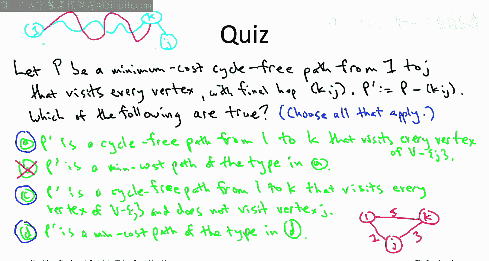