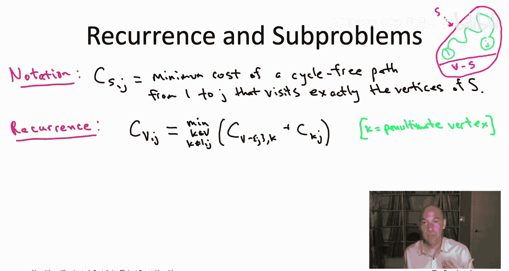
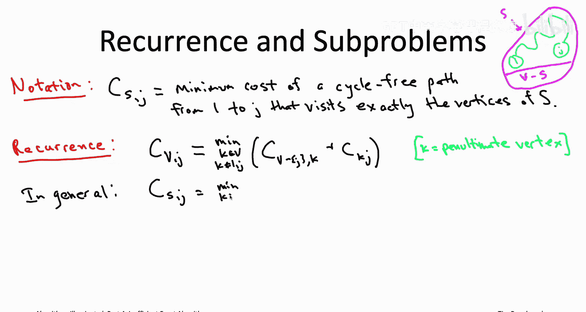
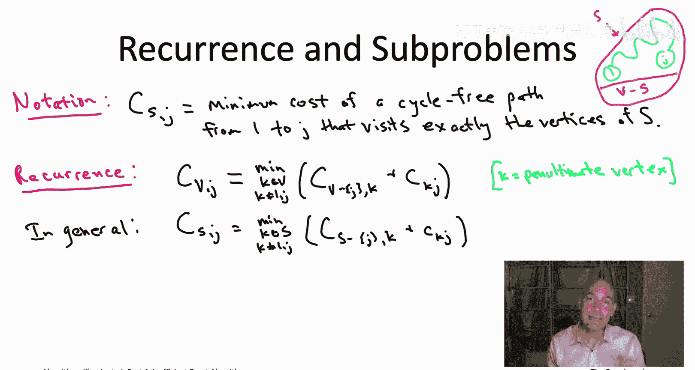
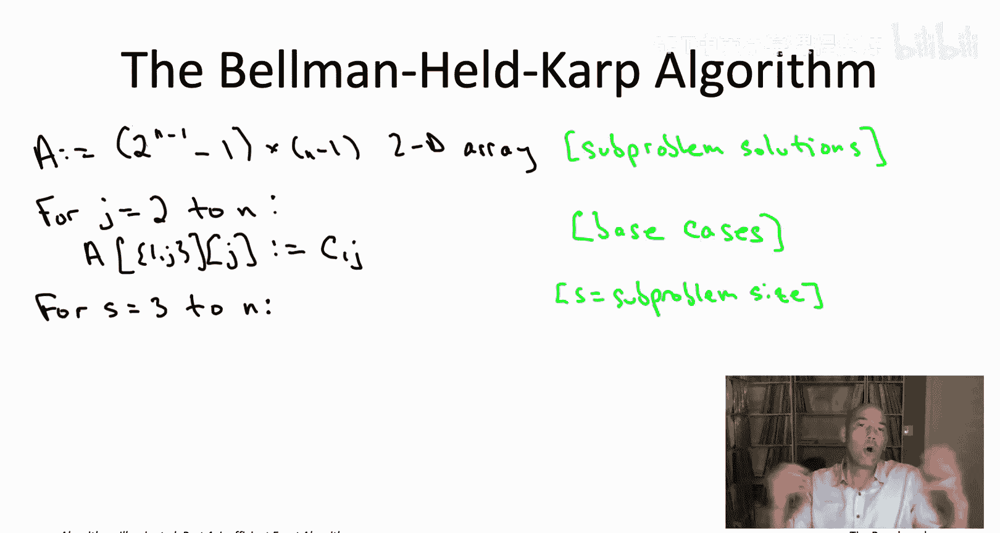
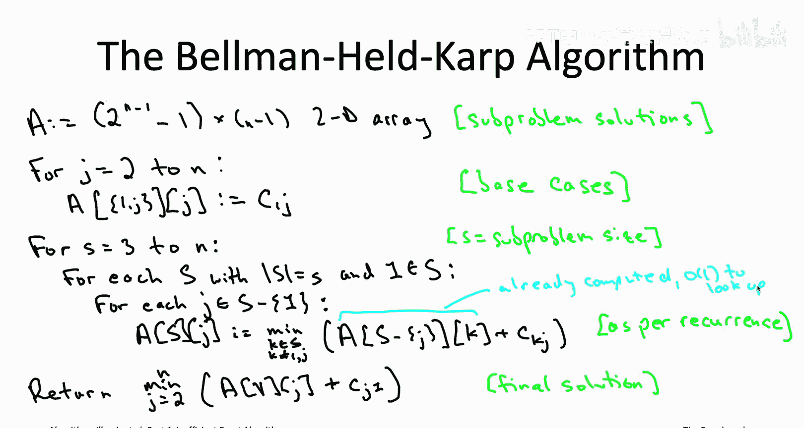
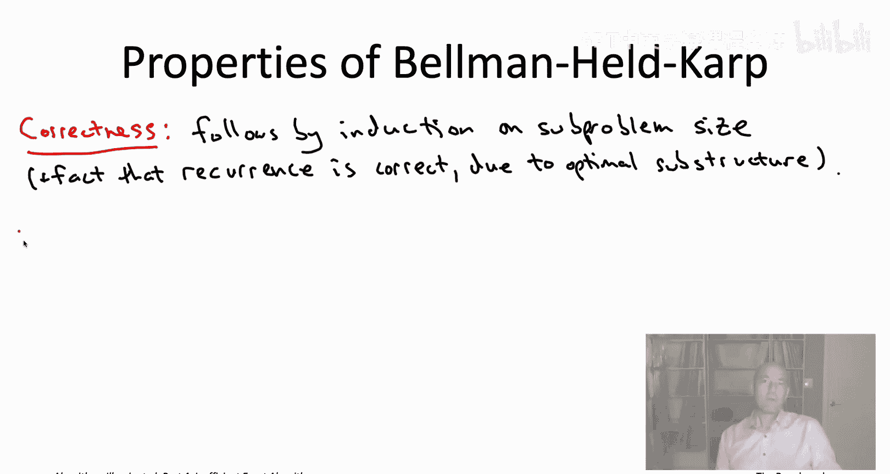
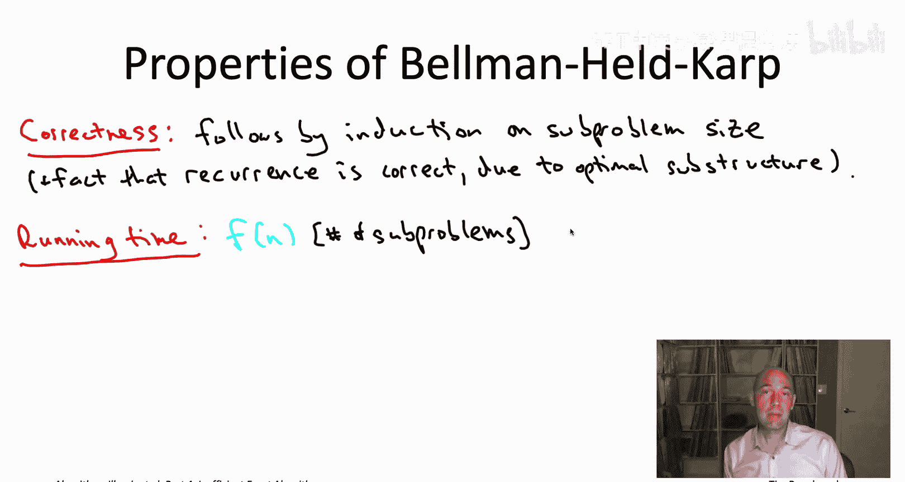
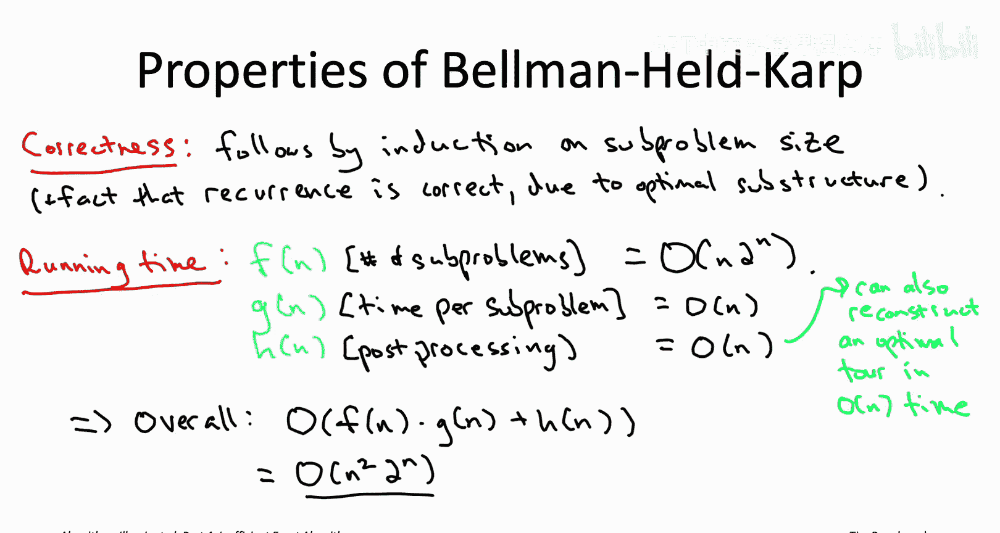

# 斯坦福大学《算法启蒙（第4册）：NP难｜Part 4 Algorithms for NP-Hard Problems》中英字幕（deepseek-R1） p19 -19-21.1_ The Bellman-Held-Karp Algorithm for TSP)  -Part 2_2-.zh_en -BV1FAVUzXEum_p19-

So what's the upshot of that quiz The upshot is that we now know what optimal solutions have to look like So if you're telling me you have a minimum cost path from1 to j that visits every vertex exactly once。

 I know there are n minus2 and only n minus two candidates for what your path could possibly look like As soon as you tell me the penultimate vertex K As soon as you tell me that the last hop of your path is k comma J I know what the rest must look like it must look like a minimum cost path starting at one ending a K visiting the vertices of v minus J and only the vertices of v minus J so that is the subproblem that the path prefix p prime solves optimally。

So now that we understand that there's only these n minus two possibilities for what the1 to J path looks like。

 we can write down a recurrence which expresses the cost of that optimal solution in terms of the costs of the n minus2 smaller optimal solutions。

So let me introduce a little notation so we can specify the recurrence succinctly by capital C subscripts capital S comma J。

 I'm going to mean the minimum cost of a path that satisfies the following four properties number one。

 the path should start at vertex1 number two， the path should end at the vertex J number three。

 the path should be cyclefr， so it doesn't visit any vertex more than once and number four。

 the vertices that it visits exactly once should be precisely the vertices in the set capital S。

So for example， in this cartoon on the upper right part of the slide。

 imagine that the sort of outer magenta circle is the set of all of the vertices and then the top set is S and then the bottom is the other vertices v minus S and this light blue path is meant to sort of indicate that this path is visiting each vertex of S exactly once so we want to know so this notation is the minimum cost of any path that looks like that。

And what have we learned from the quiz， once you know K， you know what the rest of it looks like。

 the path prefix must be the minimum cost path from 1 to k that cyclefree and visits exactly the vertices of v minus J。

 and then of course the original path it went all the way to J it also pays for that additional hop so the cost of the edge from K to J。

So again， if you prefer to think about dynamic programming recursively。

 this is basically saying to solve the original problem。

 you need to make n minus2 recursive calls to compute the optimal solutions to these different subproblems and then you take the best of all of the solutions returned by those n minus2 recursive calls Now of course know that recursion is going to continue so you need to solve these n minus2 smaller problems on the right hand side but how do you solve that well you just apply the exact same recurrence again this time to the smaller set of vertices so more generally if we replace capital V in this equation with any subset capital S of vertices。

 we get exactly the same recurrence。

So in words， if you show me an optimal path that visits exactly the vertices in capital S goes from1 it goes to J and it's cyclefr if you tell me the penultimate vertex on that path。

 I know what the S has to look like it's going to be a subpath now it visits all of the vertices of S except for that last endpoint J and it visits the other vertices S minus J exactly once in a cyclefree way while going from1 to K so that's the general version of the recurrence for any vertex subset capital S。

So this now tells us exactly what our subproblem should be。

 Basically we need a subproblem for every term that might show up in one of these recurrences。

 so for every choice of the vertex subset capital S and for every choice of that last vertex little J。

 we're going to need a separate subproblem to compute that capital C S comma J。

So which of these terms do we need to worry about which choices of capital S and little J actually make sense Well remember capital S those are the vertices that the path is supposed to visit and the path supposed to start at vertex1 so the set capital S better include the vertex 1 Also remember J that's where the path ends so capital S better also include the endpoint J so you're going to have one of these terms for each choice of J and each choice of capital S that includes both vertex 1 and that choice of the endpoint J。

So the bad news is this is a lot of subpro an exponential number right because there's n vertices so there's two to the n different subsets of vertices now capital S here it can't be any vertex subset there's a couple mild constraints but still there's an exponential number of different capital Ss that you need to worry about。

 plus then there's again another linear and n number of choices of J。

So that's a bummer that there's an exponential number of sub problemsble but remember we were expecting this right if the TSP is NP hard so if we're going to apply dynamic programming。

 we need to expect something exponential to show up somewhere either in the number of problems or in the time required to solve each subproble or in the post-proces step and just looking at the many examples that we've seen it seems like the extra complexity always shows up in the number of subproblem so we were actually expecting to see an exponential number so this actually is telling us we're probably on the right track。

I also want to point out that while exponential， it's a lot better than n factorial。

 it's more like2 to the n than n factorial， and the reason why where that savings is coming from is that these subproblems don't worry about the order in which the vertices of capital S are visited。

 so it tracks which subset of vertices of path is visited but not the order in which they were visited and that's why the factorial goes away and is replaced by the simple exponential function 2 to the N。

So we've got almost all our ducks in a row right we have our subproble we came to them by this thought experiment of what optimal solutions have to look like that led us to our recurrence and so now we just want to solve all these subproblem systematically from smallest to largest there's a very natural ordering from smallest to largest depending on how many vertices the path visits depending on the size of the set capital S remember there's one final ingredient dynamic programming which is you need to be able to extract the final solution from the subproblem solutions Most commonly the original problem literally is one of the subproblem that's not true here we want to tour and here all of the subproblem or computing paths。

 but now just we can do that exhaustive search over the n minus1 choices for the last vertex visited by the tour do exhaustive search over those n minus1 choices and then just plug in the values of our largest subproblem solutions。

So with all the ingredients in place， the dynamic programming algorithm now just writes itself。

 we're first going to solve the base cases or the smallest sub problemsblem that'll correspond to vertex subsets capital s with only two vertices。

 vertex 1 and some other vertex then we'll move on and use the recurrence to solve the next largest subpro with the visit past the visit three vertices then subsets of size 4 and then five etc。

 and once we're through with all of the subproblem we'll use that final equation to compute the final solution this algorithm sometimes called the Belllman held carp algorithm was proposed independently in 1962 on the one hand by Bellllman and on the other hand by held in CAp。

So we start by initializing our array that's going to keep track of all of the subproblem solutions。

 subproblems are parameterized by two different parameters， capital S and little J。

 so it's going to be a two dimensional array， there's a roughly exponential number of choices of capital S2 to the little n minus1 quantity minus1 to be precise。

 and then there's a most n minus1 choices for J， all vertices other than vertex1。

The base cases correspond to the vertex subsets of size2。

 so it has to contain vertex 1 and then there's going to be some other vertex little J and then little J is the only option for the endpoint as well。

 and so then the shortest path that goes from1 to j and visits only one and J that's got to be the direct one hop path I mean know that's cost that's just the cost of the corresponding edge。

So now we solve all the sub problemsble systematically working from smaller subproblems to larger subproblems and again the natural notion of problem size here is the number of vertices that the path is supposed to visit so the cardinality of the set capital S。

 so we start from size 3 subsets and then we work up to size 4， etc。

 culminating with when capital S is equal to all n vertices。

So now we have two more four loops which are looping over the choices of the parameters capital S and little J。

 since little J is supposed to be drawn from the set capital S。

 it makes sense to first start by looping over all the subsets of the current size， size little S。

Then for a given subset capital S， we know all the choices of J。

 it's every vertex and capital S except for the vertex1。

So now in this interlo iteration， root really corresponds to a specific subpro。

 subproblem capital of computing capital C， subscript capital S comma J， and we know how to do that。

 we just use the recurrence， so it's really just an exhaustive search over all choices little K for the penultimate vertex of an optimal path visiting the vertices in capital S。

Once all three of these four loops complete， we have solved all of the sub problemsblem and then as we know。

 the final solution can just be computed from the biggest of those subproble with capital S equal to capital V。

One sanity check that you always want to do when you write down your pseudo code for a dynamic programming algorithm is when you're computing one entry of your subproblem solution array。

 you want to make on the left hand side， you want to make sure that all of the entries that you need from the array on the right hand side are already computed and therefore available for constant time lookup and we see that that is indeed the case here。

On the right hand side of the recurrence， we're always looking up the value for sets that have one less vertex than capital S。

 so smaller subsets， all of those will have been computed in the previous iteration of the outermost for loop。

So that's the Bellman held Carp dynamic programming algorithm for the traveling salesman problem as always when we introduce an algorithm we should think about what are its properties in terms of correctness and in terms of its running time correctness is not so interesting it's kind of just the standard argument for dynamic programming algorithms which you've seen many times you proceed by induction on the subproblem size you just argue that each subproblem gets solved correctly in the inductive step know why is it true the correctness comes from the correctness of the recurrence and we're filling in the subproblem answers correctly why is the recurrence correct。

 well that just goes back to the optimal substructure that we started with we observed that optimal solutions to a given subproblem can only have one of a small number of possibilities and the recurrence explicitly does exhaustive search over that small number of possibilities so it necessarily computes the optimal solution the running time we can just go back to our generic analysis of dynamic programming algorithms where we just count up the number of subproble multiply it by the time for subproblem and throw in the postproces work。

So here， first of all how many subproblem are there that's what we were calling F of n before well there's two to the n choices for the set capital S a little bit less than that but roughly2 to the n and there's always a most n minus one choices for the second parameter little J so that means there's the most2 to the n times n different subproblem we have to deal with。

How about the time required to solve each sub problemblem。

 well this is just exhaustive search over all of the possible choices of the penultimate vertex little K。

 there's certainly a most end possible choices for little K at all times。

 so there's going to be a linear amount of work to fill in each array entry。

And then finally there's the postpro step what we were called H of n before。

 and so here it's not a constant time lookup but it's that final line of the pseudo code where we do this exhaustive search over n minus1 possibilities。

 each case can be evaluated in constant time， so the postpro and that final line is also going to be big O of n。

So in this analysis of the post processingces， I'm assuming that you're content to compute just to the total cost of a optimal traveling salesman as opposed to the tour itself。

 but as always with dynamic programming as you've hopefully seen many times。

 it's always possible to reconstruct the optimal solution itself by tracing backward through the filled in subproblem array。

 and if you implement this algorithm in the right way caching the appropriate things on the forward pass you can actually reconstruct the optimal tour itself in linear time O of N time and I encourage you to think about that in the privacy of your own home。

So remember， the formula for the running time bound of a dynamic programming algorithm is just f times G plus H。

 which in this case evaluates to n squared times 2 to the n。

So one piece of fine print in this running time analysis。

 I am assuming that you can generate the number of subsets capital S with a given size little S in time proportional to the number of such subsets if you think about it the number of such subsets is exactly n minus1 choose S minus1 because you know that the vertex1 has to be in there so this can be done I encourage you to think about how you might do it in a concrete implementation。

 you can use recursive enumeration or if you really want to sort of venture out into the weeds。

 you can look up something known as Gos hack。So how should we feel about this running time Well sort of mixed feelings。

 I think mean on the one hand， is a lot better than exhaustive search。

 It's very satisfying to beat the pants off of exhaustive search。

 which would have been an n factorial。 Remember by Sterling's approximation n factorial that's roughly n divided by E N divided by 2。

718 raised to the n power So that's exponentially bigger than 2 to the n whereas here we're just getting2 to the n times a polynomial times n squared。

 So that on the one hand is deeply satisfying to sort of see yet another kind of killer application of the dynamic programming paradigm that you've spent so much time mastering to beating exhaustive search for a super fundamental problem。

 The bad news is this running time is still not that great So the exhaustive search algorithm you might be able to handle sizes。

 maybe if you're lucky up to like 15 or something。 if we had an algorithm with running time 2 to the n you could go up to around 40。

 This is n squared times 2 to the n you'll be able to handle more like inputs of size n equals 30 So we've doubled。

The problem size that can be handled compared to exhaustive search which is nice。

 but if you have a traveling salesman problem that's bigger than that that say has hundreds or thousands of vertices you're not going to be able to use this dynamic programming algorithm there you're going to have to resort either to heuristic algorithms as discussed in the last chapter or you can try your luck with a state of the art mixed integer programming solver which we're going talk about later this chapter so what we're going to move on to next is yet another application of dynamic programming to a problem with finding long paths in networks it will again allow us to roughly double the problem size that you can handle but actually in biological applications that doubling of the problem size that you can handle is totally crucial to getting meaningful results so we'll talk about that in the next video see you then。

