# 斯坦福大学《算法启蒙（第4册）：NP难｜Part 4 Algorithms for NP-Hard Problems》中英字幕（deepseek-R1） p20 -20-21.2_ Color Coding)  -Part 1 of 2-.zh_en -BV1FAVUzXEum_p20-

Hi everyone and welcome to this video that accompanies Section 21。

2 of the book algorithmrithms illuminated Part 4。 This is a section about computing a long path in a graph using a technique known as color coding。

So graphs are omnipresent in the study of algorithms because it really hit this sweet spot between expressivity and tractability As we've seen there's a lot of operations you can do on a graph efficiently。

 you can search them efficiently you can compute their connected components you can compute shortest paths and so on we've also seen that there's lots of different application domains that are well modeled by graphs everything from road networks to the World web to social networks so in this section we're going to see yet another example it's going to be a killer application of dynamic programming combined with randomization to the problem of detecting meaningful structure in biological networks let's get started。

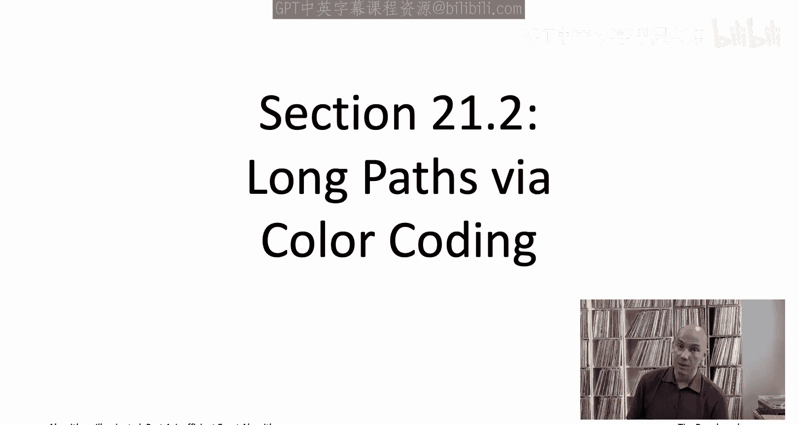

So before we jump into the problem definition， let me just tell you a little bit about the biological motivation behind this problem。

Most of the work that takes place in a cell is carried out by proteins。

 meaning chains of amino acids， and these proteins often act in concerts。 So for example。

 a series of proteins might transmit a signal that arises at the cell membrane to the proteins that regulate the transcription of the cell's DNA to RNA。

 understanding such signaling pathways and how they get rewired by genetic mutations that's an important step in developing new drugs to combat diseases。

Now， interactions between proteins are quite naturally modeled as a graph known as a protein protein interaction network or PPI network。

 so the vertices of this graph are going to correspond to proteins and is going to be an edge between any pair of proteins that are believed to interact。

So the simplest type of pathway and probably the first one you'd want to look for is a linear pathway。

 which is going to correspond to a path in this PPI network。

The problem of finding a linear pathway in a PPI network。

 and that can be cast as the minimum cost K path problem， or hereby a K path。

 I mean a path in a graph which is simple， so there's no cycles in it and has k minus1 edges and therefore visits k different vertices。

So formally， the input in the minimum cost K path problem has a bunch of familiar ingredients。

 is going to be an undirected graph， capital G， each edge of that graph is going to have a real valued edge cost C subB。

 and then there's also going to be the target path length we're looking for。

 that's going to be a positive integer K。

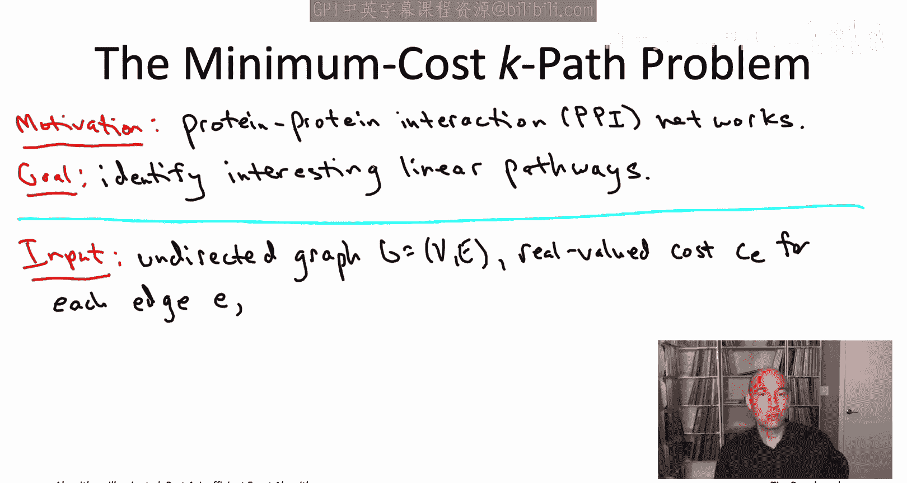

So the output then it's going to be a K path， so again。

 that means K -1 edges visiting K distinct vertices， so cycles are disallowed。

 and amongst all K paths in the graph， you'd like the one that minimizes sum of the cost of the K -1 edges in it。

 If it so happens that the input graph G actually doesn't have any K paths at all。

 then the algorithm is responsible for correctly reporting that fact。

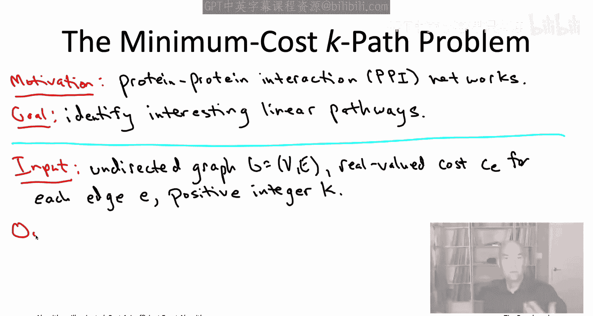

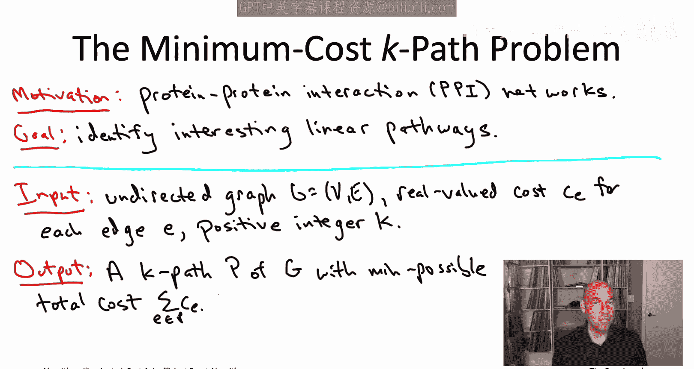

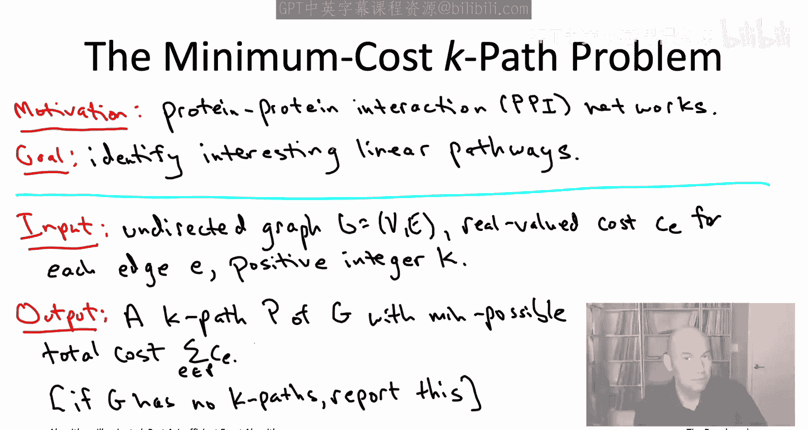

Going back to the biological motivation， the edge costs reflect the uncertainties inevitable and noisy biological data。

 And you should interpret a higher edge cost as meaning a lower confidence that the corresponding pair of proteins really do interact。

 So missing edges effectively have a cost of plus infinity。 In a PPI network。

 the minimum cost K path then corresponds to the most plausible linear pathway of a given length。

In realistic instances， you might want to think about k， the path length being maybe 10 or 20。

 while the number of vertices of the graph might be in the thousands or even perhaps in the tens of thousands。

So for example， suppose the input is our favorite running example with five vertices。

Then the minimum cost of any fourpath would be the path that goes from C to A to B to E。

So that particular fourpath has total cost 8，1 plus3 plus4 to see that it's the minimum possible note that any fourpath is going to have three edges and there's only actually a couple triples of edges in this graph that have total cost less than8 you could look at the one the two and the three。

 but that's not a fourpath that's a star， or you could look at the one and the two and the four。

 but that's also not a K path that's a cycle， so the next best thing is the one the three and the four that's the minimum cost four path of this graph。

So at this stage of the book you will not be surprised to hear me say that this is in fact an NP hard problem actually if you think about it。

 this is really a generalization more or less of the traveling salesman problem and since the traveling salesman problem is NP hard then certainly this more general problem is NP hard as well。

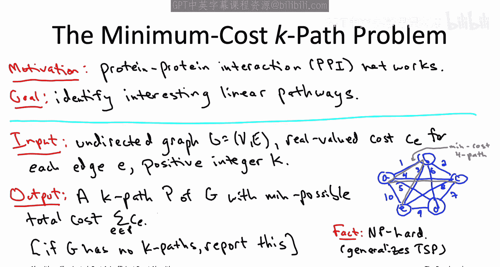

So how might we go about solving the minimum cost K path problem Well we could reason by analogy right so we just looked at the traveling salesman problem in the last couple videos and the two problems have a very similar feel。

 the main difference between the two is that in the minimum cost K path problem you've got a K a positive integer。

 the path length that you're looking for whereas in the traveling salesman problem you're looking for a tour which is basically a path of length n minus1 plus one additional edge。

So that very strong similarity would suggest that maybe we should approach the problem in exactly the same way。

 meaning use dynamic programming， and then even in our dynamic program。

 why don't we just use the exact same types of subproblems that served us so well for the TSP？

So in other words， we're again going to have a family of subproblem with two parameters。

 one of the parameters is the endpoint of the path， were calling that V。

 and then it's also going to be parameterized by vertex subset capital S。

 those are precisely the vertices that are visited by this path。

And then the definition of the subprom corresponding to a choice of capital S and a choice of little V is just to compute the minimum possible cost of any path that ends at v and visits exactly the vertices in capital S。

 One minor difference from the TSP is here you a K path could start anywhere doesn't have to start at some designated vertex like vertex1。

 so that's why we say any path at all， starting wherever。

 hand at V and visiting exactly the vertices of capital S。

 we want to know the minimum cost of a path of that form。

So we have one such subproblem for each sensible choice of capital S。

 and since we're talking about K paths， we only need to worry about sets capital S with K vertices or less。

 and then also for each choice of a vertex of V drawn from the set capital S。

If we successfully solve all of these sub problemsble， then we're going to be done。

 so the best meaning the least cost of all of the biggest subproblems corresponding to sets capital S with K vertices。

 the best of those subproblems is going to be the answer。

 It's going to be the minimum cost of a K path in the graph。So that now brings us to this quiz。

 what I'd like you to think about is， okay， I've told you these candidate subproble exactly how many subproble are there。

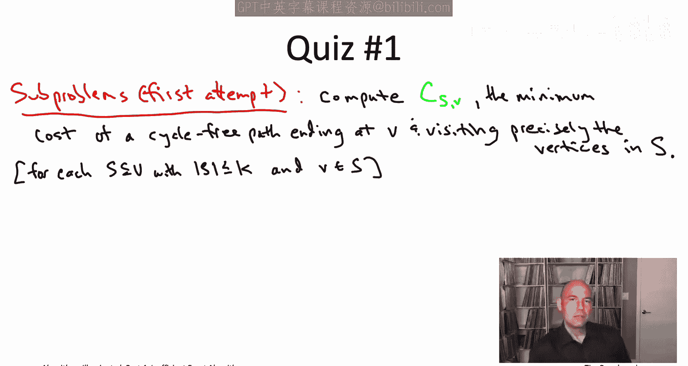

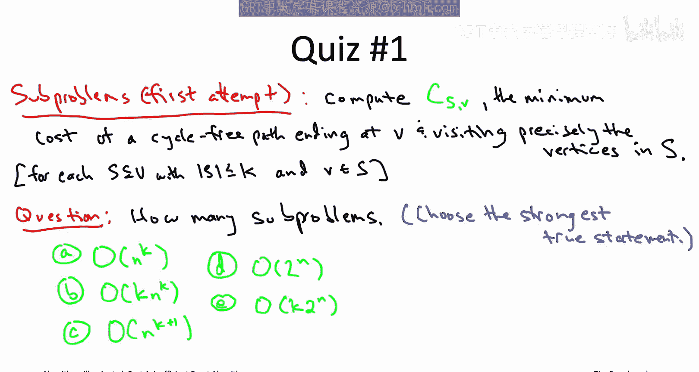

So the correct answer is the second one， the strongest of these bounds that's correct is big O of k times ended a K。

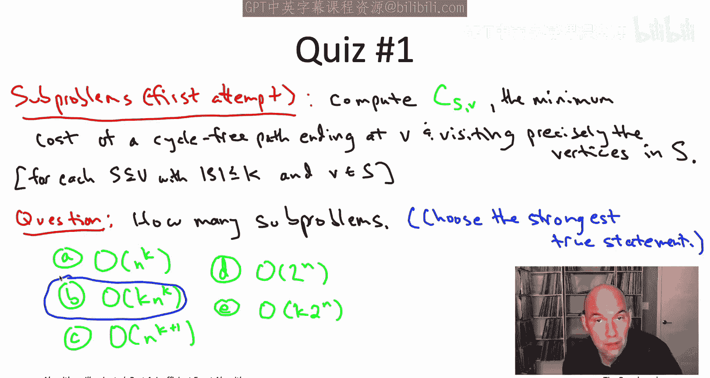

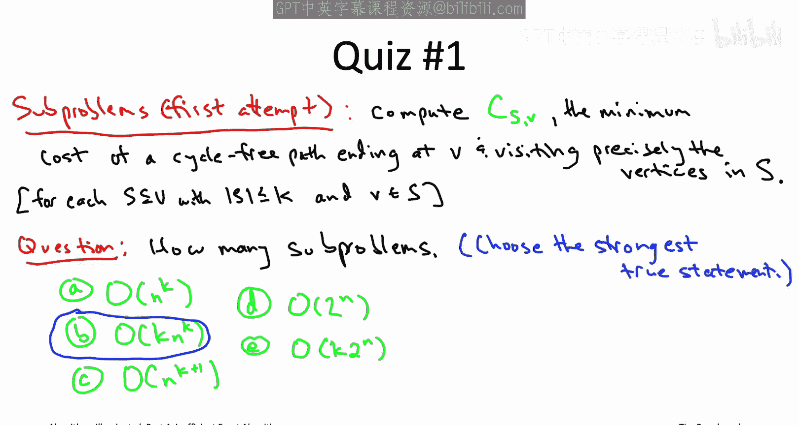

The bound is the product of two terms corresponding to the two parameters indexing the subproblem。

 so the K of course that just comes from all the different choices of V。

 So for a given capital S there's at most K choices of little V， so that's where the K comes from。

 the end of the K comes from the number of sensible choices of capital S。

 the number of subsets that have at most K elements in the K vertices。

 so that's the empty set which is n choose 2 plus singleton vertices that's n choose 1 plus pairs of vertices n choose 2 plus all the way up to subsets of exactly K vertices of which they are n choose K。

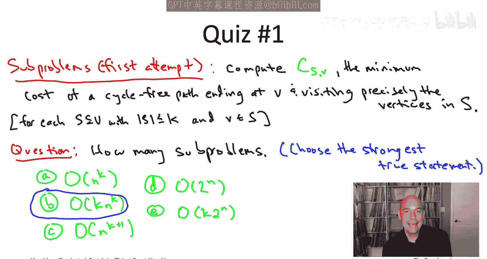

So how big is that sum of these K plus1 binomial coefficients。 Well。

 it's not too hard to convince yourself that the sum is big O of n to the K。

 So the total number of subsets of P of most K is big O of n to the K。

 Now that's going to be an overestimate when K is very big。

 like if K equals n is's actually only2 to the n subsets of any size， not n to the n subsets。

 But when K is small， which is the regime we're going to be interested in。 actually。

 there's a matching lower bound up to constant factors。 So for small K。

 the number of subsets with P size of most K really is a constant times N to the K。

So how should we feel about this bound， I mean， it seems like things are going well， right。

 It seems like this is a lot like what was happening in the traveling salesman problem back then we had n times2 to the n subproblem N for each of the choices of the endpoints and2 to the n for each of the choices of the subset here we have the same form K the different choices for an endpoint and end to the K the different choices for a subset with at most K vertices So that looks pretty good。

 And remember back in the TSP we were happy because even though our running time was exponential。

 that was better than exhaustive search exhaustive search was n factorial and we had a running time which was two to the n times n squared times a polynomial factor。

 So here we're gonna to get a dynamic programming algorithm which has sort of end to the K running time times a polynomial factor So how does that compare to exhaustive search。

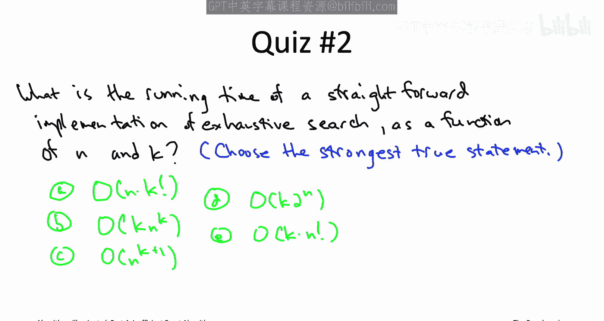

So the answer to the quiz is the second one big O of k times end to the K that is the running time of the most straightforward version of exhaustive search So the simplest version of exhaustive search doesn't sort of explicitly enumerate paths rather just enumerates ordered tuples of K vertices so vertex 17 followed by vertex 4 followed by vertex 23 etc then once you have your list of K vertices you can just check in linear time if it's actually a path in the graph and then if it is you make a note of its cost and then you just remember the smallest cost you ever see of any of the tuples that wind up corresponding to k paths So there's end to the K choices for those K tuples and then it's going to take linear in K work to check each one。

So this quiz spells trouble。 It says we actually should not be pleased at all with the bound on the number of subproble that we had in the first quiz because the bound on the number of subproble was O of K times n to the K exactly the same as the running time of exhaustive search anyways。

 So unlike in the TSP where those subproblem gave us a speed up over exhaustive search from n factorial to more like 2 to the N。

 here we're getting no speedup at all。 Exive search or dynamic programming。

 the running time is going to be n to the K times some polynomial factor。 And mind you。

 you know end to the K。 you know for the types of graph we're talking about。

 say like at least 1000 vertices。 That's a totally useless algorithm。

 Certainly already when K equals5。 So that's kind of a disaster。

 we're not beating exhaustive search to do that， we're going to need another idea。

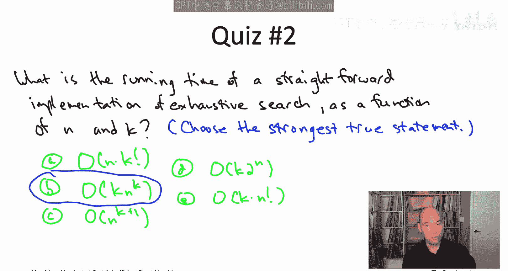

So why is it exactly that we're using so many sub problems。 Well。

 it's because through the parameter capital S， we're keeping track of the exact set of vertices that's been visited so far by a path。

 And with there being at most K vertices， that means there's roughly end to the K possible choices of what's been visited so far。

 We inherited this idea， this parameter capital S from our solution to the traveling salesman problem where we kept track of the exact subset that a path had visited thus far。

Why were we doing that in the TSP。 Well， it's because when we had a solution to a smaller sub problemble。

 a path， and we wanted to extend it to a optimal solution to a bigger sub problemble by adding what edge at the end。

 we needed to make sure that that edge wasn't visiting some vertex previously visited by the path Now we created a cycle that would be a known。

 So the motivation for tracking exactly which vertices a path they visited so far was to make sure that we never visited a vertex more than once。

So that sounds important， you know for the minimum cost K path problem right we also are required to have cycle free paths still you got to wonder。

 you know can we track less information than literally the entire subset of vertices that's been visited so far on a path。

So we can using an inspired idea known as color coding。

So there are two steps to color coding in the first step that's going to be a vertex partitioning step。

 so we've got a vertex set capital V， we've got our targets path length， little K， and in step one。

 we're going to split the vertex set into K different groups。

So for example， if k equals4， we might get a cartoon like this one。

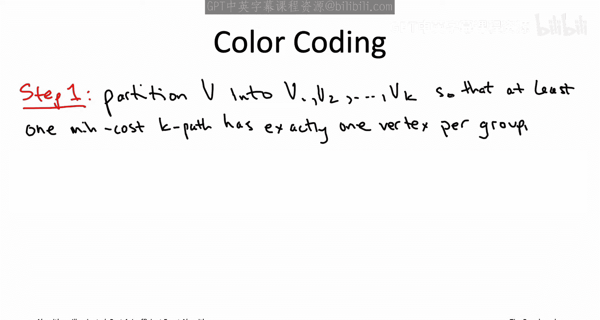

And the reason this technique is called color coding is because we can visualize this grouping as assigning every vertex a color。

 So here V1 would be the red vertices， V2， the green vertices， V3， the blue vertices。

 and V4 would be the yellow vertices。So I'll tell you exactly how we do this vertex partitioning in a little bit。

 the main property we're going to need is that it should be the case that some optimal solution。

 so some minimum cost K path should have the property that it is panchmatic under this coloring under this partitioning that is each of its k vertices should have a different color。

 or if you prefer each of the K vertices of this optimal K paths should belong to a different group。

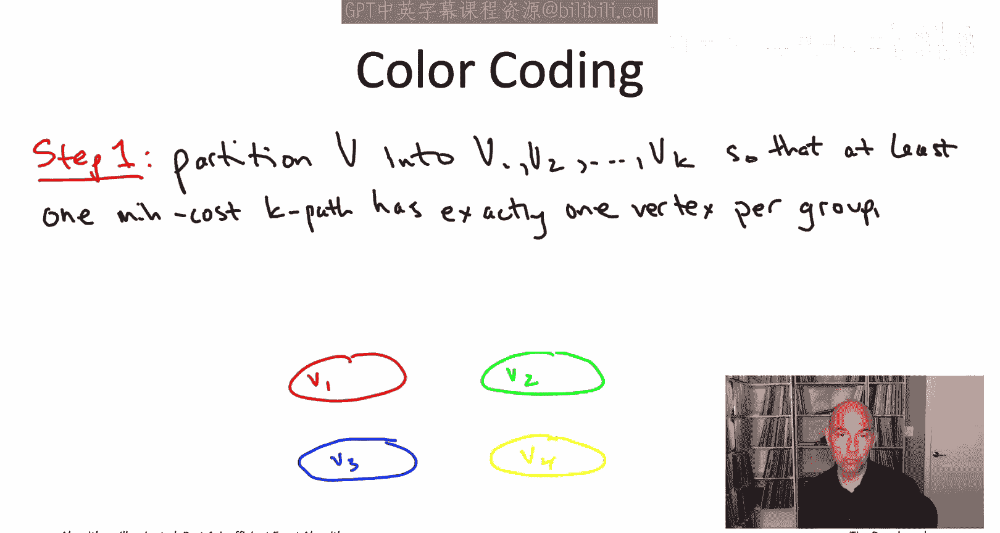

So for example， we might have a pancroatic path that begins in V2。Before proceeding to V3。

And then a vertex in V1。 and concluding with a vertex in V4。

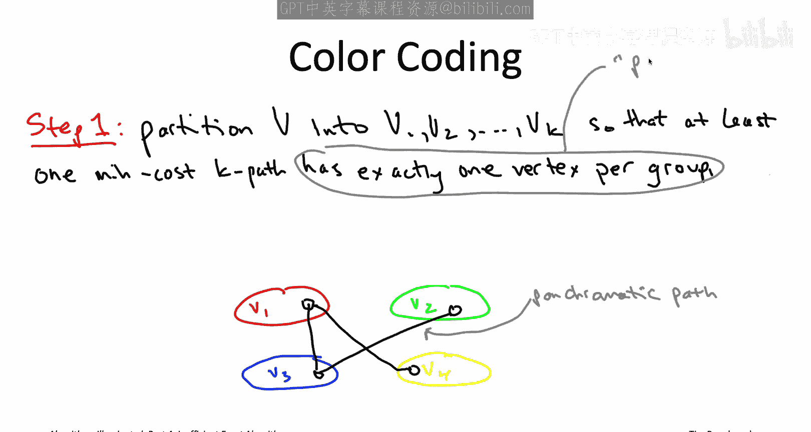

The second step of color coding solves the minimum cost K path problem but with a twist with a twist that you only want to look for panchatic paths。

 so in your graph given the vertex partitioning， given the vertex coloring among all of the panchroatic K paths in the graph。

 your responsibility is to compute the minimum cost one。

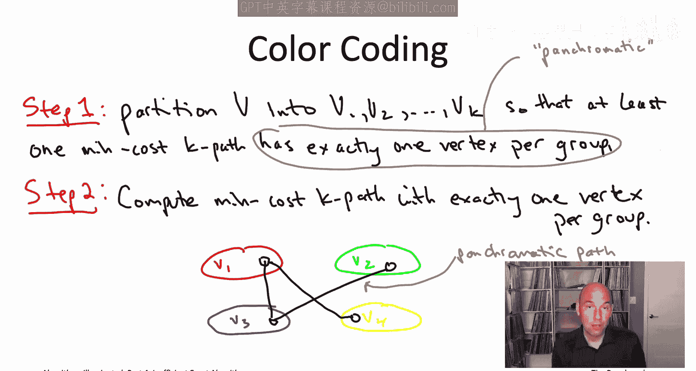

Now， notice while a pancchatic path is automatically a K path， automatically has K vertices in it。

 the converse is not true。 it's going to be K paths that are not pancatic。 So for example。

 you know here's one that starts and ends at V4 and skips V2 entirely。

So if we can carry out both of these steps， we definitely would have solved the problem we care about。

 the minimum cost K path problem because after all the second step it's computing a minimum cost panchatic path。

 while the first step ensures that the minimum cost pancchatic path is in fact a minimum cost K path of the original graph G。

Now I totally understand if you're rather skeptical of this idea， so first of all。

 looking at the second step you're like， well， you know why should this problem with computing a minimum cost pancroatic path be any easier than the one we started with computing a minimum cost K path without the pancroatic constraint。

But even more bafflingly， like look at this first step。

 like how on earth are we going to get a vertex partitioning with this property when we don't even know anything about what the minimum cost K passs look like。

 the whole point is to compute one of them。So let me respond to those two sources of skepticism in order。

 so let me first show you that in fact we can using dynamic programming compute a minimum cost panroatic path faster than any of our attempts to just directly solve the minimum cost K path problem。

Then once after we've seen how to implement step two。

 well return to step one and I'll explain how exactly we compute this vertex partitioning spoiler alert is's going to involve randomization。

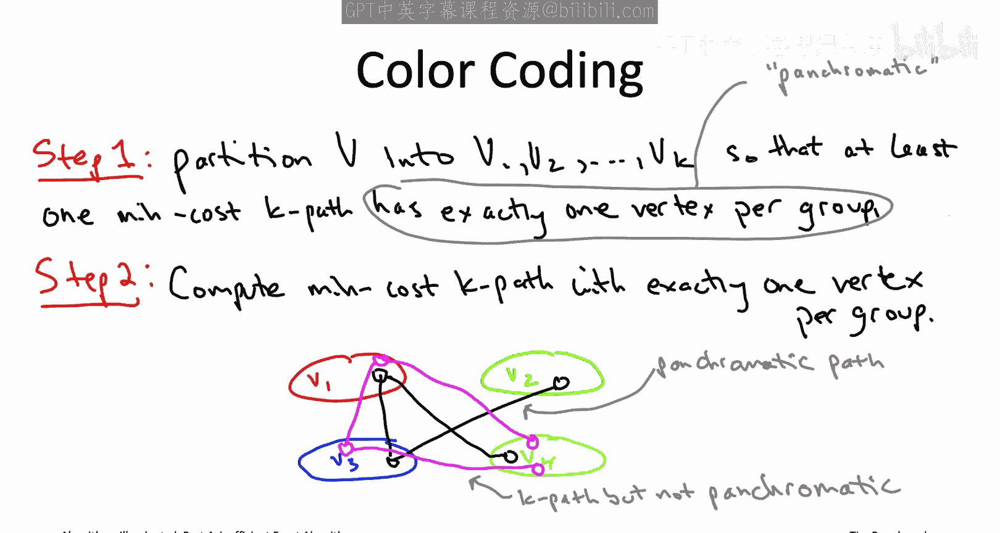

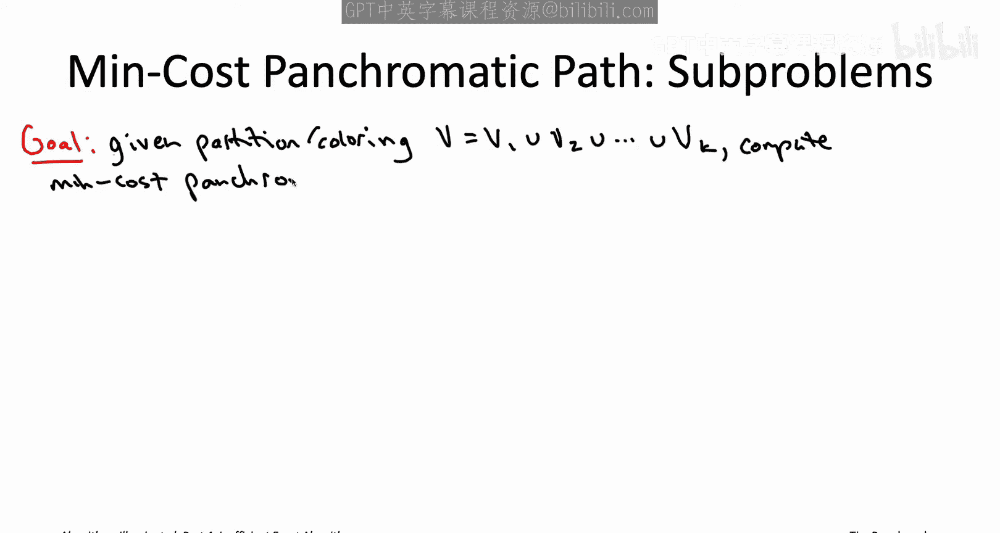

Now let's discuss and solve the minimum cost panchatic path problem。

 so like before we're given an unwtched graph where the edges have real valued costs。

 but now we're additionally given a partitioning of the vertex set into K groups in V1 up to VK。

 or if you prefer think of it as a coloring of the vertices in K colors。

Our responsibility is then to， among all of the panchatic paths in the graphs。

 remember these are paths with exactly one vertex in each of the groups。

 among all the pancroatic paths in the graph we should compute the one with the minimum cost。

 or if there are no pancchatic pass in the graph， we should correctly report that fact。

So why is this pancchatic constraint helpful， Why does it allow us to design a faster algorithm。

 Well， remember， the reason we had this end of decay K sub problems in the original minimum cost K path problem is because we kept track of exactly what vertices the path had visited so far。

The big savings you get in the pancroatic case is you do not have to remember the identities of the vertices that you've seen so far。

 You only have to remember the colors of the vertices that you've seen thus far。 So as we'll see。

 subpro are going to be indexed not by subsets of vertices， but subsets of colors。

 while there are roughly end to the K。 subsets of at most K vertices is only two to the K。

 subsets of colors， and two to the K is much， much better than end to the K。

So moving on to the formal definition of the subproblem， I need one quick piece of terminology。

 so by an S path here S means a subset of colors， so a subset of 12 up to K。

 so an S path is going to mean a path that visits vertices with colors in capital S。

 exactly one vertex with each of the colors in S and does not visit any vertices that do not have colors inside of S。

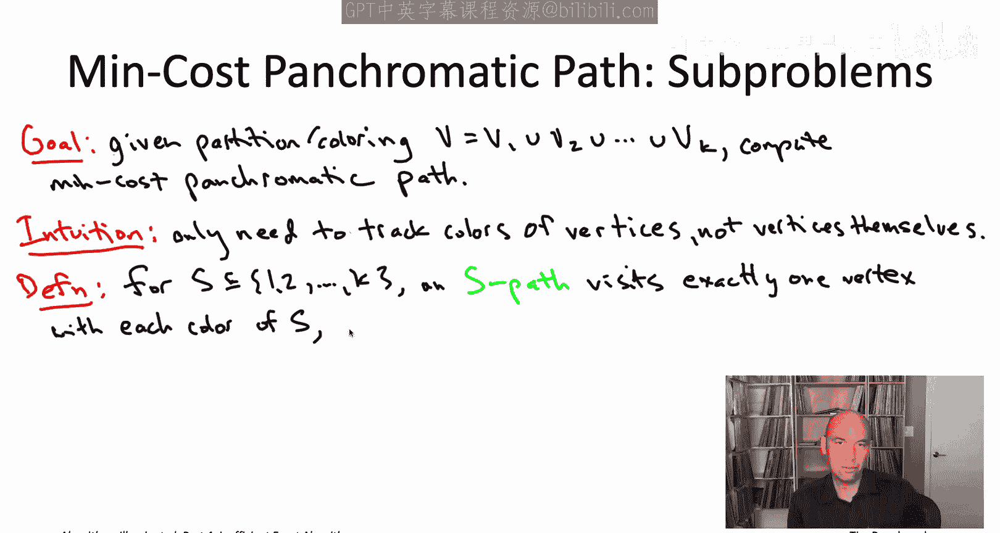

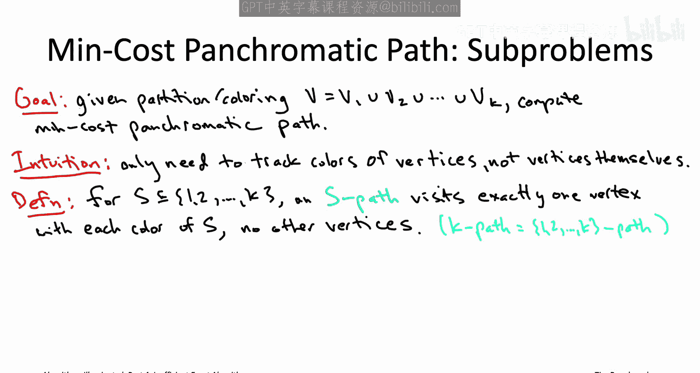

So for example， if S corresponds to the colors red， yellow， and blue。

 an S path would be a path that visits exactly one yellow vertex， exactly one red vertex。

 and exactly one blue vertex。

Note that K paths correspond exactly to the capital S paths where capital S is the set of all colors。

 the set of all of1 through K。

So like in our first attempt and like in the TSP， the subproblems are going to be indexed by two parameters as in the previous cases。

 the second of those parameters is the final vertex visited by the path。

 so that's what we're calling V here， but as we said we're not going to be tracking exactly which vertices a path has seen only which colors it has seen So like one subpath for each choice of a subset capital S of colors and each choice of the ending vertex V and the subproblems job is then to compute the minimum cost of any path that is an F path。

 so it visits vertices exactly with the colors in capital S and moreover ends at the vertex V。Now。

 in what sense are optimal solutions to these sub problemsble composed of optimal solutions to smaller subproblem。

 well here things will proceed exactly as they did in the TSP？

Consider an optimal solution to a subpro， Okay， so for some choice of V and some color is capital S。

 look at the minimum cost S path ending at the vertex V， call that path P。As usual。

 we consider the final decision made by that optimal solution， so the final hop。

 say from some vertex W to the vertex V。What we're expecting is that once you know the final hop。

 once you know the penultimate vertex W then the prefix of the path should be optimal for the appropriate smaller subproblem and that is in fact the case for exactly the same reasons we saw in the TSP so what is the subproble Well obviously this path prefix P prime now it ends at the vertex W So that's going to be the value of that parameter and moreover we know the colors it visits should be exactly the colors visited by the original path capital P minus the color that V happened to be so in this cartoon I've shown V is having the color yellow so this prefix path P prime is going to be optimal for the color subset capital S minus yellow comma W。

If you wanted to prove this formally you'd proceed by contradiction just as we have many times in the past so you'd say well。

 suppose P prime wasn't actually optimal for its subpro， supposeupp there is a still better path。

 P double prime that was even smaller that had even less cost well then you would take P double prime you would tack on that final hop W comma V to the end of it and you get a new path that has a smaller cost than P and so therefore would be a better solution to P' problem than P itself。

 but that can't happen because we started with an optimal solution P。

So what this means is that there's only a very limited number of candidates vying to be the optimal solution to a subprom once you know the final hop of the optimal solution。

 the penultimate vertex W， you know what the rest of the path has to look like so that our recurrence then is just going to perform exhaustive search over the possibilities for the penultimate vertex W so there'll be one possible choice of W for each edge incident to the vertex V。

So this recurrence looks almost identical to the recurrence that we had for the traveling salesman problem。

 which is not surprising because we came about it via the exact same reasoning。

 only difference is here subsets of colors are substituting for what had been subsets of vertices。

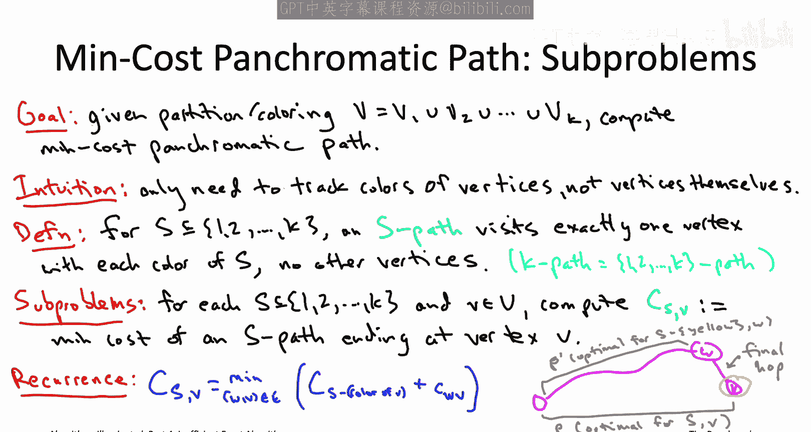

And as always with anime programming， once you've figured out the right subproble and the recurrence that links their solutions。

 you're done， the algorithm just writes itself。So we're just going to call the algorithm panchatic path remember this algorithm in addition to the graph of the edge cost。

 it is given a coloring or a vertex partitioning， so I'm going to use the notation sigma of V to denote the color that is assigned to the vertex V and again that's part of the input。

As usual we start with our subpro array capital A， it's going to be two dimensional reflecting the two parameters that index our subproblem。

 so the first parameter is the subset of colors， any non- emptyty subset of colors we have to deal with so that's2 to the K minus1 choices for capital S。

 and then there's n choices for the ending vertex little v where by n I mean the number of vertices。

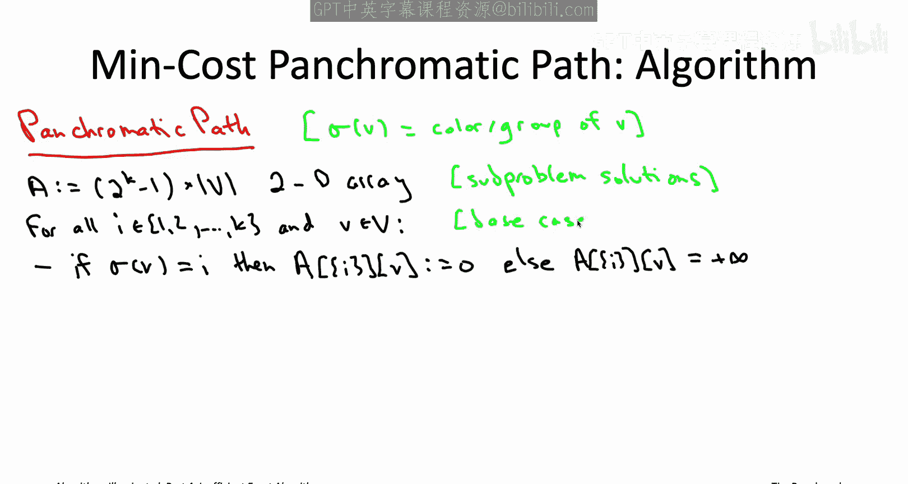

So next we proceed to the base cases， subproblem size here corresponds to the number of colors in capital S。

 so the base cases， the smallest subproblems that's where capital S has size1。

 so it contains only one color in it So we're going to have one subproblem for each possible choice of a color I and for each possible choice of the endpoint V。

Here， the subproblem is asking for， for example， the minimum cost length of a path that visits exactly one red vertex and nothing else and ends at vertex number 17。

And there's two cases， either vertex number 17 happens to be read。

 in which case the empty path fits the bill and has cost zero， or if vertex number 17 is not read。

 if it's like green， well then no path of that type exists。

 so the subproblem solution is plus infinity。

Now， we move on to solving all of the sub problems systematically， from smallest to largest。

 So we're going to have an outer for loop， which keeps track of the subproble size。 So little S。

 that'll be the number of colors in the sets capital S that we're currently looking at。

 Then we have another for loop， which enumerates over these subsets of colors with the target size with size little S。

 And then we have another for loop to search over the second parameter over all possible choices for the endpoint V。

Once you've specified all those things， we know what's a problem we're talking about， capital S。

 little V， and we just invoke the recurrence to compute solution。

The last step is to extract the final solution from the solutions to our largest subproble。

 you'll notice there are n different largest subproblem， ones for each choice of V。

 so that subproblem solution corresponds to the minimum cost pancroatic path that happens to end at the vertex V in the problem statement we don't care where the path ends。

 so we want to search exhaustively over the n choices of V and return the best of those subproblem solutions。

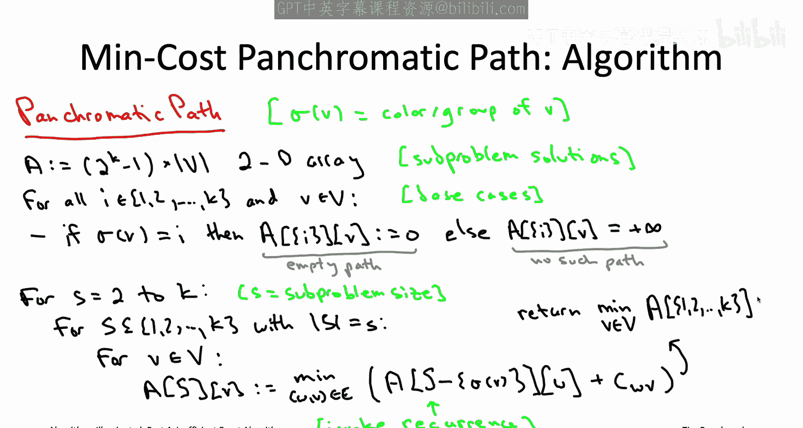

So that's the pseudocode for the pancroatic path problem。

 so once again the input there was a graph with real value edge costs and also a partitioning of the vertex set into K groups。

 or if you like a coloring of the vertices of the graph in the K different colors and that algorithm computes the minimum cost of any panchatic path。

 a path that has k vertices with each color represented exactly once。

Let's talk about the algorithm's properties。 So first of all correctness as usual with dynamic programming there's not a lot to say correctness follows by induction induction on the subproblem size。

 So for the inductive step， you have to argue you solve a subproblem correctly。

 given that you've already solved all of the smaller ones correctly。

 So that's really just justifying the recurrence and the way you justify the recurrence is through our optimal substructure reasoning so we showed that the optimal solution to a subproblem can only be one of a limited number of candidates。

 our recurrence exhaustively searches over all of those candidates the best of which must indeed be the optimal solution。

 so correctness of the recurrence drives the inductive step which drives the correctness of the pancroatic hat algorithm。

As usual with dynamic programming， I've just showed you the basic version which does the forward path through the subproblem solution array。

 so this algorithm would be fine if you just cared about knowing the value of the minimum cost pancroatic path it doesn't give you the path itself。

 but as usual it's simple to add a post-process reconstruction step that traces back through the array and gives you a minimum cost pancroatic path and it's going to be linear time。

 linear even in the path length K。The running time analysis is a little more interesting and should give you hopefully pleasant flashbacks to our running time analysis of the Belman Ford algorithm。

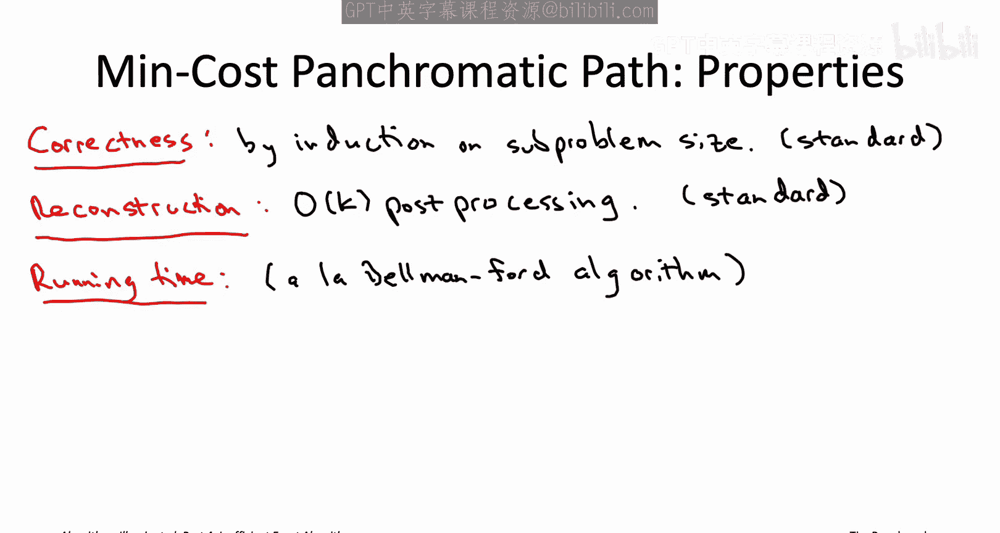

So how much time does it take to solve a single subproble。

 so say a sub problemm corresponding to the color subset capital S and the endpoint V Well the recurrence has to do exhaustive search over all possible final hops of an optimal solution。

 and so there's one candidate for each edge W comma V incident to V。

 So in other words the number of different cases the recurrence has to search over using constant time for each is the degree of the vertex。

 the number of incident edges。So that's the running time of the single iteration of the triple4 loop。

Now let's take a step back and let's ask for a fixed setting of the parameters in the first two four loops。

 the subproblem size and the specific set capital S of that size。

 let's ask how much time is done in total by solving the N subproblem in that third for loop。Well。

 each of these sub problemsblem gets solved in time proportional to that vertexs degree。

 so solving all of these n subproblems is going to be proportional to the sum of the vertices degrees。

So you may know another name for the sum of the degrees of the vertices of an underdirected graph。

 that other name being 2 m， twice the number of edges M right because each edge of an underredirected graph。

 it contributes one exactly one to the degree of each of its two endpoints。

 so the contributions over all M edges， the sum of all of degrees is just equal to 2 m。

So what that means is that the running time of all of the subpros corresponding to a particular color subset capital S runs in linear time。

 So O of M time where M is the number of edges in the graph。

 Probably to be precise as you write O of M plus n here， just in case the graph is disconnected。

 but let's ignore that。 let's just call it O of M time to solve all of the subprom corresponding to a particular color subset capital S。

That means the overall running time is just the number of choices of capital S times O of M。

 and there are of course2 to the K choices of the color subset capital S。

 so that gives us a final running time of2 to the K times M。

So how should we feel about this running time Well， maybe mixed feelings， I mean， on the one hand。

 it's too bad to see there is this exponential factor in the running time2 raised to the number of colors K But then you think about it you're like you know we're dealing with exact algorithms here for NP hard problems So we got to expect some kind of exponent to show up somewhere and then you think more about it and you're like well actually we're beating the pants off of exhaustive search remember for these K path problems。

 you have to enumerate all ks of order K twos of vertices of which there's roughly end to the K So instead of a running time scaling as end to the K we're getting a running time scaling more like2 to the K And for the kinds of parameter choices that we're interested in where K might be 10 or 20 an n might be in the hundreds or thousands。

 this is a massive massive difference huge savings over exhaustive search。

So the final piece of bad news is that。This actually isn't the problem that we originally set out to solve right we originally wanted to solve the minimum cost K path problem。

 And what we've shown is that with this weird extra constraint。

 this pancroatic constraint with that twist， can we can solve the problem much。

 much faster than exhaustive search， But how is this sub routineoutine useful for the problem we really care about minimum cost K path without the pancroatic cons。

 Well， enterranization that's coming up next。

