# 斯坦福大学《算法启蒙（第4册）：NP难｜Part 4 Algorithms for NP-Hard Problems》中英字幕（deepseek-R1） p21 -21-21.2_ Color Coding)  -Part 2 of 2-.zh_en -BV1FAVUzXEum_p21-

Let's turn to the first step of the color coding approach。

 so the responsibility here is to color the vertices of a graph in K colors where K is the target path length we're looking for so that some minimum cost K path of the graph turns monochromatic so that for some optimal path。

 each of its vertices gets a distinct color。

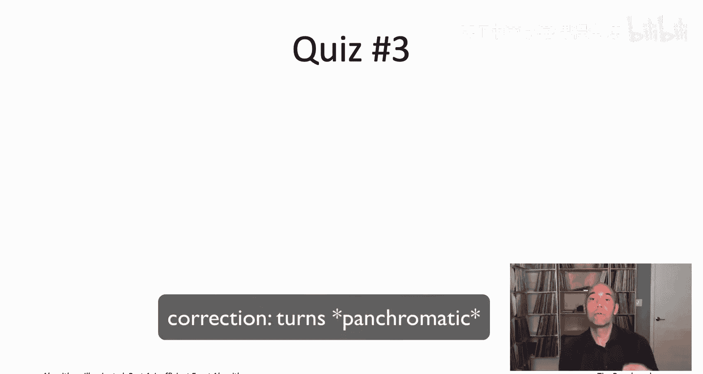

Only problem is， how on earth are we ever going to do that when we have no idea what the minimum cost K paths look like。

 after all， that's what we're trying to find in the first place。

So here we're going to have to bring out another tool from our toolbox when we actually haven't seen in a while randomization。

The hope is that a uniformly random coloring， meaning for each vertex。

 we independently assign at one of the K colors， each equally likely。

 the hope is that a uniformly random coloring actually has a decent shot at turning an optimal K path to become panchatic。

 If that is the case， and we get lucky， then we can relatively efficiently recover that path。

 using the dynamic subroutine that we just dynamic programming subroutine that we just design。

In this quiz， let's think through just what is the probability that a given K path is turned panchatic under a uniformly random coloring。

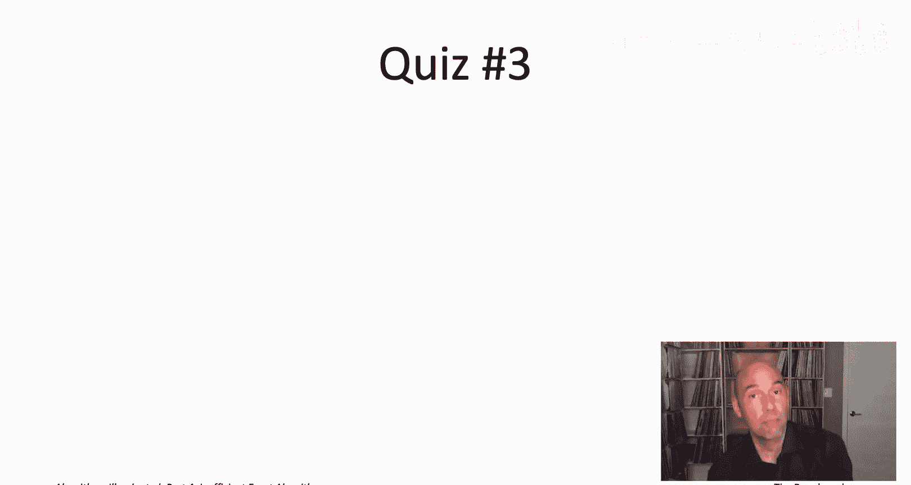

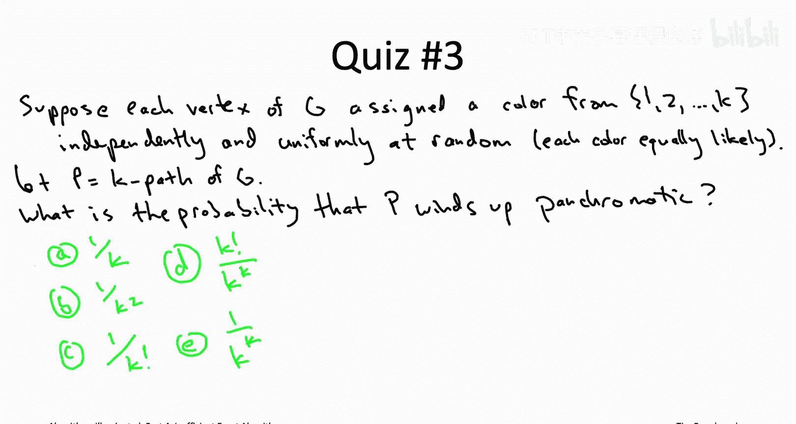

All right， so the correct answer is the fourth one， answer D。

 K factorial divided by K raiseds to the K。So let's start with the number of different things that could happen。

 so we've got our K path capital P it's got k different vertices Each of its vertices is going to be assigned a color from one through k uniformly at random。

 which means there's k different things that could happen to the first vertex of P K different things that could happen to the second vertex and so on up to K different things that could happen to the k vertex。

 which means there's k to the K possible colorings of the K vertices in this path capital P。

 and by definition each of those is equally likely each of the colorings happens with probability exactly one over the number of possibilities。

 one over K raised to the K。Question number two is about the numerator so of all of these K to the cave possibilities and how many of them does this path P wind up being panchatic So the claim here is that the answer is k factorial why well imagine we sort of first choose which vertex is going to get color number one。

 say colored red。There are K different choices for which vertex winds up the red one。

Now we want to sort of figure out which vertex is green。 Well。

 it has to be one of the K -1 uncolored vertices。 So those are the number of choices we have for a green vertex。

 Then we have K -2 remaining choices for a yellow vertex and so on all the way down to one choice remaining for that last color。

 So that gives us K factorial of decay to the K colorings Give us a panchatic。

So how should we interpret that answer， I mean， K factorial and K to the K are both growing pretty quickly with K。

 so what does their ratio look like？So for sure， let's denote this ratio by lowercase P。

 how can we get a feel for it？Well in the numerator we have this K factorial and remember a couple videos ago I showed you a really good approximation for the factorial function Sterling's approximation back then in the context of the TSP I was just trying to illustrate how much faster a two to the end time algorithm is than an in factorial time algorithm here actually Stung's approximation will play a much more direct role let me you remind you what it says。

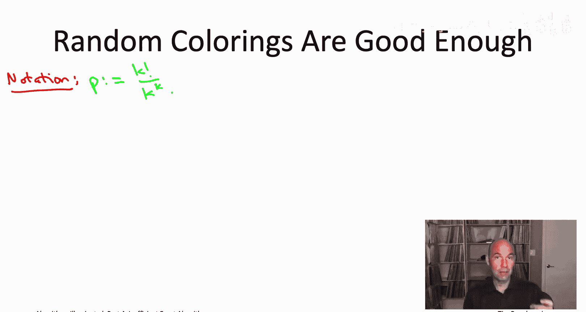

Sting's approximation says that n factorial is very well approximated by n over E here E is 2。

718 dot dot dot， so the ratio n over E raiseds to the nth power times a leading term。

 square root of2 pi n。Before we were content to just notice that n over e to the n is a lot bigger than 2 to the n for even modest values of n here。

 let's actually plug in this formula for the factorial function to simplify our ratio P。

 so we're going to plug in drillingings approximation for the numerator with n with K playing the role of n。

Noting that the two k to the K terms cancel out， we can simplify this expression as follows。

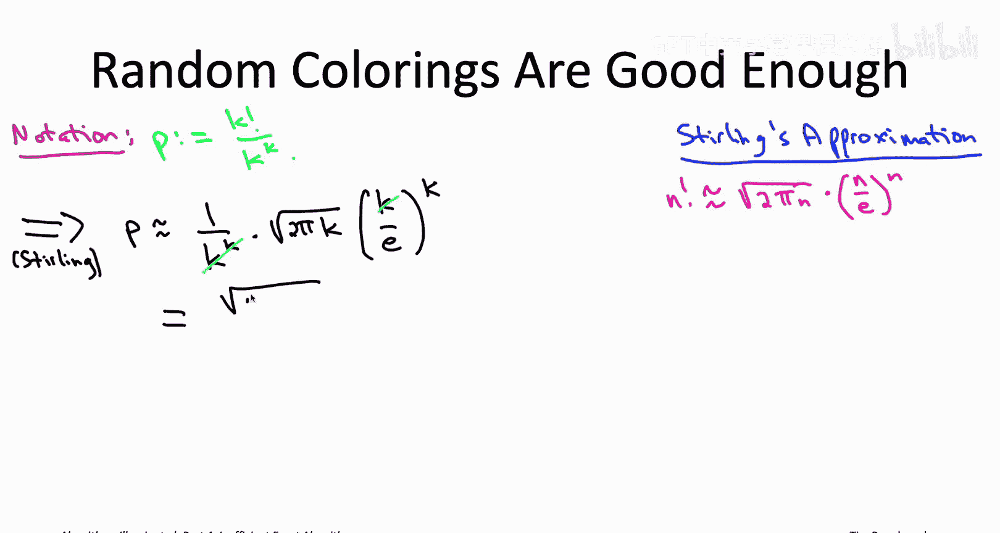

So this looks pretty bad， our probability of success P。

 meaning the probability that we transform a given K path into a pancroatic path using a uniformly random coloring。

 going that's decreasing exponentially fast with K， you can see that e to a K in the denominator。

 so in fact even if you just plug in K equals seven， this is already less than1%。

 which is kind of a bummer。On the other hand who says we have to stop with just one uniformly random coloring。

 so randomized algorithm it's going to do different things the more times we run it。

 so we can just do a bunch of independent random trials， keep trying different colorings。

 keep invoking our dynamic programming subroutine for computing the Min-cost pancroatic path and over all of our trials we just remember the best of all of the pancroatic paths that we ever see。

We only need to get lucky once if even one of our random colorings winds up turning an optimal K path panchroatic。

 our dynamic programming subroutine is guaranteed to find it。

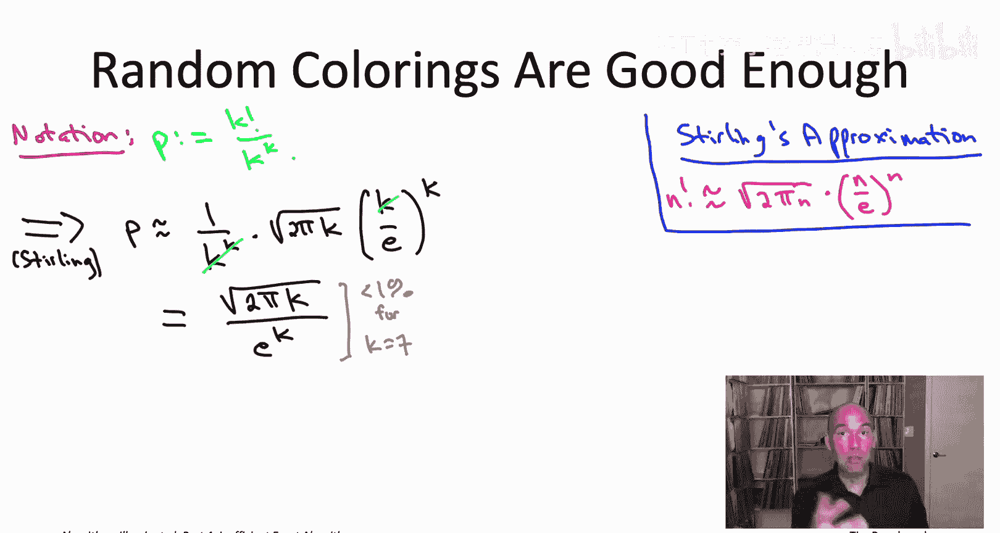

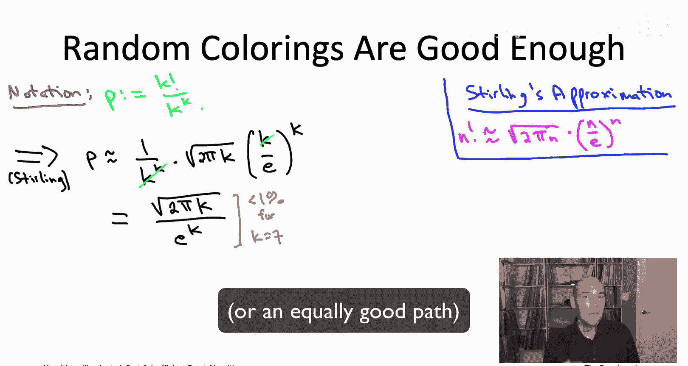

So the question is not so much， you know what is the probability that a single experiment succeeds。

 the probability， the question is how many trials do we need before we're going to succeed in at least one trial with probability at least。

 say 99%。

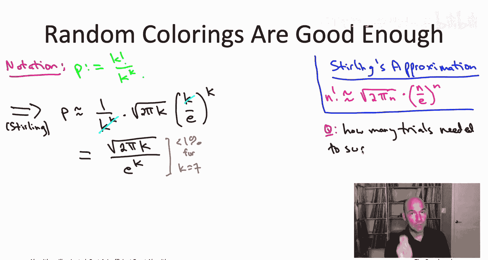

Well here there's a very clean answer， let's build it up step by step。

 let's start with just one trial， so one trial succeeds with probability P， which is pretty small。

 so it fails with probability1 minus P， which is pretty big。We're not going to stop at one trial。

 we're going to do capital T independent random trials well capital T is a parameter we get to pick we want to know how big do we need to set capital T to get what we want。

So if one trial fails with probability 1 minus p， the second trial also fails with probability 1 minus p and so on。

 all of these trials are independent so the probabilities multiply。

 meaning that the probability that all capital T trials fail is1 minus P the failure probability of one trial raised to capital T。

 the number of trials。And if this does not happen， if it is not the case that all capital T of the trials fail。

 then at least one of them succeeded， and that's exactly what we care about。

 so the probability that at least one trial is successful is going to be one minus this quantity。

 quantity1 minus P raised to the capital T。

So that may look a little messy1 minus quantity1 minus p raised to the T to simplify things。

 let's remember something that actually came up a few videos ago。

 which is the close relationship between the linear function1 minus x and the exponential function E to the minus x we were discussing this back when we were talking about why does that magical quantity for maximum coverage and influence maximization1 minus quantity 1 minus1 over k raised to the K why does that converge to 63。

2% So back then we were using the1 minus x and e to the minus x are pretty close to each other when x is close to0 here we're going to use the fact that e to the minus x is always at least as big as 1 minus x so1 minus x is a linear function e to the minus x is a curve that kisses it right at zero。

So if we plug in in particular x equal to p， then what we discover from this graph is that one minus p is bounded above by e to the minus p。

 and now that's a lot easier to handle， we have e to the minus p raised to the capital T。

 but then that just becomes E raised to the minus p times t。Meaning。

 our success probability that at least one of the trials succeeds is at least one minus e to the minus PT。

And what's really important here is that the probability that all of the trials fail。

 that's decreasing really quickly with capital T， that's decreasing exponentially as we take more and more independent random trials。

Going back to our original question， how big do we need to take capital T。

 how many trials do we need so that we succeed with probably at least 99% Well that's a failure probability of at most 1% so what we do is we're just going to set this failure probability bound that we have either the minus PT we're going to set that equal to a parameter delta where here delta would be like 0。

01。So now we can solve for the number of trials capital t as a function of Dlta。

 we find that as long as we take at least one over P P is a success probability times log1 over delta where delta is the failure probability we're willing to tolerate。

 that many trials is enough to get us at least one success with probability at least one minus delta So for example。

 if our success probability of one trial， P was like 1% that one over P term would turn into a factor of 100。

 and if we said delta to be 0。01， meaning we want a 99% rate。

 then that's going to multiply the 100 by something like5 so it's going to tell you that take 500 trials and you're good to go。

 you should succeed almost all the time on at least one of them。

In the context of color coding where we're taking these uniformly random colorings to turn Kpaths pancroatic。

 we know what our success probability P is， it's root 2 pi k over e to decay that was our sterling approximation that got us that and so that gets flipped in the number of trials。

 so the number of trials we're going to need the number of times we need to experiment with uniformly random colorings before we're likely to have had at least one success where given KPA turned pancroatic that's going to be e to decay K divided by root 2 pi k times this log of one over delta factor。

Now this may seem extravagant， this exponential in K number of trials， but don't forget。

 we're already in our dynamic programming subines spending time exponential in K so this exponential in K is just going to multiply with that one and we'll have ballpark the same type of running time。

So just to make sure that it's clear how all the ingredients fit together。

 let me go ahead and show you the pseudocode。

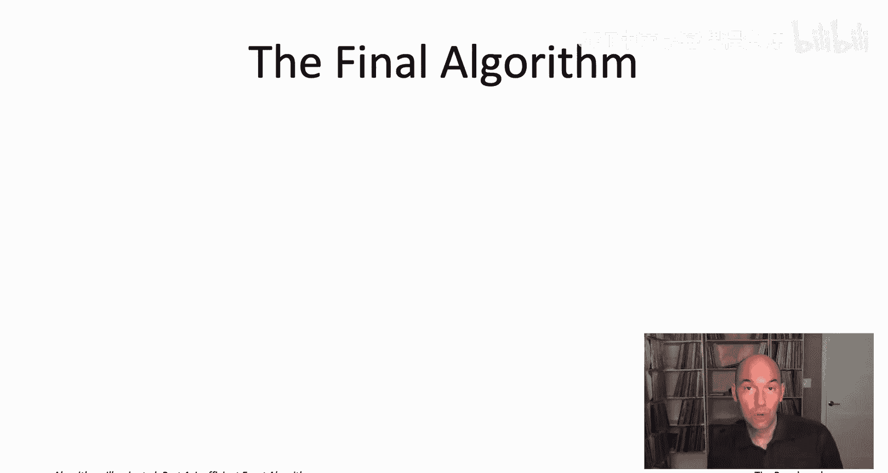

The first thing the algorithm does is compute how many random trials it needs and that's what we just sort of figured out on the previous slide。

 so that's going to be e to the K divided by root 2 pi K times log 1 over Delta where Delta is this user supplied failure probability。

Now we're just going to run capital T independent random trials。

 each trial we pick a fresh new uniformly random coloring。

 each trial we invoke our panchatic path subroutine to find the minimum cost。

 panroatic path for that particular coloring and then we just remember the best path that we ever see over all of the trials。

That is the color coding algorithm， so it does a whole bunch of independent random trials and in each independent trial it experiments with a uniformly random coloring of the vertices。

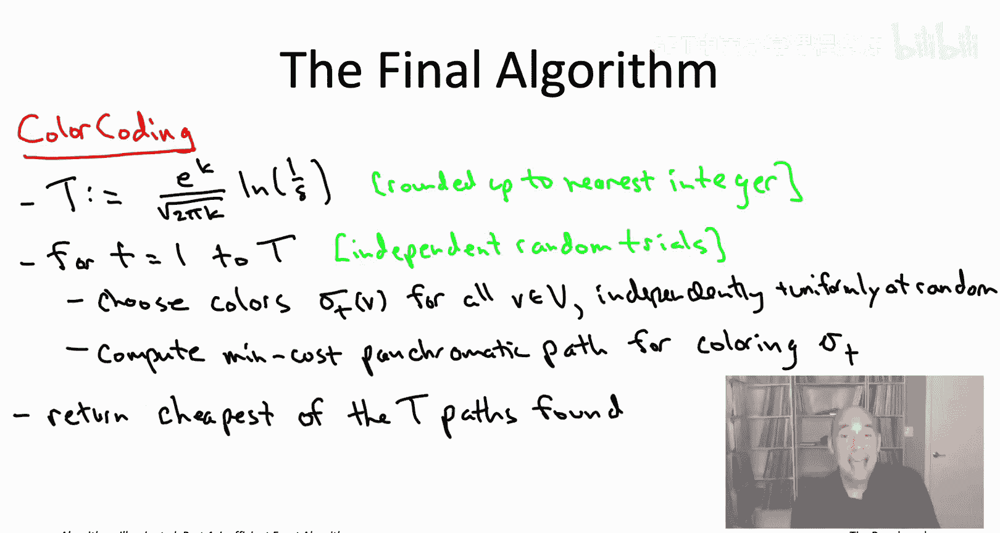

Each trial you might succeed or might not it might fail What do I mean by that succeedce means that at least one of the minimum cost K paths becomes panroatic in which case that path or some equivalently good path will be found by the dynamic programming subroutine or it could fail。

 meaning that this coloring actually winds up turning none of the minimum cost K paths of the graph panroatic removing all of them from the subroutines consideration so in that failure case the subroutine know maybe it returns plus infinity。

 if in fact the coloring meant there were no pancroatic paths at all。

 or if the subroutine returns a pancroatic path， it can't be a minimum cost one because none of them were pancatic and the failure case so it's going to be some K path at the original graph with strictly higher cost。

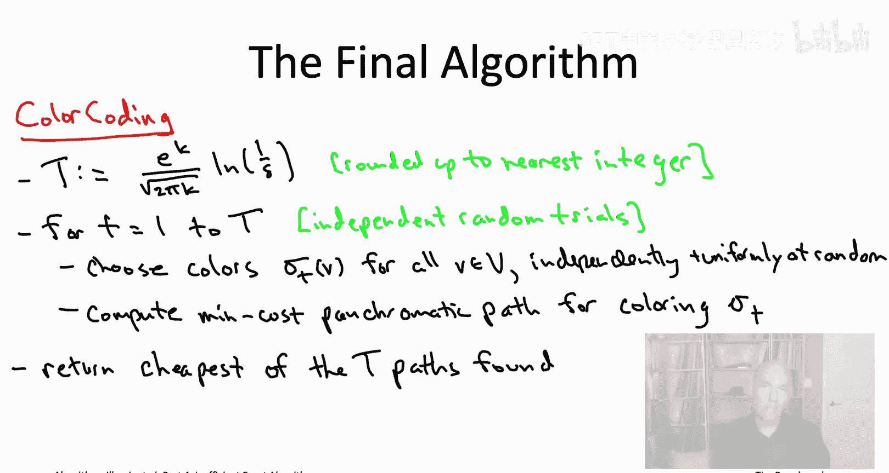

ButThe point is we only need one of these trials to succeed if at least once we wind up coloring the vertices so that some minimum cost K path becomes pancatic。

 then this algorithm will be correct and of course we've chosen the number of trials capital T so that the success probabilityba is exactly what we wanted it to be at least one minus delta。

How about the running time of the algorithm？Pretty much all the algorithm does is run these capital T independent random trials。

 so the running time is just going to be the number of trials capital T times the running time per trial。

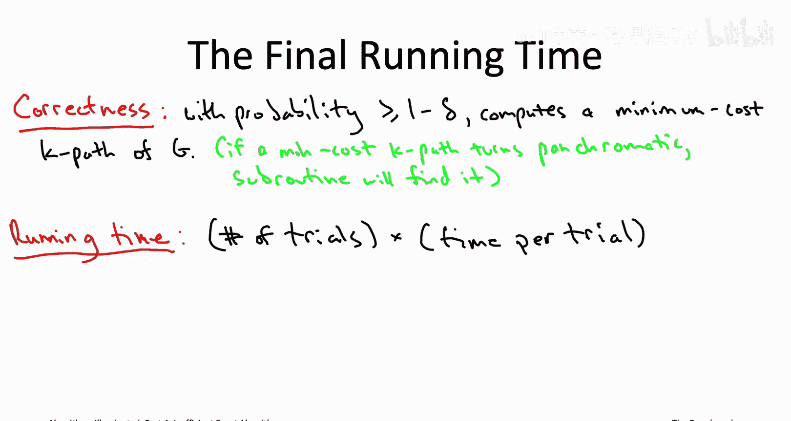

So the number of trials we computed explicitly， it's e to the K divided by root2 pi k times log1 over delta。

 let's just be a little bit sloppy with the upper bound and forget about that root K factor。

 let's just call the number of trials o of e to the K times log1 over Dlta。

The time of a trial is completely dominated by the invocation of the dynamic programming subroutine for computing a minimum cost pancroatic path and if you recall。

 the running time of that algorithm via a sort of Belman Ford style argument was 2 to the K times M where m is the number of edges in the graph。

So multiplying out that gives us a running time of quantity2 times e raised to the K power times the number of edges m times log1 over delta where delta is the user supplied failure probability。

So how should we feel about this running time Well。

 it is beating the pants off of exhaustive search remember an exhaustive search you had enumerate all ordered K triples vertices of that's going to be scaling like n to the K here we have a running time bound that scales like a constant raised to the K constant's not as small as it was before now the constants like 5。

5 but still for the values of n and K that we're talking about K equal to like 10 or 20 and n equal to say in the hundreds or the thousands 5。

5 to the K is way， way way better than a running time of n to the K end to the K would be useless really already for like K equals 5。

There is a special name for algorithms of this type。

 so exact algorithms for NP hard problems whose running time while of course is exponential。

 sort of exponential and only a rather restricted way。

 so where the exponential dependence depends only on a particular parameter sort of measuring the difficulty of the instance so in the K path problem the parameter is just K。

 the longer the paths that you're looking for， the harder the problem gets in general algorithms that have exponential dependence only on parameters and are polynomial otherwise in the input size。

 those are known as fixed parameter algorithms encourage you to do a web search on that term if you want to learn more。

And this particular fixed parameter algorithm actually made a pretty big difference in the motivating application remember at the beginning of this section we talked about the application of finding long linear pathways in protein protein interaction networks so finding meaningful structure in biological networks and before color coding came along the state of the art techniques were getting stuck for pretty small values of K maybe K around 10 or something like that and with the invention of color coding so even all the way back in like 2007 or so computers at that time。

 this algorithm allowed computational biologists to find linear pathways of length up to 20 even in PPI networks that had thousands of vertices so that really led them to understand the structure of these biological networks in a much deeper way than they could before。

So that wraps up our discussion of the color coding algorithm and more generally of exact algorithms for NP hard problems that have provable running time bounds better than exhaustive search for the rest of this chapter for the rest of chapter 21。

 I want to discuss state of the art technology that does not necessarily have provable running time bounds better than exhaustive search but can be super effective for tackling NP hard problems in applications。

 state of the Al solvers for mixed integer programming and satisfiability we'll start talking about that next I'll see you then。

