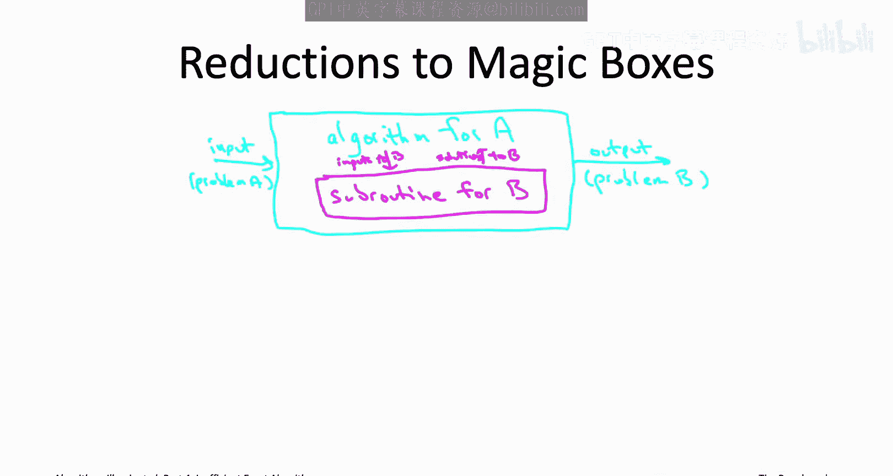
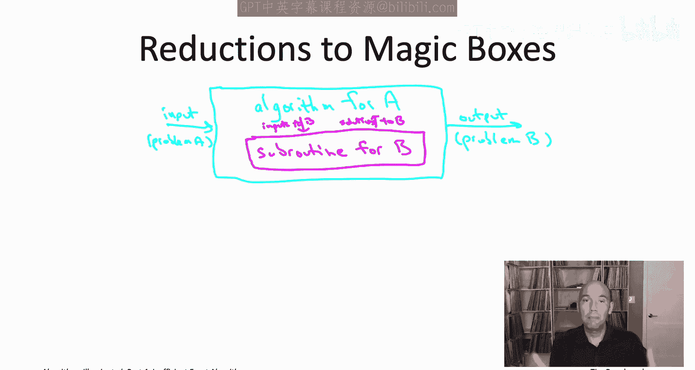
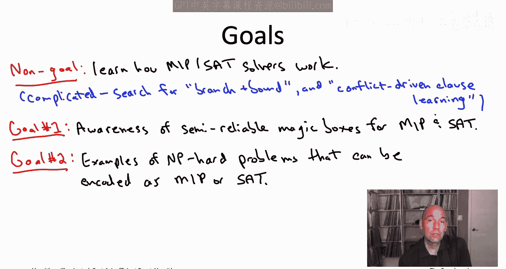

# 斯坦福大学《算法启蒙（第4册）：NP难｜Part 4 Algorithms for NP-Hard Problems》中英字幕（deepseek-R1） p22 -22-21.3_ Problem-Specific Algorithms vs. Magic Boxes).zh_en -BV1FAVUzXEum_p22-

Hi everyone and welcome to this video that accompanies section 21。

3 of the bookArims illuminated Part4。 This section is a brief introduction to Magic boxes in comparison to the problem specific algorithms that we've focused on mostly thus far。

 Take the last two problems we looked at， for example。

 we looked at the traveling salesman problem and we develop the dynamic programmingbased bellman held cart algorithm to solve it faster than exhaustive search。

 similarly for the minimum cost Kpath problem。 we developed the very clever color coding algorithm to solve that problem faster than exhaustive search。

 So bespoke algorithms like those two are deeply satisfy you really sort of get into the problem。

 you understand how to exploit the structure the problem and you come up with some provably good algorithm。

 and that's great。 But at the same time， whenever you're confronted with a new problem。

 you should always stop and ask yourself。 I this problem a special case or thinly disguised version of a problem that I already know how to solve。

😊，Now maybe the answer is no， it's not， in which case you're justified to proceed to problem specific algorithm development。

 or even if the answer is yes， technically， it is a special case of a more general problem。

 if the algorithms for the more general problem aren't good enough for your application。

 then again you've justified solving specifically the problem that you're looking at。

Throughout this book series in these video playlists we have on the other hand。

 seen a number of examples where a problem is simply a special case or thinly disguised version of some other problem that we already know how to solve maybe the first example that we ever saw was for computing the median to compute the median of array suffices to sort the array and return the middle elements。

 of the reductions we saw was we saw that all pair shortest paths reduces to single source shortest paths by invoking a subroutine for the latter once for each choice of a starting vertex or we saw that the longest common subequence problem is really just a special case of sequence line。

So reductions of this type from some problem A that you care about to some problem B that you already know how to solve。

 they transfer computational tractability from B， the problem you already know how to solve to A。

 the problem you want to solve and which reduces to B。

The reductions we've been thinking about thus far， we've always been reducing a problem to some other problem B that we'd already figured out how to solve ourselves。

 like we'd already figured out how to sort quickly by the time we were invoking a sorting subroutine to compute the median of an array。

On the other hand， and this is really sort of the full power of a reduction between two problems。

 A reduction from a problem A to a problem B， that's useful。

 even if you yourself have never figured out how to solve problem B efficiently。

 even if you've never coded up an algorithm for it。 As long as somebody hands you a magic box。

 Think of it as like an inscrutable piece of software written by a bunch of super smart people over many years。

 The hand you a magic box。 The magic box can reliably solve instances of problem B efficiently。

 You're good to go。 You can solve your problem A efficiently。

 Just run the reduction invoking the magic box， the subroutine for problem B whenever you need it。😊。

So a magic box probably sounds like pure fantasy， you know。

 akin to a unicorn or the fountain of youth。 Could these inscrutable magic boxes really exist。 Well。

 in the next couple of videos， I'm going to tell you about two of the closest approximations out there。

 namely solvers for mixed integer programming and satisfiability。So when I say solver。

 I mean basically in practice it's an inscrutable piece of software。

 so usually a very sophisticated algorithm， which has been very carefully tuned and expertly implemented and is available for you to use as off the shelf software。

There are two genres of solvers I want to tell you about in the next video we'll first discuss mixed integer programming solvers。

 also called MIPS solvers。The other type， which we'll discuss in the subsequent video are SAT solvers where here SAT stands for Saissfiability。

So both MIp and satAT are crazy general problems， both are expressive enough to capture all of the problems that we've studied in this book series as special cases。

 So they're very general， but at the same time， several decades worth of engineering effort and ingenuity have been poured into state of the art mixed integer programming and satisfiability solvers and so for this reason。

 despite the generality of the problem that they're solving MIp and Sa solve was reliably tackle medium-sized instances of NPp hard problems。

 and not that crazy amount of time。 So the solver performance varies a lot with a problem and a bunch of other factors。

 but just to give you a sense， you might reasonably cross your fingers in hope that for a problem that's naturally encoded as a mip or a sat problem that inputs with size in the thousands or if you're lucky even the tens of thousands。

 you might be able to solve in less than a day or even faster than that。So in some applications。

 MIPS and Sa solvers are unreasonably effective even for large instances。

 even with input sizes in the millions。

So my goals in the next two videos are pretty modest。

 I am not going to tell you at all about how these mi and sat solveverrs actually work。

 that would require an entirely separate course。 Rather。

 I want to prepare you to be an educated client of this cutting edge technology of MI and Sa solvers。

For those of you that do want to learn more about implementation details。

 so what MIPS and SaAT solvers look like under the hood it' a pretty complicated topic。

 but to get started， you might want to do a search for branch and bound if you want to learn how mixed integer programming solvers work or a conflict drivenve clause learning if you want to look into the newest generation of satisfiability solvers。

So if we're not going to learn how these solvers work， you know what are we going to learn。

 well the first thing is， honestly I just want you to know that these pieces of technology exist and are more or less available at your fingertips。

Not enough programmers are aware that we have these semi reliable magic boxes called MIPS and SaAT solveverrs。

 which can be incredibly useful for tackling NP hard problems in real applications。

So the second goal is I want to give you a little bit stronger sense for how general the mixed signature programming and satisfiability problems are。

 so I want to show you how some natural NPP hard problems can be naturally encoded as special cases that these solvers can handle。

Finally， we're only going to spend a relatively short amount of time discussing MyPS and SaAT solveverrs will just be barely scratching the surface。

 but I do want to give you some pointers if you want to dig deeper and learn more either into the implementation side。

 as we just discussed， what to search on branch and Bo or CDCL solvers or if you want to actually put these things to use in your own applications。

 if you're wondering about what software is out there， how should you get started。

 we'll touch on that in the next couple videos as well。

Let me conclude just by trying to clarify what might be some mixed messages you feel like you've been getting from these videos so far。

 So in the opening sequence we talked about what does NP hardness mean for the algorithm designer and we said how you need to compromise you need to either give up on being exact on being correct or you need to sacrifice on running time and run an exponential time and on the other hand。

 here I am telling you that in practice we have these semi-reliable magic boxes that can solvemp hard problems mixed in programming and satisfiability in particular。

 which then cover many other problems also as special cases So how do we reconcile those two things Well the magic boxes for mi and I wouldn't call them reliable I would call them only semireliable So if you're applying a mi or sat solver to an NP hard problem in your own application basically you need to keep your fingers crossed and have a plan B plan B could be something like a fastturistic algorithm have a plan B in case the solver does not work out and make no mistake There will be。

Some instances out there， including fairly small ones that can bring your solver to its knees。

 you take whatever you can get with MR problems and the semi reliable magic boxes that are mi and sat solvers。

 they're about as good as it gets。So in the next video。

 I want to help you be an educated client of the first of these semi reliable magic boxes。

 solvers for mixed integer programming， I'll see you there。

