# 斯坦福大学《算法启蒙（第4册）：NP难｜Part 4 Algorithms for NP-Hard Problems》中英字幕（deepseek-R1） p23 -23-21.4_ Mixed Integer Programming Solvers).zh_en -BV1FAVUzXEum_p23-

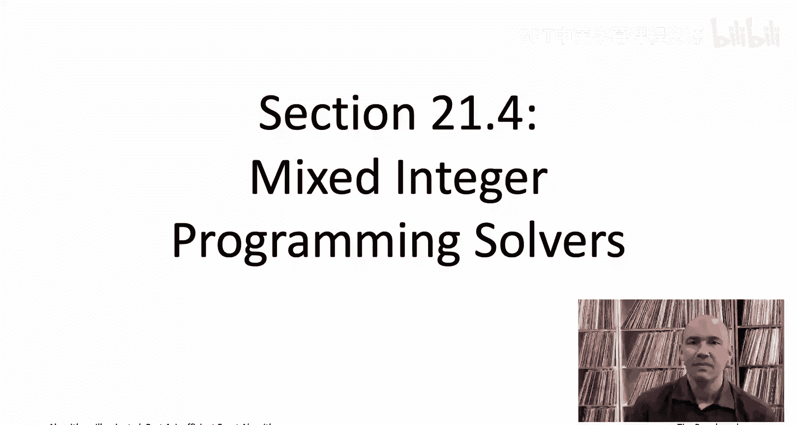

Hi everyone and welcome to this video that accompanies Section 21。

4 of the book algorithmrithms illuminated Part4， This section is a brief introduction into one type of semi reliable magic box known as a mixed integer programming or MIP solver。

So lots of discrete optimization problems， including pretty much everything that we've seen in this book series。

 can be cast as a special case of a very general problem known as mixed integer programming。

Now programming here， the word has the same anachronistic use that it did when we discussed dynamic programming or that you hear in television programming。

 so programming here refers to planning not to coding as you might expect in the modern day In any case whenever you have an empty heart optimization problem that lends itself naturally to a formulation as a mixed integer program throwing a Mipssolver at it is probably worth a shot let's get an initial feel for how this might work by revisiting an old friend the Napsack problem。

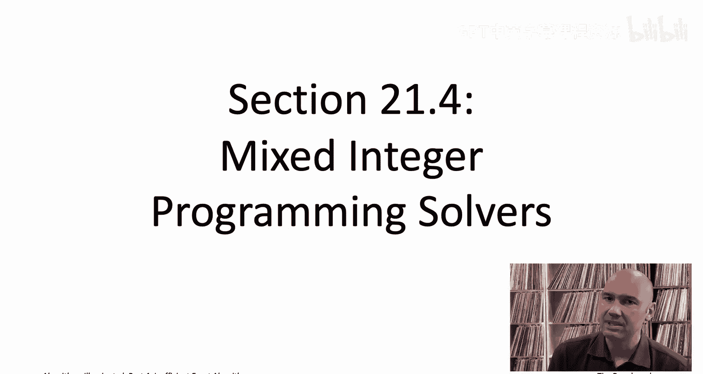

So let me remind you the definition of the Napsack problem。

 which we've discussed a few times in the past， so the input comprises2 n plus1 positive integers。

 so there are n items， each of which has a value and a size and then the last of the numbers capital C is a Napsack capacity。

So for example， here's an example with five items and a NApsSack capacity of 10。

The goal is to choose a subset of the items you would like the total value of those items to be as high as possible。

 but the constraint is that the sum of the sizes of those items should be at most the NapsSack capacity。

The problem specification spells out three things， the decisions to be made。

 the constraints that have to be respected， and the objective function， which is to be optimized。

The decisions， well， we need to make a binary decision for each of the N items， for each item I。

 we need to decide whether it's going to be included in the NApsack in our subset or not。

A very convenient way to numerically encode binary decisions is as 0，1 variables。

 So that's what we're going to do here。 We're going to use X I Does know1。

 if I is included in the subset and 0， if I is excluded from the subset。Second。

 the constraints actually， in the Napsack problem there's only the one constraint。

 saying the sum of the chosen items sizes should be a most capital C。

 What I want to notice here is that that constraint is actually very easy to express in arithmetic in terms of these decision variables。

 these X sizes that we've introduced， because an item I is going to contribute its size S sub I to the overall size if it's included and it will contribute0 to the overall size。

 if it's not included。So in other words， we can express the total size of the chosen items as a simple sum。

 so we sum over the items and then a given item contributes Sj times Xj。

 notice that's going to be0 if xj is 0， the items excluded and it's going to be SJ。

 the size of item J if J is included。The final part of the problem specification is what it is we want。

 what is the objective function， and that's just maximizing the total value of the chosen items。

 and just like the total size was easy to express as a sum in terms of the XJs。

 so is the total value， it's just exactly the same sum except with the SJs replaced by the VJs。

So guess what you just saw your first mixed integer program。

 your first MIP to make sure this is all crystal clear。

 let me literally spell out what the mixed integer program is for the case of this five item example on the right part of the slide。

So let me write the objective function first， so remember we want to maximize。

 we want to maximize the total value and the total value can be expressed as a sum of the decision variables。

 the xj is each multiplied by the value of the corresponding item。So the first item had value6。

 so that gives us a6 x1 as the first term， right the item contributes6 to the value if it's included zero if it's not included。

Second item has value 2。 so excuse me， value 5。 so we get a 5 x2。Third item has value 4。

Fourth item is value 3。And the fifth item has value 2。So that's going to be the objective function。

 So for a given setting of the xjs to0 or 1， this just encodes the total value of the chosen items。

Then we have the constraints。So now we want to say that the total the sum of all of the sizes of the included items is at most thenapsack capacity。

 so the first item， remember it has a size of5， so we're going to have an 5 x1 here。

 contributes5 to the size if it's included zero to the size of its not。And then similarly。

 the second item has size four， third item has size three。Second fourth item has size2。

And last item has size one。

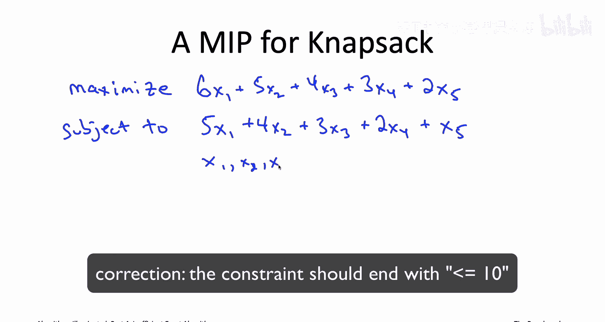

And then finally， let's just record what are these Xjs， they are zero or1。

And the zero where1 is meant to indicate whether the item is excluded or included in the final subset。

And this simple as it is， this is exactly the sort of description that can be fed directly into a magic box known as a mixed integer programming or a Mi solver。

So for example， if we wanted to know the answer to this five item instance that we have on this slide。

 we could use a leading commercial MIPS solver like Grobi optimizeizer would be one example。

 and if we wanted to do that， you would literally just invoke the solver with the following input file。

Whi you'll notice is literally what we just wrote down on the previous slide in math。

 you just translate to text file， you feed it into Gro the Opr。

 and in the blink of an eye it will tell you the optimal solution。

 which in this case turns out to be to setting x1 equal0， the rest of the xj is equal to 1。

 so you exclude the first item you take the other four。So this naturally was just a toy example。

 just five items usually when you're using a MIPS solver， you're solving instances that are bigger。

 and for larger instances you're not going to want to type up this input file by hand。

 you're going to either want to write a program that generates the input file automatically or alternatively just interacts directly with the solvers's API。

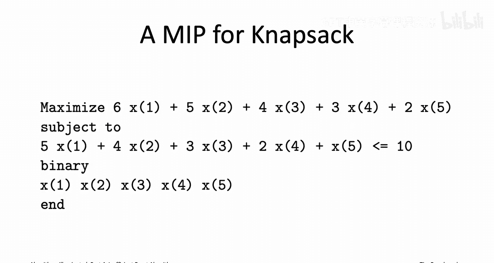

Let's move on to discussing mixed integer programs more generally beyond just the NApsack problem although I probably owe you a couple of words of explanation before that first you might be wondering what is the mixed what's up with the M in MIP and mixed refers to the fact that the solvers were' discussing accommodate a mixture of different types of decision variables so we've only used a binary one so far0 or1 more generally they can handle they can use decision variables that can take on integer values within some range or even real value variables within some range So because you can mix real value to integer value variables that's why they're called mixed integer program。

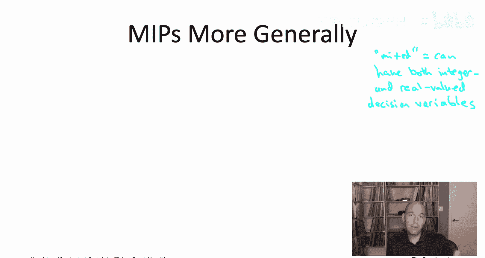

I should also warn you that what I'm calling MIPS are sometimes called other things。

 MIPS is definitely a common terminology， but some authors will call these instead integer linear programs。

 ILPs， to emphasize the linear aspect， which we'll talk about in just a second。

 and then some authors just say integer programs， Is and leave off the mix。

There's also a really interesting special case of a mixed integer program。

 which is the special case where there are no integer valued or 01 decision variables where all the decision variables are real value。

 So that special type of MI is known as a linear program or an LP。

State of the art solvers work really， really well on linear programs， in fact。

 anytime you use a solver to solve a mixed integer program under the hood。

 the solver is probably solving thousands of linear programs to help it along。Not coincidentally。

 it turns out the linear programming problem is polynomial time solvable。

 while general mixed integer programming is NP hard。

 so that's a still very powerful and expressive but quite tractable special case of mixed integer programs。

 linear programs to the case where all of the decision variables are real valued。

So how do you specify a MIPS in general， Well it's really just those same three ingredients that we discussed。

 you have to identify your decision variables， which decisions are getting made。

 you have to say what your constraints are and you have to say what you want。

 what's your objectiveive function。

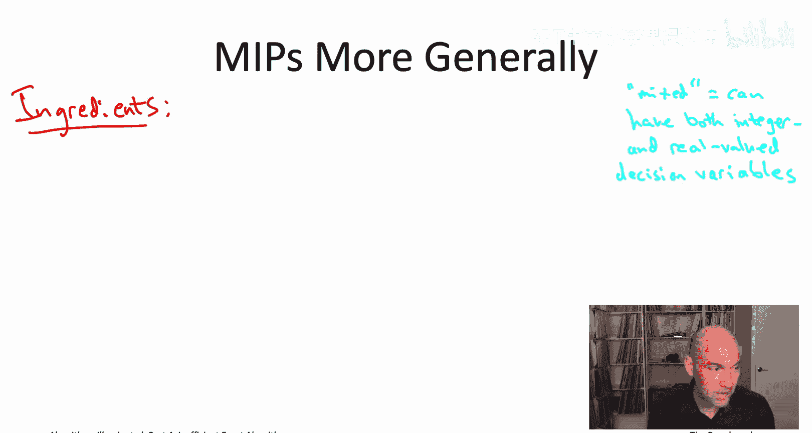

The one really important restriction is that both the constraints and the objective function should be linear functions of the decision variables。

So what does it mean to say that the constraints and objective function are linear in the decision variables Well let's go back and look at our Napsack integer program What you'll notice is that in both the objective function and in the constraints you know we have taken some of the decision variables and scaled them by a constant like six or five or4 and we've also added up the decision variables together。

 but we haven't done anything else。 and so that's exactly what linear means。

 So for example you would not be allowed to have an expression like xj squared that would be nonlinear you couldn't have xj times xk that would be nonlinear you couldn't have like one divided by xj1 over xj also nonlinearar either the Xj log of Xj etc none of those are allowed to show up in a mixed integer program So both the constraints and the objective function need to be expressable as basically sums over decision variables scaled by constant factors。

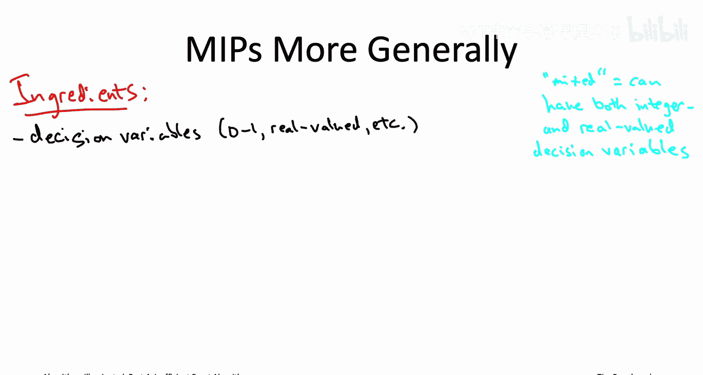

It is true that the latest and greatest MIPS solveverrs can also accommodate limited types of nonlinearity like certain quadratic terms。

 but they typically run much faster when you have just linear constraints and objective functions。

 and that's what we'll focus on here。

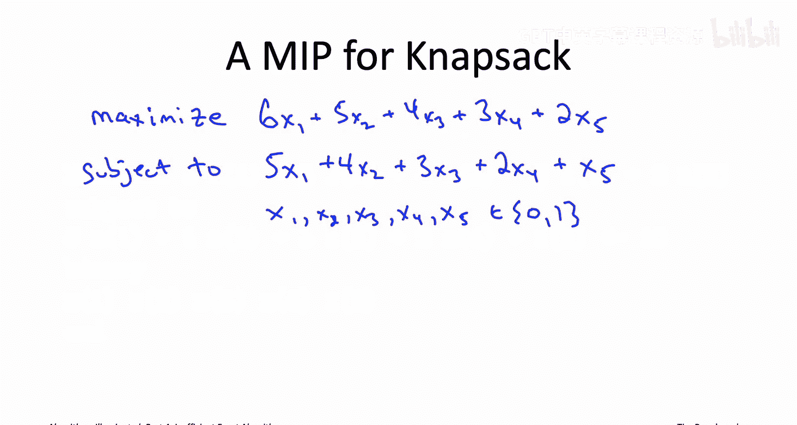

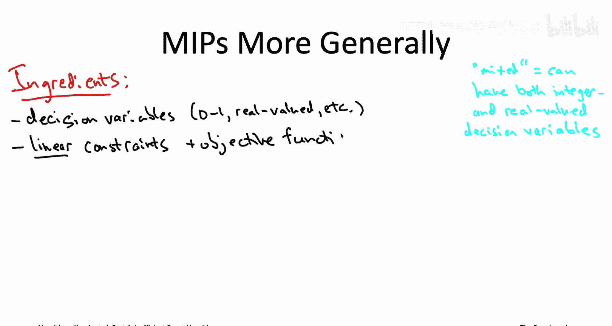

So now I can formally define for you the mixed induture programming problem。

 basically you've given a description of a and your job is to just find the best solution subject to the constraints。

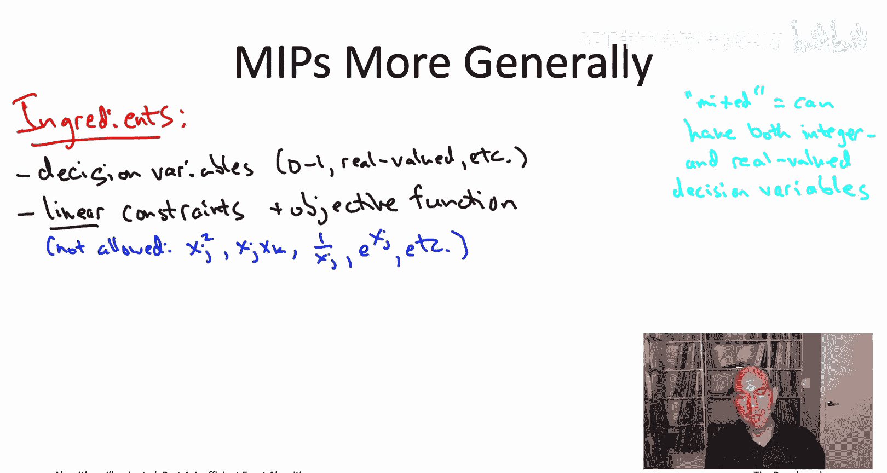

So the objective function being a linear function all you can do is basically choose what to scale the different decision variables by。

 so the input just consists of the coefficients of the linear function。

 so coefficient CJ for each of the decision variables Xj similarly for each constraint and unlike the Napsack problem。

 you're perfectly welcome to have more than one constraint in a mixed energy program。

 so for each of the M constraintss again it needs to be linear so you need to specify the coefficients。

You also need to specify a right hand side for the constraint so for example。

 in the Napsack problem the Cs become the item values。

 remember those were the coefficients in the objective function。

 we only had one constraint so m was equal to 1 and the coefficients for that constraint were equal to the item sizes。

 remember that was the left hand side of the constraint of the inequality， whereas meanwhile the B。

 the right hand side is just the Napsack capacity capital C。So a generic mixed integer program。

 this is what you get， you're told what the decision variables are and which values they're allowed to take on。

 you're told a linear objective function value through the coefficients。

 and then you're told some number M of constraints again linear again specified via their coefficients。

So the responsibility of a MIPA algorithm of a MiPS solver is then just to compute an optimal solution to this very general optimization problem。

So among all of the allowable ways to assign values to the decision variables。

 among all the ways that respect all of the given constraints。

 you want to find the one with the best objective function value。

 So if you try to maximize an objective， you want the variable assignment that satisfies all the constraints and has as high an objective function value as possible。

So even with this linearity restriction in both the constraints and the objective function。

 it can be embarrassingly easy to express NP hard optimization problems as mixed integer programs。

 so we already saw an example of that when we talked about Napsack and wrote this very simple integer program。

 know just to elaborate on the point， you know imagine we had a hardernapsack problem called a twodimensional k Napsack problem where now every item J it has as usual it has its value VJ it has its size SJ supposeupp it also has a third parameter of weight WJ。

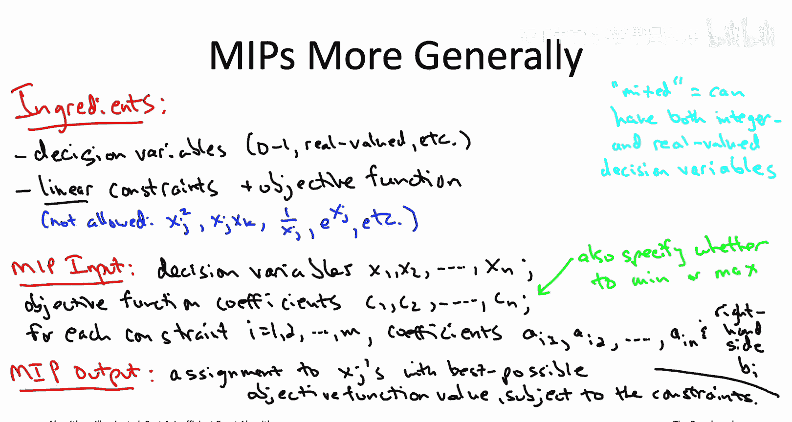

And in addition to the NApsSack capacity capital C。

 suppose there's now an analogous bound on the total weight， capital W。

So the goal now in two-disional NapsAC， again， you want to maximize the total value of the items that you choose。

 subject to two constraints， first of all， as before the total size should be at most the Napsack capacity capital C。

 but then also the total weight of the chosen item should be at most the weight bound capital W。Now。

 you're a graduate of the algorithmrim's illuminated dynamicynamic Program bootot campamp and you could knock out a dynamic program for the twodiional NApsack problem without that much trouble。

 but you could not do it as quickly as you could simply add the second constraint to the mixed Energy program that we already have。

And it's not just the Napsack problem， so many problems that are familiar to you， like for example。

 a maximum weight independence set， the minimum mixband problem。

 the maximum coverage problem that we talked about。

 all of those are really quite easy to encode as mixed integer programs so those are problems that if you want to try to tackle along with a MIPS solver。

 you should go ahead and give it a shot。Mix integer programs are also the state of the a for tackling the traveling salesman problem if you want to solve it exactly in practice。

 although that application of integer programming is quite a bit more sophisticated than the other examples that I mentioned if you want to learn more about how to apply MIPS to the traveling salesman problem。

 I suggest you do a web search on the subt relaxation。

Not only can many problems be naturally encoded as a mixed integer program， in fact。

 many problems can be encoded as a mixed integer program in multiple different ways。

 and it turns out the choice of formulation can matter a lot。

 so you can see solver performance very tremendously even by an order of magnitude or more depending on which specific formulation you use。

That means if your first attempt at tackling a problem using a mixed inte your programming solver fails。

 doesn't necessarily mean it's the wrong technology。

 it may just mean you need to experiment with other ways of encoding your problem as a MI for the solver to have acceptable performance。

So now that you're feeling amped up to apply one of these semi reliable magic boxes。

 one of these MIPS solvers to a problem that you care about， where should you get started？Well。

 let me just tell you a little bit about what the state of the art looks like at the time of this recording。

 which is in the year 2020 right now there's unfortunately a huge gulf in the performance between commercial and non-commercial solvers。

 so let me give you recommendations separately for each of those two cases。So these days。

 a majority of experts will tell you that the Grobi optimizeimr solver is the most consistently reliable and robust one out there。

If you wanted to choose a runner up， you'd probably choose either CLX。

 which is actually in some ways a precursor to Grorobi optimizeizer or FICO Express。

So the good news is that if you're associated with a university。

 if you're a student or you're a staff at a university。

 you can obtain free academic licenses for any of these solvers。

 it is sort of restricted to research and educational use。

So for those of you stuck with non-commercial solvers， if you ask around for recommendations。

 here's four of the names that you hear reasonably often。

 it's kind of an alphabet super various acronyms， but anyways， so you can start with the SPSver SCIP。

 CBC solver， MIPSCL， or the GNew project is the G Linear Program Ki GLPK。

The CBC and MIPS CL solvers have more liberal licensing agreements than the other two。

 the other two are free for non commercial use only。

So another thing you might want to look into if you sort of get serious about these MIPS solvers is if you want。

 you can decouple the tasks of sort of formulating a mixed integer program for your problem。

 and on the other hand， sort of syntactically describing the formulation you came up with to a particular solver by specifying your mixed integer program in a high levell solver independent modeling language。

One good example is the Python based CVX PY。So the cool thing。

 if you do choose to use one of these solver independent modeling languages。

 is you can then experiment easily with all of the solvers supported by that language to figure out which one tends to work the best on the types of inputs that you care about。

 Your high level specification is just going to get automatically compiled down into whatever format the solvers expected。

So that wraps up what I want to tell you about the semi reliableable magic boxes known as MIPS solvers is's one other genre of such boxes I want to tell you about satisfiability solvers and that'll be in the next video。

 I'll see you there。

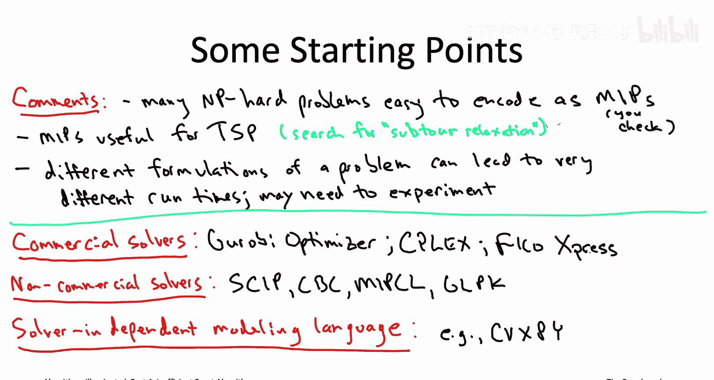