# 斯坦福大学《算法启蒙（第4册）：NP难｜Part 4 Algorithms for NP-Hard Problems》中英字幕（deepseek-R1） p24 -24-21.5_ Satisfiability Solvers).zh_en -BV1FAVUzXEum_p24-

Hi everyone and welcome to this video that accompanies Section 21。

5 of the book algorithmrithms illuminated Part4 This section is a very brief introduction to the world of satisfiability or satAT solvers。

 This is the second genre of semi reliableliable magic box that we'll be discussing。

So MI mixingger programming solvers from the previous video those are meant for optimization problems where you want to optimize some numerical objective function subject to a bunch of constraints but you know some problems that come up at applications aren't really optimization problems you don't have something you want to optimize but you do want to know whether or not all of the constraints can be satisfied that as you want to know is there a feasible solution and if so you'd like to get your grubby little hands on one of those feas solutions So problems of that type sort of feasibility checking problems can in many cases naturally be encoded as satisfiability problems So whenever you have one of those problems that naturally lends itself to a sat formulation throwing a Sa cell rait is probably worth a shot let's get a feel for how this might work through a concrete example a famous problem we actually haven't talked about yet the graph coloring problem。

The graph coloring problem is actually one of the oldest graph problems of them all already in the 19th century。

 this was being studied quite intensively， so the input in the graph coloring problem is going to give you an undirected graph and I'm also going to give you a positive integer K。

The goal then is to color the vertices of this graph with K colors so that no edge is monochromatic so that for every single edge of the graph。

 its two endpoints have different colors。 That's something known as a K color。So for example。

 imagine a graph which is basically a wheel with six spokes， so seven vertices overall， the center。

 and then the six ends of the spokes at the perimeter。Let's consider k equal3。

 so we're trying to figure out if the graph is three colorable。And you stare at this little bit。

 and you realize。Yes， it is。For example， you can color the middle node yellow say and then just alternate two colors around the perimeter。

Sayid blue and green。

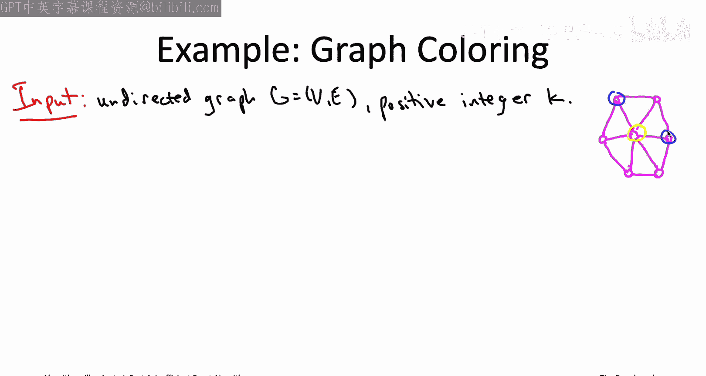

What you'll notice is that for each of the 12 edges in this graph。

 the two endpoints of the edge have different colors that makes this a legal three coloring of the graph。

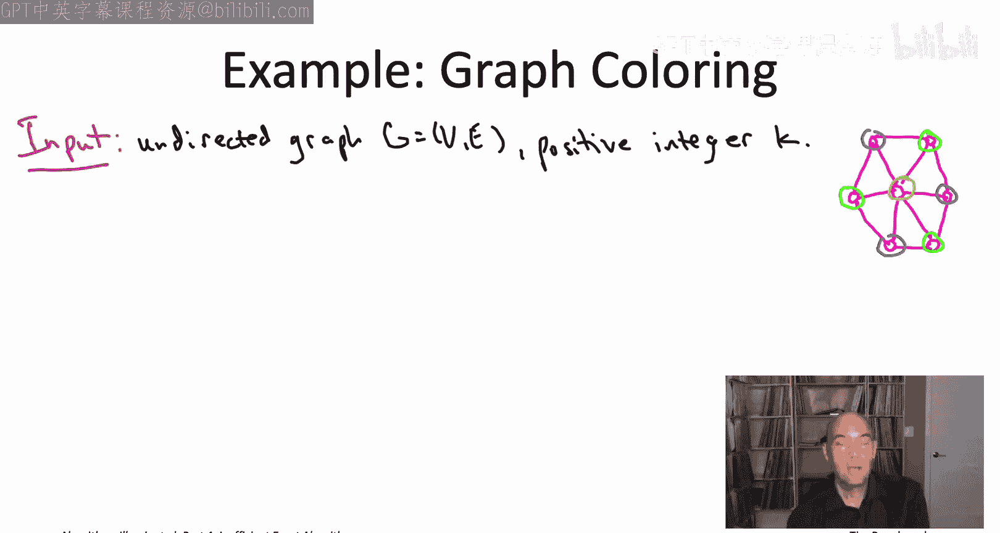

So what if we ask the same question for a wheel with five spokes， is that graph three colorable？

It kind of feels intuitively like it should be only a smaller graph。

 so if the first graph with three colorable， maybe this one should be two。In fact。

 the wheel with five spokes is not three colorable。

 you actually need four colors to color the wheel with five spokes why is why。

 well you know the vertex in the middle has to get some color， let's color it yellow once again。

 notice each of the other five vertices is adjacent to the middle note， middle vertex。

So each of the five vertices on the perimeter has to get a color other than yellow。

So the only hope then to be three colorable is to use only two colors on the perimeter。

 say blue and green。But notice we'd have to alternate the colors。

 right otherwise we'd have an edge on the perimeter where both endpoints had the same color。

But unfortunately， we can try alternating blue and green， but it's not going to work out。

We can color for the vertices on the perimeter in that way。

 but then we're stuck with this fifth vertex， we can't color it blue because of its neighbor to the northeast。

 we can't color it green because of its neighbor to the south。

 and we can't color it yellow because it's also connected to that middle vertex。

 so we have no choice but to use a fourth color to color that last vertex。

And so that's then the graph coloring problem， I give you an unretched graph I tell you the number of colors K that you're allowed to use。

 and the question is whether or not the graph has a K coloring， whether you can color the edges。

 color the vertices， numbers 1 through K， so that no edges monochromatic。

 no edge has the same color on both endpoints。

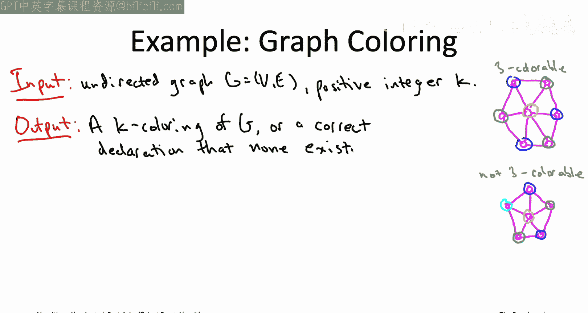

Let me clear up a point of confusion that may have arisen for those of you that watched the videos on the color coding algorithm for computing the minimum cost K path of a graph。

The color coding algorithm you'll remember， it also involved coloring of a grass of vertices。

 Unlike here， where the coloring is part of the problem statements in our color coding algorithm。

 we used vertex colors just internally to the algorithm。

 That was just part of the color coding technique。Now， once we colored all of the vertices。

 we did have this notion of a panchatic path where all of the vertices have different colors。

 that sounds sort of like what we're talking about here， but but it's different Here。

 we're really just saying each edge should have its endpoints have two different colors。

 whereasas back then we were thinking about K paths。

 and we wanted all vertices of a K path to have K different colors。

So I'd be remiss if I didn't mention at this point what's probably the most famous result in all of graph theory。

 something known as the four coloror theorem which concerns this exact graph coloring problem。

 it also concerns what are called planar graphs， so a graph is planar if you can draw it on the 2D surface on a piece of paper so that none of the edges crossed so that edges meet only a common endpoints so like if you look at a roadmap that's generally going to be a planar graph。

The four color theorem says that every planar graph can be colored using only four colors。

 Every planar graph is four colorable。Now we see here an example on the bottom right of the slide。

 the wheel with five spokes， that's a planar graph。

 we drove it on a piece of paper and none of the edges are crossing。

 and we argued that that actually required four colors。

 so certainly four colors might be necessary even for very simple planar graphs。

 so the four color theorem says that that's true， but you will never need five。Historically。

 interest in the graph coloring problem was motivated in part by an analogous problem about minimizing the number of inks needed to color a map。

 like a map you have in an Atlas， and it turns out an equivalent statement of the four color theorem is that if you've got a map with a bunch of countries and the countries are contiguous regions。

 then in fact you only need four colors of ink to color all those countries so that any pair of countries with a neighboring border have different colors。

I don't want to do a disservice to the graph coloring problem by suggesting that it's purely recreational because it's not there are real applications of graph coloring problems。

For example， already if you're just trying to assign classes to K classrooms。

 that's exactly a graph coloring problem where you have one vertex per class and you have an edge between each pair of classes that overlap in time If you want a really high stakes application of graph coloring problems。

 we're talking tens of billions of dollars here， then check out the final sequence of videos on this video playlist for our case study on the FCC incentive auction。

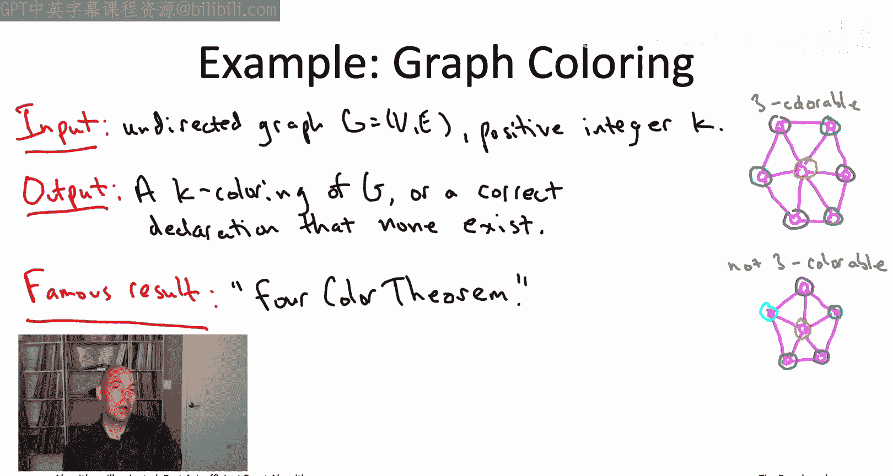

When we talked about mixed integer programming solvers， MIPS solvers。

 we focused on optimization problems， and that's really what they are made for maximizing or minimizing some objective function subject to constraints。

 So the inherently numerical nature of optimization made it natural to use the formalism of arithmetic for specifying MIPS we had this linear constraint。

 this linear objective function， Each one was just a sum over the decision variables。

 reached decision variables is perhaps multiplied by some scalar。

Now another problems where there's not a natural numerical objective function where you really just kind of care whether or not there's a feasible solution or not。

 as in the graph coloring problem， in that case it's not obvious arithmetics the best formalism to use and another natural one。

 especially for computer scientists to think about is the formalism of logic。So in that spirit。

 our decision variables are no longer going to be numbers。

 our decision variables are now going to be Boolean variables that can only take on two values true or false。

By a truth assignment， we just mean an assignment of each of the decision variables to one of its two possible values to either true or false。

 so if you're working with a collection of n Boolean variables。

 there's going to be two to the n different truth assignments possible to those variables。Next。

 we're going to need some constraints， presumably we're only interested in some subset of the truth assignments representing feasible solutions to some problem。

 so we need a language to specify those constraints。 I should say in the context of satAT。

 you often hear constraints referred to as clauses。

 so I'll try to stick with constraints just to be consistent with our discussion of MIps。

 but I may accidentally say clause， and certainly you'll hear other people say clause for constraintsst in the context of satisfiability problems。

Anyways， a constraint is going to be some logical formula which constrains which truth assignments are possible。

 Now， it turns out we're going to be able to get away with what seems like a super simple type of constraint。

 We'll eventually learn when we talk about the cooklevin theorem quite a bit later that actually it's sort of without loss of generality to use these constraints。

 but they're going to look simple when I first show them to you。

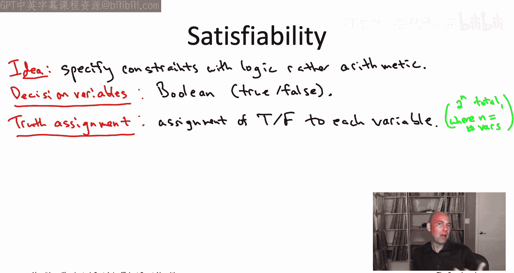

The constraints will be restricted to disjunctions of literals。 What does that mean。

 So a literal is something very simple， It's either a decision variable like Xi or the negation of a decision variable。

 not X。 And so literal is either X or not Xi。 so there's two n possible literals。

 if you have n variables。

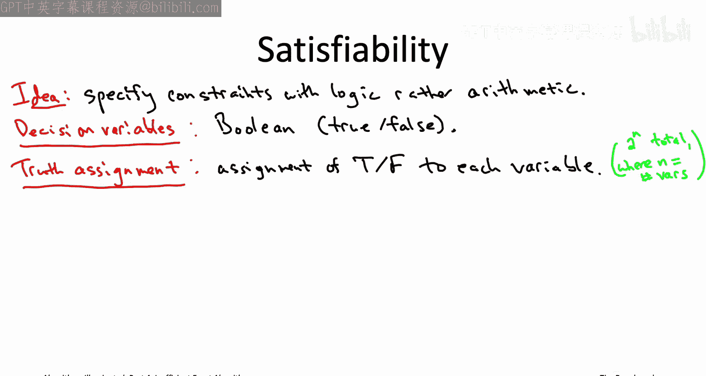

What's a disjunction， a disjunction is just logical or okay so x or y。

 that's true if and only if at least one of x or Y is true。

So let me give you an example of a disjunction with three literals x1 or not x2 or x3 as far as the notation。

 I don't know if you've seen it before， but you you can see there's this little v in between the x1 and the not x2 in between the x2 and the x3。

 that V is just the symbol for logical or mean that upside down L in front of the x2 that just denotes not so if x2 is true。

 then not x2 is false that x2 is false then not x true is not x2 is true。

Disjuctions of literals are actually pretty easy going creatures。

 pretty easy to satisfy a single disjunction of literals。

 like take the three literal example we have on the slide。This constraint' basically telling us。

 look， if you want to make me happy， all you got to do is set x1 to be true if we do that， it's done。

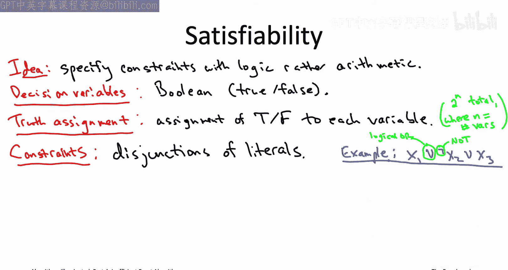

If we screw that up and we wind up setting X to false so we can still make amends by setting X2 to false。

 if we do that， the clause will still be happy。If we also mess up that assignment set X2 to be true。

 well then we still have a chance to salvage our relationship by setting x3 to true。

 If we do any of those three things， this constraint will be satisfied。 In fact。

 there is only one way to mess up satisfying this constraint。

 which is to set each of the variables involved to the opposite value that's being requested by the constraint。

 So in this case， it would mean if we set X1 to false and x2 to true and x3 to false。 Well。

 then we've really thumbed our nose at at this constraint and it's not satisfied。

 But if the eight possible assignments of truth assignments to x1 x2 and x3。

7 out of the8 will satisfy the clause。 the only one that doesn't is again。

 the one that refuses all three of the assignment requests， X1 to false X2 to true and X3 to false。

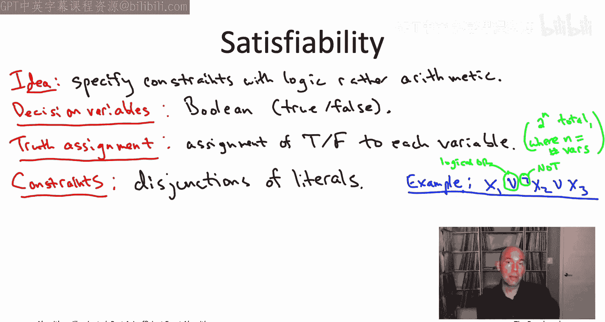

The same kind of thing is true more generally for disjunctions of any number of literals。

 so disjunction with K literals is going to be two to the K ways to assign truth values to the K variables that are involved。

 exactly one of them will fail to satisfy the clause if and only if every assignment is the opposite of what is requested by the clause2 to the K minus1 out of the two to the K assignments will in fact satisfy that clause。

Now， with all the terminology in place， I can state for you formally what is the computational problem known as SAT or satisfiability。

The input to the problem is a list of Boolean decision variables， let's say there's n of them。

 x1 up to xn， and also a list of some number of constraints， let's say there's M constraints。

 and each constraint should be in the format that we specified as disjunction of one or more literals。

The responsibility then of an algorithm or a solver for SAT is to identify a truth assignment theres two to the impossible possible truth assignments。

 and the algorithm needs to find one of them that satisfies each of the M constraints。

Or if the instance is unsatisfiable， if in fact no truth assignment satisfies all of the clauses simultaneously。

 then the algorithm should correctly report that。So that is the famous satAT problem and as we'll learn in the second half of this video playlist。

 this is a super important problem， one of the most central in all of theoretical computer science。

But let's not get ahead of ourselves right because when you first see it the sad problem。

 it seems like pretty simple， right， I mean， you've got these decision variables。

 but they're all boolean。 It can just be true or false， not much to see there。

 And then you have these constraints， but the constraints are like super simple。

 just these disjunctions of literals and a disjunction of literals is really easy to satisfy。

 at least if you if you're just looking at one of them at a time。

 So could the sadAT problem really be general enough to encode other problems that are of interest that we actually would want to solve。

For example， what if we wanted to encode the graph coloring problem as sat。

 how would we do that because again， like in graph coloring， if we're looking for a K coloring。

 it actually really feels like we want one variable for each vertex which can take on one of K values。

 right each of the possible colors and in satAT， we can't do that we're stuck with these boolean variables that can only take on two different value。

It turns out that with little practice， you can encode a surprisingly large number of problems as satisfiability problems actually。

 there's even I mean， in principle， if you allow very fancy encodings。

 there's even the result that we'll see called the Cooklevin theorem。

 which says pretty much any problem you're ever going to encounter can in fact be encoded using satisfiability But what I mean here is that there's lots of problems that show up in real applications that you might really want to solve which translate kind of very directly into satisfiability so that it's then easy to use the latest and greatest Sa solvers to see how well they do on your problems。

 Probably the sort of most classic application of Sa solvers where they've been used for decades is in verification both of software and in hardware that is looking for bugs。

But there's also been some really fun applications just in the last few years， so for example。

 in 2017 a bunch of cryptography researchers showed how to use SA solveverrs to break the previously cryptographically secure hash function Shah1。

 and then we'll see another example in the case study on the FCC incentive auction in the final videos of this playlist。

So let's get back to graph coloring so how are we going to encode a graph coloring problem as satisfiability all we have to work with is boolean variables。

 but it seems like we'd really like to have variables that could take on K different values。

Well it's going to be a very simple fix， we're just going to have K Boolean variables per vertex corresponding to the K different colors that might be assigned to that vertex。

So the intended semantics here is that x subvi， that should be true if the vertex v is assigned sign the color I。

 if it's assigned sign any other color， then x sub VI should be false。So what about the constraints。

 remember the whole point of the graph coloring problem is that no edge should be monochromatic。

 no edge should have both of its endpoint received the same color I。

But you think about it a minute and you realize that type of constraint that translates really easily into a disjunction of literals over these boolean decision variables that we just wrote down。

Right，So suppose there's some edge V come a W and we're concerned about both the endpoints getting some color I。

How would we make sure that doesn't happen？We can enforce that with one constraint that's a disjunction of two literals。

 not XVI or not XwiI。 So this constraint is basically requesting an assignment of false to XVI and also it's a requesting an assignment of false to XwiI。

So the one way you can make this this constraint not satisfied is by setting XVI and XwiI both equal to true。

 and that exactly corresponds to the case where both endpoints of the edge have the color I So when that bad thing happens。

 this constraint will indeed not be satisfied， so the constraint enforces that the two endpoints cannot both get the color eye。

Now for each edge you need k of these constraints to rule out each of the K colors， but that's fine。

 that means at the end of the day， you have K times M constraints of this form where K is the number of colors and M is the number of edges in the graph。

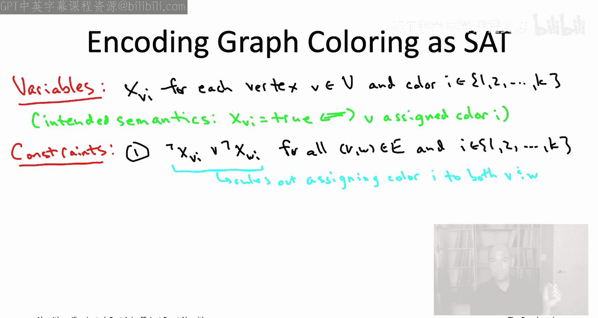

So with this set of constraints， we should no longer be worried about any monochromatic edges。

 those have been explicitly ruled out by these constraints。However。

 we're not quite done because if you think about it， I mean。

 one way you could satisfy all of these constraints would be to just set everything to false。

That's not really what we want that would sort of correspond to not coloring any vertex anything。

 which is sort of missing the point， so we also want to have a constraint which says that vertices should get a color。

So we enforce this with a second set of constraints。

 one constraint per vertex v where we just to use a disjunction of k literals and the literals are just the unnegated versions of the K decision variables corresponding to the vertex V so x v1 or x v2 or dot dot dot all the way up to x of Vk where K is the last of the colors So again。

 this's going to be exactly one way that this clause is not satisfied。

 and that's if you do the opposite of everything it wanted you to do。

 So this constraint is imploring you to set at least one variable to true the only way that not satisfied is if all of the variables are false。

So that means if you have anything that satisfies both one and two。

 then every vertex is going to get a color or at least one color。

 and no edge is going to be monochromatic， every edge will have different colors at its endpoint。

It is true that if you use only these two families of constraints。

 it does leave open the possibility of a truth assignment that assigns more than one color to a vertex that is not ruled out。

 So if that bothers you， you could add a third family of constraints that enforce that each vertex gets exactly one color。

 if you want， you can also just stick with these two families of constraints and not worry about it。

 Yeah， a vertex might get more than one color might be more than one of its variables might be set to true。

 but it doesn't matter because no matter how you choose one color from among them and you do that for all of the vertices。

 you're going to get a k coloring no matter what because there weren't any conflict between any of the colors assigned to any of the vertices。

 So that's fine too。 Just only use these and then extract a K coloring arbitrarily from satisfying truth assignment。

So that's how to encode an instance of graph coloring as an instance as satisfiability。

 I hope you'll agree that that was actually not very hard。

Moreover， know what we've written down in this slide。

 the collection of variables in this collection of disjunctions of literals。

 this is exactly the sort of description that can be fed directly into a magic box called the satisfiability or satol。

So to see what I mean， let's just look at a really toy example。

 let's just look at sort of a triangle， so a complete graph on three vertices。

 and let's look at the encoding a set of the question of whether or not the triangle is too colorable。

I'm going to show you the file format you would pass to any number of Sa solvers， but for example。

 MinSAT， one of the most popular open source solvers， and so if you invoked MinSaAT。

With the following input file。It would immediately tell you whether or not the triangle is too colorable。

 It's not， of course， so it would return satisfiable。So just to sort of explain。

 what is the syntax you're seeing here， the first line of the file warns the solver that the Sa instance has six decision variables in nine constraints。

 the CF stands for conjunctive normal form and that just indicates that each constraint is in the format we've been talking about。

 the disjunction of literals The numbers between one in six refer to variables and the hyphen indicates negation。

 The first three in the last three variables correspond to the first and the second color respectively the first three constraints are from our second family specifying that each vertex gets at least one color and the last six constraints correspond to our first family ruling out the two vertices。

That are connected by an edge get the same color the zeros are just to mark the ends of constraints。

So in any case that's it， it's very simple conceptually to encode graph coloring as satisfiability。

 we had our incision variables， we had our constraints。

 and once we have those two things it's equally straightforward to translate that into a format which you can then just feed directly into one of these magic boxes and see how it does。

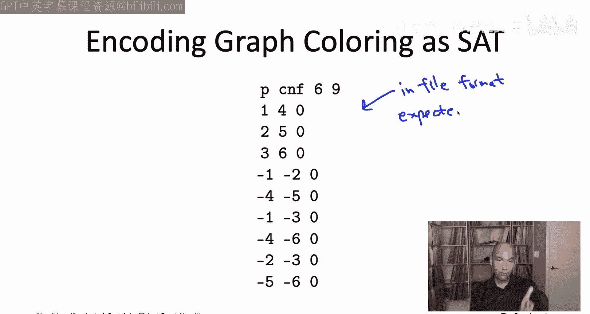

One thing that's cool about the satisfiability world compared to the mixed inger programming world is there isn't really a big difference between commercial and non-commercial solvers。

 In fact， you may or may not know that all the sat nerds from around the world gather together every year or two to hold a sort of sat Olympics sat competitions so everybody brings their latest and greatest solvers everybody brings their hardest and most nastiest instances and they run Olympic style competitions even going so far as to give out gold silver and bronze medals so this has been going on for a couple of decades so if you want to see the current state of the art of Sa solvers go check out the latest sat competition Most of the submitting groups make their solvers open source。

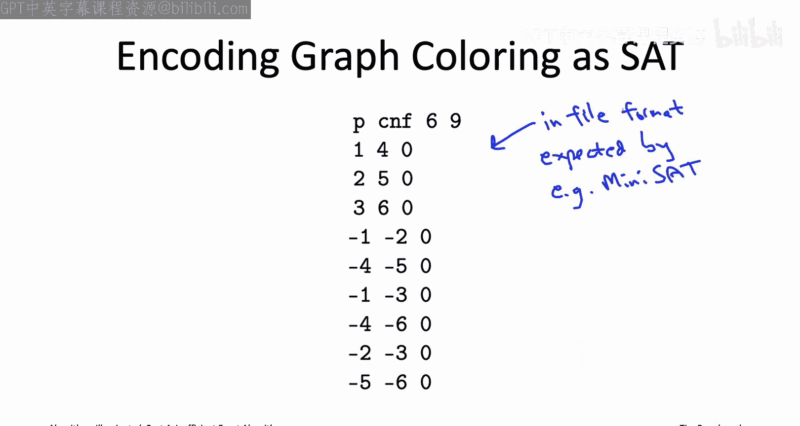

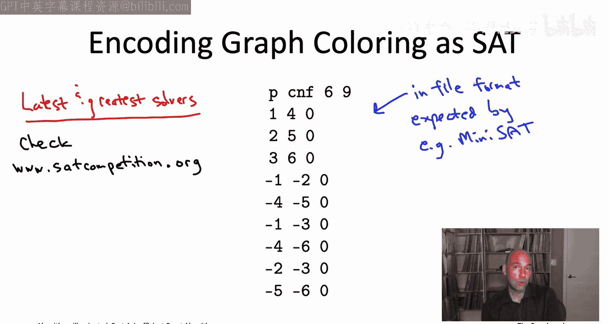

If you're feeling lazy， you don't want to go explore the latest and greatest ones。

 you just want sort of a quick tip of where to get started again MinsAT is a pretty reasonable place to start it combines good performance with ease of use in a permissive license。

 specifically the MIT license and then for those of you who want to up your S solving game to the next level。

 you might want to check out satisfiability modulo theories or SMT solvers。

 one current example is Microsoft's Z3 solver which is also freely available under the MIT license。

That brings us to the end of our discussion of Sa solvers and zooming out of semi-reliable magic boxes and of zooming out even more of just talking about augmenting your toolbox to help you tacklemp hard problems that come up in your own projects we discussed both how to compromise on correctness。

 We talked about path heuristic algorithms both ones with provable guarantees and ones like local search that generally don't have provable guarantees and then in this chapter we've now finished discussing ways of compromising on running time and designing algorithms that are exact that are guaranteed to be correct but will not run quickly all of the time。

 but hopefully weren't quickly most of the time here again。

 we looked at some provable guarantees So algorithms that provably run faster than exhaustive search The beman held carp algorithm for the TSP and the color coding algorithm for finding long paths in a graph and then we also talked about again a couple tools where maybe you don't have those provable guarantees of beating exhaustive search。

 but they're still super useful in applications a lot。

Time these semi reliable magic boxes known as MiPS solvers and sat solvers。

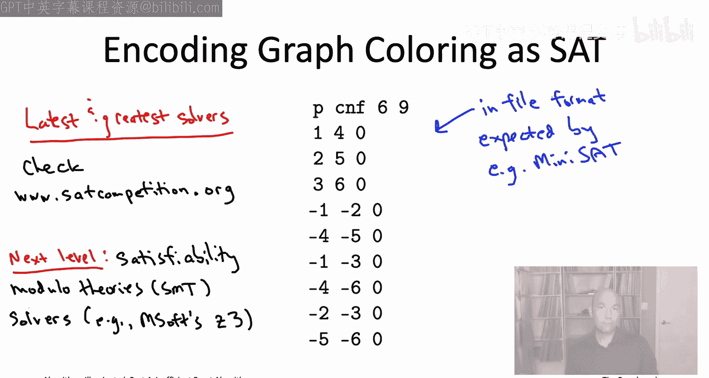

At this point， you have reached what I was calling level 2 expertise early on in the playlist。

 which is that if someone hands you an NP hard problem。

 you're going to have a lot of different ideas of how you might make progress on it。

 maybe you use fastturistic algorithms， maybe you use local search， maybe use dynamic programming。

 maybe with some randomization， maybe you use one of these magic boxes， amid persette solver。

 but the point is you have a lot of things you can try。

But that's always assuming someone handed you an NP hard problem。

 okay that you knew was NP hard and so you knew you needed to compromise on either correctness or on running time。

But the question still is you know a problem in the wild。

 you know it doesn't come with like a label on its forehead telling you that it's NP hard。

 So how do you know that a problem is NP hard so that you don't waste time trying to come up with an exact polynomial time algorithm for it That's the subject of the next chapter chapter 22。

 what will give you a simple recipe for proving the problems are NP hard and an awful lot of practice putting that recipe to use I'll see you there。

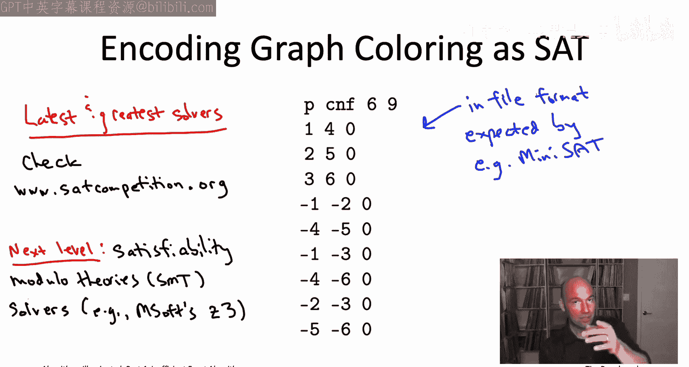