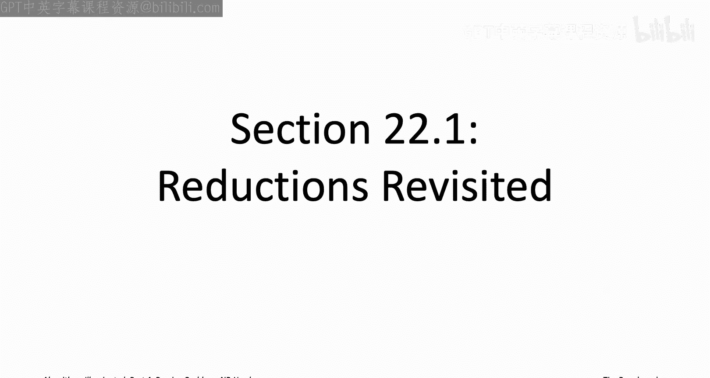
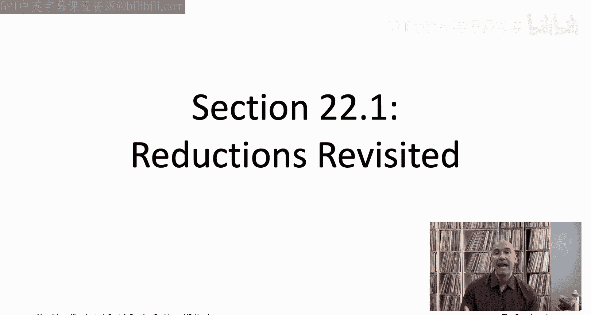
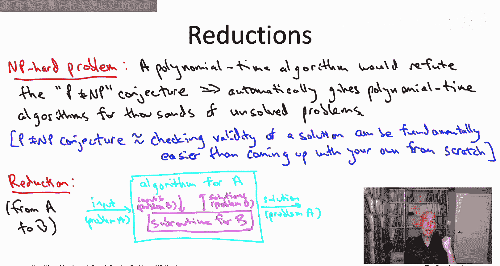
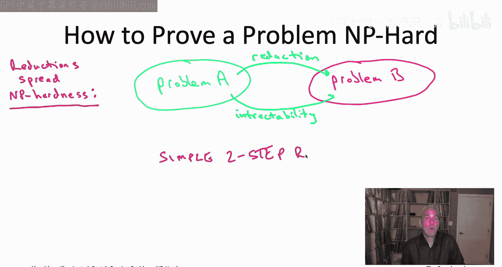
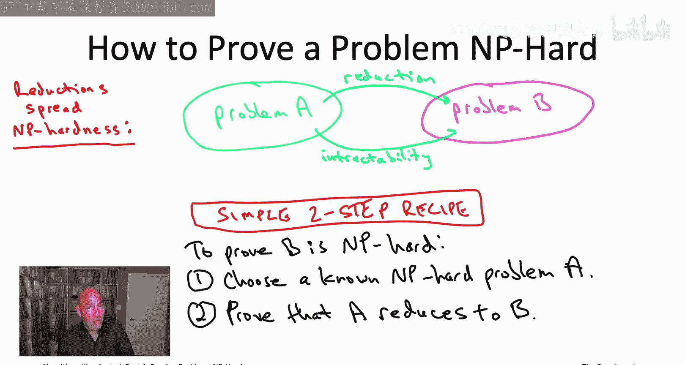

# 斯坦福大学《算法启蒙（第4册）：NP难｜Part 4 Algorithms for NP-Hard Problems》中英字幕（deepseek-R1） p25 -25-22.1_ Reductions Revisited).zh_en -BV1FAVUzXEum_p25-

Hi， everyone， and welcome to this part of the video playlist that corresponds to Chapter 22 of algorithms illuminated Part 4。

 This is a chapter about proving problems NP hard。 So in the last couple chapters。

 chapters 20 and 21， we were focusing on raising your level of expertise around NP hard problems up to level 2。

 So we had in mind， your boss hands you a problem tells you it's an NP hard problem。

 So you know immediately you have to compromise on either running time or correctness。

 and the goal of those two chapters was to give you a number of tools to make progress on an NP hard problem。

 So whether it was using the greedy paradigm to design fastturistic algorithms。

 whether it was using local search or dynamic programming to beat exhaustive search or maybe those semireliable magic boxes the SAT and MIps solvers that we talked about。

 In any case， given an NP hard problem， there's a number of different tools you would now have to throw at it。

So the goal of this chapter is to raise your level of expertise one further up to level 3。

 So now imagine that you're the boss and that problem has come up in one of your projects and。

 of course， problems that arise in the wild。 they don't come with a label on their forehead。

 telling you whether they' NP hard or not。 recognizing that takes a trained eye。

 and you will get that training that practice in this chapter。

 will begin with just one famous NP hard problem。 The three sat problem。

 So satisfiability every every constraint it's a disjunction of the most three literals will take it on faith for this chapter。

 that three sat is NP hard。 that's a famous result known as the Cook Leth theorem。

 And then through a web of 18 reductions。 we will establish 18 other problems are also NP hard。

 giving us an inventory of 19 NP hard problems。

I encourage you to use this list of 19 NP hard problems as a starting point for your own NP hardness proofs going forward。

 and the many examples of reductions that we'll see those con serveed as templates for yourO。

 so let's get started。

Let me begin just by jogging your memory about some of the stuff we talked about in the opening sequence of videos corresponding to chapter 19 when we were just getting a level1 understanding of NP hardness means。

 so what does it mean that a problem is NP hard， it means that a polynomial time algorithm that solves that problem would refute this famous mathematical conjecture the P equal to NP conjecture。

 and in particular a polynomial time algorithm for an NP hard problem would automatically lead to polynomial time algorithms for thousands of well- studieddied problems that have resisted the efforts of tens of thousands of brilliant minds。

We haven't defined the peanut equal to NP conjecture formally， we'll do that in the next chapter。

 but we did describe it informally as the conjecture that checking someone's work。

 like checking out a filled out pseudodoku puzzle can be fundamentally easier than the problem of coming up with your own solution from scratch this conjecture is widely believed to be true。

 it hasn't been proved， but it's widely believed to be true。

 so that means if a problem is NP hard so a polynomial time algorithm solving it would refute this peanut equal to NP conjecture that is strong evidence if not near tight proof but strong evidence that there's no exact polynomial time algorithm for the problem and the kinds of compromises we've been talking about in the past couple chapters are indeed required。

One thing that's really cool is that to apply the theory of NP hardness。

 you actually don't need to understand any complicated fancy mathematical definitions in particular you don't need to actually know what the definition of the P not equal to NP conjecture is。

 that's probably one of the reasons why NP hardness has been arguably the most successful export ever from theoretical computer science to the rest of the world。

 so to see what I mean I encourage going to your favorite academic search engine and just searching for the term NP hard or the related term NP complete and you will get an unbelievable number of hits including many papers broadly in engineering and the life sciences and even in the social sciences。

So you don't need to know any fancy math to apply the theory of NP hardness。

 all you need is an understanding that you already have an understanding of reductions between problems。

We've talked about reductions many times but super important concepts so let me just sort of say it once again in terms of this cartoon reduction is just a way of building the light blue box given the magenta box In other words should it's an argument that the only thing you really need to solve a efficiently is an efficient subroutine for B so a little more formally a reduction is an algorithm it takes as input something from the problem you're trying to solve problem A it's allowed to use in a subroutine for this problem B。

 the problem it reduces to a polynomial number of times and the reduction so inside the light blue box it's also allowed to do a polynomial amount of additional work outside of the subroutine cause to the magenta box but at the end of the day after you've called the magenta box a polynomial number of times and you've done your polynomial amount of extra work that light blue box should be in a position to correctly report the solution to the instance of problem A that it was handed to in the first place。

And as algorithm designers we're usually thinking about reductions in their honorable form of spreading the frontier of tractability so given a problem you already know how to solve problem B。

 a reduction spreads that tractability to a target problem problem A so for example。

 the all pairs shortest path problem reduces to the single source shortest path problem so given that we know how to solve the single source shortest path problem。

 we then automatically also know how to solve the all pairs shortest path problem In general。

 whenever you have a reduction and whenever there's a polynomial time algorithm for that problem B。

 the reduction automatically gives you a polynomial time algorithm for the problem A In other words。

 a reduction from a problem A to B spreads tractability in the opposite direction。

 tractability from B to A。

But as we mentioned in the opening sequence of this video playlist。

 the point of reductions in the theory of NP hardness is different。

 it's a more nefarious use of reductions， not to spread computational tractability。

 but to spread computational intractability， to spread NP hardness in the opposite direction。

When we were using reductions in their honorable form for spreading tractability。

 the tractability spread in the opposite direction of the reduction。

 So if a problem a reduces to a problem B， tractability of B implies tractability of a。

 because you get algorithm from A just by running the reduction and using the assumed efficient algorithm for B。

 So computational intractability spreads in the opposite direction of tractability。

 which means it spreads in the same direction of the reduction。

 So if a reduces to B and a is intractable， say it's NP hard。

 then B is also intractable in the same sense。To remind you why that's true。

 imagine that problem A is NP hard。 So what does that mean that means a polynomial time algorithm for the problem A will refute the P equal to NP conjecture。

 Suppose then problem A reduces to problem B。Suppose hypothetically。

 we actually came up with a polynomial time algorithm for B。Well， then by the reduction。

 they would automatically translate to a polynomial time algorithm for A。

But we said that would refute the pen to NP conjecture So in other words。

 even a polynomial time algorithm for B would refute the pen to NP conjecture。

 and that's exactly our provisional definition of what it means for a problem to be NP hard So if A is NP hard and A reduces to B。

 then B has to be NP hard as well。What that means for us is that there's an unbelievably simple recipe for proving that a problem is NP hard。

So if there's some problem B that shows up in one of your own projects and you suspect B might be NP hard。

 here's how you'd go about doing it。 Step1， choose a known NP hard problem A。Step two。

 design a reduction from the problem A to the problem you care about B。

If you carry out both of these steps， you are done。

 You know that problem B is NP hard A was NP hard by assumption。

 you reduced it to B and the intractability， the NP hardness flows in the same direction of the reduction。

 So from A to B， that is it。

To carry out these two steps you do need a couple skills。

 so for step1 you need some awareness of known NPP hard problem。

 so you need to know what are some options for what you could choose for that problem A。Now。

 as we said in this chapter， you'll already learn about 19 NPp hard problems。

 any of which is a totally legitimate choice for the problem A and step1。

If 19 problems aren't enough for you， there's hundreds more out there that are well documented in books。

The second step requires a skill that really you already have。

 which is skill in designing reductions between different problems。 It's true， you know。

 our training to this point has been in honorable uses of reductions to spread tractability。

 but those exact same reductions spread intractability in the opposite direction and to the extent that there are special tricks to the trade of reductions and NP hardness proofs well get a lot of practice with those as we go along through the rest of these videos。

Coming up in the next video， we're going to discuss what in some sense is the mother of all NP hard problems。

 the threeat problem， and the famous Cook Levin Theorem， I'll see you there。

