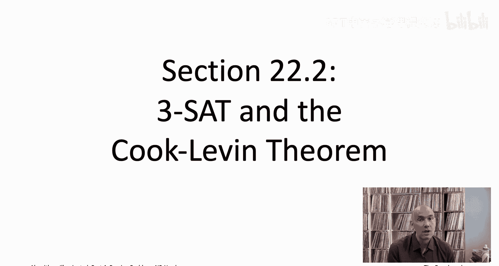
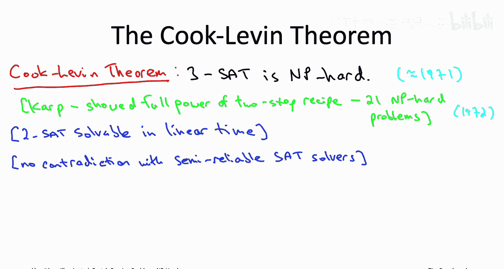
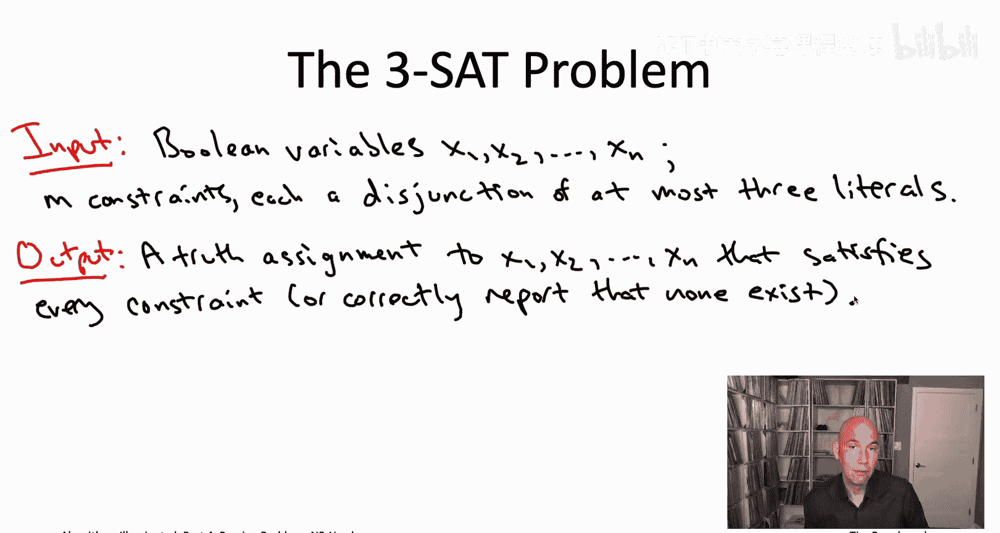
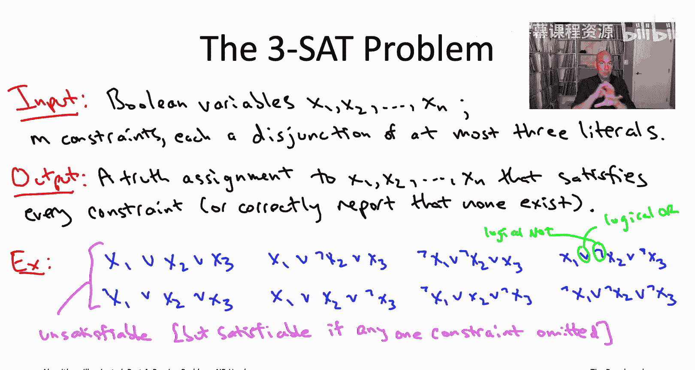

# 斯坦福大学《算法启蒙（第4册）：NP难｜Part 4 Algorithms for NP-Hard Problems》中英字幕（deepseek-R1） p26 -26-22.2_ 3-SAT and the Cook-Levin Theorem).zh_en -BV1FAVUzXEum_p26-

Hi everyone and welcome to this video that accompanies Section 22。

2 of the book algorithmrithms illuminated Part4， this is a short section about the threeat problem and the Cook Len theorem。

So in the last video， we saw a simple two step recipe for proving the problems are NP hard。

 So if you apply this recipe thousands of times， you will find yourself with an inventory of thousands of NP hard problems。

 But how does this whole process get started in the first place。

 Where does that first NP hard problem come from from one of the most famous and important results in all of computer science。

 the Cook Levinth theorem。

The formal statements of the Cooklevin theorem is simply that the seemingly innocuous three sat problem。

 satisfiability with the most three literals per disjunction。

 the seemingly innocuous three sad problem is， in fact， an NP hard problem。As you could have guessed。

 this theorem was proven by Stephen Cook and Leonid Levin。

 It was there proved independently on opposite sides of the I Curtain， both sort of ballpark 1971。

 Stephen Cook was at Toronto， Leon  Le1 was in Moscow and it took a while for Levin's work to become widely appreciated in the West。

 So if you look at old textbooks。 you'll see the Cook Levin theorem actually referred to as Cook's theorem。

 but really both of them proved that both of them deserve credit for it。

 So they both proved that the threeat problem is NP hard。

 and they also hinted at the possibility that perhaps lots and lots of other problems our NP hard as well。

 and that prophecy was really fulfilled by Richard Kp in 1972 who was directly inspired by Cook's work So Carp really showed the full power of NP hardness by applying the twostep recipe we've been talking about over and over again。

 So Kp's original list of 21 NP hard problems which includes many of the ones that we're going to be discussing in this chapter that really made it clear that NP hardness was。

The fundamental obstacle that was preventing progress in all kinds of different fields on lots of different famous problems。

 like， for example， the traveling salesman problem。

Cook and Carp both received the ACM Turing Award in 1982 and '85 respectively。

 if you haven't heard of the Turing Award， you should have heard of the Turing Award。

 it's the equivalent of the Nobel Prize in computer science Levin again his work was kind of really fully appreciated only later but he was recognized in 2012 with the Canuthth Prize。

In case you're wondering where the three and threeatAT comes from again。

 we'll define the problem on the next slide， you know disjunctions of the most three literals。

 basically the reason for the three here is that that's the smallest number for which the problem is NP hard。

 so perhaps you've actually seen at some point the twoS problem where you have disjunctions of either one or two literals that can actually be solved in linear time。

 several ways to do it but one way is a reduction to the problem of computing the strongly kinetic components of a suitable directed graph。

Now just a few videos ago we were talking about satisfiability in the context of Sa solveverrs。

 semi- reliableliable magic boxes that actually have some success of solving the SAAT problem in practice Now keep in mind the semi-reliability of Sa solvers is in no way in contradiction to the Cooklen theorem。

 the Cooklevin theorem is saying you cannot have a guaranteed fast and correct algorithm for the three SAT problem and in fact SaAT solvers do not give you a guaranteed correct and fast algorithm。

 they give you a sometimes correct and fast algorithm for the SaAT problem which is not the same thing。

In this chapter we're not going to worry about why the Cook Levin theorem is true we're not going to worry about its proof we're just going to take it on faith in this chapter。

 so the plan is more to stand on the shoulders of these giants and assuming that there's one problem3atAT is NP hard to then generate via reductions 18 additional NP hard problems if you're curious about know how you'd ever prove the NP hardness of a problem from scratch as was done in the Cook Levin theorem will discuss the high levelve idea behind the proof in the videos corresponding to the next chapter to chapter 23 I should say you know the proof I think it's worth seeing at least once in your life。

 but almost nobody remembers the G details of the Cook Levin theorem most computer scientists are content just to be educated clients of the Cook Levin theorem using it along with other NP hard problems the same way that we're going to in this chapter as a tool to prove the problems that you care about are NP hard。

To conclude this video， let me just make sure we're all crystal clear on exactly what the threeSa problem is if you watch that video a few videos ago and satisfiability solvers。

 there won't be anything new to see here， but if you haven't。

 I just want to make sure you know exactly what problem we're talking about。

So the input to a threeat problem consists of variables and constraints and both are of a super simple form。

 So all of the decision variables have to be boolean so they can take on only the values true or false。

 So if we're given collection of n Boolean variable is just going to be two to the n possible truth assignments。

 possible assignments of each variable to either true or false the only constraints we're going to bother with are disjunctions of literals。

 So a literal is either a decision variable and Xi or its negation not Xi。

And disjunction just means logical or， so A or B is true， if A is true， or if B is true。

 or if both A and B are true。

When we were talking about Sa solves， we allowed our disjunctions of literals to have any number of literals an arbitrary number for the threeSAT problem。

 it's going to be the special case where we restrict each of the constraints to have at most three literals。

The goal then is exactly what you'd expect so out of these two to the end possible truth assignments。

 we're curious whether any of them satisfy simultaneously all of the constraints。

 all of the disjunctions of at most three literals if there's no such assignment we'd like to an algorithm to report that facts if there is a satisfying truth assignment we would like an algorithm that returns one to us on a silver platter。

So for example， consider the following eight constraints。And just to be clear on the notation。

 this V that appears between each pair of literals that just stands for logical or。

 which is what disjunctions are all about。 And whenever you see that upside down L in front of a variable that means we're looking at the negation。

 So here in the upper right of the constraints， there is a not x2 and also a not x3。

So if this was the input， if the input was these three variables， x1 x2 and x3。

 and these eight clauses， each with three literals， this would be an unsatisfiable threeat instance。

 There's no satisfying truth assignments Indeed， there's eight possible truth assignments for the three Boolean variables and each of these eight constraints rules out exactly one of those eight possible truth assignments。

 So there's none left， So it would be unsatisfiable On the other hand。

 if we deleted any one of these eight constraints， we would have a satisfiable instance of three sat becaused be there'd only be seven forbidden assignments to the three variables there'd be one left over that would be satisfy。

 So in general， when there exists a truth assignment satisfying all the constraints。

 We call it a satisfyfiable instance， otherwise we call it an unsatisfiable instance。

That's the Cook  Le theorem， And it gives us our first N hard problem。3 S is NP hard。 Now。

 building on this fact through reductions， we will spread NP hardness to 18 of problems。

 In the next video， let's get oriented about exactly what all of those problems and all of those reductions are going to be。

