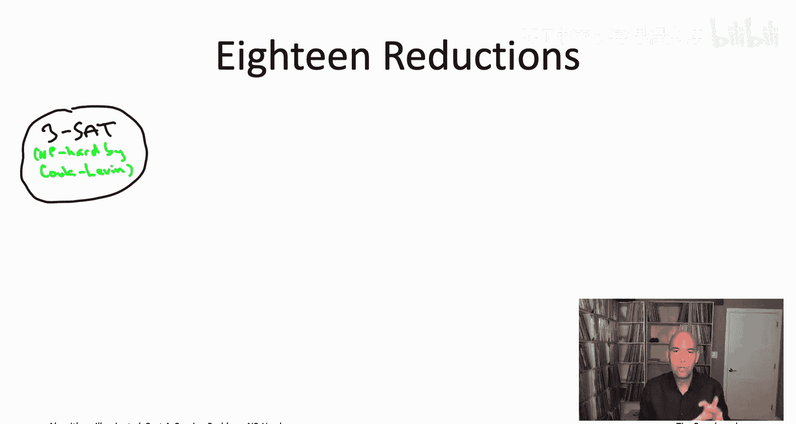
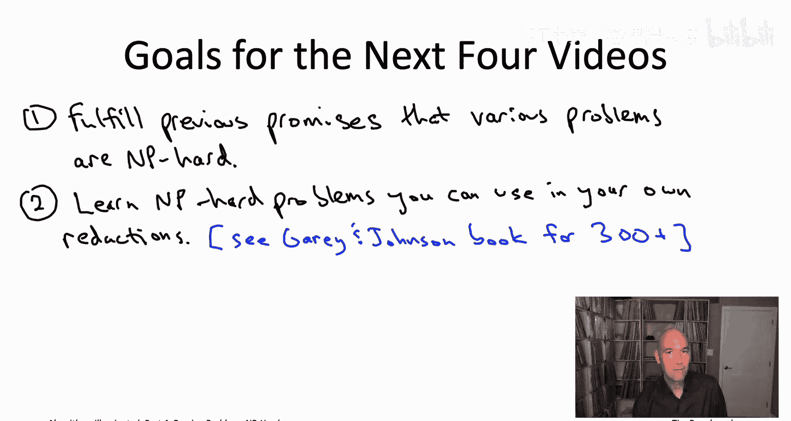
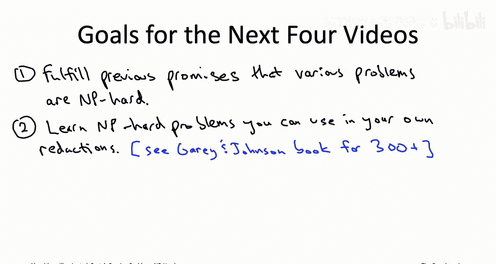
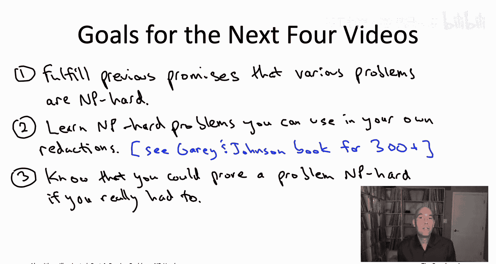

# 斯坦福大学《算法启蒙（第4册）：NP难｜Part 4 Algorithms for NP-Hard Problems》中英字幕（deepseek-R1） p27 -27-22.3_ The Big Picture).zh_en -BV1FAVUzXEum_p27-

Everyone and welcome to this video that accompanies section 22。

3 of the book algorithmgorithms illuminated Part4 This is a section about the big picture of what chapterer 22 is going to look like so as we've mentioned there's going to be 19 problems that we're discussing all NP hard all proved NP hard via reductions from the threeS problem So there's 19 problems and 18 reductions to keep track of let's get organized。

First， a quick sanity check as algorithm designers were accustomed to designing reductions for the honorable purpose of spreading computational tractability。

 or is it anti hardness reason reductions to spread computational intractability which goes in the opposite direction and it's really easy to mix up those directions so let's have a quiz to sort of hone our understanding。

 if you watch the video about mixed integer programming or MIPS solvers。

 we show that the Napsack problem is easily formulated as a MI so in other words。

 the Napsack problem reduces to the mixed integer programming problem so what does that then imply。

Okay， so the answer correct answer is are the second and third ones， B and C。

The easiest way to see why is just to remember the cartoon we had about a problem A reducing to problem B and the directions that tractability and intractability spread。

Suppose a problem A reduces to a problem B if we're talking about spreading tractability。

 then remember that goes in the opposite direction of the reduction， so if problem A reduces to B。

 then tractability of B implies tractability for a right given a polynomial time algorithm for problem B。

 you would just compose that with your reduction from A to B to get yourself a polynomial time algorithm for a showing that a is tractable。

Whereas intractability spreads in the opposite direction of tractability that is in the same direction of the reduction。

 remember the two step recipe for proving a problem B is NP hard as you take an NP hard problem A and then reduce A to B。

 and that spreads the intractability from A to B。So for us in this quiz。

 right where we have the Napsack problem reducing to the MIPS problem。

 so the Napsack problem is our problem A， the MIPS problem is our problem B。

So computational intractability goes in the same direction from Napsack to MIP and that is exactly what answer B says。

 whereas answer A has the spread of intractability in the wrong direction so B is correct because the intractability will spread from NA from the problem A to the problem B MIP and then for the same reason answer C is also correct because computational tractability spreads in the opposite direction so given a reasonably good algorithm for MIP you get a reasonably good algorithm for NApsack just by composing the reduction from NApsack to MIP with the assumed reasonably good algorithm for solving MIPS。

With that sanity check on your understanding out of the way。

 we can proceed to talking about the 18 reductions by which we will generate 18 new MP hard problems in addition to the three set problem。

In this cartoon， we're going to have 19 blobs corresponding to 19 computational problems。

 including all of the ones that we've discussed thus far in this video playlist。

 we're going to have an arrow from one problem to the other If there's a reduction in that same direction。

 So an arrow from a problem A to a problem B， if a reduces to B and intractability is going to spread in that exact same direction。

 So the mother of all NP hard problems， the cooklen theorem， we're going to start from threeat。

Now we're going to have a tree directed outward from threeatAT。

 so the M hardness will spread from threeSa through this directed outre to the other 18 problems。

Let me now just go ahead and draw the rest of this directed out tree。

 then we'll discuss which of these reductions we've already seen are easy。

 and then which reductions are going to be the hard ones occupying the next four videos。

That's a bit overwhelming probably it's a lot of problems。

 you will notice almost all of these problems we have discussed in the past。

 I'll tell you about the other ones in a second， it's also a lot of reductions， 18 reductions。

 but actually some of those we've seen in the past also as we'll discuss。

Let's start with the one truly trivial reduction you'll see there's an arrow from the threeSAT problem to the SAAT problem saying the threeatAT reduces to SAAT。

 and that's completely trivial right because threeSAT is literally a special case of sat。

 the special case of the instances where each constraint happens to be a ajunction of at most three literals。

 so certainly any subreoutine for SAAT automatically solves threeat。

One of these reductions while not trivial is something we've actually already seen。

 We saw it back in the opening sequence of videos corresponding to chapterpt 19 and that's the reduction from the directed Hamiltonian path problem to the cyclefree shortest paths problem when you can have edges with negative length so back then we were talking about using reductions to spread inability we introduced the twostep recipe and I just wanted to give you a quick glimpse of what that twostep recipe looks like in action and the particular case study we used way back in chapter 19 is we took on faith that the directed Hamiltonian path problem is NP hard something will prove in this chapter and then we showed that that problem reduces reasonably easily to the problem of computing cycle-free shortest paths and reason that was interesting is it sort of explained the limitations that we had on the shortest path algorithms that we were discussing in an earlier book of this series so like the Belman Ford algorithm and the Fd Warshorell algorithm they're guaranteed to compute shortest path distances only in the special case of graphs that have no negative cycle and then finally from this reduction from。

Directed Hamiltonian Pa， we finally understood why。

 because if the developmentel for Fld Warhore algorithms were correct more generally。

 even when graphs did have negative cycles， that would actually refute the pennot equal to NP conjecture。

So that leaves us with 16 of the 18 reductions to understand now of those 1611 of them are actually quite easy and I'll show up in the book as end of the chapter exercises。

 so let me just enumerate those 11 relatively easy reductions now and I'll give you some hints along the way of what those reductions actually look like。

For example， you know one pretty easy one is the reduction from the independent set problem to the Ceeique problem so let me remind you what these two problems are they're both problems about undirected graphs。

 so an independent set of a graph that's a subset of vertices that are all nonadjacent so there's no edge that has both endpoints in that subset and a clique is exactly the opposite that's a subset of mutually adjacent vertices。

 every edge with both endpoints in that set is in fact present in the graph。

The independent set problem， we're looking for the maximum size of an independent set and the maximum clique problem。

 we're looking for maximum a clique of maximum possible size。

If someone hands you efficient subroutine for the cleeique problem on a silver platter it's very easy to extract from that an efficient algorithm for the independent set problem if I give you an instance of independent set I say find me the biggest independent set you can find what do you do you toggle which edges are in and which edges are out of the graph so you take the complement edge set of the graph that I gave you that turns all the independent sets into Ceaiques now you run the assumed subroutine for computing a maximum size clique it hands it back to you and now you just toggle those edges back and you get a maximum size independent set of the graph that you started。

Something very similar is going on in the reduction from the independent set problem to the vertex cover problem so it's the vertex cover problem so now you want to find a vertex cover which means you want to find a subset of vertices that includes at least one endpoint of each edge so you want it to be the case that there's no edge both of whose endpoints are omitted from your subset and then of course all the vertices would be a vertex cover that would cover both endpoints of all the edges so you want a minimum size vertex cover okay the smallest subset of vertices such that every edge has at least one endpoint cover。

And so here the trick is to realize that in any graph， if you take any independent set。

 the complement of the independent set is a vertex cover and vice versa。

 so this means that if you want to find the maximum size independent set of a graph and I give you a subroutine for computing the minimum size vertex cover。

 all you need to do is invoke the subroutine for finding the smallest vertex cover。

 you take the compliments so you take all the vertices that are not in the smallest vertex cover and that's going to be the largest possible independent set。

Let's go ahead and follow the rest of the arrows down that directed path Okay so next we have that the vertex cover problem reduces to the set cover problem what's the set cover problem well the input looks a lot like it did in the maximum coverage problem so there's a ground set of elements I give you a collection of subsets of that ground set。

 but rather than having a budget on how many subsets you can pick I give you the requirements that your subsets have to cover everything have to cover the whole ground set and then your job is to cover the whole ground set with as few of the subsets as possible that's the set cover problem。

Turns out the vertex cover problem is simply a special case of the set cover problem。

 so given an efficient subroutine for set cover it immediately gives you an efficient subroutine for vertex cover。

 why is vertex cover a special case of set cover， we'll just think of the ground set as being the edges of the graph and you're going to have one subset for each vertex of the graph and the elements of that subset are going to be the edges incident to that vertex so in effect it's almost like subsets correspond to stars in the graph that you're given and if you think about a little bit you'll realize that set covers of that set system or exactly correspond to the vertex covers of the original graph。

Next the set cover problem reduces to the maximum coverage problems。

 remember these two problems have almost the same input。

 the difference that in maximum coverage I give you a budget on how many subsets you can pick and you want to cover as much stuff as possible in set cover I give you a requirement that you have to cover everything and you want to pick as few sets as possible。

So if you were given a subroutine for the maximum coverage problem。

 how would you use it to solve the set cover problem。

 well you'd take your maximum coverage subroutine and you would ask it。

 you for the maximum amount that can be covered with one set。

Then you'd ask it again for the maximum amount that could be covered by two sets and then again by three sets and so on。

 and it would be handing you back the maximum coverage that could be achieved with that number of subsets at some point once your budget K is high enough。

 then the maximum coverage subroutine will actually be able to cover everything and so the first value of K like if k equals 17 was the very first time the maximum coverage algorithm was able to cover the entire ground set。

 then you know that that's the answer for your set cover problem those 17 subsets or a minimum size set cover in the set cover instance that you started with。

Finally， along this path and this is something we mentioned back when we were discussing influence maximization is that the maximum coverage problem is basically a special case of influence maximization that's why it was so cool we were getting just as good an approximate correctness guarantee for the more general problem that one minus quantity1 minus1 over K raised to the K let me give you kind of a quick hint of why how to view maximum coverage problem as a special case of influence maximization I'll leave it to you to think through the details so suppose we're given an instance of maximum coverage right so we have our ground set and we have our subsets we need to somehow view this as an instance of influence maximization so in particularly we somehow need a graph。

So what we're going to do is we're going to have we're going have two rows of vertices in the top row we'll have one vertex for each of the subsets that we were given in the maximum coverage instance in the bottom row we're going to have one vertex for each of the elements of the ground set that we were given in this maximum coverage instance those are going to be the vertices for the edges you're going to have an directed edge from each vertex corresponding to a subset to each of the vertices corresponding to the elements that it contains。

That's going to be the graph。The last thing the influence and maximization circuit chain is going to be expecting is an activation probability。

 we're just going to set that equal to one Think this through and what you'll find is that the influence maximizing subsets in this graph。

 they're going to be subsets of k vertices in the top row that activate as many vertices in the bottom row as possible and that's going to correspond exactly to the coverage of those corresponding k subsets。

Moving on to a different part of the graph let me just talk briefly about the traveling salesman problem let's not worry right now about why the traveling salesman problem is NPp hard。

 let's worry about the two edges going out of the TSP so the reductions from TSB to two other problems So let's start with the traveling salesmen path problem so this is just the slight variant of the TSB where instead of a tour that loop back on itself you want a path but still a path that's cyclefree and visiting every vertex so there is going to be a path where if there's n vertices there'll be exactly n minus1 edges visiting each of the vertices exactly once and in the path problem you want a minimum cost such path。

A reduction from the TSP to this traveling salesman path problem is then just a way of using an efficient subroutine for computing the best path and extracting from that subroutine the best to in the original instance and this is not hard to do。

 I'll leave it to you to think through the details。

 but basically it's possible to do a little bit of minor surgery on the TSP instance that you start with so that if you feed this sort of slightly modified version of the graph to a subroutine for computing a traveling salesman path you're actually going to trick that subroutine into computing for you a tour in the original graph that you started with again I'll leave that as an exercise for you to think through the exact same idea works for the minimum cost K path problem that we discussed at length case to the problem of given a graph with edge costs computing the K path so a path with K minus1 edges。

 K distinct vertices， no cycles， the minimum cost K path exact same idea will prove that that problem is NP hard as well。

Next， let's talk about the Hamiltonian path problem so because some of the graph problems we care about are most naturally directed graphs like Sfr shortest paths。

 whereas for others we're focusing on undirected graphs like in the TSP。

 it's useful to have two versions of the Hamiltonian path problem one for directed graphs again where you're looking for a simple path that visits every single vertex exactly once or the same version of the same problem in undirected graphs and as you'd hope these two problems are almost the same they are a very easy reductions in both directions So for example。

 if you start from an undirected graph and I give you a sub-routine for the directeded case you can transform your undirected graph into a directed one just by replacing each undirected edge with a directed edge going in either direction if you think about it if you compute a directed Hamiltonian path after you've bi-directed all the edges it's easy to extract from that an undirected Hamiltonian path from the graph that you started with。

On the other hand， if you start from a directed Hamiltonian path instance， so a directed graph。

 there is a way it's a little more complicated， but not much is a way to turn a directed graph into an undirected graph so that after you compute an undirected Hamiltonian path in the undirected graph that you produced。

 you can extract from it directed Hamiltonian path in the graph that you started so the upshot is again just using a very minor surgery on the graph。

 there are reductions either direction between the undirected or directed Hamiltonian path problems。

Let's now zip over to the far left of the slide and talk about the two problems that we discuss semi-reliable solvers for the SAT problem and mixed integer programs。

 so when you have a sort of feasibility problem you know like graph coloring or whatever usually satAT is the most natural encoding of it。

 but whenever you have an encoding using satisfiability if you wanted you could have an encoding using mixed integer programming as well now mixed integer programming is about optimization so you would expect there to be an objective function but if all you're trying to do is encode an instance of satAT you don't need an objective function you just have sort of a placeholder or objective function like maximize zero。

Then all you need to do is translate the logical constraints in the given satAT instance。

 so disjunction of literals into arithmetic constraints into inequalities and as you'd probably expect in your integer program。

 you're going to have101 random01 decision variable for each boolean variable in the SAT instance where the value1 corresponds to true and the value0 corresponds to false and then if you think about it。

 each of the disjunctions of literals is quite easily translated into an inequality saying something like x1 plus x2 plus x3 is at least equal to some constant。

There's other ways you could also argue the mixed integer programming is NP hard， so for example。

 as we saw， it includes NApsAC as a special case and eventually we'll be proving that NApsSAC is NP hard。

 it's very easy to encode the independent set problem as a mixed integer program， et ce。

 but you just I chose one particular proof of NP hardness and mixed integer programming here going via the satisfiability problem。

The last of the easy reductions concern problem we haven't discussed yet， the subset sum problem。

 so in the subset sum problem I give you n positive integers， you know， so 17，234。

 you know 19 million， blah blah blah， blah， I give you n positive integers。

 and I also give you a target， you know， 21 325，173。And the question is。

 is there a subset of the n numbers who sum is exactly equal to that target， yes or no。

 okay so it's not an optimization problem， it's just feasibility or is there not a subset with exactly the target sum？

We will be proving that the subset sum problem is NP hard。

 but here I just want to record the fact that if subset sum is NP hard。

 it will immediately imply NP hardness of two problems we have discussed at length the NApsack problem and make spend minimization it turns out subset sum is basically a special case of both of these two problems so if subset sum is NP hard certainly so are the more general problems which we actually care quite a bit about subset sum is basically the special case of Napssack where the item sizes are the same as the item values and it roughly corresponds to the subset of make spend minimization when you have only two machines。

So those are the 11 kind of easy exercise reductions that I wanted to mention。

 so that leaves us with five reductions， four of those we will be covering in the next four videos。

 the fifth one， even though it's not that easy， I'm still going to leave it as an exercise and that is the proof that the graph coloring problem is NP hard。

The difficulty of that reduction is you know roughly on par with the reductions that we're going to see in the forthcoming videos you know I could have had another video with this reduction。

 but by the time we finished these four reductions you're going to be sick of them so you're gonna be glad that I just sort of deferred this as an exercise for those of you interested to do in the privacy of your own homes。

That leaves us with four harder reductions， so we're going to start in the next video by reducing the three set problem to the independent set problem。

Once we have that reduction from3S to In set， at least assuming the Cook Len theorem。

 assuming3SAT is NP hard， at that point， the hardness will flow all the way to the end of that path。

 including to the maximum coverage and influence maximization problems。

The next order of business will be to establish that the traveling salesman problem is NP heartt that's really the canonical NP heart problem。

 so I certainly want to show you why it is in fact NP heart。

 so we have two steps to do there the first one is going to be another reduction from threeat to a graph problem this time not to independent set but rather to the directed Hamiltonian path problem so that'll be in the second of the forthcoming videos。

That reduction will establish NP hardness of the directed Hamiltonian Pa problem again assuming the Cook Levinn theorem as we discussed the directed and undirected Hamiltonian Pa problems are not that different。

 so once we know the directed version is NP hard we also know the undirected version is NP hard and then there's actually a pretty easy reduction from the undirected Hamiltonian Pa problem to the traveling salesman problem so we'll do that in the third of the forthcoming videos that'll be the easiest of the four and that'll finally fulfill this promise that the traveling salesman problem is indeed an NP hard problem。

That leaves us with one last reduction， which will be in the fourth of the forthcoming videos。

 a reduction from the independent set problem， which again will be proving NP hard in the next video to this subset some problem。

 which again， by virtue of it being a special case of the K NApsack and make expand minimization problems that will immediately establish that those two problems are NP hard。

And what's interesting here is that you know Napsack and the subset subspecial case。

 you know those are problems， they don't involve these complicated objects like graphs or something like that。

 the input to those problems is just a bunch of numbers。

 just end numbers and in particular we know we can solve the NApsack problem and therefore the subset subspecial case in pseudoponomial time using an algorithm that runs in time proportional。

To the magnitude of the input numbers Now that's not what we want。

 we really want to run in time polynomial in the input size and the number of digits needed to represent the input numbers and this N hardness result is interesting because it explains why we can't get what we want It explains why for the NApsack problem we're really stuck with this running time that depends on magnitudes of the input numbers rather than on the number of digits in those numbers。

The next four videos we'll be filling in these gaps and presenting those proofs of those final four reductions before we do that I I kind of feel like I should level with you because NP hardness reductions including some of the ones we're about to see they can be like kind of painfully messy and to be honest pretty much nobody remembers the details of any NP hardness proofs all that said there's still some pretty good reasons for seeing a few of them so let me just be explicit about what the goals are for going through these NP hardness reductions over the next four videos。

Goal number one is to fulfillill a bunch of promises that I owe you from previous videos in this playlist from earlier in the book right so problem after problem that we tackled I kept saying oh bummer。

 this is MP hard oh man， this one's MP hard too we got to compromise on correctness or compromise on running time we can't get what we want and I feel a little bit fraudulent if I didn't actually explain why those problems are MP hard and why we needed all those compromises that we went through and the video is corresponding to chapters 20 and 21 so that's the first reason we're going to go through these reductions。

The second goal is to give you some ammunition for carrying out the first step of the simple two step recipe of provinging problems that are NP hard right step one is you have to choose a known NP hard problem so going through these reductions that'll really solidify sort of our knowledge of a bunch of NP hard problems that you can then use in your own NP hardness reductions。

If 19 problems aren't enough for you， well， let me refer you to the classic book by Michael Gary and David Johnson。

 Computers and intractability， a guide to the theory of NP completeness。

 This book is all the way back in 1979 and don't forget the cooklevin theorems around 1971 and Carp demonstrated the power of NP hardness around 1972。

 So this is just later that same decades， it's still sort of early days， but already in 1979。

 there were hundreds of NP hard problems no， and that book includes a compendium of over 300 NP hard problems。

 which is a great place for brainstorming your own NP hardness reductions Indeed。

 it's very hard to think of any computer science books from 1979 that remain as useful as Gary and Johnson to this day。

Finally， I don't expect you to really remember the details of any of these NP hardness reductions。

 say a year from now or frankly， even like a week from now。

 but still this exercise should be empowering to you right so if at some point in the future。

 your boss hands you a problem and says， you know your' raise for the year depends on whether you can prove that this is NP hard by next week。

 you should feel like that is something you could do if you really needed to right they're messy。

 they're problem specific， but look you're just about to watch a few 20 minute videos with examples of reductions you're going to understand them you're going be like yes。

 if I really had to do this， I could。That's enough about the big picture of chapter 22。

 let's dive into the reductions， starting with the In set problem， see in the next video。

