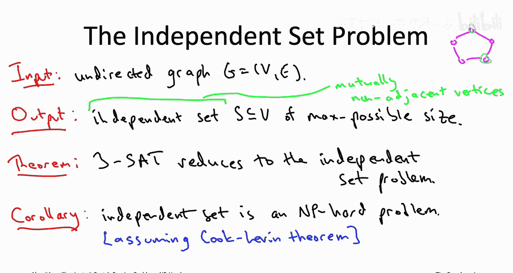
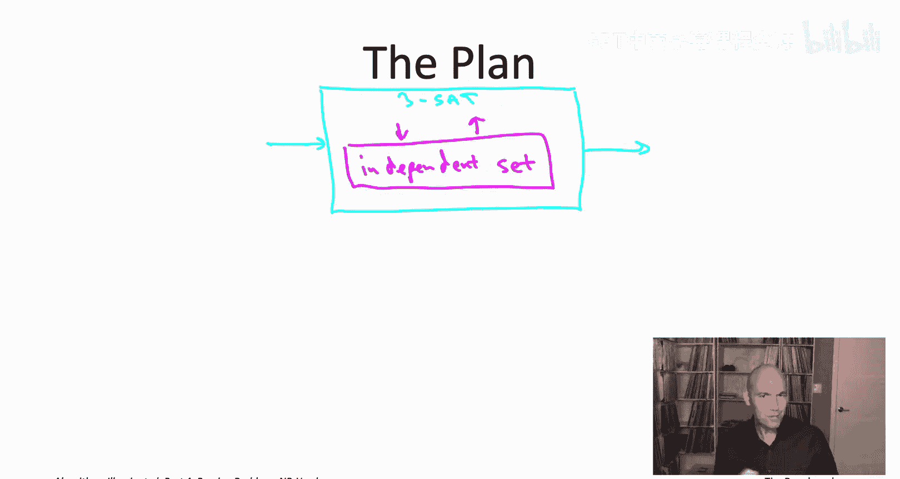
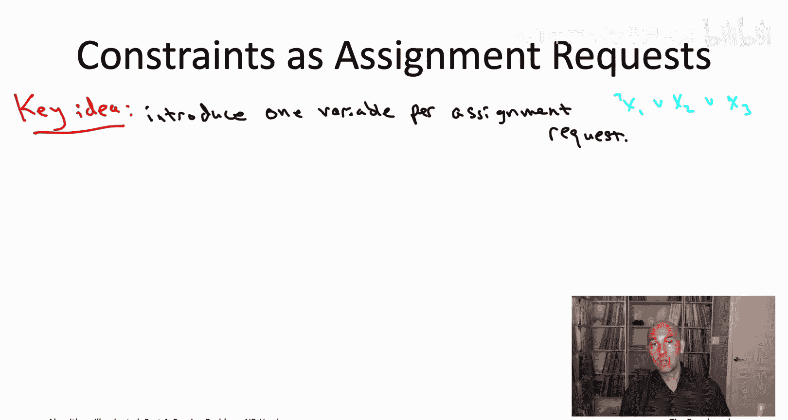
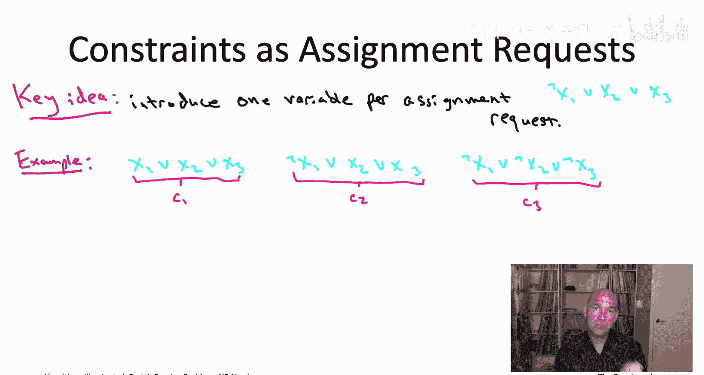
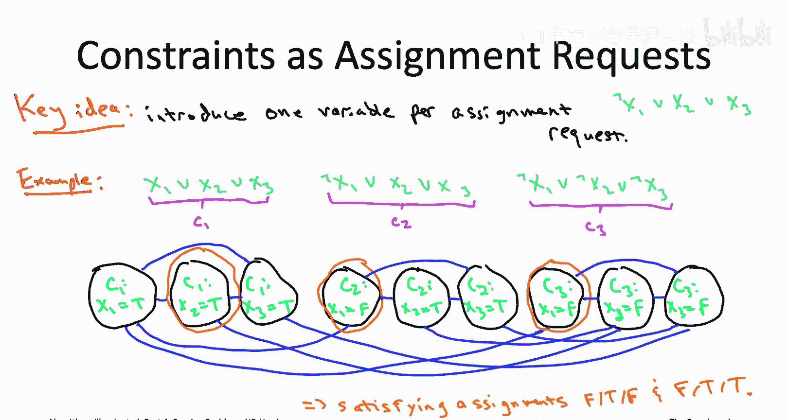
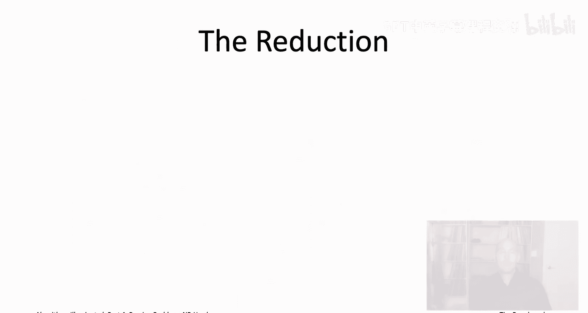
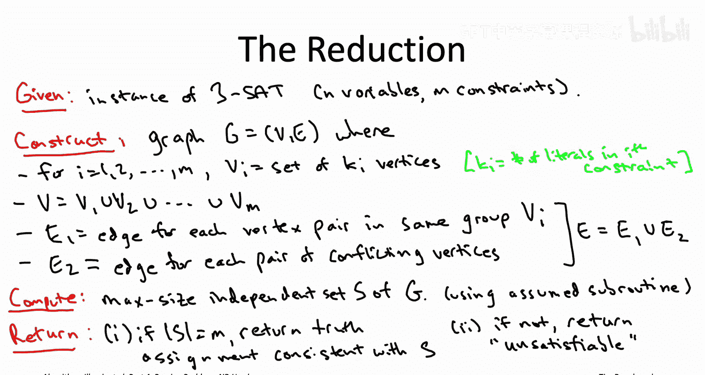
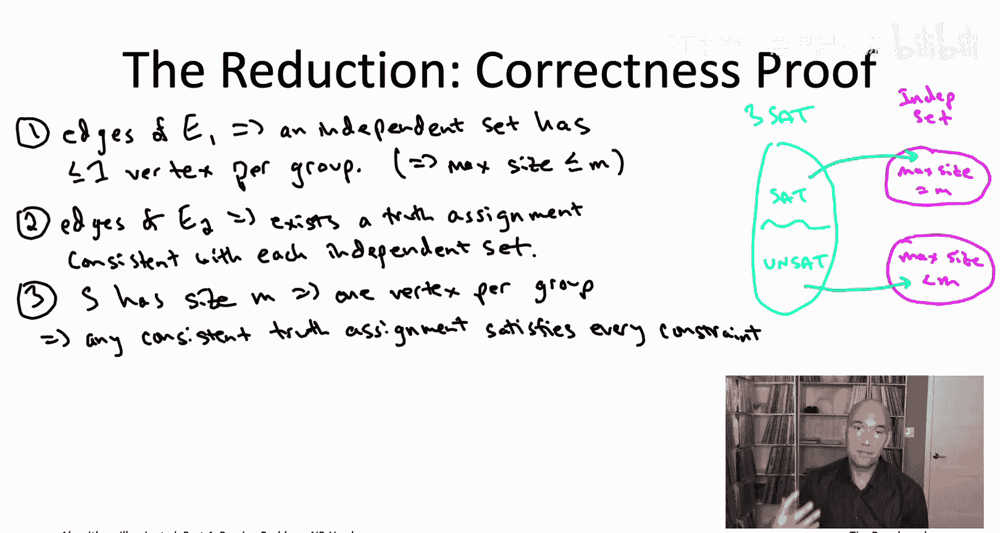
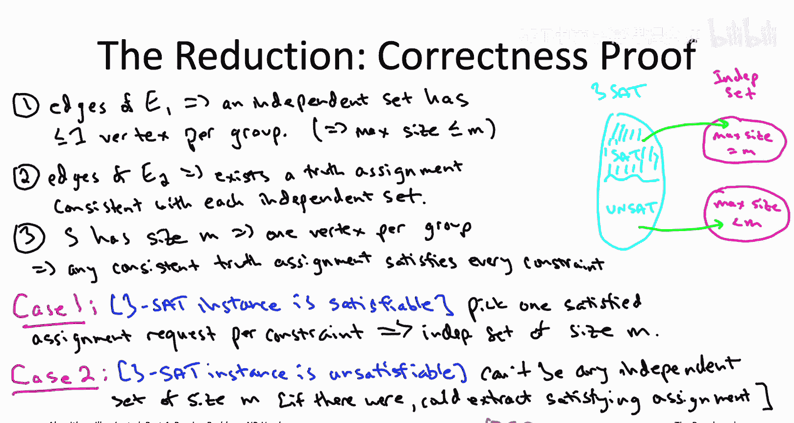

# 斯坦福大学《算法启蒙（第4册）：NP难｜Part 4 Algorithms for NP-Hard Problems》中英字幕（deepseek-R1） p28 -28-22.4_ Independent Set Is NP-Hard).zh_en -BV1FAVUzXEum_p28-

Hi everyone and welcome to this video that accompanies Section 22。

4 of the book algorithmrithms illuminated Part 4。 This section will be the first of our major NPPharness reductions。

 a reduction from3 sat to the independent set problem Let me quickly jog your memory about what the independent set problem is。

In the independent set problem， the input is an undirected graph。

 and the goal is to compute a independent set that is a subset of vertices that are all mutually non adjacent。

 an independent set of the maximum possible size。For example， if the input graph is a five cycle。

 the maximum size of an independent set would be two vertices。

There's various pairs of vertices that form independent sets， not all of them do。

 some of them are adjacent， but I mean， non adjacent pair of vertices is an independent set。

 and if you tried to pick three vertices， two of them would wind up adjacent， which is not allowed。

 So two as big as it gets if the input graph is a five cycle。

We've talked about the In set problem a couple times in the past。

 so it's very common for the vertices to be representing people or tasks。

And the edge is to be representing conflicts， so for example。

 people that don't get along or tasks that require the same resource。In fact。

 what we've discussed has been a generalization of this called the weighted In set problem。

 or also part of the input is a non negative weight W sub V with each vertex V。

 and the goal in that version of the problem is to compute the independent set with the maximum possible total weight。

So that's， for example， the version of the problem where we gave a linear time algorithm using dynamic programming for graphs that were path graphs。

 we did that back in part3 back in the previous playlist or more generally for tree graphs you can solve the weighted independent set problem in linear time what we're going to see here is that even this special case of the independent set problem which basically corresponds to all of the vertex weights being equal to one if you have general graphs then even this special case is going to be NP Hart。

So how are we going to prove that。 We're going to prove that using our two step recipes。

 we're going to choose an NP hard problem A and reduce that problem A to the independent set problem。

 Now， at the moment， we kind of only have one NP hard problem truly to work with。

 which is the threeet problem offered by the cook Le1 theorem。

 Then as we generate more and more n hard problems。

 that that'll give us more candidates that we can use in the first step of the recipe。

 But to get started， our hand is sort of forced， we really need to reduce the threeet problem to the independent set problem。

 So that's going to be what we're going to do。

As long as we're willing to take the Cook Leth theem on faith。

 as long as we're willing to assume that the three side problem is indeed NP hard。

 then by our two step recipe， this reduction will show that independent set is an NP hard problem as well。

As we saw in the previous video， once we know that the In set problem is NP hard。

 the dominoes start falling and we find that lots of other problems that we care about are NP hard as well。

 so the clique problem， the vertex cover problem， the generalization of that into the set cover problem。

 then the maximum coverage problem and finally the influence maximization problem。

 all of those are NP hard via very easy reductions from the In set problem。

So how is this going to work， how are we going to be reducing threeat to independent set remember this what this means that means if we're given a subroutine for independent set。

 so independent set will correspond to the magenta box。

 we need to show how from such a subroutine we can build an efficient algorithm for the threeat problems。

 we need to figure out how to build the blue box。We have seen one NP hardness reduction in the past that was way back in the opening sequence of videos corresponding to chapterpt 19。

 not sure if you remember it。 So there we reduced the directed Hamiltonian path problem to the psychofree shortest path problems。

 and that first example our magenta box was a subroutine for computing psychofree shortest paths and the light blue box that we were building was an efficient algorithm for the directed Hamiltonian path problem。

 and that reduction really was pretty conceptually straightforward right because these are both problems that involved directed graphs。

 So the blue box for solving directed Hamiltonian path It's given a directed graph And then the question is is there is there not a directed Hamiltonian path。

 and then the subroutine also expected a directed graph and you just ask it for the psychofree shortest paths。

 there was the one twist where know the psychofree shortest path subroutine expected the edges to have lengths So we gave them all length of-1 to trick the subroutine into computing long paths for us。

 even though it was the shortest path subroutine that it was very straightforward We're given a directed graph we just added -1 to。

Edge we fed it into the cyclefree shortest path subroutine， the magenta box。

 and then we could pretty much immediately output what we needed to to complete the description of the light blue box。

 Now， here， things do not seem as straightforward。 we are not dealing with two graph problems we're dealing with one problem from logic。

 the threeat problem and then a graph problem， the independent set problem。

 So somehow this reduction。 Okay so now we're given a subroutine， a magenta box that expects a graph。

 but we weren't ourselves given a graph。 We were given this threeat instance。

 just a bunch of sort of disjunctions of literals。 So somehow we have to fabricate some kind of graph from the threeat instance that we can then feed into our magenta box。

 our independent set subroutine。

So that somehow the answer to that independent set problem gives us information about whether the given three set instance was satisfiable or not。

 That is what we are task with doing。So let's start brainstorming about how we might do that。

 Your first thought might be to transmographyify the given threeat instance with end decision variables into an underwreched graph that has n vertices。

 so the one to one correspondence between the Boolean variables in the given threeat instance and the vertices in the graph that we construct there's two to the n truth assignments corresponding to true false and there's two to the n subsets of n vertices so maybe somehow we could do that in a way that independent sets of the graph correspond to satisfying truth assignments Well actually that's a natural nice know a's place to start but it's not actually going to pan out so we're going to need a more clever way of setting up a correspondence between variables in the threeat instance and vertices in the graph that we construct。

So think about one of the constraints in the three set instance that we were given。

 each constraint is a disjunction of at most three literals， so for example。

 one of the constraints might be not x1 or x2 or x3。

Back when we were talking about satAT solvers and we first introduced the satisfiability problem。

 we discussed how disjunctions of literals are pretty easy going creatures， pretty easy to satisfy。

 Really， they're just a list of variable variable assignment requests。 And to make a clause happy。

 you just need to satisfy one of their requests。 So， for example。

 this disjunction of three latererals。 It's sort of pleading with us， you know。

 please set X1 to false。 Then I'll be happy。😊，Or failing that， please try to set X 2 to true。

 I'll still be happy。 Fail also that the clause， the constraint is saying you have one more shot in making me happy。

 please set x3 equal to true。 So we can think about a disjunction of literals is really being K different requests for how the constraint wants the variables to be assigned。

 And the only way to fail to satisfy a clause as if you reject every single one of its K variable assignment requests。

The key idea in the reduction is that in the graph that we're going to construct from the given threeet instance。

 we're going to have one vertex for each of the variable requests， so for example。

 a clause like this one in the upper right that would give rise to three vertices。

 one requesting the next one is false and then to the requesting x2 and x3 are true。

 every other clause with k literals would give rise to its own K vertices。

So for example， imagine we had three constraints each a disjunction of three literals。

 let's say we had the same constraint as before not x1 or x2 or x3。

 and let's throw in one constraint asking for something to be set to true。

 So x1 or x2 or x3 and another constraint which is asking for some variable to be set to false so not x1 or not x2 or not x3。

 So this is three constraints each with three literals that's going to give rise to nine vertices。

 one for each of the nine assignment requests made collectively by these three constraints。

For example， the first three vertices correspond to the three assignment requests made by the first clause。

 so we have one vertex about c1 asking that x1 is set to true C1 asking x2 to be true。

 and then a third one C3 asking x3 to be true， then you we have separate vertices when the constraintsst C2 makes the same requests for variables x2 and x3 so the separate vertices corresponding to the second clause again with a three variable requests。

 x1 to false or x2 to true or x3 to true。Do subsets of these vertices encode truth assignments， Well。

 it depends。 not always。 The issue is that some of the requests are inconsistent with each other in that they ask for opposite assignments to the same variable。

 Like the first vertex and the fourth vertex are making opposite requests to what the variable X1 should be assigned to。

 And obviously， X1 is linked at one of those two values， not both。On the other hand， remember。

 the whole point of the independence set problem is to represent conflicts， so that says， okay。

 we should just introduce an edge between any two vertices that conflict that ask for opposite assignments to a common variable。

So， for example， we will have an edge between the first and fourth vertices。

Similarly between all three of the first three vertices and the corresponding last three vertices。

And then also the second and third vertices from the second group conflict with the second and third vertices from the third group。

So now what's cool is that a satisfying truth assignment can be easily extracted from any independent set in this graph。

 any subset of non conflictfing vertices， if that subset contains at least one vertex in each group。

For example， consider the second， fourth and seventh vertices。

Those three vertices correspond to three variable assignment requests。

 actually two of those three requests are redundant。

 so we have two different requests to set x1 to false from the fourth and the seventh vertices。

 plus the request by the second vertex to set x2 to be equal to true。Now。

 the claim is that any truth assignment consistent with all of those requests。

 that any truth assignment that says x1 to false and x2 to true will， in fact。

 satisfy all of the clauses。 And that's because this independent set has at least one vertex from each of the three groups。

 So by virtue of X2 being set to true， that first group is represented。

 So the first constraint will be satisfied， and then similarly because x1 is equal to false。

 that's going to give us a representative from the second and third groups。

 satisfied assignment request。 So the second and third clauses will be satisfied as well。

 So this independent set gives rise to two different satisfying truth assignments。

 we don't really care which one both of them， x1 is equal to false and x2 is equal to true。

 and then x3 can be equal to whatever either way it's going to be a satisfying assignment。

So far so good， we see how any independent set of a particular form。

 any independent set with at least one representative in each group。

 we can easily extract from such an independent set satisfying truth assignment to the three set instances that we started with。

 which is exactly what we wanted。That can't be the whole story， however， because for all we know。

 we're going to be handed a three side instance that doesn't have any satisfyying truth assignments at all。

 That's actually unsatisfiable。 And that's also something we're responsible for recognizingogni。

 So we need to make sure that in the graph that we construct we can know immediately when we look at the maximum size independent set。

 we can know immediately whether or not there was some satisfying assignment in the three side instance we were originally given。

But there's a very easy way to do that， which is just we're going to add in all of the edges that occur within a group。

So in effect， we're going to impose a triangle on each of these triples of vertices。Now。

 what should be clear is that any independent set can only pick one vertex at most from each group。

 any pair of vertices within the same group are adjacent， so they can't both be an independent set。

 So every independent Es at most one representative per group。

 we already know that if we get exactly one representative per group。

 we can extract a satisfyying assignments。 and as we'll see in the correctness proof the converse is fine as well。

 So if， in fact， the maximum independent set does not have one vertex from every group。

 then we'll be able to immediately conclude that we were initially given an unsatisfiable threeet instance。

So the general reduction， the main result in this video。

 the general reduction from threeat to independent set。

 it's literally just exactly what happened on this slide just scaled up to arbitrary threeat instances。

 So let me go ahead and spell out the reduction on the next slide it'll literally be just what we just did。

 but I'll spell out that reduction on the next slide and then we'll discuss the correctness of the reduction so we'll argue that you can deduce whether or not the original threeat instance was satisfiable based on what a maximum sized independent set looks like in the corresponding graph that you construct。

Allright， so let's describe the reduction in general。

 So don't forget what a reduction is responsible for doing。 You're given a magenta box。

 a subroutine for some problem。 B B in our case is independent set。

 And then from that you're building up the light blue box。

 the algorithm for the problem A and for us here a is threeatAT。

 So our blue box is given an instance of threeat So we're given n decision variables M constraints each one of disjunction of at most three literals。

 and then we have to somehow prepare that into a graph that we can feed into our independent set subroutine。

 it'll spit back out a maximum size independent set from which we can hopefully deduce what was going on with the original threeat instance that we're responsible for。

So given an instance of three set n variables M constraints we need to construct a graph so what are the vertices well just like in the example the vertices are going to correspond to assignment requests made by the constraints so we have M constraints let's say the Ih constraint has k sub I literals in it K sub I here is going to be12 or three so for each constraint I we're going to have a collection of K sub I vertices so1 two or three vertices depending on the number of assignment requests and then the overall vertex set is just going to be the union of these subsets of vertices over all of the M constraints。

The edge set then contains two types of edges， just like in the example。 So first of all。

 any pair of vertices in the same group， any pair of vertices that are assignment requests from the same constraint。

 those get connected。 that was the second batch of edges that we added in the example。

 those triangles and then the other edges are the ones between conflicting assignment requests。

 Okay so if two different vertices are making opposite requests to the same decision variable。

 those also get connected by an edge。 that was the first group of edges that we added in the example。

 and that is it that is a graph defined from an arbitrary threeat instance。

Having defined the graph， we now have in our hands an input that we can， if we want。

 feed into our magenta box， are assumed subroutine for the independent set Pro。

 And that's what we do。 We have our graph。 We just say， hey， subroutine， magenta box。

 What give us back a maximum size independent set of this graph。So it'll do that by assumption。

 now we'll have this independent set， and the question is， what do we do with it。

 how do we figure out what was up with the three set instance we were given from this independent set that was handed to us by the magenta box。

Well， we're not going to have to work too hard。 We're just going to look at how many vertices are in this independent set that were given。

 So if there's M vertices in the independent set， where M is the number of constraints we started with are equivalently the number of vertex groups。

 So we're handed an independent set that has M vertices in it。

 then we're just going to return an arbitrary truth assignment consistent with all of the variable requests made by that independent set。

 And remember， because of that second batch of edges because of the edges in E2， any independent set。

 there corresponds to one or more consistent truth assignments。

 So we just pick an arbitrary truth assignment consistent with the independent set capital S。

 and we return it， As we'll see on the next slide that will necessarily be a satisfying assignment。

On the other hand， if the independent set that we get back does not have M vertices in it。

 And if you think about it， that means it has to have less than M vertices in it。

 then we declare victory and that we say， well， you know。

 that three sad instances you gave us in the first place we're off the hook because it's unsatisfiable。

 There are no satisfying truth assignments。 And again， on the next slide。

 we'll see that that is indeed a correct declaration of unsatisfiability。

If you look over the amount of work done by this reduction。

 it's not very much right so it invokes the assumed subroutine to the independent set exactly once for the graph capital G that it constructs and know with an appropriate implementation of the reduction。

 you can also make it run in a linear amount of work outside of its one subroutine call by linear I mean big O of M plus n where m is the number of constraints and n is the number of variables in the given three set instance。

Let's proceed to the argument that this reduction is correct。

 that it always correctly solves the three set instance it was given。

 So that is whenever there is a satisfying truth assignment， the reduction of a return one。

 whenever there is no satisfying truth assignment， the reduction will， in fact。

 correctly deduce that fact。So the picture you want to have in mind as we go through this proof of correctness is the cartoon I've drawn here on the right part of the slide。

 right， So it's a reduction from three sat to independent sets。

 So that's why the green arrows go from left to right。 Independ sets。

 That's what we're assuming we have a efficient subroutine for。

 So that's like the magenta box that we have access to。

 And we're trying to build that light blue box for for the three SAT prop。

And what we're hoping we just did with this reduction， right。

 So we just showed how to translate any instance of three set into a graph。

 and we're hoping that the satisfiability status of the three set instance we started with is will be immediately apparent from the result of the In set subroutine。

Specifically， we're hoping that whenever we started with a satisfiable three side instance。

 we wind up with a graph with an independent set of size M。

 and whenever we started with an unsatisfiable three side instance。

 we wind up with a graph that has an independent set of size less than M。Now mind you the reduction。

 when you're constructing capital G， you have no idea whether this formula。

 whether the three side instance is satisfiable or not。

 and yet you're hoping that property gets preserved encoded by the independent set of that graph capital G。

So let's now see that that is in fact the case， and let's begin just with some basic properties of the reduction。

 really just things that we deliberately enforced in the way that we constructed our graph capital G。

First of all， we have these edges in E1。 So these are the edges that go between any pair of vertices that belong to the same group or equivalently any two assignment requests made by the same constraints。

 These are the triangles that we had in the example。 So because of the edges in E1。

 any independent set can only pick at most， one vertex from each of the M groups where M here is the number of constraints。

 If you think about it， I mean， that means the biggest and independent set could be is if it picked exactly one vertex from each of the M groups。

 So the maximum size， no matter what is going to be M at most。Don't forget about the edges of E2。

 So these were the first ones that we added in our example。

 These are the ones that were between vertices corresponding to conflicting variable assignment requests。

 So requests to the same decision variable， but for opposite values。

 So we added these edges so that in any independent set， right， which means there's no conflicts。

 So if there's no conflicts。 that means we can define a truth assignments。

 That is consistent with all of the variable assignment requests in that independent set。

 There may be more than one as we saw in the example。

 but there always be at least one consistent truth assignment for any independent set。

 and that's enforced by that second subset of edges。Therefore。

 we can extract a satisfying truth assignment whenever we're given an independent set that that happens to have M vertices in it。

 because the only way that an independent set capital S can have m vertices。

 if it has one vertex per group， having a vertex from a group corresponds to making a variable assignment which satisfies that clause。

 so if your vertices represent all of the groups， then you're making assignments that satisfy all of the clauses。

 all of the constraints。So those are all properties of the reduction that hold。

 no matter whether the given three set instance was satisfiable or not。

 so now to do the correctness proof we're going to need two cases。

 one for the case where the given three set instances is satisfiable and one where it's unsatisfiable。

So let's assume first that there is some satisfying truth assignment to the three side instance we were given。

 F some satisfying truth assignment arbitrarily。Now。

 what we're going to do is construct an independent set of the graph G that has M vertices in it。

 so how are we going to do that？Well， it's a satisfying truth assignment。

 which means that each of the M constraints is satisfied， so for each of the M constraints。

 at least one， if not more of the variable assignment requests that the constraint was making is in fact met。

So what we're going to do is we're going to walk through the constraints one at a time when we get to a constraints。

 we pick one of the variable assignment requests it was making。

 which was in fact satisfied by the true assignment。

So that gives us one satisfied variable assignment request for each of the M constraints。

 which then translates to M vertices in the graph G with exactly one vertex for each of the groups。

So that's a subset of M vertices， moreover， because we picked only one vertex per group。

 and because we started from a consistent truth assignment。

 that is going to be an independent set of capital G with size M。

Summarizing whenever we're given a threeet instance， which isn in fact satisfiable。

 we're going to wind up constructing a graph where in fact。

 the maximum size of an independent set is M is equal to the number of constraints。

 So when we invoke our subroutine， it'll compute for us a maximum size In set It'll give it back to us。

 We'll check it。 It'll have M vertices in it， it'll have to be exactly one vertex per group and as we've seen。

 we'll be able to extract from that independent set a satisfying assignment for the original instance。

 So the reduction really will do the right thing when it starts with a satisfyisfiable instance。Now。

 suppose on the other hand， that we actually start out with an unsatisfiable three side instance。

 what's going to happen， what's going to be up with the graph capital G that we construct。Well。

 the thing to realize is there is no way that the graph G that we construct will have an independent sets of size M。

Why not， if it did have an independent set of size M， it would have to be with one vertex per group。

 and then we'd be able to extract from that independent set a satisfying truth assignment。

 but by assumption there are no satisfying truth assignments。E go。

 if you start with an unsatisfiable threeet instance。

 you're going to wind up with a graph where every independent set has at most M1 vertices。

 So therefore， when our reduction invokes the magenta box and computes a maximum size independent set of G。

 it's going to get back an independent set that has M-1 vertices or less and it's going to do the right thing。

 it's going to report that the given three side instance was unsatisfied。 So with both cases covered。

 that wraps up the correctness of the reduction。

So I'm wondering if this is one of those proofs where some of you out there are thinking I'm being a little too pedantic。

 So maybe slide before last when we describe the reduction。

 how you build the graph G from the given threeet instance。

 maybe once that reduction was written down， you looked at it and you're like， yeah。

 you know it's obvious that this works。 And so you're wondering what was the point of that sort of slightly painful proof of correctness we did in the previous slide。

 And you know as we saw that reduction is correct。 But it is not that hard to screw up reductions。

 and to think that you've proved that a problem is empty hard using reduction。

 but then actually the reduction isn't quite right。 So to drive that point home on this quiz。

 I want to show you an example of how a reduction might go awry。Specifically。

 I want you to think about the reduction we just saw from the three set problem to the independent set problem and imagine we just sort of forgot about those edges that went inside a group。

 So imagine we did not include an edge between vertices that are different variable assignment requests from the constraint。

 Where would the proof break down。

So the correct answer is the third one answer C， so first of all， for answer A。

 because we still have the edges E2， those were the ones that ruled out any conflicts between assignment requests。

 so even without the edges in E1， it's still the case that any independent set translates to a welldefined truth assignment and more generally any independent set with at least one vertex per group is going to translate to a satisfying truth assignment。

For B， it's also still the case that part of the case one of the proof of correctness。

 a satisifiable threeS instance， you can again just choose one satisfied assignment request from each of the end constraints and that'll continue to give you an independent set of size M in the graph capital G so that part still works What about C Why is C correct Why does this part of the proof break down。

The issue is that if we omit the edges E1， all of a sudden it becomes possible for an independent set to include more than one vertex from a group。

So while it's still the case that if you start from a three unsatisfiable three side instance。

 it's still the case you will not have any independent sets with at least one vertex in every group。

 You can't have independent sets of that form， because from any such independent set。

 you could extract a satisfying truth assignment， which doesn't exist。However。

 if you forget those edges E1， you might have an independent set which sneakily smuggles in M vertices into it。

 even though it skips some of the vertex groups， because it made up for it by including more than one vertex and some of the other vertex groups。

 other vertex groups。 So the second case of the correctness proof breaks down without those edges E sub1。

So one takeaway from this quiz is that with be hardness reductions。

 the devil is often in the details and if you get the details wrong。

 the reduction can actually be wrong， and so that's why know as you proceed to our next three reductions in the next three videos。

 we will always pause and take care to make sure that our reductions are correct。

 So that's it for independent sets， let's move on to directed Hamiltonian path。

 See in the next video。

