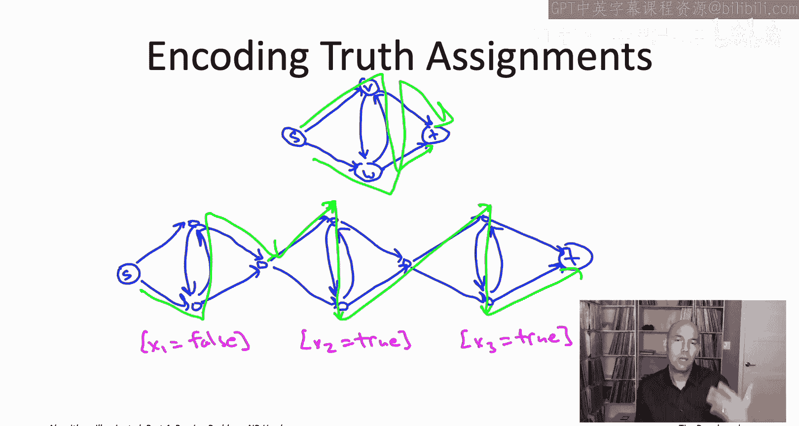
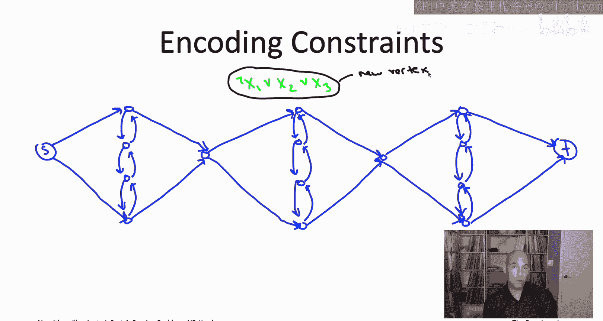
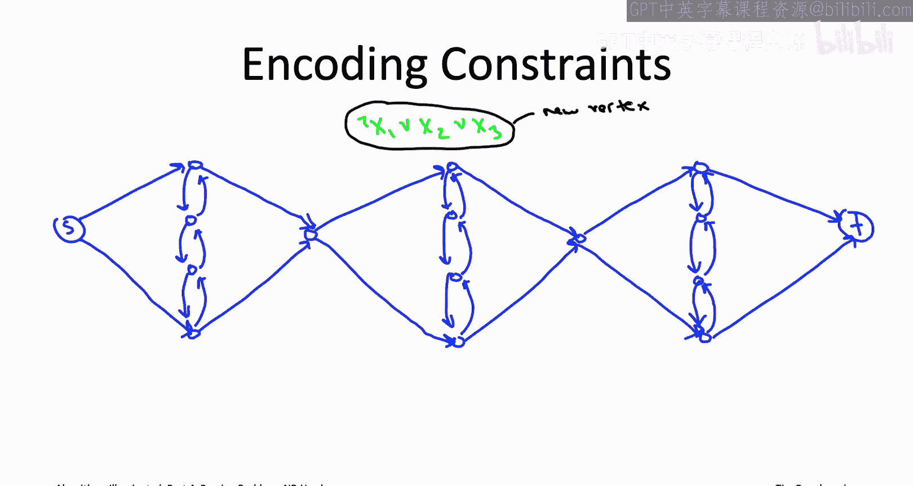
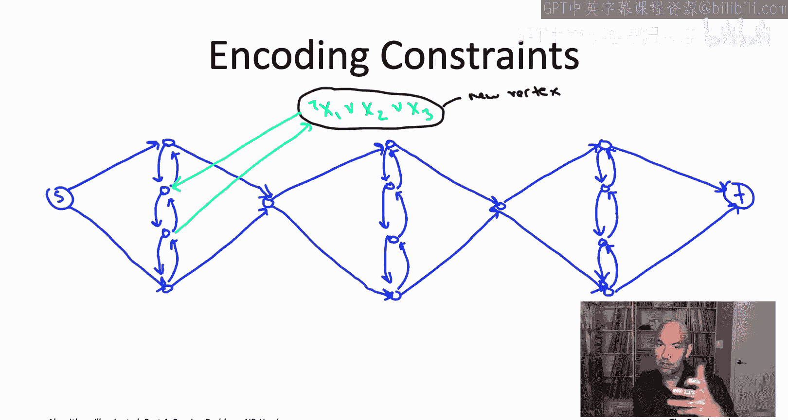
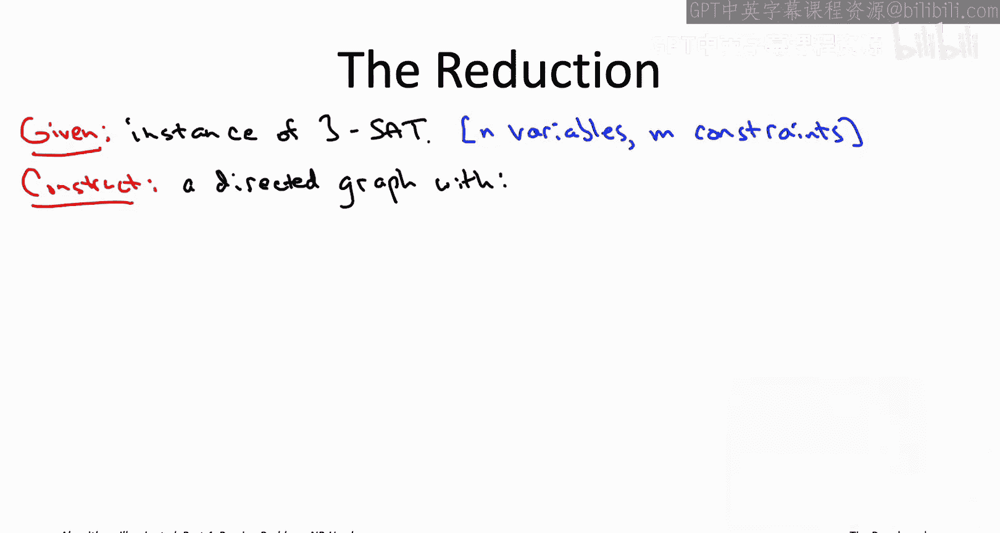
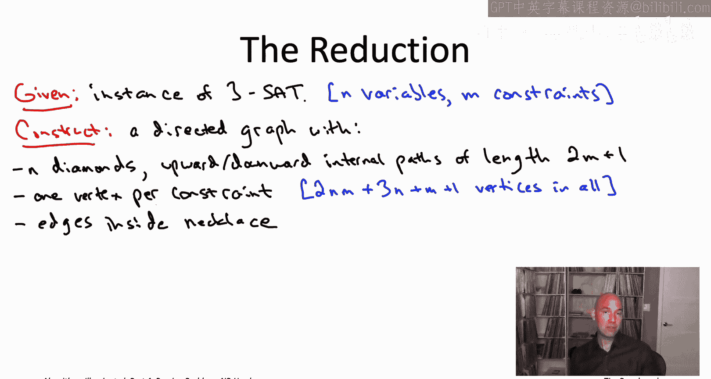
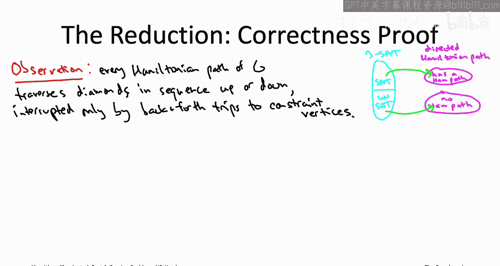
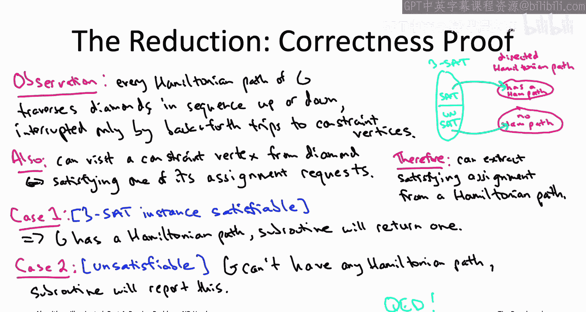

# 斯坦福大学《算法启蒙（第4册）：NP难｜Part 4 Algorithms for NP-Hard Problems》中英字幕（deepseek-R1） p29 -29-22.5_ Directed Hamiltonian Path Is NP-Hard).zh_en -BV1FAVUzXEum_p29-

Hi everyone and welcome to this video that accompanies Section 22。

5 of the bookArithms illuminated Part4 This will be the second of our four major NP hardness reductions。

 it will again be a reduction from the threeatAT problem to a graph problem it's going to be a different graph problem。

 the directed Hamiltonian path problem which we saw briefly in the very first chapter when we discussed why computing cyclefree shortest paths is NP hard。

 so let me now remind you about that directed Hamiltonian path problem。

The input naturally is a directed graph also two distinguished vertices， so S。

 which is the starting vertex and T， which is the destination vertex。

 and the responsibility of an algorithm for this problem is to return an ST Hamiltonian path of the graph。

 so it's a path that starts at S ends a T and visits every vertex exactly once。

 or if the graph doesn't have a st Hamiltonian path， the algorithm should correctly report that fact。

In contrast to most of the 19 problems that we're discussing in this chapter。

 our interest in the directed Hamiltonian Pa problem。

 it's less for its direct applications and more for its utility improving proving that other problems are NP hard。

 including most notably the traveling salesman problem。

And the main result of this video is going to be a reduction。

 we're going to be reducing the threeat problem to the directed Hamiltonian Pa problem so if we're willing to accept the Cook Len theorem if we're willing to accept that the threeat problem is NP hard by our twostep recipe this shows that the directed Hamiltonian Pa problem is NP hard fulfilling a promise I made you way back in that opening chapter when we deduced from the NP hardness of directed Hamiltonian Pa。

 the NP hardness of cyclefree shortest paths。

What's the reduction going to look like Well， actually just in the last video right。

 we saw a reduction from3atAT to a graph problem， the independent set problem and that may have been surprising at that time since3atAT doesn't have anything to do with graphs it would seem has to do with logic and independent set has to do with graphs now that we've seen that however。

 it should be totally plausible that we could also reduce the threeat problem to other graph problems。

 perhaps even including the directed Hamiltonian path problem。And we can， you know。

 because it's a different problem than independent set we're going to need a totally different reduction。

 unfortunately it'll even be a little bit more complicated than the reduction in the previous video。

 but that's kind of characteristic of how NP hardness proofs work。

 they tend to be pretty problem specific。

Like last time we need a plan right so we're trying to build this blue box for solving threeatAT given a magenta box that solves the directed Hamiltonian path problem。

 which means at the end of the day， we're going to have to look at the answer that this magenta box gives us。

 it's going to tell us whether or not some graph has a Hamiltonian path and from its answer we're going to have to deduce whether our original threeatAT instance was satisfyisfiable or not。

 so what is our plan for extracting a satisfying truth assignment from a Hamiltonian path of a graph。

Well here we're going to be able to encode truth assignments in an easier way than in the independent set reduction。

 here we're just going to concoct the graph to force a Hamiltonian path to make a sequence of binary decisions。

 which will then encode truth assignments to the original threeSaAT instance。

To see how this might work， let's start with just a simple four vertex diamond graph。

You stare at this graph for a little bit and you realize there are exactly two ST Hamiltonian paths。

 one that zigzags up to down and one that zigzags down to up。

This means that from an ST Hamiltonian path in the diamond graph we can extract。

 we can think of it as encoding assignment to a single boolean variable。

 identifying the one zigzag path with true and the other zigzag path with false。Now。

 of course we're encoding a truth assignment not just to one variable， but to n variables。

 So how are we going to do that， what we'll just chain a bunch of these diamond graphs together in a long necklace。

Now， any ST Hamiltonian path， so it goes from S to T it has to traverse every single diamond。

 and in each diamond it has to make aciion of whether to zigzag down or to zigzag up。

 so depending on the sequence of decisions that the ST Hamiltonian path makes。

 we can interpret that as a truth assignment。

So for example， if we identify zigzagging down and then back up with true in the other direction as false。

 this Hamiltonian path that I've shown you on the slide that would correspond to the truth assignment that sets the first variable to false because in the first diamond the path zigzags up。

 and then in the second and third diamonds because it' zigzags down。

 that's going to be an assignment of true to two other variables x2 and x3。

That's how we're going to encode truth assignments just with these necklace graphs so hopefully that's simple enough and the next step is we need to somehow figure out how to incorporate the constraints in the given threeat instance intuitively we want to somehow modify this graph so that the only ST Hamiltonian path that survive are the ones that correspond to satisfy truth assignments in our original threeatAT instance。

To see how this might work， let's just add one constraint to the necklace graph with three diamonds that we were just looking at。

 let's say we want to encode the constraint， not x1 or x2 or x3。

So we're going to add one additional vertex beyond the vertices in the necklace。

 this new vertex will correspond to this constraint。

 and the idea is that we want to set things up so that an ST Hamiltonian path can visit this constraint vertex。

 if and only if it's traversing a diamond in the correct direction。

 in the direction that corresponds to the variable assignment requested by this clause。

Let's see how this would work in our simple example。 So in blue。

 I've drawn the same necklace graph we have on the previous slide。

 the same sequence of three diamonds。 Okay， I'm lying a little bit。

 I added a couple extra vertices on the pathways that go up and down within a diamond。

 We'll see why I did that in a second。 Otherwise， this is exactly the same as what we had on the previous slide。

 The blue edges。 So now let me show you the new edges we're going to add between the necklace and this new constraint vertex corresponding to the constraint。

 not x1 or X2 or X3。

As usual， we can think of this constraint as making three requests， it says， hey。

 please set X1 to be false or failing that， please set x2 to be true or failing that。

 could you at least set x3 to be true， And so what we want is we want that in one of these diamonds we can successfully visit this constraint vertex and then resume where we left off if and only if we're traversing the pathway within that diamond in the correct direction and the requested direction。

So， for example， consider the first diamond corresponding to the variable X1。

 So this constraint has an opinion about what it wants x1 to be， and it wants it to be false。

 If we do set it to false， remember we're identifying that with a path that goes zigzags up through the diamond。

 So the path is going to be going up through the first diamond if it corresponds to the requested assignment X1 to be false。

 So what we're going to do is on the way up through the first diamond。

 we're going to add an edge to the constrained vertex。 and then back to that same diamond。

 allowing a path to just resume where it left off。And now you can see why I added those extra two vertices in the middle of each of the pathways in the diamond。

 it was just to make sure we could do this sort of back and forth day trip， if you will。

 to this constraint for text。Now we can just add two more edges you know to each of the second and third diamonds and then notice this constraint is requesting a true assignment to x2 and x3。

 so that means if the path is traversing the second or third diamond in the correct direction。

 meaning from up to down， then again we want to introduce these edges to just allow this quick trip to and from the new constraint fort。

For example， consider the following green S T Hamiltonian path。

Notice this SD Hamiltonian path trip goes through each diamond in the downward direction。

 so this path we should interpret is encoding the all true truth assignment。

Now notice assigning x1 to true does not satisfy the constraint in question does not meet its variable request。

 and accordingly there's no way to visit this new constraint vertex。

 the black vertex on top from the first diamond without either skipping or visiting twice some vertex and again we added these extra two vertices in the middle to make sure that this was true。

Assigning X2 to true does satisfy the constraints， and this is the reason why the Hamiltonian path in green can take a quick back and forth day trip to the constraint vertex from the second diamond before resuming its downward journey exactly where it left off。

Now because X3's assignment also satisfies the constraint。

 such a day trip is also possible from the third diamonds， but in this particular path。

 because the constrained vertex had already been visited from the second diamond。

 there's no reason in fact you can't visit it from the third one into Hamiltonian path。

 so instead the SD Hamiltonian path just proceeds directly downward in the third diamond and then over to the destination T。

There's also a second ST Hamiltonian path that corresponds to this exact same truth assignment。

 the allru truth assignment， and it's just you know you flip what you do in the second and third diamonds。

 so the second Hamiltonian path would go directly downward in the second diamond and then in the third diamond that's when it would make the day trip over the constraint vertex and then come back and proceed all the way to T。

Okay， good， that's how we handle one constraint and sort of change the graph to make sure that SD Hamiltonian paths have to correspond to truth assignments that satisfy that constraint。

 But you know what about the rest of the constraints Well we can just do exactly the same thing。

 So if we have a second constraint we want to accommodate。

 we're just going to add yet another vertex and then connect it to the middles of these diamonds Now one thing that's a little annoying is we don't want the different constraint vertices to interfere with each other so we're going to add a new pair of vertices on these pathways internal to each diamond for each constraint that we have So rather than having three hops to go up or down as we do with one constraint now with two con we're going to have five hops up and down。

 So let me do a little racing and redrawing so that we can accommodate two constraints at the same time。

So now that we have these expanded diamonds now with four vertices internal to the middle path in each diamond。

 we're going to reserve the top two of those four vertices for the first constraint and then the bottom two vertices of each of those is going to be reserved for the second constraint so let me just redraw the light blue edges we had before interacting with the first constraint vertex again using just the top pair of vertices internal to each of the paths inside the diamond。

And now we'll do exactly the same trick with the second constraint vertex。

 So the second constraint is making the opposite assignment request from the first one。

 So it actually wants x1 to be true。 X2 to be false x3 to be false。 So for example。

 from the first diamond， we're going to allow a quick back and forth day trip to the second constraint vertex。

 this bottom vertex。 if and only if it's going downward through that middle path in the first diamond。

 remember， downwards zigzas correspond to assignments of true。

Let me again highlight an ST Hamiltonian path for you it will again correspond to the all true truth assignment so itll go downward in each of the three diamonds Now as a Hamiltonian path that has to visit both of the constraint vertices So the top constraint know the top vertex that's just like before you can take a day trip of back and forth trip to it from the second diamond or the third diamond I'm going to choose here to do it from the second diamond but you can equally well choose to do it from the third diamond Now the bottom constrained vertex for the all trueru truth assignment the only assignment we made that makes that second constraint happy is our true assignment to the first variable for the second and third variable is we actually the opposite of what this clause wanted so the only diamond from which we'll be able to make a back and forth sojourn to this bottom vertex is from the first diamond so that's what the path is going to do。

One possible point of confusion just because this example is sort of so small so we have only three variables and both constraints actually involve all three of the variables。

 so that's why we have the light blue edges going to and from each of the constraint vertices from each of the three diamonds remember in general you're going to have n variables and you're going to have like three literals in each con so actually there will be no light blue edges between most of the diamonds and one of the constraint vertex there will be at most three diamonds the ones corresponding to the variables that that appear in that constraint and that's where you'll have a pair of light blue edges for each of those at most three diamonds。

The general reduction， the main result from this video。

 the reduction from3atAT to directed Hamiltonian path is going to be literally the same as what is happening in this example。

 just scaled up to handle any number of variables and any number of constraints so we're again going to have n diamonds。

 one diamond for each of our decision variables in the given threeat instance the diamonds will be stuck together in a necklace arranged in a sequence each diamond is going to have a path going both up and down internally and we'll subdivide the path a whole bunch of times and then we'll add one vertex for each of the constraints and we' wire the constraint vertices to and from the diamonds so that the only way you can visit a constraint vertex from a diamond is if you're traversing that diamond in the direction corresponding to one of the variable assignment requests made by that constraint。

Let me spell that out a little bit more formally again just to be super clear to triple check the direction of the reduction right so we're reducing a known NP hard problem which in our case is threeet。

 we're reducing it to the target problem directed Hamiltonian path threeet is our problem A。

 that's the light blue box we're trying to construct directed Hamiltonian path is our problem B。

 that's the magenta box that we assume we have access to so we're building the blue box so we're given as input instance to threeAT。

All we have going for us in trying to solve this instance of threeet is that someone gave us a magenta box for the directed Hamiltonian path problem。

 so to make use of it， I guess wed better construct some directed graph from our threeet instance that we can feed into the magenta box and again that construction is exactly the one we've done in the last slide scaled up to an arbitrary number of variables and constraints。

There's going to be n diamond graphs where n is the number of variables in the given threeet instances and again they're going to be stuck together so the rightmost vertex of one diamond is just going to be identified superimposed with the leftmost vertex of the next diamond and then there are going to be these paths that go up and down in the middle of the diamond and if you think about it we needed we wanted two vertices for each of the constraints so if there's M constraints is going to be two m vertices internally to that upward and downward path inside the diamond so that means the path length。

 the number of hops to get from the midpoint of the top diamond to the bottom of the diamond that's going to be two m plus one hops visiting two m internal vertices along the way。

Also as we saw in the example there's going to be one additional vertex that we add for each of the M constraints so if you tally it up how many vertices are there well so in each of the n diamonds there's two m internal vertices and the upward downward paths so that contributes two times n times M vertices then there's the vertices corresponding to the constraints so that adds another M and then there's the vertices in each diamond other than the ones internal to the upward downward path so that's three vertices per diamond plus then one extra for the destination of vertex at the end to the vertex T。

As far as the edge set we have the edges inside the necklace graph。

 so that's just like it was on the previous slide right so you have an edge from the leftmost vertex of a diamond to its top and its bottom vertices and from its top and bottom vertices over to its rightmost vertex and then you have these paths going up and down the middle so those are all of the edges inside the necklace。

Finally， we need the edges to wire the necklace to and from the constraint vertices and again this works just like in the example。

 so for a given constraint vertex it contains some number of variables and it's going to have a pair of blue edges one going to and one coming from each diamond corresponding to a decision variable that appears in that constraint。

 either positively or negatively， so with a disjunction of three literals there's going to be six edges。

 six light blue edges coming out of that constraint vertex。

 a pair for each of the three variables participating in that constraint。

Now in each of the diamonds we've reserved the Jth pair for use by the Jth constraints and then whether you attach that constraint vertex to the J pairer in one direction one order or the other order。

 that depends on whether the Jth constraint contains the variable Xi positively or negatively if it contains Xi positively then we want it to be possible to visit that constraint vertex going downward through the diamond so that means you take the top vertex of the pair and you connect that to the constraint vertex and then you can come back from the constraint vertex down to the lower vertex of the Jth pair and then you do the opposite if it's the case that the constraint actually includes the literal not Xi。

Few so that completes the construction of the directed graph。

 Probably the most complicated construction of this type that we're going to wind up doing。

 But now you know we used to have a threeet instance now we have a directed graph。

 This is something we can feed directly into the assumed subroutine for directed Hamiltonian path I guess we also have to tell the subroutine。

 a starting vertex and a destination vertex， but you already know what those are right the starting vertex is the leftmost vertex of the first diamond and the destination vertex is the rightmost vertex of the last diamond。

To complete the reduction， we we have to finish building this light blue box or we have to say what actual solution we return to the threesat instance we're responsible for。

 So we're going to look at the output of the magenta box of the directed Hamiltonian path subbertine and from it we have to extract an answer to that threeet instance and again there's going to be two cases depending on whether we get a Hamiltonian path back or not So if the subbertine comes back and says hey here here's a directed ST Hamiltonian path of your graph G Well we know that a Hamiltonian path it has to traverse all the diamonds in sequence and it has to traverse them either upward or downward so either they visit the top vertex before the bottom vertex or vice versa So any Hamiltonian path。

 we can interpret as a truth assignment and in that case we will just return that truth assignment as a solution to the threeat instance we were given As we'll see in the proof of correctness on the next slide in that case。

 the truth assignment return must indeed be a satisfying truth assignment。

 So the reduction is going to be correct in that case。On the other hand。

 totally possible that this directed Hamiltonian path circuittine says， hey。

 you gave me this directed graph that doesn't even have any ST Hamiltonian paths。

in that case you say okay， sorry subroutine， and then you report back that the threeSa instance that you were handed in the first place must be unsatisfiable and again we'll see in the proof of correctness on the next slide that whenever the graph G that we construct has no Hamiltonian path。

 it must indeed be the case that the original threeat instance was unsatisfiable so the reduction is going to be correct in that case as well。

Moving on to the correctness of the reduction， let me again draw the picture you should have in mind as we go through this proof。

The reduction is from threeat to directed Hamiltonian paths， so threeSAT is our problem A。

 it's our known NP hard problem as per the cooklevin theorem and then directed Hamiltonian path that's our target problem that's our problem B that we're trying to show is NP hard and so basically we want to show that this reduction even though it doesn't know in advance whether or not the threeatAT instance it was given a satisfiable or not it just constructs this graph capital G the status the satisfiability status of the threeatAT instance will be reflected in the graph G that it constructs So given a satisfiable threeat instance。

 this reduction winds up churning out a graph G with a Hamiltonian path conversely if the given threeat instance is not satisfiable it churn out a graph that does not have a Hamiltonian path that's what we need to show。

Let's start with just a basic observation about the reduction which just follows by the way that we constructed the graph G so G may or may not have a Hamiltonian path。

 we don't know， but if it has a Hamiltonian path， any Hamiltonian path has to have a restricted form it has to look like the Hamiltonian path that we were drawing in the example so in particular the path has to go through the diamonds one by one and each diamond to either goes straight up or straight down through the path in the middle except possibly interrupted by a back and forth day trip to a constraint vertex。

 but importantly you cannot be a Hamiltonian path and do anything other than visit a constraint vertex and come right back。

A Hamiltonian path cannot jump from a constrained vertex to a different diamond。

 because then there would be no way for it to resume where it left off in the diamond where it jumps to that constrained vertex in the first place。

In other words， Hamiltonian paths can only differ in which direction they traverse a diamond going up versus going down and exactly where in their journey they make a back and forth trip to a given constraint for a text。

 but all Hamiltonian paths have that basic form。

Also， as we've seen by construction， we've wired the constrained vertices to the necklace to the diamonds so that the only way you can get away with visiting a constrained vertex and again necessarily by just going there and coming straight back the only way you can manage that in a Hamiltonian path is from a diamond that you're traversing in the direction which would satisfy one of the assignment requests made by the corresponding constraint。

 so if the constraint has say not x1 in it and you're traversing the first diamond upward corresponding to an assignment of false to the first variable。

 then indeed you have the option of going straight to that constraint vertex and back but if you're traversing that first diamond downwards in the wrong direction you're not going to have that option and if you're a diamond that doesn't interact with that constraint at all。

 you're again not going to have the option of visiting that constraint vertex from that particular diamond。

What these two things mean for us is that if anyone gives us a Hamiltonian path of the graph G we're done。

 we can just immediately extract a satisfying truth assignment from that Hamiltonian path because this first observation tells us that the Hamiltonian path has to have a very restricted form。

 master traverse the diamonds in sequence， either upward or downward interrupted only by these back and forth day trips to the constraint vertices the Hamiltonian path that has to do exactly one back andfor day trip to each constraint vertex and by the second observation。

 the only way you can make one of those back and forth trips is by doing something in a diamond that corresponds to a variable assignment that satisfies the correspondingent constraints So if you manage to visit all the constraint vertices then the truth assignment that you're encoding does in fact satisfy all of the con。

 It is a satisfying true assignment。Those are our basic observations now again we need two cases to discuss correctness depending on whether or not the given threeet instance was satisifiable or not。

 we want to argue that a reduction does the right thing， computes the right solution in either case。

So suppose first that the given threeet instances is satisfyisfiable。 Well。

 then if you think about it， any satisfying truth assignment actually gives rise pretty immediately to a Hamiltonian path in the Gr G that we constructed So one such path traverses each diamond in the direction suggested by the satisfying assignment。

 So downward in any diamond for a variable set to true and upward for the other diamonds and then you take a back and forth day trip to the Jith constraint vertex at the earliest opportunity。

 So from whatever diamond is the corresponds to the first variable whose assignment satisfies the jaith constraints。

By virtue of G having a Hamiltonian path， we know that our assumed subroutine for solving that problem will hand us back on a silver pla or a Hamiltonian path。

 It may or may not be the same one that we just talked about， but it will be some Hamiltonian path。

 given that there was one to find。 And by the last of our observations， you know。

 given that Hamiltonian path， we can extract the reduction extracts from it a satisfyying truth assignment。

 So the reduction does indeed correctly work when given a satisifiable threeet instance。

 What about when it's given an unsatisfiable threeet instance。Well。

 if the given threeat instance is unsatisfiable， then because there's no satisfying truth assignments。

 you can have a path from S T that visits all of the constrained vertices without skipping or visiting twice some vertex because if you did have such a path and by our final observation you could extract from it a satisfying truth assignment but there are no satisfying truth assignments。

 So that means there are no Hamiltonian paths to be found。

 I assume subroutine will correctly report that fact and then our reduction in turn will correctly report that that threes instance is unsatisfiable So that completes the reduction from threeat to the directed Hamiltonian path problem because the threesad problem is and be hard by the cooklevin theorem。

 the directed Hamiltonian path problem is as well。Coming up next。

 we're going to have the big payoff of this video， which is we will finally prove that the traveling salesman problem is NP hard。

 I'll see you there。

