# 斯坦福大学《算法启蒙（第4册）：NP难｜Part 4 Algorithms for NP-Hard Problems》中英字幕（deepseek-R1） p30 -30-22.6_ The TSP Is NP-Hard).zh_en -BV1FAVUzXEum_p30-

Hi everyone and welcome to this video that accompanies Section 22。

6 of the book algorithmgorithms illuminated Part4， This section is the third of our four main reductions and here we will prove finally that the famous traveling salesman problem is indeed NPHart。

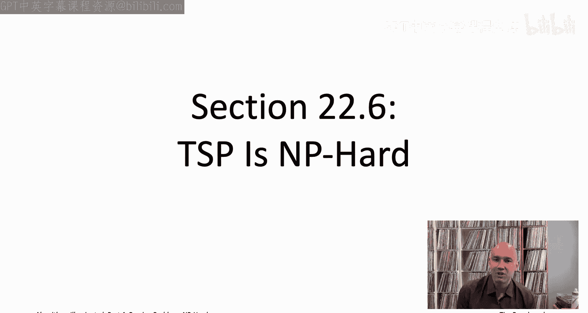

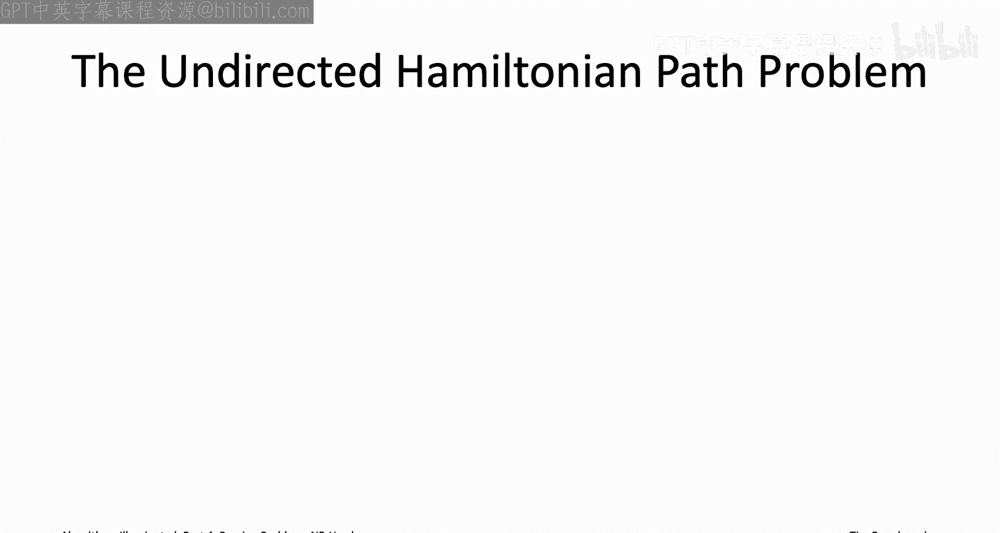

In the last video we proved that the directed Hamiltonian path problem is NP hard using a reduction from the threeatAT problem and this video is the big payoff so here we're going to be proving that the traveling salesman problem is NPR actually the idea will be very much like how we use the directed Hamiltonian path problem to show that the psychofree shortest paths problem is NP hard way back in the opening sequence of videos there is you know on the one hand like immediate type checking error with this idea which is that directed Hamiltonian path is of course about directed graphs whereas the TSP is about undirected graphs so it would seem much more appropriate to use the undirected version of the Hamiltonian paths problem。

So the input is exactly the same as in the last video except now with an undirected graph so you've given an undirected graph you' given a starting vertex S and a destination vertex T and the goal is the same so we want to compute an S Hamiltonian path now。

 of course it's going to be an undirected path and an undirected graph。

 but again we want a path that one endpoint is S。 the other endpoint is T and it should visit every vertex exactly once。

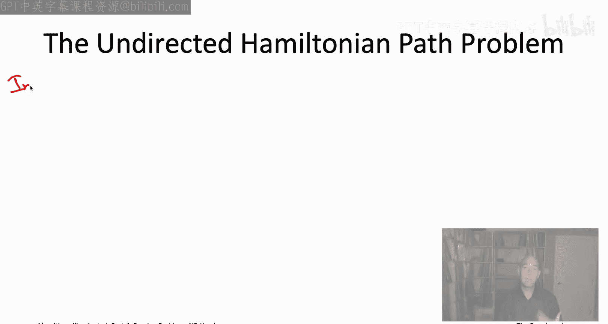

Of course， if the graph does not have any Hamiltonian paths。

 we would like an algorithm to correctly declare as much。

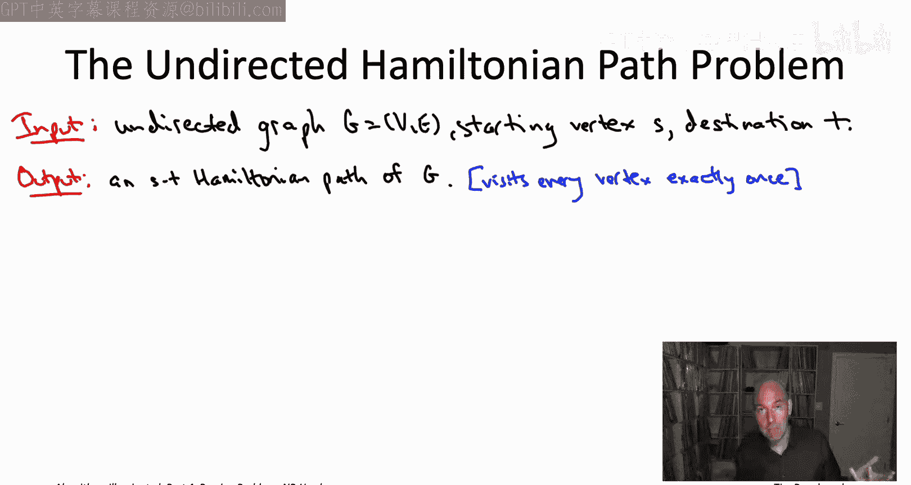

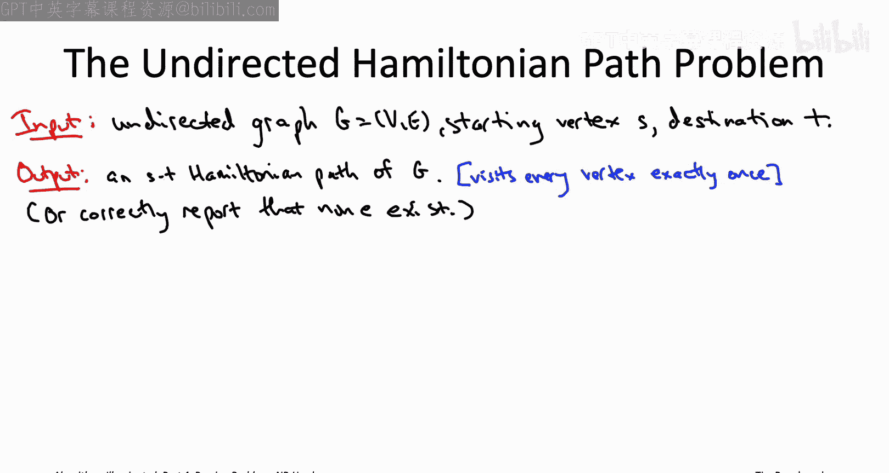

We know that the directed version of the Hamiltonian Pa problem is NP hard we proved that in the last video there's actually we haven't actually proved that for the undirected version of the problem。

 but as I mentioned in the overview video a few videos ago。

 there's actually quite easy reductions back and forth between the directed undirected versions of Hamiltonian path so by virtue of the directed Hamiltonian path problem being NP hard so is the undirected version and again I'll leave the details as an exercise for you to carry out in the privacy of your own home。

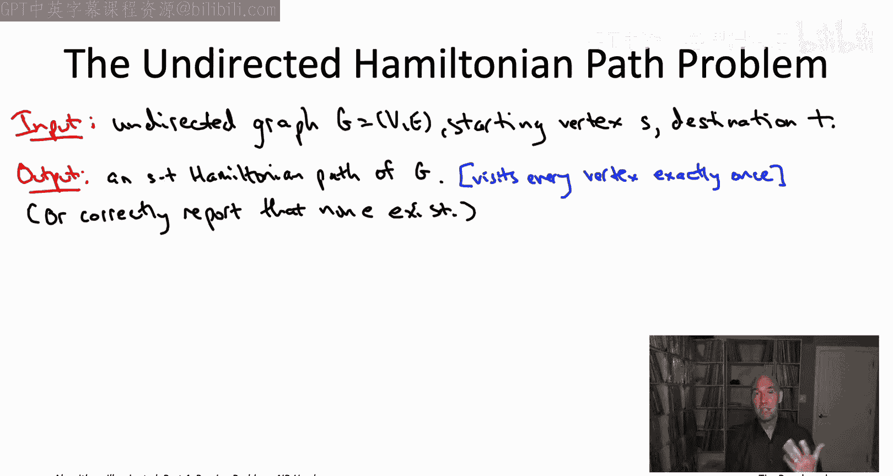

The plan then will be to reduce this NP hard problem。

 the undirected Hamiltonian path problem to the traveling salesman problem。

 so that'll prove the traveling salesman problem is also NP hard。

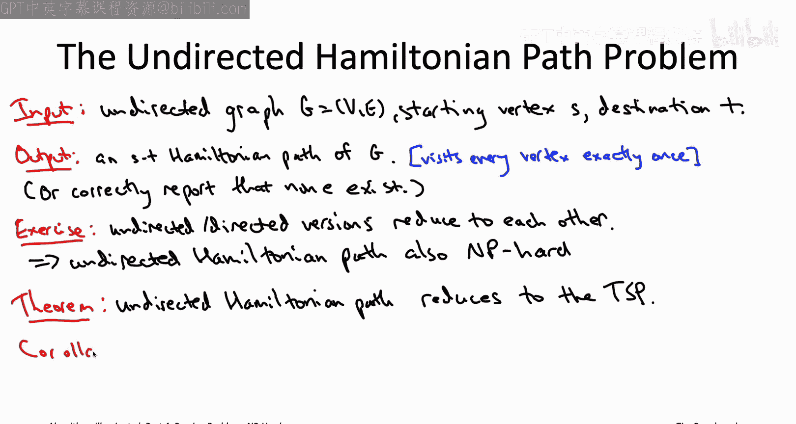

We should be breathing a sigh of relief so the task that we're responsible for this video doesn't seem as intimidating as the last two videos so the reduction we have to come up with from undirected Hamiltonian path to the traveling salesman problem those are both problems that have to do with sort of basically finding certain paths in an undirected graph so it's plausible that they would have something to do with each other whereas the last couple videos we had to prove the much less plausible fact that this problem and logic。

 the threeat problem had something to do with these graph problems。

 the independent set and directed Hamiltonian path problems So's not it's going to be easier in this video than the last couple。

 but it's still the question is you know what's our plan So we're be we're going to assume that we have access to a subroutine for solving the TSP that's going to be our magenta box how can we extract from a traveling salesman to knowledge about a Hamiltonian path in some other graph that we were given。

So the starting point of the reduction is an instance of directed Hamiltonian path。

 remember this is the known NP hard problem we're reducing from。

 So we might be given an instance like this four vertex graph that I'm shown on the right。

 All of the edges are there except the one between the two bottom vertices is missing。

 and you will notice that there is， in fact no ST Hamiltonian path in this particular graph。

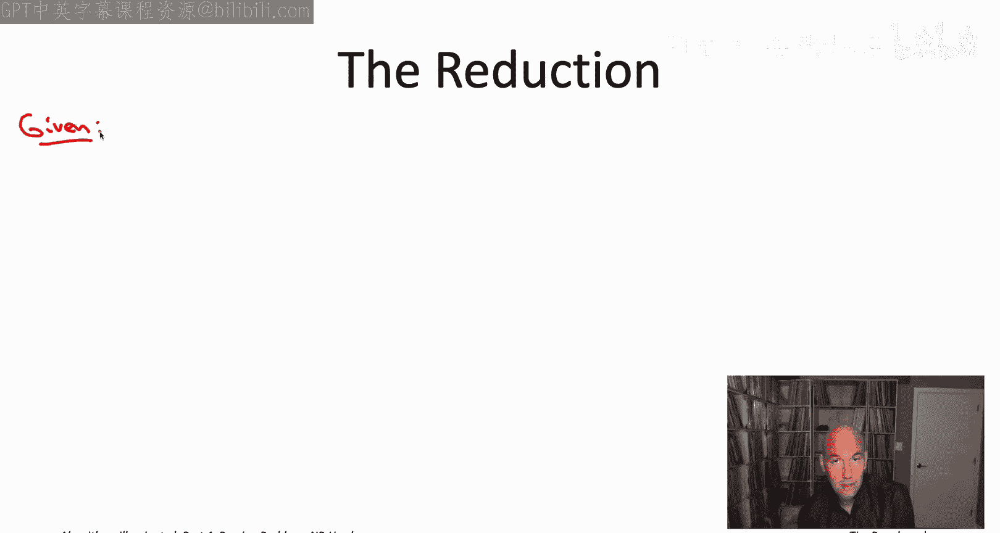

We're going to modify this graph in two ways， both very simple。

 So first we're going to augment it by one additional vertex called that vertex Vs。

 We're going to connect v knot to only the vertices S and T。

That gives us a new undirected graph with one more vertex and two more edges than before。 Now。

 we want to invoke this assumed December 1 June for the traveling salesman problem。

 which is expecting， first of all， it's expecting a complete graph。 And second of all。

 it's expecting all of the edges to have edge costs。 So we somehow have to turn this graph complete。

 And we also have to say what the edge costs are going to be。Well， not going to be very hard。

 we're just going to fill in all the missing edges， the costs of the original edges。

 so all the edges here in light blue and magenta they're going to have cost zero。

 all of the edges which are missing and that we put in in this step。

 we're going to give them a cost of one。

Now that we have a complete graph G prime and we've committed to an edge cost for each of the edges。

 so a cost of one for the green edges， the ones added in in the last step and a cost of0 for the other edges。

 either edges that were there in the first place in the undirected Hamiltonian path instance or the two extra edges we added incident to V So at that point we actually have something we can feed into our assume subroutine for the TSP So that's exactly what we do and the subroutine is going to hand us back a minimum cost traveling salesman Either it has total cost0 Either it only uses zero cost edges like the magenta and light blue edges in this picture or it uses at least one green edge and it has cost one and that's the clue that we're going to tell us whether or not we started with a graph of the Hamiltonian path or not。

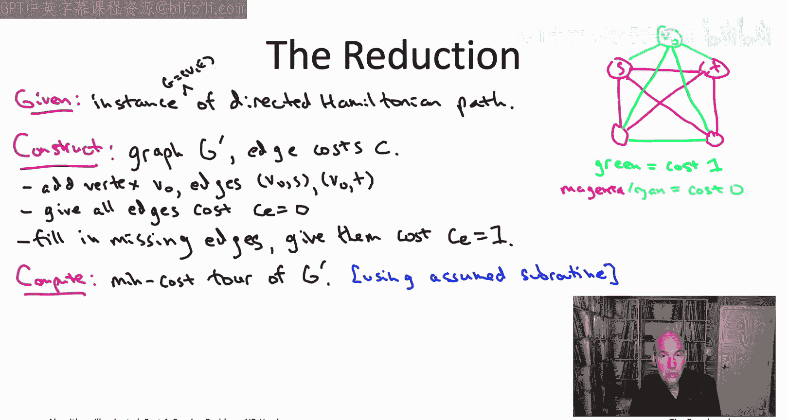

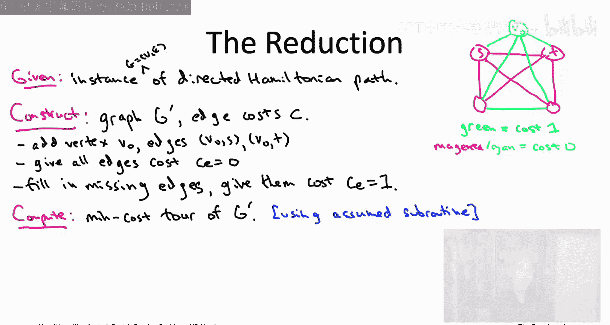

Specifically， if the TSP subroutine hands us back a tour with total cost0。

 how do we extract an ST path from that from the original graph Well when we argue through the proof of correctness on the next slide we'll see that any zero cost tour must include for us with the two light blue edges so the two edges that we added incident to that extra vertex v knot and we're just going to return the path you get if you remove those two light blue edges from the to as we'll see that's going to be a path from S to T that visits every vertex in the original graph that is a Hamiltonian path of the original graph。

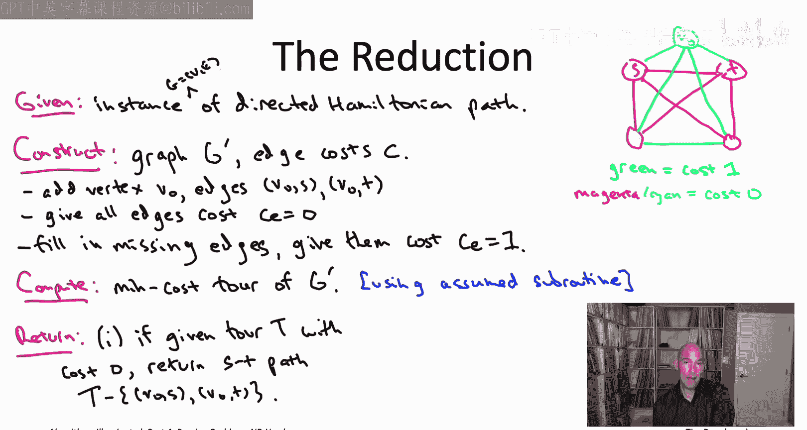

On the other hand， if the tour we get back has cost bigger than zero。

 then we sort of throw up our hands and say， we don't believe there was。

 in fact any Hamiltonian path in G。That's the entire reduction。

 so it just invokes the assumed subroutine to the traveling salesman problem once it invokes it on this graphra G prime and it doesn't do that much work outside of the subroutine call。

 right it has to construct this graph G prime， but at worst that's going to take a quadratic and n time where n is the number of vertices。

In other words， this certainly qualifies as a reduction。

 Only one indication of the subbertine and a polynomial amount of additional work。

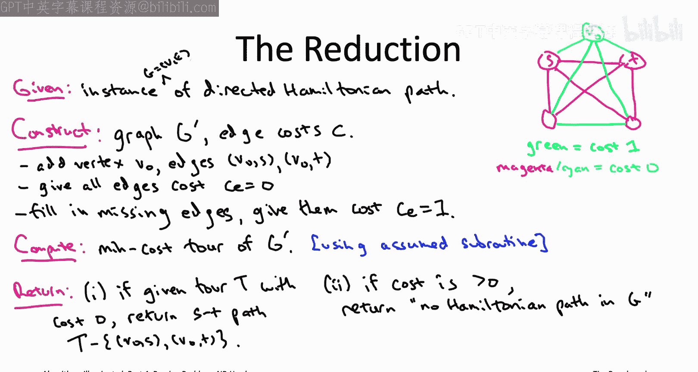

Moving on to correctness， so let me draw the picture that you should have in mind。

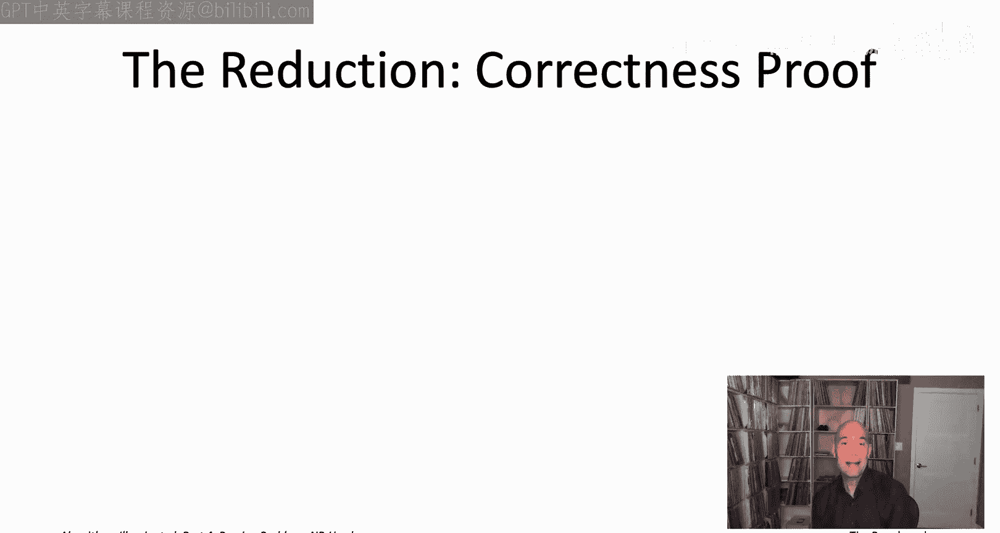

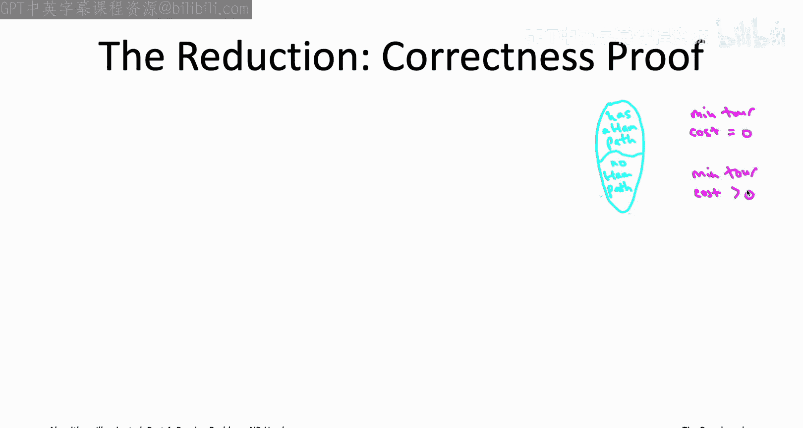

Don't forget the direction of the reduction we're reducing undirected Hamiltonian path to the TSP。

 so the TSP that corresponds to our magenta box that we're going to assume we have access to that's the problem we're trying to prove is NP hard。

 meanwhile we're trying to build a light blue box， something that will solve the undirected Hamiltonian path problem that's our known NP hard problem。

So the arrows in the reduction go from undirected Hamiltonian path to the TSP and for the purposes of correctness。

 what we're hoping is happening is that again， the reduction has no idea whether it's given a graph of the Hamiltonian path or not。

 but we're hoping that whatever the status of the initial graph was that continues to be reflected this time in the optimal tour cost of the TSP instance G prime that we construct specifically if we do have a Hamiltonian path。

 we want that to be reflected with the existence of a zeroco tour and if we start with a graph that does not have a Hamiltonian path。

 we want that to be reflected in a TP instance where every tourr has cost strictly bigger than zero so those are the two things we want to show。

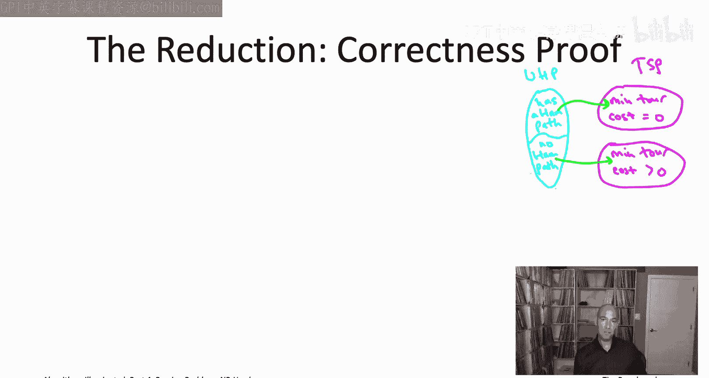

Let's make some observations about our reduction。 So what if if there is a zero cost tour。

 what must it look like， Well observe that V， the extra vertex that we added。

 it was incident to only two edges of the original graph G， the vertices S and T。

 There was no edge between V and any vertex of G other than S and T。

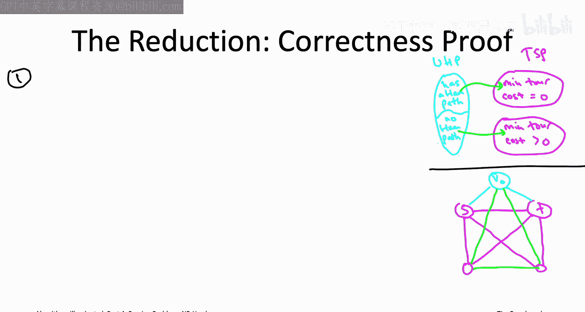

So what that means is any traveling salesman has to visit a VN and there's only two edges incident to V knot that have cost zero。

 the ones that have the other endpoints S and T So for example。

 I've redrawn the instance that we had on the previous slide and as you can see VNot it has the cion edges to S and T those have cost zero but the other edges are green。

 those have cost1 So the only way to visit VO while incurring only zero costs is to use those two cion edges to go via S and T。

So that means given such a tour， a zero cost Tora， we can think about removing these two edges that we know it Ha the edges incident to v and connecting it to S and T。

 So if we remove those two edges， what do we have left。

 So now we have a path that visits all of the vertices other than V knot。

 So all of the vertices of the original graph capital G with endpoint S and T。Now。

 if the tor had zero costs， then all the edges in this ST path have to have zero cost。 But remember。

 the only edges that have zero cost are the ones that were present in the original graph capital G。

 So that corresponds to the magenta edges in this picture。

 all of the edges that were missing from the original graph G corresponding here to the green edges those have cost one。

 So if this St path you get after removing the two edges from the tour， if it has zero cost。

 it must be using only the magenta edges and none of the green edges。

 but all of those magenta edges were in the original graph capital G。

 so this must be necessarily Hamiltonian path in the original graph capital G。So what does this mean。

 this means that if the TSP subroutine happens to hand us To with total cause0 we're done。

 we just know immediately how to extract from in a Hamiltonian path of the input graph capital G so now again for the correctness proof we need two cases。

 one where we start with a graph that did have a Hamiltonian path and then another case where it doesn't have a Hamiltonian path。

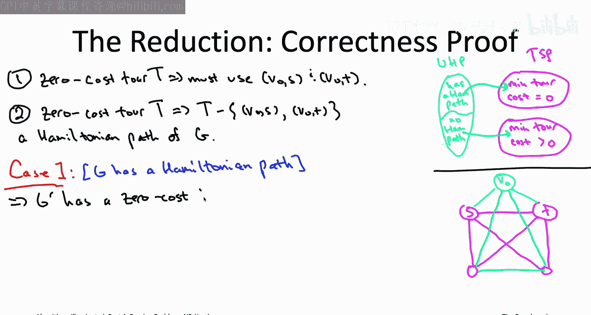

Let's start with a case where G does， in fact have a Hamiltonian path。

 The claim is that then the TSP instance G prime that we construct。

 it does indeed have a zero cost tour。 Naly， you just take the Hamiltonian path and you add to it。

 these two cion edges。 so you connect S and T both to Vs。

 you started with a Hamiltonian path and now you made it into a tour and you only used zero cost edges of G prime。

 you only used original edges of the graph， a magenta edges plus the two cion edges。

 all of which have cost zero。 So that's great。 So if G is aian path。

 know G prime is going to have a zero cost tour， we were given this perfect subroutine for computing the minimum cost tour。

 So it'll hand us a zero cost tour and as we saw given a zero cost tour， we know what to do。

 we know how to extract a Hamiltonian path。 So in the case1。

 the reduction will do the right thing If there's a Hamiltonian path to be found。

 the reduction will in fact return such a path。

The other case is even easier。 So suppose the original instance G has no Hamiltonian path。

 Well then we certainly know the TSP instance G prime that we're constructing is not going to have a zero cost tour because from any zero cost tour。

 we can extract a Hamiltonian path。 But if no such path exists。

 then the zero cost tour can exist either So we get a TSP instance G prime。

 the minimum tor cost is bigger than zero when we invoke our assumed subroutine for TSP we' learn that the minimum tour cost is bigger than zero。

 and then the reduction does the right thing it looks at this sort of expensive tour。

 and it concludes correctly that the graph was given capital G has no Hamiltonian path。

 So either way， either case doesn't matter the reduction works in both cases So that completes the reduction from the undirected Hamiltonian path problem to the TSP because the former is NP hard So is the latter。

 So traveling salesman problem。 Indeed you now know completely why that is NPhar Com up next。

 we have one more。

For example， we want to show that problems involving only numbers can also be and be hard。

 such as the NApsack problem that's coming up next， see you then。

