# 斯坦福大学《算法启蒙（第4册）：NP难｜Part 4 Algorithms for NP-Hard Problems》中英字幕（deepseek-R1） p31 -31-22.7_ Subset Sum Is NP-Hard).zh_en -BV1FAVUzXEum_p31-

Hi everyone and welcome to this video that accompanies section 22。

7 of the book algorithmrithms illuminated Part4。 My guess is you're probably getting pretty sick of these MP hardness proofs at this point。

 totally understandable。 So good news this is the fourth and final one that we will look at will again be a reduction from3s。

 This time it will not be to a graph problem It will be to a problem that involves only numbers known as the subset some problem and subset some problem is actually a special case of two familiar friends。

 problems weve looked at in the past， both NApssac and makespan minimization。

 So in one fell swoop we will be proving both of those problems NP hard as well。 Let's get started。

So the subset some problem， a problem we haven't actually talked about at any previous point in these video playlists or in this book series。

 let me tell you about it， it's very， very simple。The input is nothing more than a bunch of numbers so we're going to have n numbers that we're going to call A1 up to AN。

 and then we're also going to have a final number capital T， which will serve as a target。

 All of these n plus1 numbers are assumed to be positive integers。

The goal then is just to identify a subset of the AIs whose sum is exactly capital T。

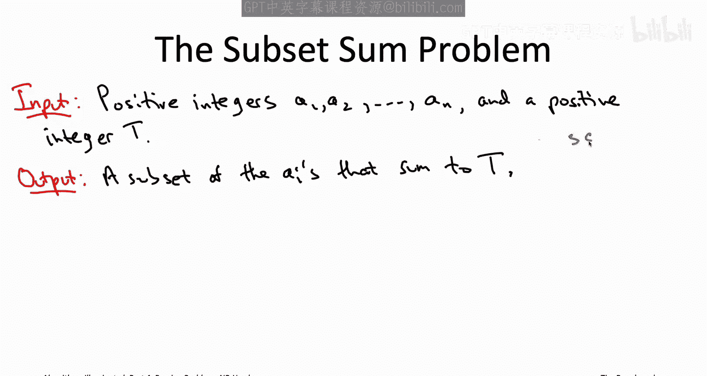

So believe it or not this super simple problem where the input is just a bunch of numbers。

 this is actually an NP hard problem The way we're going to show that is we're going to reduce the independent set problem。

 which we approved NP hard a few videos ago， reduce the independent set problem to the subset sum problem thereby showing that subset sum is also NP hard。

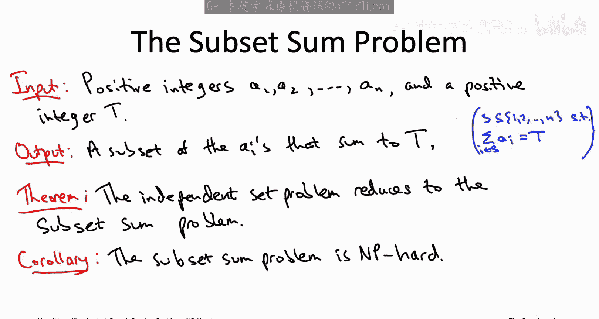

What is the plan notice we're back to needing a plan。

 this is a reduction between two problems that seem to have nothing to do with each other。

 the independent set problem a problem about graphs and the subset some problem。

 which is a problem just about numbers。In other words。

 if someone handed you an efficient subroutine solving the subset some problem on a silver platter that would be like the magenta box。

 how do you build the light blue box， how would you efficiently solve the independent set problem So just for this slide rather than worrying about the optimization version of the independent set problem where you have to find a maximum size independent set for this slide only let's just worry about the feasibility version of the independent set problem where I give you a graph and I give you a target independent set size K like 173 and your job is just to figure out whether or not there's an independent set that has size at least 173 that's all I'm going to ask from you on this slide。

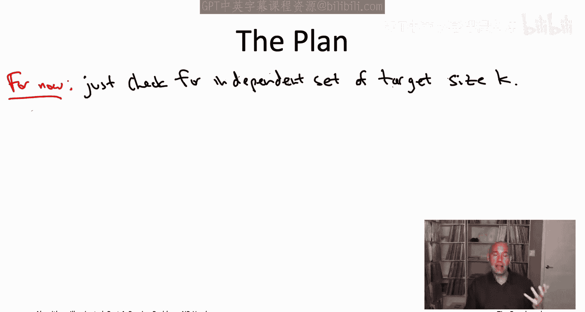

So now the question is given a graph and given a target K like 173。

 how can we metamorphose that into a bunch of integers so that there's a subset sum of a given target in the instance that we construct if and only if we started with a graph that does have an independent set of size at least k。

One thing to be on the lookout for is that whatever encoding we use of a graph of an independence at instance in terms of numbers。

 we better be using really big numbers like magnitude exponential in the size of the graph that we started with。

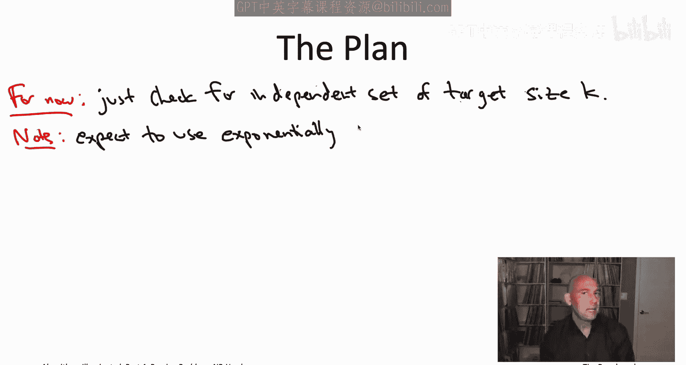

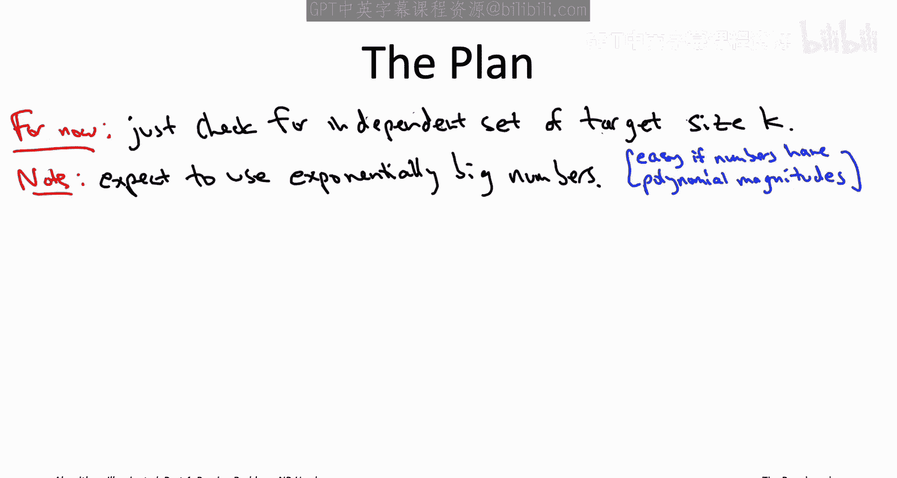

The reason for that is that if the numbers aren't big。

 then not just subset some but even the more general Napsack problem is not a hard problem it iss a polynomial time solvable problem right we saw that when we discussed the dynamic programming algorithm for the NApsack problem。

 we saw an algorithm that runs in time big O of little N times capital C。

 where little N is the number of items in the input and capital C is the magnitude of the NApsack capacity。

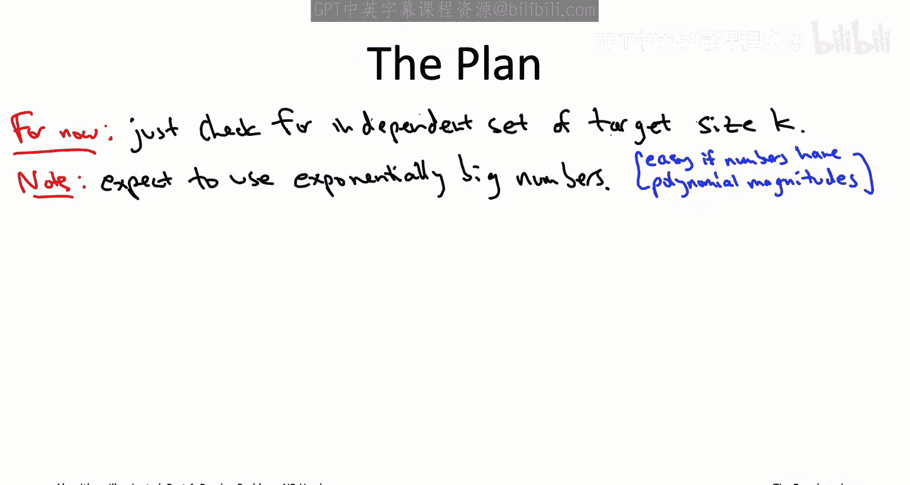

That algorithm shows that the NApsack problem and therefore subset sum is easy when the numbers are small。

 so the only hope of generating a hard instance of NApsack or even more strongly subset sum is to use numbers that are exponentially big those are going to be instances where our dynamic programming algorithms are no better than exhaustive search。

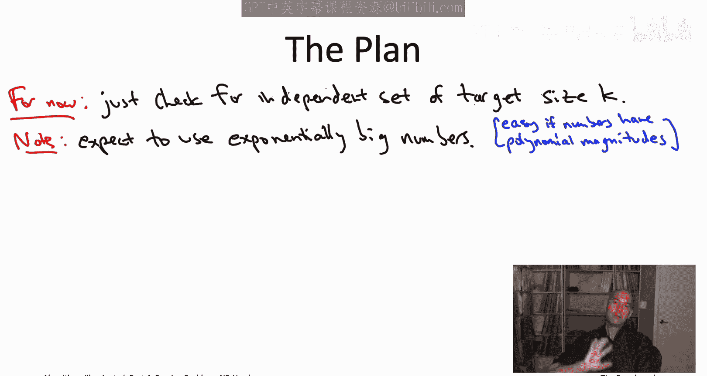

Let me draw the usual kind of summary cartoon on the right part of the slide so our known NP hard problem here is the independent set problem so that's the light blue box that we're trying to build and then the target problem the one we're trying to show NP hard is subset sum so that would correspond to the magenta box a reduction goes from the known NP hard problem independent set to subset sum and what we're hoping is that instances so graphs that have an independent set of at least a given size K they're going to map to subset some instances that do have a subset who's sum to a target capital T whereas if we started with a graph that does not have that big an independent set we'll get a subset some instance that does not have a subset sum of the appropriate target that's what we're shooting for。

Our initial attempt at the reduction， we're just going to use a one number and a subset some instance to encode each of the vertices of the graph。

 and the key idea is to use the lower order digits of the numbers that we construct to encode which edges are incident to the vertex。

So to see how this might work， let's look at a simple example， let's look at a four cycle。

There are four vertices， in this initial attempt we're going to be using four numbers。

 one for each vertex， let's use A1A2 A3A4 for the vertices V1， V2， V3， V4。

The leading digit of each AI is always going to be equal to one。

 and then there'll be four trailing digits， which encode which of the four edges is incident to that vertex。

So let's give everybody their leading a digit of one。Now a1。

 so we look at vertex v1 and we see that it's incident to the first and fourth edges E1 and E4 so we're going to attack on four digits 1001 so the first one indicates that E1 is incident to V1。

 the next two zeros indicate that edges E2 and E3 are not incident to V1 and then the final one encodes that E4 is in fact incident to V1。

So as a result， we map vertex v1 to the number 11，001。We can repeat the exercise with A2。

 so the second vertex， the first and the second edges are incident to it。

 the third and the fourth ones are not， so here the four trailing digits are going to be 1100。

And as a result， vertex V2 gets mapped to the number 11，000 and 100。Similarly。

 the vertex V3 gets mapped to the number 10，000 and 110。

 and the fourth vertex gets mapped to the number 10，011。Now here's what's cool， check this out。

 so consider independent sets of size two in this graph。There's only two of them。

 there's one that picks the northwest and southeast corners， the first and third vertices。

 and there's another one picks the northeast and southwest corners， V2 and V4。Consider the first one。

 V1 and V3。 Let's look at the sum of the two corresponding numbers， A1 plus A3。What we sum of 11。

001 and 10，000 and 110， what do we get， we get 21，111。What about the other independent set of size 2。

 the V2， along with the V4？Well， if we sum up the corresponding numbers， the A2 and the A4。

 look at that exactly the same sum。21，111。Moreover。

 and I'll leave this for you to check that any other pair of vertices or any other subset of vertices is not going to give you this sum it's going to give you a different sum so for example。

 if you took V1 and V2 which of course is not an independent set， you're going to get 22。

101 so that's a different sum。So that seems pretty promising right the independent sets of size two are exactly correspond to the subsets of numbers with this targets on 21。

111。But let's change the example just a little bit instead of a four cycle。

 let's think about a five cycle。So we can use exactly the same idea so now we have five vertices so we're going to have five numbers and each of those numbers it's again going to have this sort of leading digit of one。

 and then it's going to have five trailing digits， one digit for each of the five edges in the graph and again that digit will be 001 according to whether the edge is not incident or incident to that vertex。

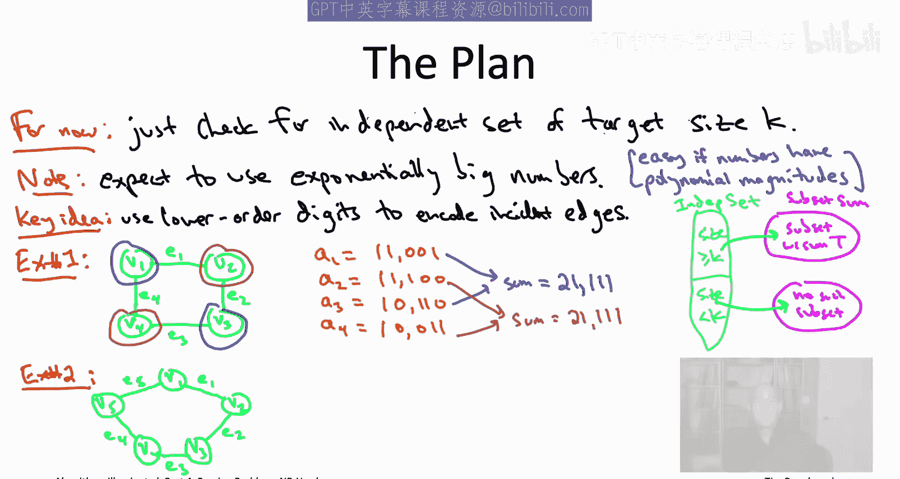

So for example， the first vertex will be mapped to a number a1， 110，001。

 reflecting the fact that the first vertex is incident to the first and fifth edges。

 but is not incident to the second， third and fourth edges， similarly for the other four numbers。

And what's annoying is the different size2 independent sets now actually map to pairs of integers with different sums。

 so for example， suppose look at the independent set V1 and V3。If you add together 110，001 and 101。

100， what do you get， you get 211，101。Now let's try it again with the vertices V2 and V4。Now。

 unfortunately， you don't get quite the same thing， instead of 211，000， 101， you get 211，00 and110。

So what's going on in general so in general a lower order digit of the sum。

 we're seeing a zero whenever it corresponds to an edge with neither endpoint in the independent set。

 right so for example， when we take V1 and V3 E4 is not incident to either E1 or E3 and that's why we're seeing a zero in the fourth of the trailing digits of the blue sum。

 similarly if we look at V2 and V4 now it's the fifth edge E5 that is incident to neither V2 nor V4 and that's why we're seeing the zero in the last leading digit of the brown sum。

On the other hand， for any edge where one of its endpoints is in fact in the independent set。

 that's where you're seeing a one， so for example， in the blue sum， you see ones in the first second。

 third and fifth digits to reflect the fact that those are the four edges that are incident to the two vertices。

 V1 and V3。The final idea in the reduction is to introduce one additional number per edge。

 we already had one number per vertex now we're going to also add one number per edge and the sole purpose of these new numbers are just to correct any digits that would otherwise be zero in the sum。

So for the five cycle， in addition to A1 through A5 that we already had。

 we're going to have a B1 through B5 corresponding to the five edges in the graph。

So B1 corresponds to the first edge and its job is to correct a zero if it shows up in the digit corresponding to edge E1。

 so that would be the first of the trailing digits or the second digit overall。

 so to correct for a zero in that first trailing digit B1 should be equal to 10，000。

Similarly on down the road， B2 that's supposed to correct the second trailing digit。

 so that should be 1，000， and then the rest are going to be 110 and1。

Now we can say the target just like we did for the four cycle， the leading digits should be two。

 all the other digits should be1， so in other words the target sum is going to be 211，111。

And we can now see how to make use of these new numbers。

 the BIs to supplement our old blue and brown sums so that we get the desired target， so for example。

 in addition to A1 and A3， we can supplement that with B4 reflecting the fact that E E4 is not covered by either V1 or V3。

Similarly for the independent set corresponding to V2 and V4。

 so there it's E E5 that is left out in the cold， and so to correct that we use the fifth of the BIs。

And in general to achieve a target sum of 211，111， what do you need to do。

 you need to pick two vertices because you need a two in the leading digit。

 and then you need the rest to be equal to ones， so you need it to be an independent set because if you didn't have an independent set。

 you'd be picking two endpoints of the same edge and you would see a two in the corresponding column on the other hand if you do have an independent set of two vertices you can always complete that with corresponding BI values to get this target sum just by adding in a BI value for any digit where you would otherwise have a zero。

So that's the idea of the reduction and that's what's going to work in general。

 one number per vertex， one number per edge， leading digit is always one for the vertices。

 the rest of the digits encode the incident edges， and then the numbers corresponding to the edges are just meant to correct for any digits that otherwise would be zero。

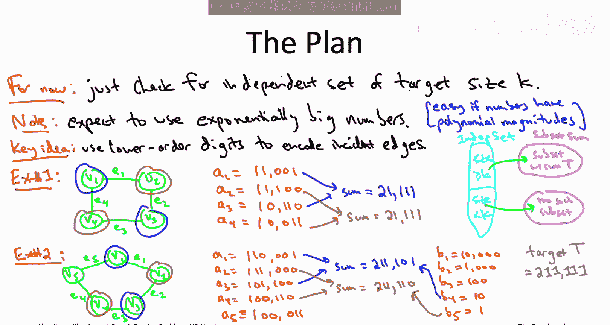

So just to spell it all out so again this is the reduction we're responsible for building that light blue box。

 that light blue box should solve the independent set problem given an efficient subroutine for the subset sum problem。

 given a magenta box for subset sum so consider some instance we might see it's just going to be some undirected graph capital G let's label the vertices V1 up to VN and the edges E1 up to EM。

Also a little notation， let a sub i denote the edges or really the indices of the edges that are incidents to the vertex of VI。

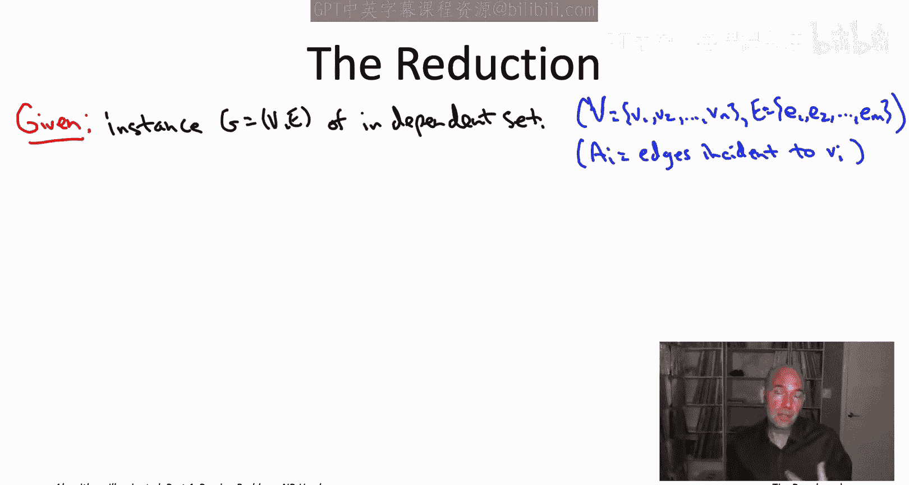

So the first thing the reduction does is it constructs numbers just like we did before。

 so there's going to be AIs one per vertex， and there's going to be Bs one per edge。

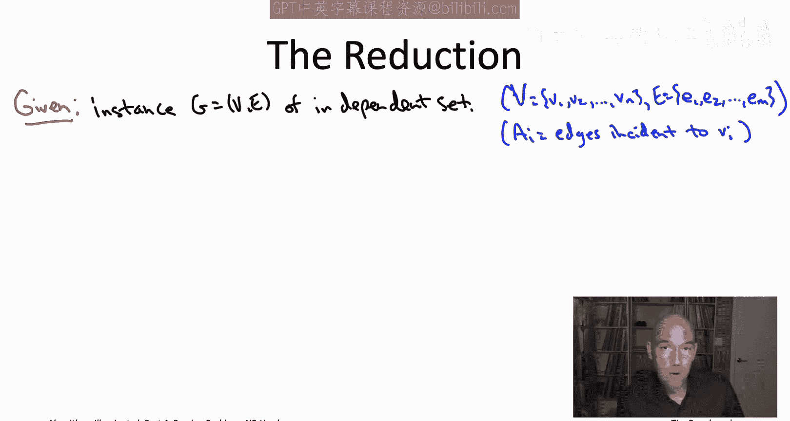

So the formal definition of a sub I， the number that corresponds to vertex v sub I。

 well we're going to have a 10 raised to the M this corresponds to that leading digit of1 that we always had。

Plus we're going to have a one in any digit corresponding to an incident edge。

 so we're going to sum over the edges incident to vertex VI and if EJ is incident to VI。

 then in the J of the trailing digits we want to see a1 so that's going to correspond to 10 raised to the M minus J power but again。

 this is just saying in math， exactly what we were doing on the last slide leading dig1 plus then zeros and ones according to which edges are incident to that vertex。

And then for each edge Ej， as mentioned， we're going to have a number that corrects for zero that would otherwise appear in the J trailing digit。

 so BJ is just going to be equal to 10 to the M minus J。

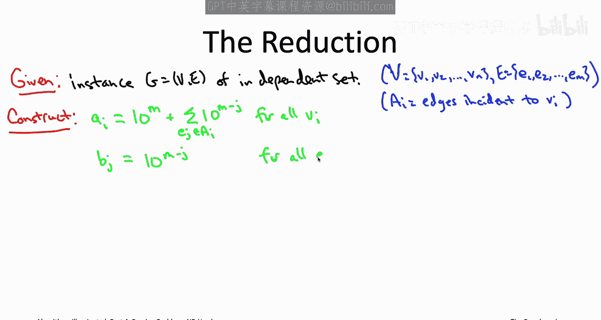

So those are the numbers we're going to be using corresponding to the vertices and corresponding to the edges。

 so all we need now is our target sum capital T at that point we have all the ingredients to feed into our subset sum subroutine and see what it says。

 so we're actually not just going to use one target sum capital T we're going to search through a bunch of them starting from very big target sums and then looking at smaller and smaller ones and the first point at which we succeed that's going to tell us exactly how big the maximum size of the independent set is of the graph capital G。

So we're gonna to have a loop indexed by K and you should think of k as the size of an independent set that we're looking for right now so if we have a graph with 10。

000 vertices， we'll start very ambitious and we'll say K to be 10。

000 is there an independent set that includes every single vertex and then if we find out the answer is no we're going decrease our ambition and say well what about one that's 9999 is there an independent set of that size the answer is no we'll move on to the next iteration and so on and if at some point all of a sudden for the first time for an iteration where K is equal to 333723 we do find an independent set of that size we know that's got to be max if you wanted to I'm using linear search over K here for simplicity if you wanted to be fancy you could use binary search as well let's stick with linear search just to keep it simple。

So for a given size of independent sets k that we're looking for at that point we know exactly how we want to set the target sum so basically in the trailing digits。

 we want to see ones everywhere just like in the example and then in the leading digits we just want to see the size of the independent set that we're looking for so in our examples we were looking at independent sets of size two and so that's why we had a two always in the leading digit of our target sums。

Having specified the target， we can now invoke or assume the subroutine for the subset some problem。

 we just ask it， hey， could you return to us a subset of the AIs and the BJs that has total sum equal to this capital T and the subroutine either will hand us such a subset or it'll correctly tell us that no such subset exists。

The subout reports that no subset subset with that sum exists。

 then we just sort of move on to the next iteration into the for loop。

 we try again with decreased ambitions， lower target size for an independent set。

 if it does return a subset of the AIs in the BJs， well then we're just going to return the vertices that correspond to the AIs in the sum so if the sum has like a1 A3 and A5 along with some B's like B7 and B9。

 whatever， we're going to return the vertices V1 V3 and V5 and that will be our final answer which as we'll see in the proof of correctness in the next slide will in fact be a maximum maximum independent set of the input graph capital G。

This definitely qualifies as a reduction in the sense we've been using the term。

 it does invoke the assumed subroutine for subset sum multiple times and times it a polynomial number of indications that's allowed and outside of the subroutine calls it as a polynomial amount of work so if this is correct。

 this would indeed be a reduction from independent set to the subset sum problem。

 Let's now see why it is in fact， correct。

Let's start with a few basic properties of the reduction。

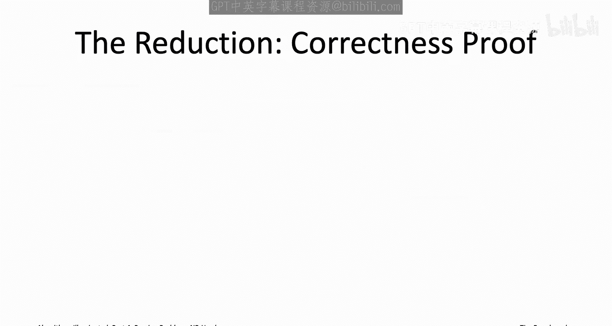

Think about any subset of the numbers that we just constructed any subset any number of the AIs。

 any number of the BJs let's say there's SAIs and then I don't care how many BJs there are。

 so maybe 17 AIs and 23 BJs in a subset What is that sum going to look like Well it's definitely going to have as its leading digits it's going to have S the number of AIs because those are the only ones that have a one in the leading digits So in our example the sum is going to start with a1 and a7 because there's 17 of the AIs then we're going to have these M trailing digits。

 one for each of the edges and each of those trailing digits is going to be either0。

12 or three and the reason is that there's only three different numbers that we've constructed that could possibly contribute to one of the trailing digits。

So for example， you know consider the like 40th trailing digit which numbers could possibly contribute to it well it's B sub40 right that's the number that's basically a one only in the 40th trailing digit and then zeros otherwise that can contribute one and then the two endpoints of E E40 they also have a one in the 40th trailing digit。

 but that is it， those are the only three numbers that can contribute to the 40th trailing digit。

So you sum up all these numbers， you're going to get however many AIs you have in the leading digits。

 and then you're going to get a bunch of zeros， ones， and twos， and threes in the M trailing digits。

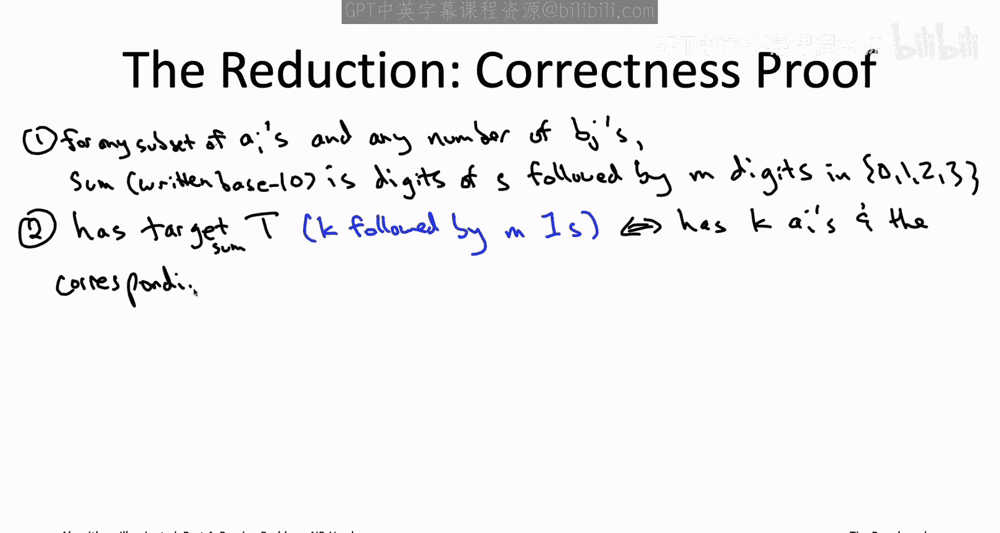

So what this tells us is that there's only a very limited number of ways that the subset of these numbers could possibly have the targets on capital T remember what capital T is。

 the leading digits should be equal to K where K is the size of the independent set that we're wondering about and then all of the M trailing digits should be equal to1。

So how is it that the leading digits could possibly be equal to K Well， from the first observation。

 we see the only way that could happen is if the subset included K of the AIs。

 which would then correspond to K vertices of the original graph G。 Moreover。

 if all of the trailing digits are at most one， it must be that those K vertices form an independent sets of the graph G that we were given。

 because if two of those vertices had the same endpoints。

 so like if the set included both endpoints of the 40th edge。

 then the 40th trailing digit would not be one， it would be two or more。

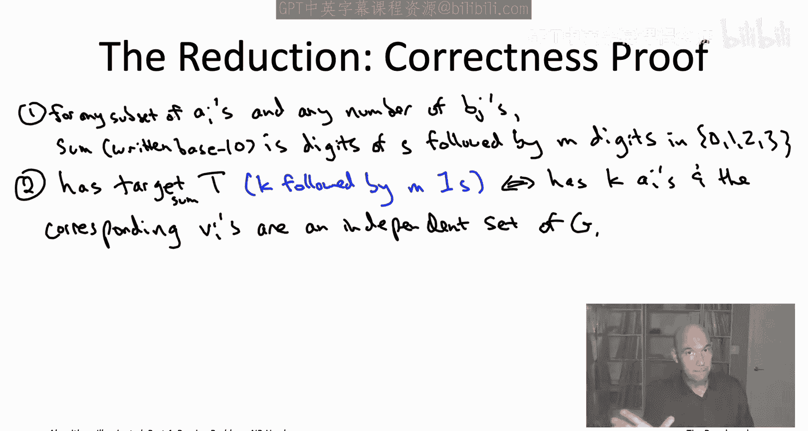

So now for each iteration of the reductions so for each target independent set size K and corresponding target capital T。

 we're again going to have two cases saying the reduction does the right thing in either case so first of all。

 if the graph did not have an independent set that was that big of size K。

 there should not be a subset sum of the target sum capital T on the other hand。

 the first time K reaches a number where there is an independent set in G of that size。

 then in fact we should extract that from a corresponding subset sum。So for the first case。

 consider an iteration where actually K is really big so there is no independent set of size K in the input graph capital G The claim is then in the subset sum instance that we construct there will be no subset with the target sum and of course the subroutine will then correctly tell us that fact and we'll move on to the next iteration as we have to so why is that the case。

 well if there was a subset with the targets on capital T from these couple observations we know we could extract from its k vertices that form an independent set of G but that doesn't exist in this first case so that subset can't exist so we're never going to be tricked into thinking that there's an independent set when there isn't if there isn't an independent set there won't be a subset sum and the subroutine will clue us into that fact。

Now at some point， k will get small enough that the input graph G really will have a size K independent set。

 so what happens then？Well， the reduction will construct this instance of subset sum and the claim is that that instance will indeed have a subset with the target sum capital t and in fact you can read off such a subset from any size K independent set of the graph G namely given the K vertices of G that are an independent set you just include in the subset the corresponding AIs that make sure the leading digits are equal to K and because it's an independent set all of the trailing digits will be equal to either zero or1 depending on how many endpoints of an edge are included in that independent sets and then just whatever digits have the zero。

 you throw in the corresponding BJs to correct it and bump it up to1 so if there's a size K independent sets then there will in fact be a subset that has the target sum capital T with our subset sum subroutine it will return to us some subset of that form and as we saw from our basic observations once we're given a subset with the target sum we can extract from it a size K。

Independence set。 So in the very first iteration where a size K independent set exists in G。

 this reduction will indeed find it and return it。 So that completes the correct the correctness of this reduction。

 Given an efficient subtine from subset sum， you really can solve the independent set problem because independent set problem is NP hard subset sum is MP hard as well。

 And as we've seen， subset sum， it's a special case of both knapssack and make band minimization。

 So now we know those two problems are MP hard as well。

That's the last of the NP hardness reductions that I wanted to torture you with so you can breathe a sigh of relief about that having seen this parade at NP hardness reductions。

 you know I hope a few things have happened。 So one。

 you I hope it's sort of closed some loose ends that we had earlier on in this video playlist I was throwing you all these different problems just sort of promising you that they are NP hard promising you that we needed to resort to something like a heuristic algorithm or something like you know an exponential time algorithm better than exhaustive search now we know that that is in fact true now we know that all those problems are indeed NP hard and do require the kinds of compromises that we were looking at secondly。

 now you know a whole bunch of NP hard problems So if you want to prove a new problem is NP hard in your own work using that twostep recipe you have a lot of options for what you can pick for the known NP hard problem which we were calling capital A and again you can look in a book like Gary and Johnson to find many more examples of NP hard problems and finally you know while。

You knowThese reductions may have been kind of messy and pretty problem specific and you probably won't remember any of the details you know even a week from now you know you watch this video right it wasn't that bad I mean we did sort of you know slog through it and you know so if you really were sort of locked in a room and no one was willing to let you out until you proved that some problem is NP hard having seen all these I hope you feel like you know what if I really had to do it I could I hope you now feel like you have those skills that your level of expertise with NP hardness is up to level3 you now can recognize NP hard problems in the wild。

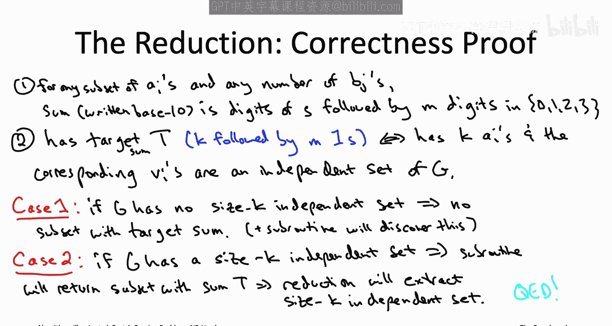

So from here there's sort of a fork on the road there's two different directions you can go。

 So in the next chapter chapterpt 23， that's an optional chapter。

 it's more mathematical than the rest of the playlist and that's for those of you that want to bring your level of expertise with NP hardness all the way up to level4 where you could really just sort of go to a whiteboard and explain what the P versus NP question is to one of your colleagues So for those of you that are interested in that the mathematical underpinnings of NP hardness and the P versus NP conjecture。

 definitely check out the next set of videos corresponding to chapter 23 If that sounds like too much are just sort of not how you're interested in spending your time I really encourage you to jump to chapter 24 which is going to have a detailed case study of how almost all of this algorithmic toolbox that we've been studying was put to use in a super high stake application major a called the FCC incentive a that was run just a few years ago and that involved tens of billions of dollars So even if you't if you want to skip。

Math， I hope you don't skip chapter four and that final case study。In any case。

 whichever route you choose to go， I look forward to seeing you in the next video。

