# 斯坦福大学《算法启蒙（第4册）：NP难｜Part 4 Algorithms for NP-Hard Problems》中英字幕（deepseek-R1） p32 -32-23.1_ Amassing Evidence of Intractability).zh_en -BV1FAVUzXEum_p32-

Hi everyone and welcome to this video that accompanies Section 23。

1 of the book Alrithms illuminated Part4。 This is first section of chapterer 23。

 a chapter about P NPP and all that。So in the videos we've had in this playlist up to this point。

 corresponding to chapters 19 to 22， those actually have covered pretty much everything you really need to know about NP hardness。

 if you're just sort of a pure algorithm designer So you've learned first of all。

 what is NP hardness mean whatever its algorithmic implications someone tells you that a problem is NP hard。

 Secondly， you've now learned this rich toolbox of algorithmic techniques you can throw at NP hard problems that come up in your own projects or that are handed to you by your boss。

 And then third， if you're the boss if you're actually in charge of the project。

 you've learned how to you've learned how to spot NP hard problems when they show up in the wild。

 you've learned how to prove problems NP hard using that twostep recipe。

 Now throughout those videos we didn't really need a completely rigorous definition of NP hardness So I didn't give you one we had a provisional definition of an NP hard problem as one for which a polynomial time algorithm would refute this peanut equal to NP conjecture we discussed informally what the peanut equal to NP conjecture was basically that checking someone's work。

Can be fundamentally easier than coming up with your own solution from scratch but again we never really gave you the precise mathematical definitions so the point of this optional part of the playlist is to fill in those missing foundations。

These optional videos corresponding to Chaer 23， there in effect an introduction to a deep and beautiful field known as computational complexity theory。

 a field that studies the amount of resources， like say the amount of time or the amount of memory or the amount of randomness that's necessary to carry out various computational tasks as a function of the input size。

Throughout our discussions of computational complexity theory。

 we will maintain a ruthless focus on the algorithmic implications of that theory。

 and because of that particular viewpoint， it's going to be a treatment of the topic that might be a little bit different than what you find in a typical complexity theory book。

 or frankly， even in a typical algorithms textbook。

For those of you looking for a more traditional and or deeper introduction to computational complexity theory on YouTube。

 I highly recommend the videos by Ryan O'donnell， who's a professor at Carnegie Mellon University。

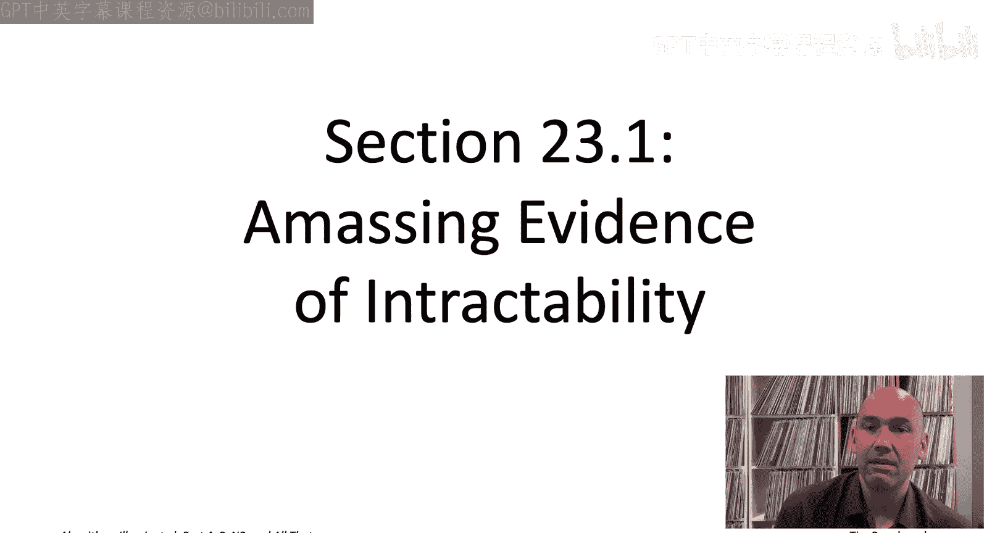

Let's get started by outlining our plan to amass evidence of computational intractability of a problem by reducing lots of other problems to it。

Consider a problem like the traveling salesman problem。

 which is long thought to be computationally intractable As we mentioned in the opening video sequence。

 Jack Edmonds already back in 1967 before the concept of NP hardness was formalized。

 already back in 67， Edmonds was conjecturing that there's no polynomial time algorithm for the TSP。

 not even with running time end the 100 when you have N vertices。

 not even with running time Biggo of end of the 10，000。

To this day we do not know whether this is the case。

 we do not know whether there exists a polynomial time algorithm for the traveling salesman problem。

 but if we wanted to adopt as a working hypothesis that there isn't。

 how might we amass evidence for that hypothesis？The fact that so many brilliant minds have tried and failed to solve the traveling salesman problem over the last 70 years。

 you know， that is circumstantial evidence that the problem may well be impossible to solve efficiently。

 But can we do better， Can we somehow amass stronger evidence than that。

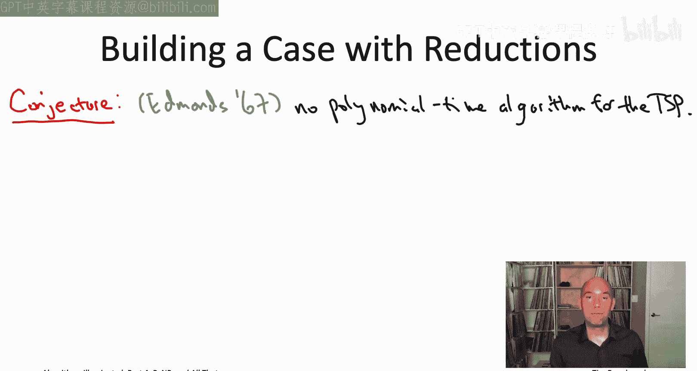

The key idea is to show that a polynomial time algorithm for the traveling salesman problem would not just solve the one unsolved problem。

 not just solve the TSP， but any such solution would automatically solve thousands of unsolved problems。

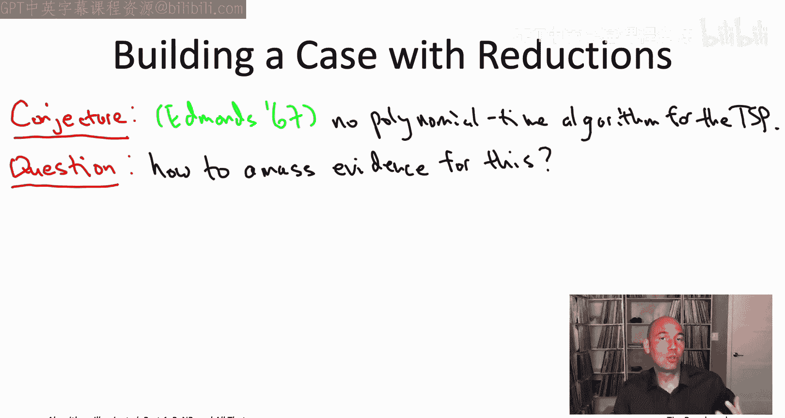

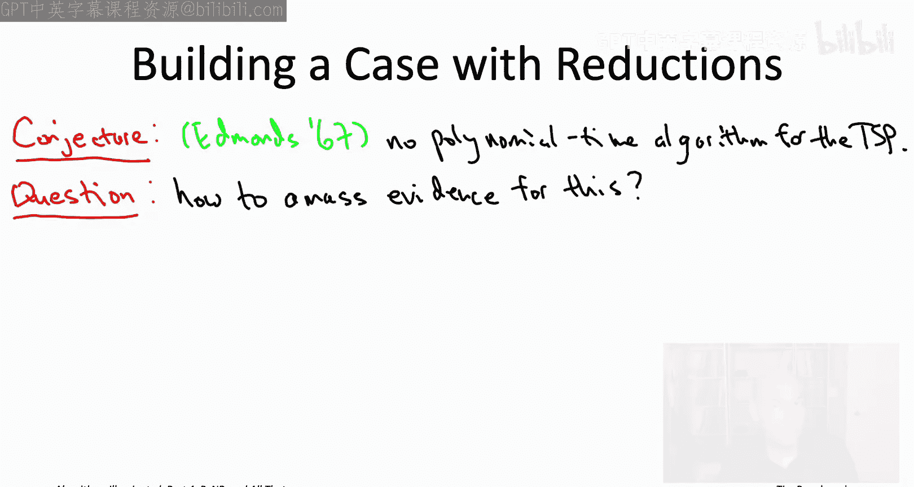

In other words， we can build evidence for the intractability of the TSP in two steps。

 so first of all we identify a massive collection of computational problems let's call that collection of problems script C and then in step two we show that every single problem in that big set script C reduces to the traveling salesman problem so a polynomial time algorithm for the traveling salesman problem would then automatically translate to one for each of those problems in that massive set Sc C。

We've been saying and will continue to say that a problem A reduces to a problem B。

 if you can solve problem A using only a polynomial number of ins to a subroutine for B。

 plus a polynomial amount of additional work outside of the subroutine calls to B。

This is the most appropriate definition of a reduction for our purposes。

 given that we're focused on algorithmic implications。

 these are exactly the sort of reductions that transfer computational tractability from one problem to another。

 And as we've seen， transfers computational intractability in the opposite direction。 Now。

 these kinds of reductions actually have a specific name， a couple specific names。

 We're going to be calling them cook reductions， you also hear them called polynomial time Tring reductions。

And again， cook reduction is just giving a name to something we've been using all along。

 So this is just where when you're reducing a problem A to a problem B。

 you have to show how given a magenta box that solves B。

 you can build a light blue box that solves A。You may well wonder like how else would you define a reduction。

 This kind of seems like the obvious definition for it。

 but there are more restricted forms of reductions。 For example。

 things called leaven reductions and carp reductions。

 We'll see those at the very end of this chapter when we discuss emptycompleteness until then do not worry about these distinctions。

 we're just going to be talking about cook reductions as we have been throughout this entire playlist。

That's our plan for amassing evidence of intractability for the traveling salesman problem to show that lots and lots and lots of computational problems reduced to it。

 and therefore any polynomial time algorithm for the TSP would automatically translate for all of those problems in a ability big set script C or if you want to think about it another way。

 what this would mean is that if even one of the problems in Sc C is intractable。

 cannot be solved by a polynomial time algorithm， well then that's enough to conclude that the TSP cannot be solved by any polynomial time algorithm either。

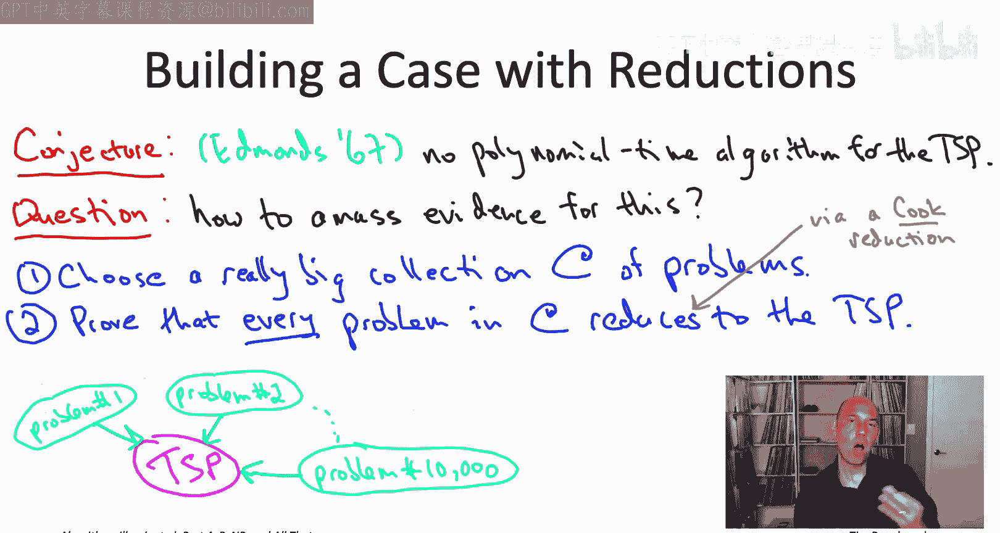

Note that， the bigger the set script C of problems。

 that is the more problems you're able to reduce to the TSP。

 the stronger the case you've built that the TSP is an intractable problem。

 so we would like to carry out this plan with Sc C as big as possible。

How should we choose this set Sc C which problems should we be trying to reduce to the traveling salesman problem Well for starters。

 you know why not reach for the stars and take C as big as we possibly could。

 why not take Sc C to be the set of all computational problems in the world？

That's not what we're going to be doing， we're going to be taking Sc C to be just a subset of all possible computational problems because taking Sc C to be everything that's just too ambitious。

 hard as the traveling salesman problem may be there are computational problems out there in the world that are much。

 much harder than the TSP and can't possibly reduce to it。

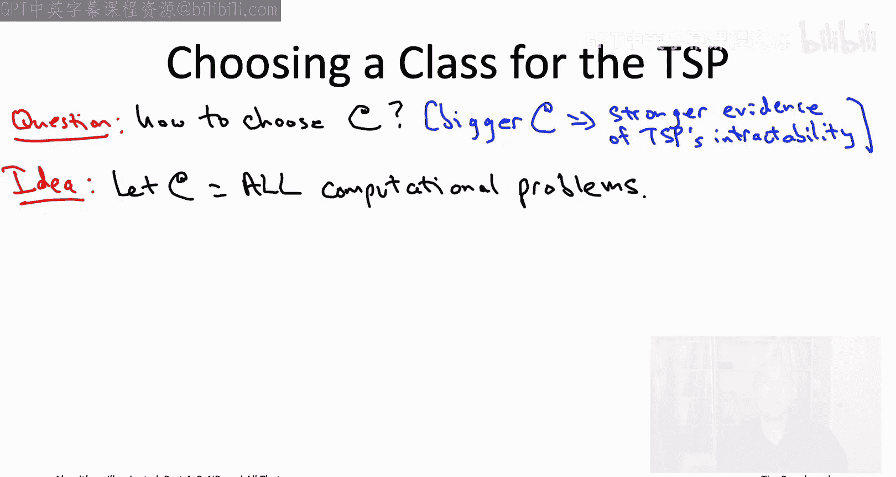

Some problems are even undecidable， which means that they're unsolvable by computer。

 no matter how much time I give you， you can't solve them in an exponential amount of time。

 you can't solve them in a doubly exponential amount of time and so on。

 Maybe the most famous undecidable problem。 Maybe it's one you've heard of is the halting problem。

 Very simple problem to state。 I just hand you a program。 So think like 1 thousand lines of Python。

 And I just want you to answer that yes， no question。 will this program eventually halts。

 or will it get stuck in an infinite loop。 And that's all I want to know。

 The halting problem cannot be solved by computer。The obvious approach is to just simulate the program that you're given through an interpreter。

Only problem being is that， you know， suppose you've simulated for 100 years and it hasn't halted yet。

 How do you know if it's in an infinite loop or if tomorrow is going to be the magical day where it actually halts。

 you might hope that with some algorithmic ingenuity。

 you could shortcut wrote simulation and certainly for special cases of the problem， you can。

 but for the fully general version of the problem， as proved by Alan Tring back in 1936， there is。

 in fact， no finite time algorithm for the halting problem。

Speaking of Alan Tring's 1936 paper， many computer scientists， including myself。

 feel that Tring's paper should really be regarded as the birth of computer science as an intellectual discipline。

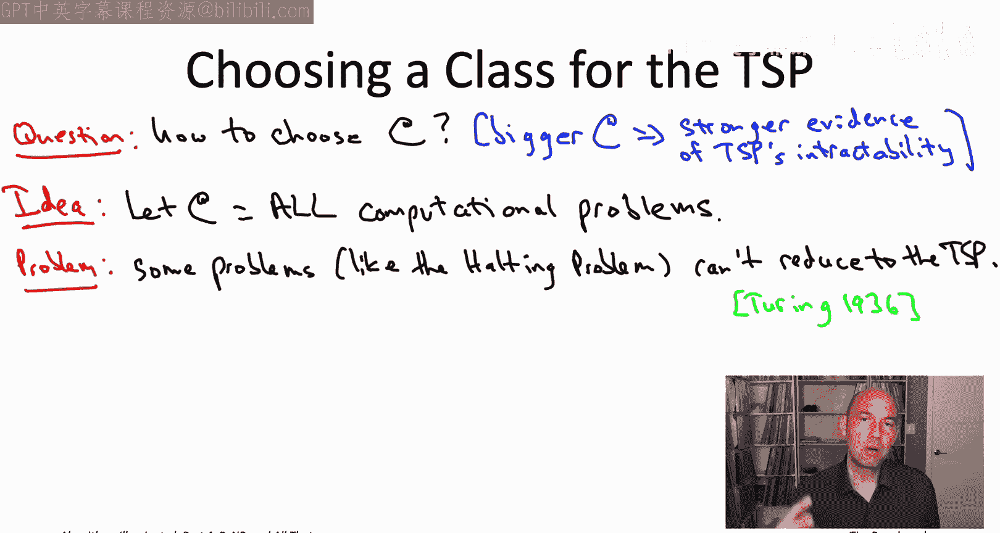

And for this reason， many of us feel that Allan Ting's name should be as widely recognized as say。

 Albert Einstein。

So what made Alan Turinging's 1936 paper so important。 Well， two things。 So， first of all。

 Tring introduced a formal mathematical model of what computers can do。

 It's a model that we now refer to as a Tring machine。 Now， mind you。

 this is a good 10 years before anyone had ever built a general purpose computing device。Second。

 by defining what computers can do， Turing was able to study what they can't do and to prove in a precise sense that computers cannot solve the halting problem。

Thus， from literally day one of computer science as a scientific discipline。

 we have been acutely aware of the limitations of computers and the necessity of compromise when tackling difficult computational problems。

After this digression about the halting problem the traveling salesman problem no longer seems that bad。

 We may not know how to solve it in polynomial amount of time。

 but we certainly know how to solve it in a finite。

 albeit exponential amount of time just using exhaustive search So that means there's no way the halting problem can reduce to the traveling salesman problem because if it did。

 that would give a finite algorithm for the halting problem， which pertring we know does not exist。

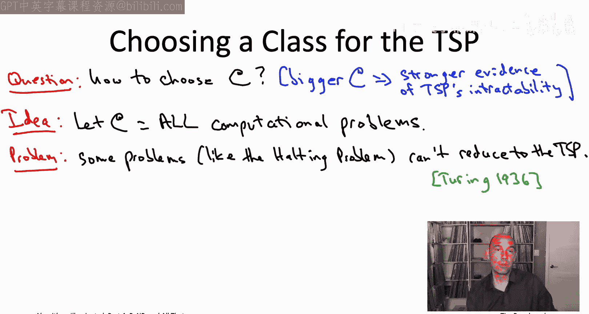

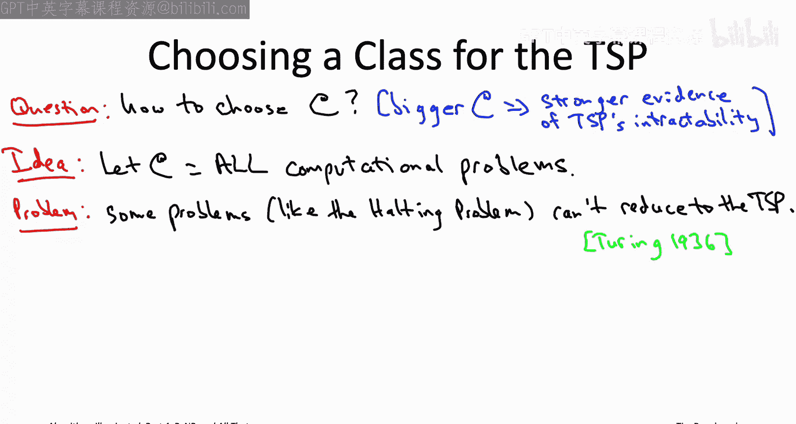

Let's go back to the drawing board we have to figure out which problem Sc C we're going to reduce to the TSP。

 we want to take Sc C to be as big as possible， bigger sets mean stronger evidence of intractability。

 but now we understand that we can't take Sc C to be everything。

 but we still want to take it to be as big as possible。

Well， if what's limiting the traveling salesman problem from capturing computational problems like the halting problem is that the TSP is solvable by naive exhaustive search。

 maybe we can at least take Sc C to be all the problems equally well solvable by naive exhaustive search。

 those are the problems that might plausibly reduce to the traveling salesman problem。

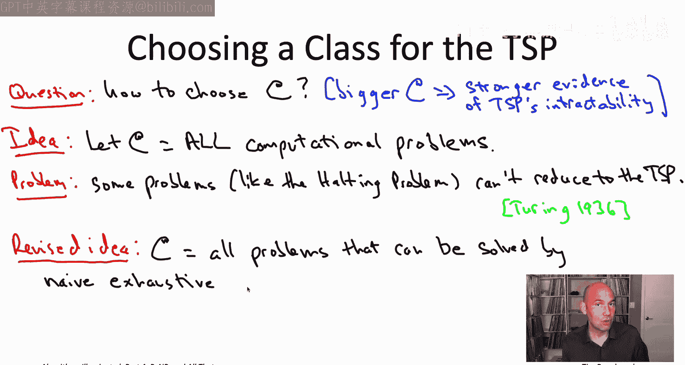

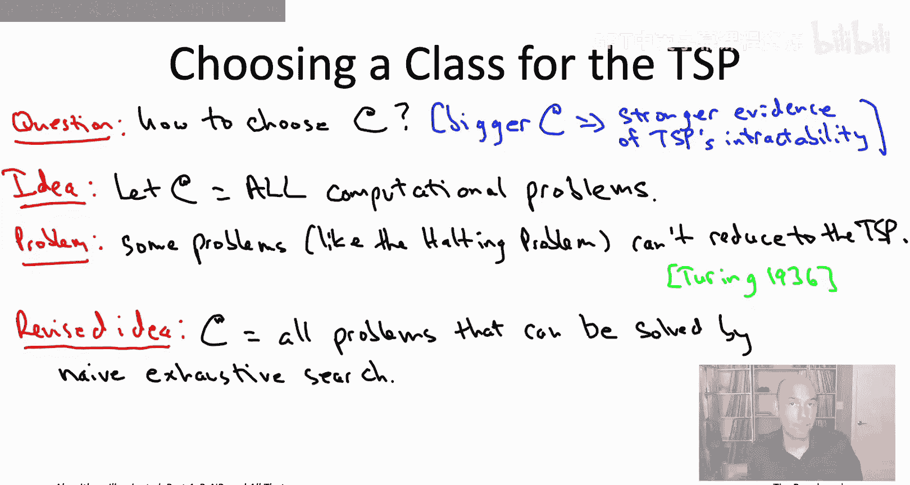

That may all sound， you know， nice and reasonable in English， you know。

 all problems equally well solvable by naive exhaust search。 But what does that actually mean。

 Could we really have a mathematical definition that formalizes that idea。Yes we can。

 and in the next video we'll start laying the groundwork for the formal mathematical definition。

 I'll see you there。

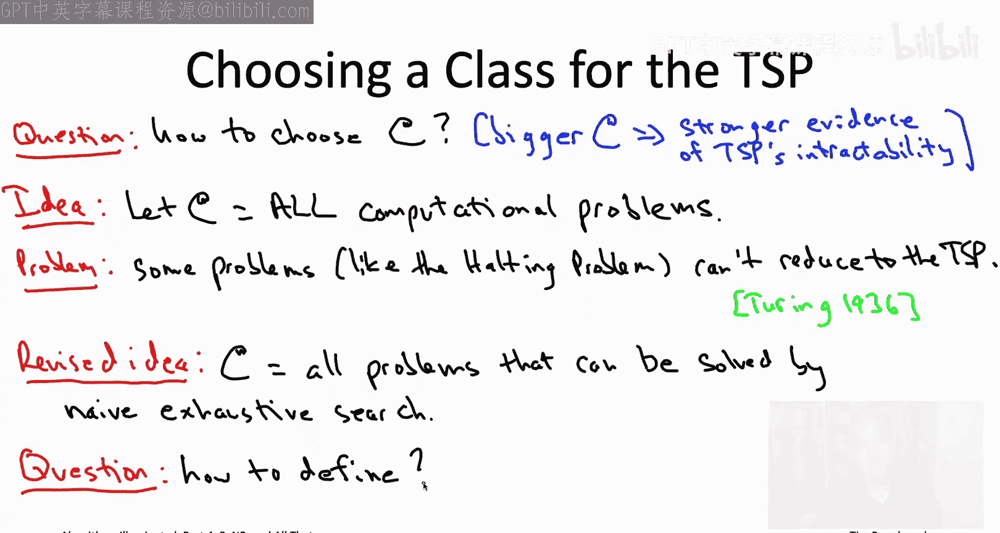