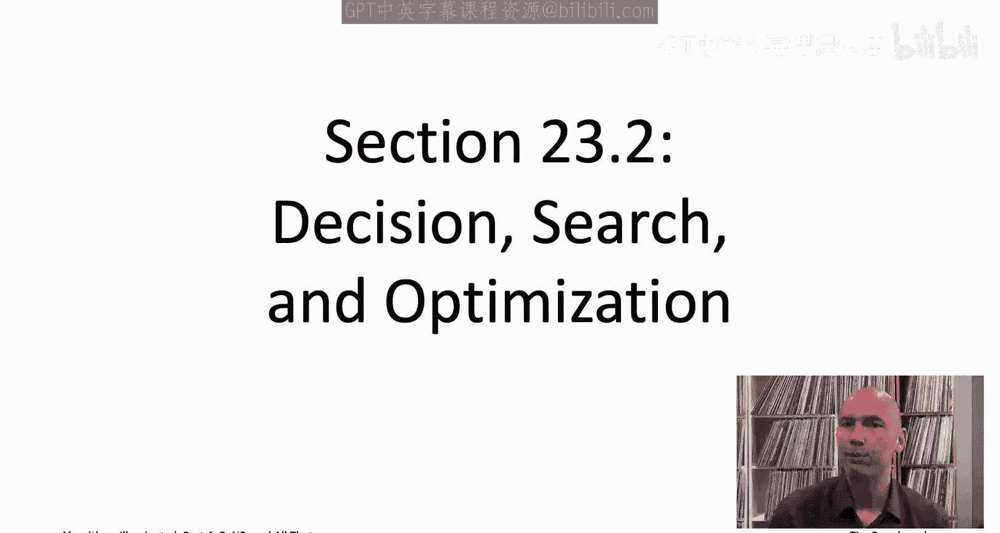
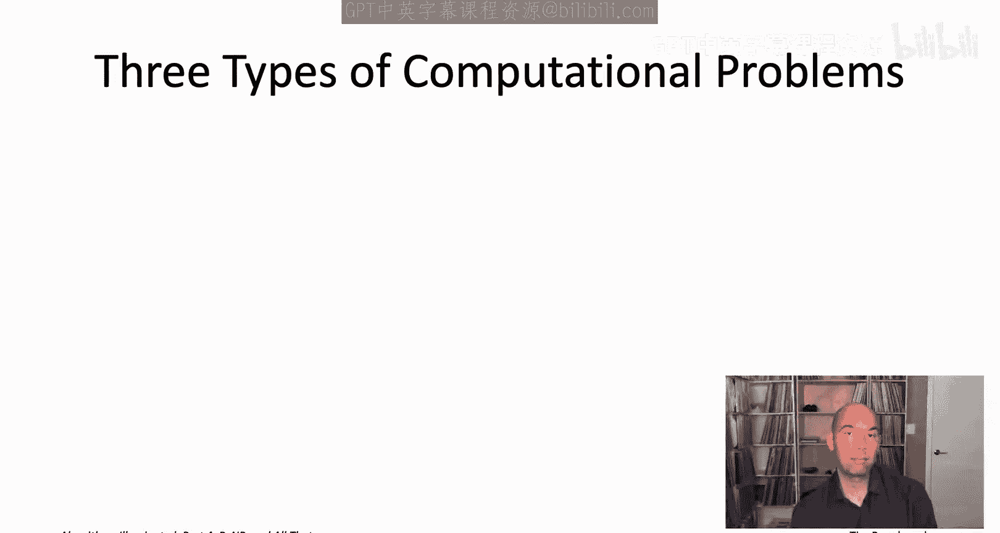
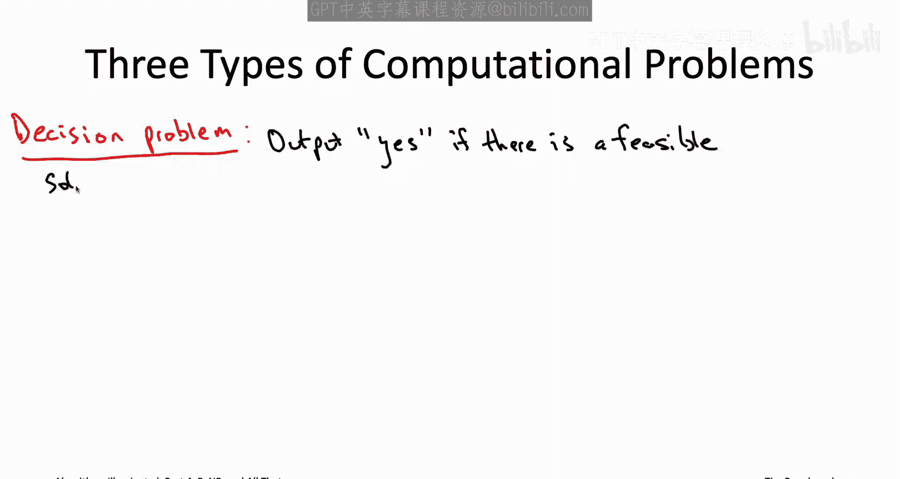
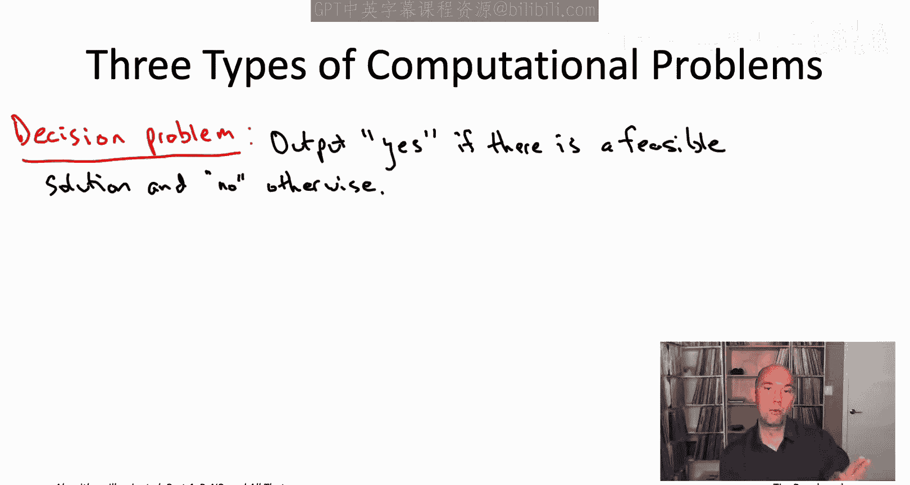
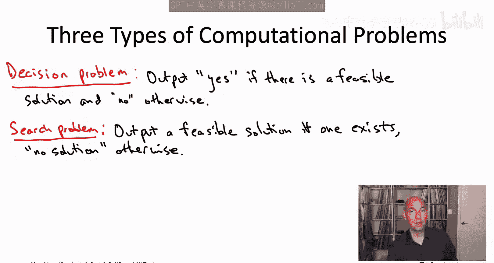

# 斯坦福大学《算法启蒙（第4册）：NP难｜Part 4 Algorithms for NP-Hard Problems》中英字幕（deepseek-R1） p33 -33-23.2_ Decision, Search, and Optimization).zh_en -BV1FAVUzXEum_p33-

Hi everyone and welcome to this video that accompanies Section 23。

2 of the book algorithmrims illuminated Part 4， It's a section about decision。

 search and optimization， So before we move on to formally defining what we mean by problems solvable by naive exhaustive search which will correspond to the complexity class NP P。

 let's take a step back and categorize the different types of input output formats that we've seen in the computational problems that we've studied thus far。

It's worth differentiating between three different types of computational problems。

 so let me list them in what would seem to be increasing order of complexity。

First we have the decision problems， so these are problems where an algorithm is only responsible for outputting a binary answer yes or no。

 So for example， the decision version of the threeat problem， the input would be the same as always。

 a threeet instance so a bunch of disjunctions of at most three literals each and for the decision version all an algorithm would have to do is either say yes。

 it's satisfiable or no it's unsatisfiable。 it would not for the decision version be responsible for actually producing a satisfying assignment when one exists。

Decision problems are convenient when developing a computational complexity theory。

 but in real applications they're also going to sort of the rarest of the three that we're going to talk about。

 usually in applications you actually want a feasible solution not just to know that one exists。

And accordingly， in this entire video playlist， we've only seen one decision problem。

 which was in the opening sequence when I was giving you that glimpse of the two step recipe for proving problems NP P hard。

 So back in that reduction， we reduced the directed Hamiltonian path problem to the psychofree shortest path problem。

 And if you go back and look at that reduction， we were actually using the decision version of directed Hamiltonian path。

 So the algorithm was only responsible for outputting yes or no。

 depending on whether the graph had a Hamiltonian path or not。

Moving on to a category of problems which you do see in applications are search problems。

 So here an algorithm's responsibility is given an instance to either hand back a feasible solution or to correctly report that none exist We've seen several search problems in this video playlist a sat and threeat or really canonical versions where I give you a bunch of disjunctions of literals and you either have to report a satisfying truth assignment or correctly report that none exist graph coloring that was also a search problem。

 you know either exhibit a K coloring or correctly report that it's not K colorable Similarlyly。

 the versions of Hamiltonian path that we used in the previous chapter for NP harness reductions。

 those were also search problems either report a Hamiltonian path or correctly report that none exist subset sum now that I think about it also a search for a search problem。

The majority of the problems that we've discussed in this video playlist are optimization problems。

 so an algorithm for an optimization problems responsible not just for figuring out whether or not there's a feasible solution。

 but that if there is at least one feasible solution that's responsible for handing back to the best one。

 So in an optimization problem， you also specify an objective function to be maximized or minimized and an algorithm needs to among all feasible solutions return one with the best possible objective function value or if there are no feasible solutions。

 the algorithm should as usual correctly report that fact。

We've been studying several different optimization problems， so just to rattle off a few。

 right the traffic salesman problem， you want a minimum cost tour， the NApsack problem。

 you want a maximum value， feasible solution， and similarly make expand minimization。

 maximum coverage and influence maximization。So all three types of problems reference a feasible solution and what that actually means is problem specific。

 sometimes it's going to correspond to satisfying assignments or it might correspond to Hamiltonian paths or traveling salesman tours。

 whatever， and for optimization problems， the objective function is also going to be problem specific minimizing the total cost to maximizing the total value etc。

Now， complexity classes， as we'll be discussing in the chapter。

 they usually stick with problems of only one of these three categories to avoid type checking errors。

 and so when we define the complexity class NP formally in the next video。

 it will be defined as a class of search problems。I should warn you that most books in both complexity theory and algorithms define the complexity class NP P in terms of decision problems rather than search problems。

 the reason they do that is because it's more convenient for developing complexity theory。

 the reason I'm not doing it is because decision problems are further removed from the natural algorithmic problems that are our focus in this video playlist。

You shouldn't really worry about the distinction though。

 as all the algorithmic implications of NP hardness。

 including whether or not the P not equal to NP conjecture is true is false。

 all of that remains exactly the same no matter whether you define the complexity class NP in terms of decision problems or in terms of search problems。

Now， you might be concerned that in restricting our definition of the complexity class NP only to search problems。

 leaving optimization problems like the traveling salesman problem out in the cold and obviously those are problems that we care about quite a bit。

 but not to worry， optimization problems have a natural search version。 So for example。

 you can turn the traveling salesman problem into a search problem by the input in addition to specifying a graph with edge costs as usual。

 you also specify a target objective function value。 So the search problem would be， for example。

 if there's a traveling salesman tour with cost at most 1000， give me one。

 otherwise correctly report that no tours of that quality exist or in the Napsack problem you would say give me back a collection of items with total value at least 10。

000 or correctly report that no such subsets of items exists。In general。

 you can turn an optimization problem into a search problem by specifying the subjective function target capital T and asking whether there's a feasible solution with objective function value at least as good as T。

The search version of an optimization problem is only going to be easier。

 So if you can solve the optimization problem， you can certainly solve its search version。

 but there's actually also a reduction in the other direction。

 So if I gave you a box solving the search version efficiently。 So for example。

 for the traveling salesman problem I gave you an efficient subroutine that took as input a TP instance and a target tour cost and either reported back a tour with cost at most of the target or correctly reported that no such tour existed。

 I could just use that subroutine over and over again inside a loop that's binary searching over the target objective function value capital T and I could use that subroutine to compute a minimum cost traveling salesman tour So given a magic box solving the search version I actually can solve the optimization problem as well。

 Now this is generally not how you'd want to actually approach an optimization problem in practice generally an optimization problem。

 you want to just solve it directly the way we've been doing throughout this book series。

 But for the purposes of this chapter only or we're just trying to。

fiure out which problems are polynomly time solvable and which ones appear not to be。

 there's no reason to distinguish between the search and optimization versions。

 one of them is polynomly timesvable if and only if the other one is and similarly one of them is NP hard if and only if the other one is。

With these preliminaries out of the way， now that we know that our focus for the moment will be squarely on search problems。

 we're ready to formally define the complexity class NP P in the next video， I'll see you there。

