# 斯坦福大学《算法启蒙（第4册）：NP难｜Part 4 Algorithms for NP-Hard Problems》中英字幕（deepseek-R1） p34 -34-23.3_ NP_ Problems with Easily Recognized Solutions).zh_en -BV1FAVUzXEum_p34-

Hi everyone and welcome to this video that accompanies Section 23。

3 of the book algorithmgoms illuminated Part 4， a section about the complexity class NP corresponding to problems with easily recognized solutions。

 So with this video we really arrive at the heart of the discussion How are we going to define exhaustive searchslvable problems。

 In other words， the problems that might plausibly reduce the traveling salesman problem or to think about it in another way。

 what are the minimal ingredients necessary to solve a problem using naive exhaustive search。

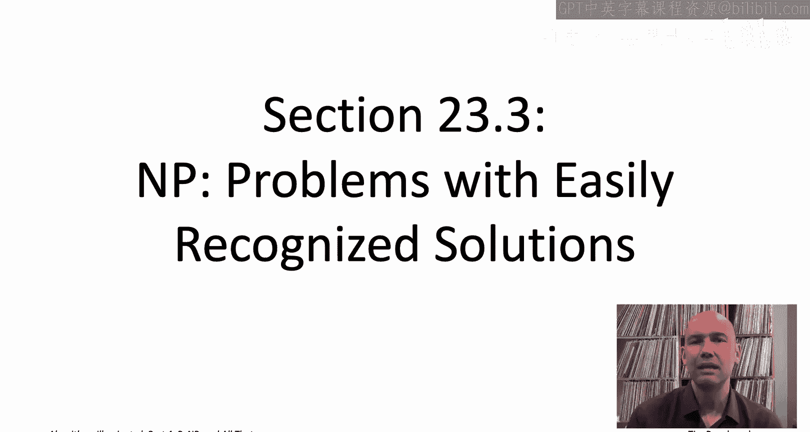

The big idea behind the complexity class NP P is the efficient recognition of purported solutions。

That is， if someone handed you a feasible solution on a silver platter。

 you could quickly check whether or not it was indeed a feasible solution。 For example。

 if someone hands you a filled out Sudoku or Kenken puzzle。

 it's quite easy to check whether or not they followed all of the rules。 Similarlyly。

 if someone hand you a sequence of vertices in a graph。

 it's easy to check whether or not it constitutes a traveling salesman。 And if it does。

 whether its total cost is a most some target total cost capital T。

Formalizing that idea leads us to the complexity class NP As we mentioned in the previous video。

 the class NP is going to consist solely of search problems。

 remember a search problem that means there's a notion of a feasible solution and the algorithm is responsible either for returning a feasible solution or correctly reporting that none exist So for example。

 given an instance of TSP and a target tor cost like 1000。

 either return a tour with cost of most 1000 or correctly report that none exist。

 or given an instance of 3atAT， either exhibit a satisfying truth assignment or correctly report that the instance is unsatisfiable。

Under what conditions does a search problem belong to the complexity class NP while there are two conditions。

 so first of all， you know we talked about handing you an alleged feasible solution on a silver platter。

 condition one is that silver platter shouldn't be astronomically large。

 so to write down a feasible solution that should be possible using a polynomial number of bits。

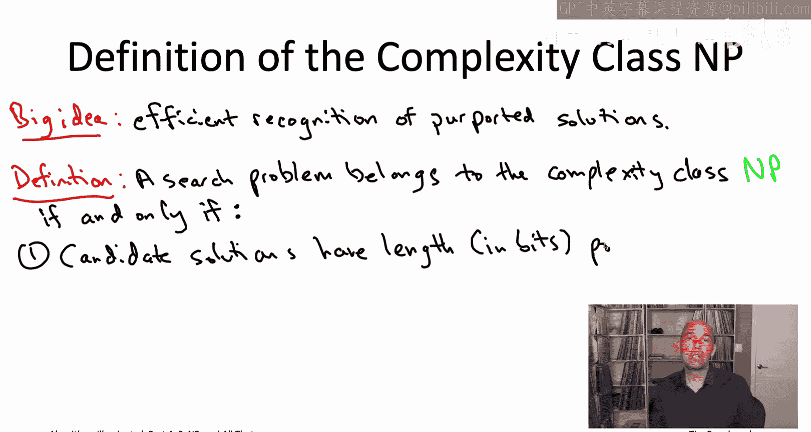

The second condition asserts efficient recognition。

 so given an alleged feasible solution and by the first condition we know its description length is a most polynomial。

 given an alleged feasible solution， you should be able to with only a polynomial amount of work。

 confirm or deny that candidate solutions feasibility。

And that is it That is one of the most important definitions in all of computer science。

 the definition of the complexity class NP。 I should warn you。

 especially if you go and look at some complexity theory textbooks。

 you can equivalently define the complexity class NP as the search problems that are efficiently solvable by what's called a nondeterministic Turing machine Nodeterministic Turing machine that's a fictitious and frankly。

 at this point somewhat anachronistic computational model and indeed the acronym NP it stands for nondeterministic polynomial time Don't forget our reckon mistake from the beginning。

 never mistake capital NP is standing for not polynomial It's not what it stands for stands for nondeterministic polynomial time and it's because of this alternative definition of the complexity class capital NP。

When you're thinking about algorithms as we are in this book series and in these videos。

 you should really always think about NP problems as those with efficiently recognizable solutions and the study of algorithms there's really no reason to ever worry about these nondeterministic Tring machines。

We have throughout this video playlist seen many examples of problems that satisfy both of these two conditions。

 so let's just go over a few so that this definition starts to gel for you。

Let's start with the traveling salesman problem so that's an optimization problem。

 so it's actually not eligible for membership in the complexity class NP。

 but we can think about the search version of the TSP where in addition to the in vertices and the edge costs。

 you're also given a target objective function value capital T and the search version says either producer a tour with total cost at most of the target capital T or correctly report that no such tour exists。

The search version of the Tra salesman problem is certainly a member of the complexity class NP right we have to take two things。

 so first we have to check the candidate solutions， have length polynomial in the input size。

 but what's a candidate solution that's just going to be a sequence of n vertices Now it only takes if the vertices are named sort of123 up to n then it's only going to take a log based2 of n bits to reference a vertex so you're going to need O of n log n bits to describe a candidate tour。

Second condition asserts efficient recognition and as someone handed you a sequence of in vertices straightforward to check that it constitutes a tour that is each vertex appears exactly once。

 and it's easy to compute the total cost of that tour and to check is it at most the target capital T so certainly TSP。

 the search version passes both tests with flying colors。

 that's going to be an example of an NP problem。It's probably even easier to see that the threeatAT problem belongs to the complexity class NP right so here candidate solutions。

 those are just going be truth assignments so you can specify a truth assignment to end bullolean variables using end bits just end zeros and ones for false and true and that's the first condition second condition assert its efficient recognition and if someone hands you candidate solution a truth assignment it's easy enough to check whether it's a satisfying truth assignment or not you just walk through the constraints one by one and then you just check that every single constraint is satisfied and a con is going to be satisfied if and only if one of the variable assignment requests that it makes is in fact fulfilled by the suggested truth assignment。

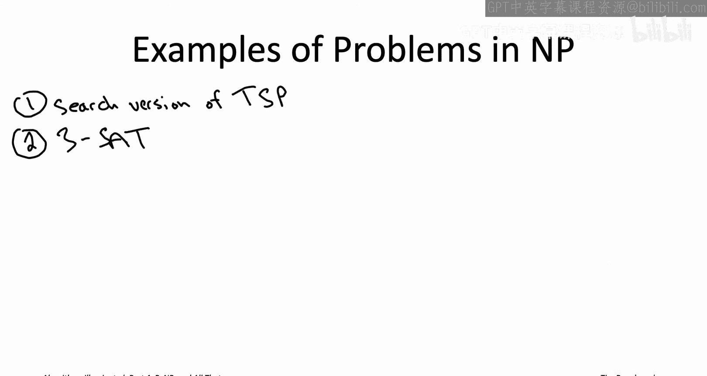

Similarly， the Hamiltonian path problem undirected directed doesn't matter。 Why is that an NP。 Well。

 again， a candidate solution that's just going to be a list of vertices。

 polynomial description length and it's easy to check whether or not in fact。

 it only uses legitimate edges in the graph and whether every vertex is visited exactly once we can think about say make span minim and that's an optimization problem So again to talk about membership at N we have to turn to its search version So given an instance of makepan minimization plus a target makespan like 100 the question is is there a schedule with makepan at most 100 or not or correctly report that every schedule has make span bigger than 100 that again belongs to NP right so here alleged solution that's just going be a schedule of the jobs on the machines easy enough to describe and of course given a schedule it's straightforward to compute the makes span and check it against the target makespan So no worries there Similarlyly。

 if we want to think about the independent set problem the search version again it's an optimization problem So we think about the version where you're also given a positive。

K and the question is whether or not there's an independent set with size at least k and if there is you're responsible for returning one。

 that again belongs to NP， again， candidate solutions。

 just subsets of vertices straightforward to describe。

 and as we know it's straightforward to check whether or not a subset of vertices is in fact an independent set。

 whether or not all of them are mutually non- adjacentjacent。And there's many， many。

 many more examples， almost everything that we've seen in this book series and these video playlists。

 at least the search version of the problem is going to be a member of the complexity class NP and maybe the big takeaway is just that you know we've deliberately defined the requirements for membership and NP to be very easy to pass very weak and so that means there's a kind of almost all the problems that we can think of easily passed the two criteria and boom are members of NP So MP is a big class because the entrance requirements are so easy to pass。

In the first video corresponding to this chapter， we discussed our plan for amassing evidence of intractability of the traveling salesman problem by reducing tons and tons of other problems to it。

 so we wanted to settle along this set Sc C so that all of the problems in Sc C reduced to the TSP and we want that set to be as big as possible because the more stuff reduces to the TSP。

 the stronger the evidence that the TSP is in fact an intractable problem。

The question then was okay so how should we choose this set script C we can't set it to be everything because there's definitely problems out there like the halting problem which are unsolvable and therefore could never be reduced to a problem as easy as the TSP which if nothing else can be solved in exponential time using naive exhaustive search so it seemed like the most ambitious thing we could try to do is try to reduce every other problem that is equally well solvable by naive exhaustive search。

 reduce all of those problems to the TSP that would mean the TSP is sort of the hardest among all problems solvable by naive exhaustive search。

Now I just gave you the formal definition of the complexity class NP and it was in terms of the efficient recognition of alleged solutions。

 so let's now connect those two ideas， efficient recognition with solvability by naive exhaustive search on this slide I just want to point out that any NP problem is indeed solvable by the same naive exhaustive search that you could use say for the traveling salesman problem。

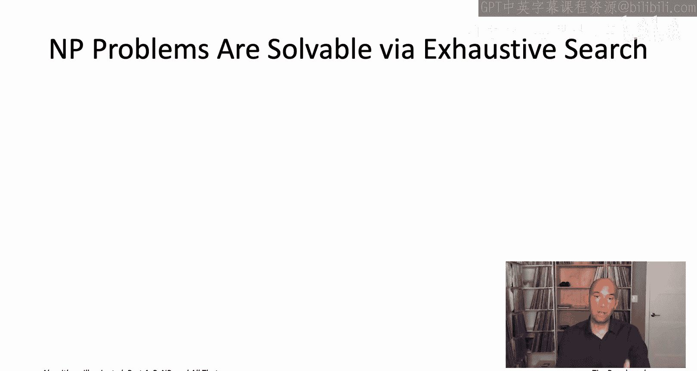

When we saw the TSP by exhausted search， we enumerated through all sequences of vertices。

 all possible orderings， and so here similarly， we're just going to enumerate all possible candidate solutions one by one。

The first requirement for membership and NP says that candidate solutions have to have length bounded by a polynomial in the input size。

 so this is an NP problem by assumption， so that means we only have to worry about candidate solutions that have length that most big O of n to the D sub1 where D sub 1 is some constant。

 maybe it's 100， maybe it's1000， but anyways independent of N。

What that means is that there's only an exponential number of different candidate solutions that we need to try。

 so for example， if we know that all candidate solutions can be described in a most end of the 10th bits。

 then the number of candidate solutions we need to look at is at most two raised to the end of the 10th。

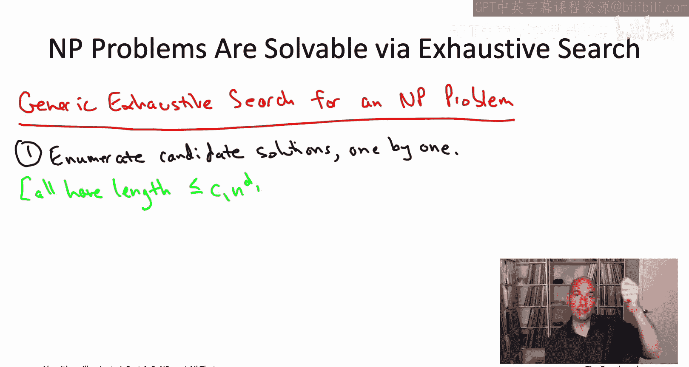

Now we use the second requirement of an NP problem。

 which is that a candidate solution can be efficiently recognized。

 so for each of these possibly exponentially many objects that we're enumerating for each one separately。

 we check whether it is in fact a feasible solution and if we ever find one， then we return it。

 that's our answer， if we exhaust all of the possible candidate solutions and we discover that none of them are feasible solutions。

 we can correctly report that fact。

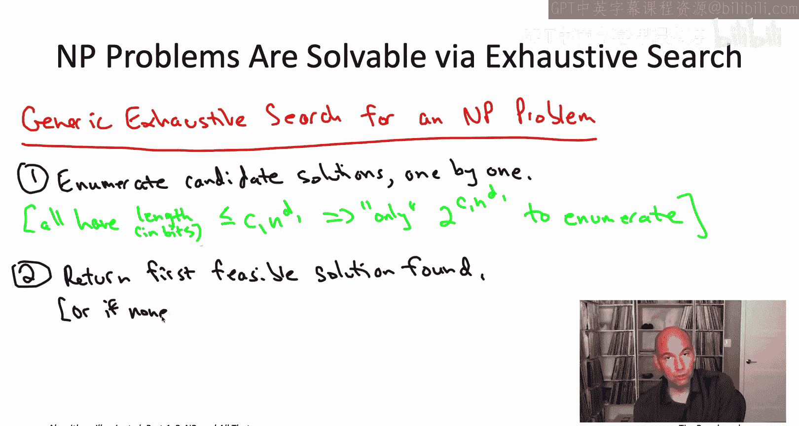

That second requirement for membership and NP then tells us that for each step in the enumeration。

 this feasibility checking is going to require only a polynomial number of steps。

 so most C2 times n raised to the D2 where C2 and D2 are constant independent event。

Correctness of this generic algorithm should be obvious。

 it literally checks every conceivable feasible solution， checks them one by one。

 returns a feasible solution if it finds one otherwise correctly reports no solution。

 and because it has at most an exponential number of steps in the enumeration with polynomial time for each step。

 the overall running time of this generic exhaustive search algorithm is only exponential in the input size n。

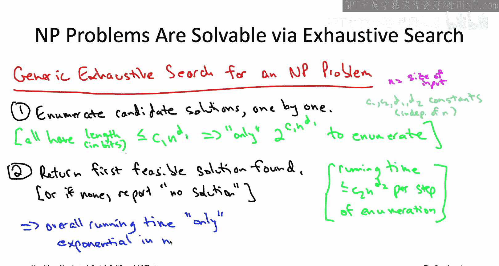

As we've mentioned the requirements for the membership in the complexity class NP are very weak and so almost any search problem you ever come across is going to wind up being a member of NP So what that means is that if some problem like the traveling salesman problem if in fact every problem in NP reduces to it。

 that's extremely strong evidence that the traveling salesman problem is intractable because if there were a polynomial time algorithm for the TSP that would automatically give you a polynomial time algorithm for every single problem in NP。

 every single problem with efficiently recognizable solutions which in turn is almost every problem you're ever likely to encounter。

This strong evidence of intractability is exactly the formal definition of an NP hard problem。

 A problem is N hard。 If every single problem in the complexity class N reduces to that problem。

 or in other words， a polynomial time algorithm for that NP hard problem would automatically give a polynomial time algorithm for every single problem in N。

 every problem with efficiently recognizable solutions。Now。

 when I defined formally the complexity class NP， I sort of made a big deal of the fact that it was a class only of search problems to avoid type checking errors。

 so an optimization problem like the TSP is ineligible for membership to belong to the class NP。

 but the TSP is not ineligible for being NP hard， indeed the optimization version of the TSP is indeed an NP hard problem as are all of the other optimization problems that we've discussed in this video playlist。

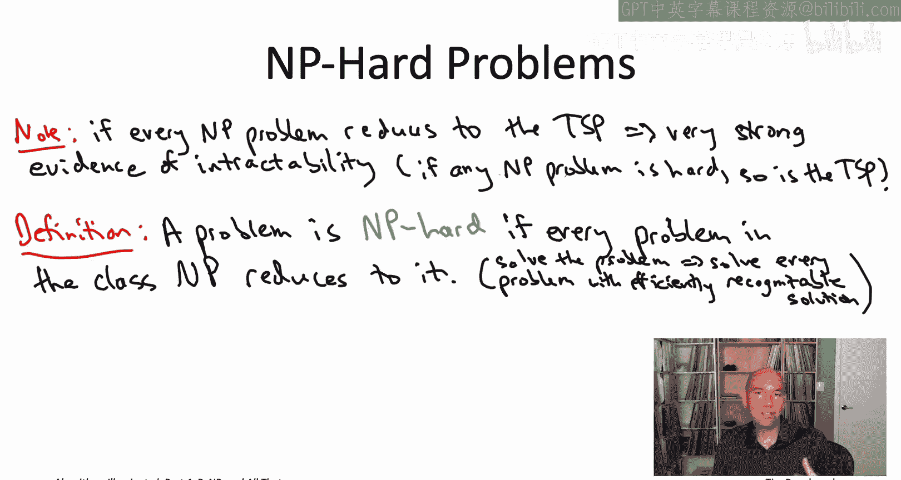

I again， need to warn you just so you don't get confused if you look up the definition of NP hard from other sources like in books and complexity theory or even many books and algorithms。

 it's common to define NP hardness in a less liberal manner than I've done so here So here when I say a problem is NP hard if every problem in the class NP reduces to it。

 I'm speaking as usual about these cook reductions these are reductions where I give you the magenta box。

 you're allowed to invoke a polynomial number of times。

 you're also allowed to do a polynomial amount of additional work。

 And then if you can solve the problem that counts as a reduction。

 So that's what a cook reduction is。 Many books actually use only a restricted form of reduction called11 reduction。

 which we'll discuss in the last video in this sequence。 when we talk about NP completeness。

 And in particular， if you're using only 11 reductions you're stuck with only search problems being NP hard。

 So if you use that definition， you can't actually say the TSP as NP hard that would be incorrect。

 you have to say the search version of the TSP is NP hard whereas with this definition。

 we can just flat out， say the TP。

NPP hard， that's just a true statement with this definition。

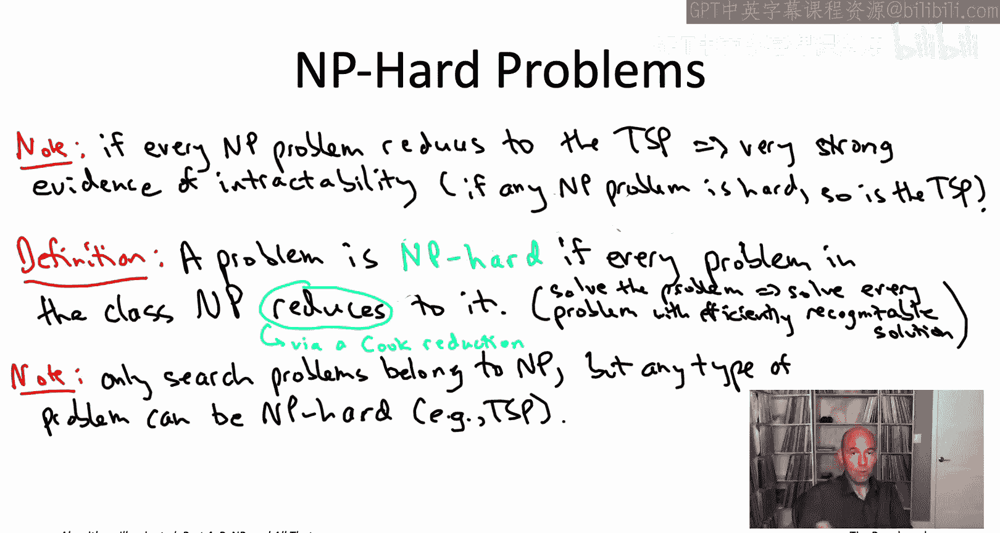

Why am I using this more liberal definition in this video playlist because it' maybe less convenient for the development of complexity theory。

 but it accords much better with the algorithmic viewpoint that we're taking in this book series？

Let's revisit the fundamental cook Levinn theorem。 So we talked about the cook Levinn theorem in the last chapter chapterer 22。

 That's when we were learning how to prove the problems are NP hard。

 What we did is we took the cook Len theorem on faith。

 the cook Levin theorem tells us that the three sad problem is NP hard。

 And then using our two step recipe from that one NP hard problem， we generated 18 more。

Now that we have a mathematical definition of what it really means for a problem to be NP hard。

 we correspondingly have a very precise understanding of exactly what the Cooklevin theorem shows。

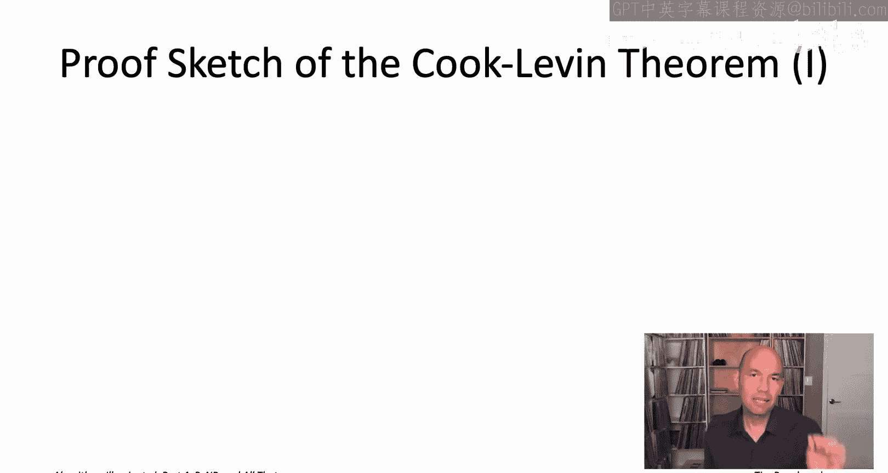

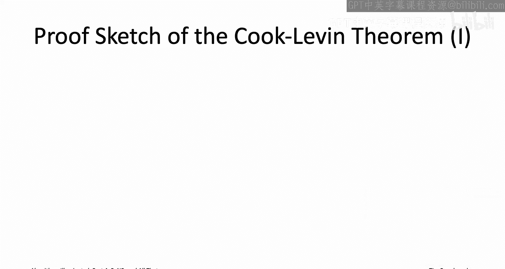

Namely， in asserting that the threeatAT problem is NP hard。

 what Cook and Levin are saying is that every single NP problem。

 every problem with efficiently recognizable solutions can in fact be reduced to the threeSaAT problem。

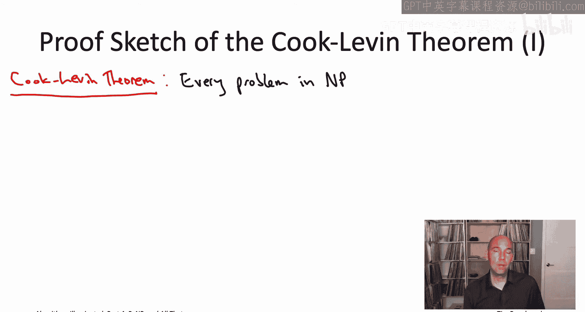

And you might well be wondering， how could this possibly be true。

 The three sad problem seems so simple， the complexity class NP P so vast。

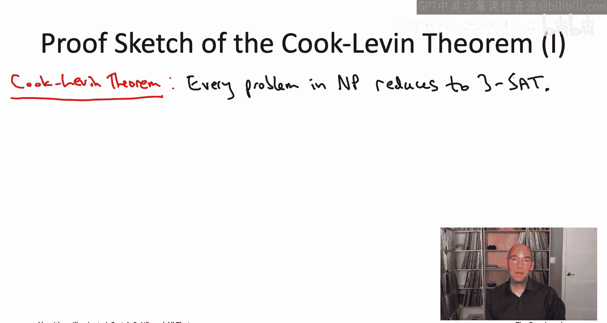

Well， the details of the proof get kind of messy， but let me just give you the gist。

What do we have to show， have to show that every problem an NP reduces to three sets。

 so let's fix one arbitrary problem from the class NP。We know almost nothing about this problem A。

 we have no idea what it looks like。 The only thing we know is that it happens to be a member of the complexity class NPp。

 So we know it's a search problem。 And then there are those two defining characteristics of NPp problems。

 So first of all， we know the candidate solutions must have length polynomial in the input size。

 So let's say decribable and a most C1 times n raised to the D1 Bs or n is the size of the input。

 And then secondly， we should be able to efficiently recognize purported solutions。

 So given one of these candidate solutions， which again has the most polynomial length。

 we should be able to check whether or not it constitutes a feasible solution in polynomial time。

 So time at most C2 times n raised to the D2 here， C1 C2 D1 and D2 or all constants independent of N。

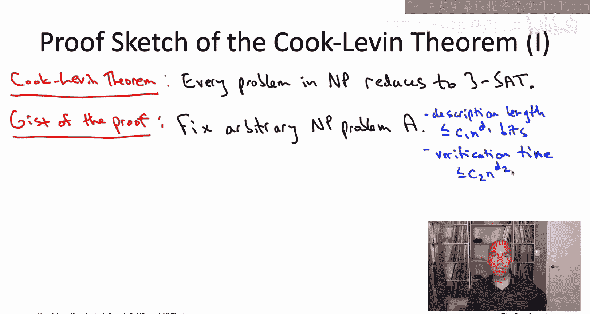

Now we have to somehow reduce this abstract and B problem A to the seemingly very simple three set problem。

 so it's going to be a reduction， so we're going to have to draw a cartoon which will give you fond or maybe not so fond memories of the proofs that we did in the previous chapter。

 we're going to need a reduction from this problem A to three set。

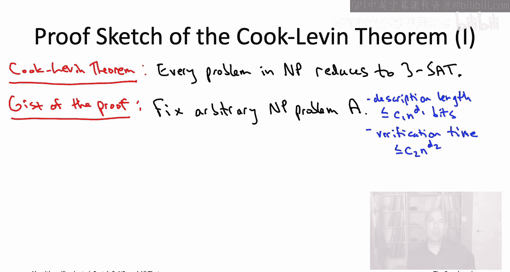

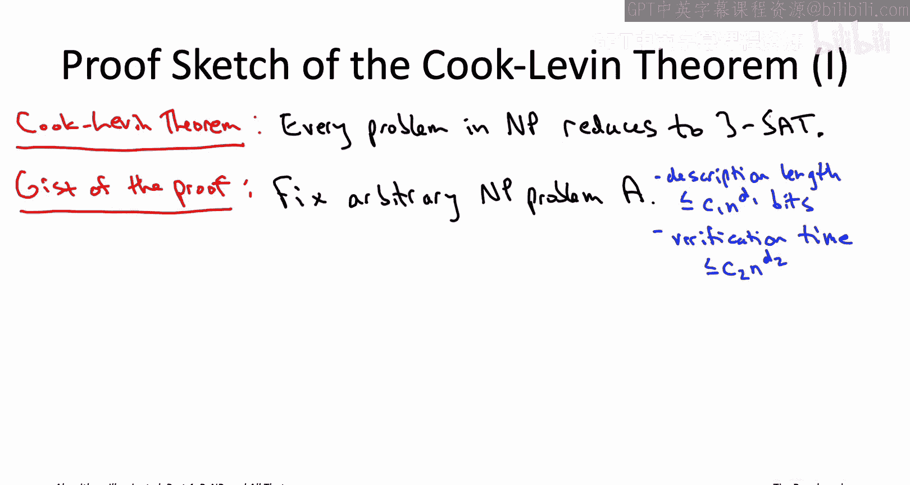

This reduction will be from the light blue problem。

 the arbitrary NP problem A to the magenta problem three S。

 so we need to show the given a subroutine solving threeatAT， given a magenta box。

 we need to see how to build that light blue box for solving this arbitrary MP problem that we started with。

The plan then is to translate any instance of the arbitrary NP problem A to somehow encode it as an instance of satisfiability so that the status of the problem we started with。

 whether it's feasible or not， is reflected in the status of the satisfiability instance that the reduction produces and furthermore。

 satisfying truth assignments to the threeet instance that we construct。

 we should be able to extract from that a feasible solution to the problem that we started with。

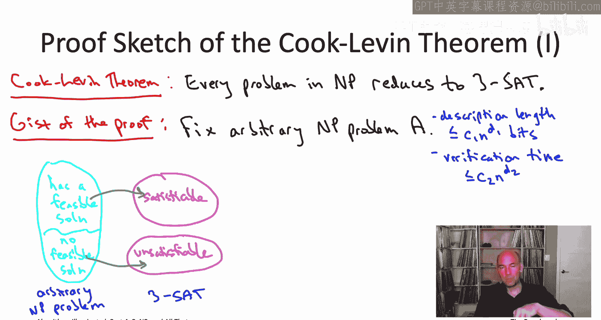

So what are the basic ingredients in this reduction， How are we going to do this encod Well。

 at the end of the day， we're going to be responsible for producing a feasible solution to the instance that we started with if one exists。

 and the only thing we know about those feasible solutions is that they can be described in at most C1 times end of the D1 bits。

So the sensible thing it would seem to do would be to just have a bunch of boolean variables。

 C1 end to the D1 Boolean variables whose true false assignments record whether those bits are zero or 1。

So the reduction has now already taken advantage of that first property satisfied by NP problems。

 that the description length of candidate solution is not too big。

 the reduction therefore can just explicitly have boolean variables。

 encoding the bits of an alleged feasible solution。

We still have to take advantage of the second property possessed by NP problems。

 efficient recognition， so we need to use the fact that there is this polynomial time verification algorithm that given a candidate solution confirms or denies its feasibility and at most C2 times end to the D2 steps。

What we're going to do is have a whole nother collection of boolean variables in our three side instance。

 which we're going to call state variables， and the point of these state variables is to encode the execution of the assumed verification procedure on a candidate solution。

Now by assumption by virtue of problem A belonging to NP。

 the verification algorithm runs in at most C2 times end to the D2 time， Moreoverover。

 let's assume we use a computational model where referencing one bit of memory costs you1 time step。

 that means if you perform at most C2 times end to the D2 time steps。

 you only have time to reference at most C2 times n to the D2 bits of memory。Therefore。

 we can basically summarize the entire computation of this verification procedure with a table with C2 times end to the D2 rows in the same number of columns。

So the rows of this table corresponds to time steps。

 it's a snapshot of what things look like at each time step that the algorithm runs。

 and then within a row， the columns are encoding the bits of memory at that particular time step of the execution。

I sympathize if this description of the state variables encoding the verification algorithms execution on the candidate solution。

 if this description of the state variables seems a little vague。

 I've done that deliberately because the additional details of exactly what the state variables are and exactly how you faithfully encode the entire execution of the algorithm that depends on the exact details of your computational model on your exact definition of what an algorithm is allowed to do from one time step to the next Now the simplest choice and the one you'll usually find in books is to use a Tring machine as the computational model。

 and if that were the case you could get away with this table of state variables that I've listed on this slide plus a few extra variables at each time step to encode the machine's current state。

And with some additional grun work， that same proof can be adapted to computational models that more closely resemble modern computers and programming languages。

Given our goals here， it would take us too far afield to really nail down sort of the details of the computational model to get into the sort of guts of turing machines and so on。

 so just to have the gist of the proof， we'll be content to leave the description of the state variables like this it's a table where rows correspond to time steps。

 columns correspond to bits of memory and hopefully it's plausible that okay maybe with a little bit of extra bookkeeping to keep track of a few things you really can using in this table and code what the verification algorithm's entire trajectory would look like given a particular candidate solution。

Let's now complete the construction of our threeat instance。

 what we've already said what the variables are， there are these solution variables encoding a candidate solution to the instance of the problem A that we were given in the first place。

 and then we also have these state variables which encode the execution of the verification algorithm on some candidate solution。

So what about the constraints， Well， the point of the constraints is to enforce our intended semantics for the state variables。

 to enforce that any truth assignments given to those variables in that table that it really should encode a legitimate computation of the verification algorithm。

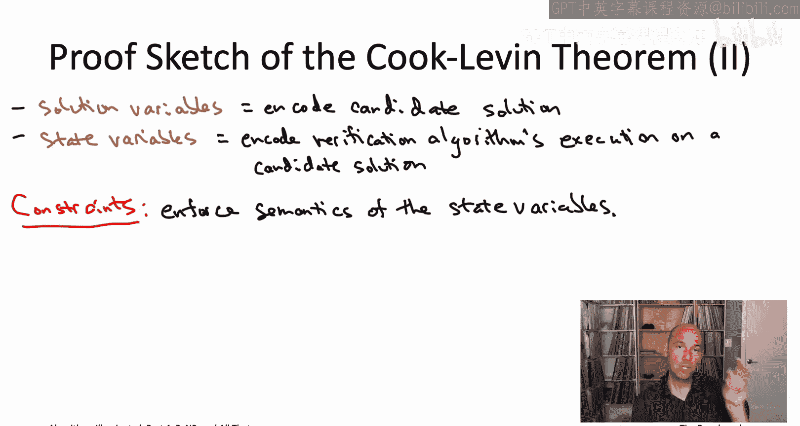

For example， you're going to have one constraint or actually a bunch of constraints for each entry in that twodimenal table So for each choice of a time step T。

 each row， each choice of a column， like the I bit of memory iss going to be some constraints which enforce that the contents of the I bit of memory at time T or what it should have been。

 That is whether or not that bit is a0 or1 that depends on the relevant bits of memory from the previous time step。

 It depends on what instance of problem A we were given in the first place。

 It depends on what candidate solution to that instance we're looking at。 And then finally。

 it depends on description of exactly how the verification algorithm operates。

That probably seems like quite a mouthful。 But here's the good news。 The good news is that， you know。

 in a computational model， like say， a Tring machine。

 what can happen from one time step to the next is really， really limited。

 The machine basically has some internal state。 It's going to be reading some character from some cell and possibly replacing that with a different character on that same cell。

 So because what happens from one time step to the next is so simple。

 It turns out you can enforce these intended semantics with a reasonably small number of disjunctions of at most three literals each。

😊，So let's take stock of where we are so given these constraints。

 how can we interpret a truth assignment to the three sat instances that we've constructed what it's going to be these true false values assigned to the solution variables so we can interpret that as a candidate solution and then all of these state variables tell us what the verification algorithm would do with that particular candidate solution oh so we are missing actually one constraint。

 which is that in addition at the end of the verification algorithms execution。

 it should accept the candidate solution described by the solution variables。

So if I happen to give you a magic box that solved threeatAT， what could you do with it。

 Well you could solve any NP problem that you wanted， How would you do it， take your NP problem。

 take an instance of it， run it through this reduction。

 construct a threeat instance as we just discussed run this magic box that will either give you a satisfying truth assignment or tell you that none exist if it gives you a satisfying truth assignment you can read off a feasible solution to the instance of problem A you started with just by reading off the bits encoded by the solution variables and if the threeat instance winds up being unsatisfiable you can correctly conclude that there were no feasible solutions to the instance of the problem A that you started with So that's the cooklen theorem。

 the threeat problems NP hard literally every single problem with efficiently recognizable solutions actually reduces to the seemingly quite simple threeatAT problem。

Coming up next， the Pavverse is empty conjecture， I'll see you there。

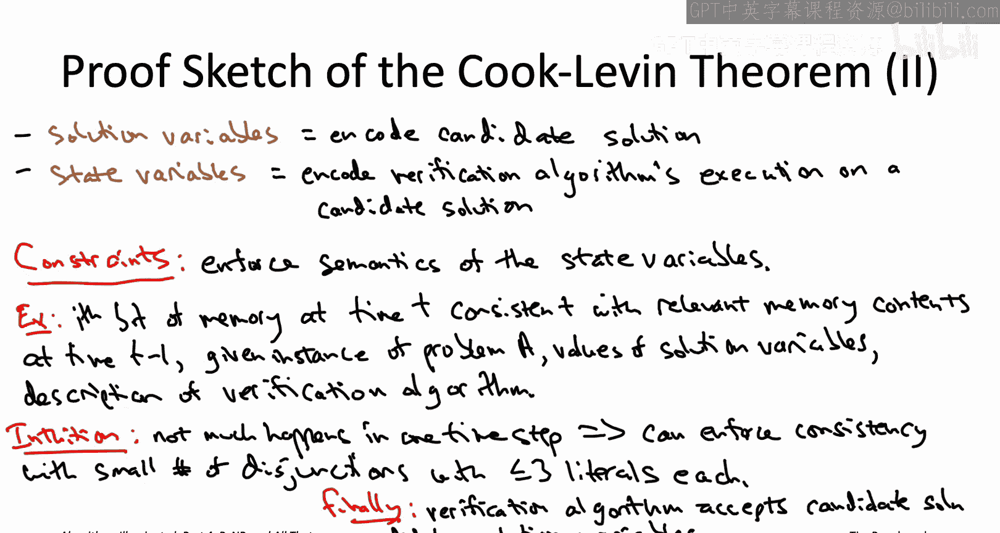