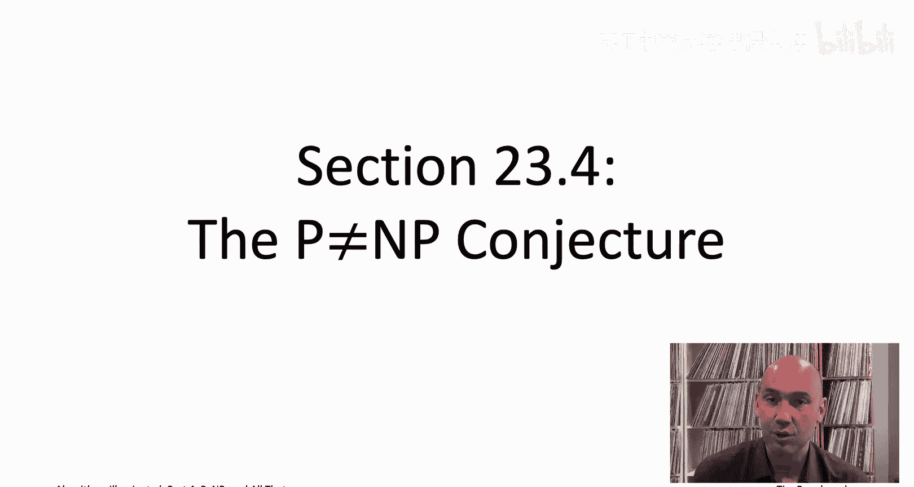
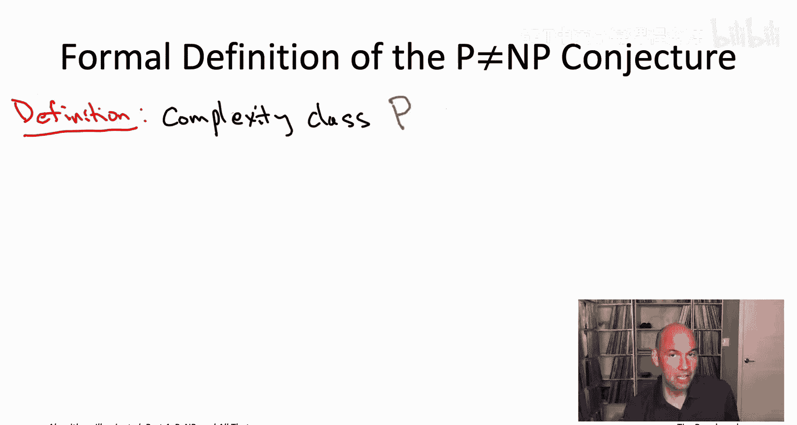
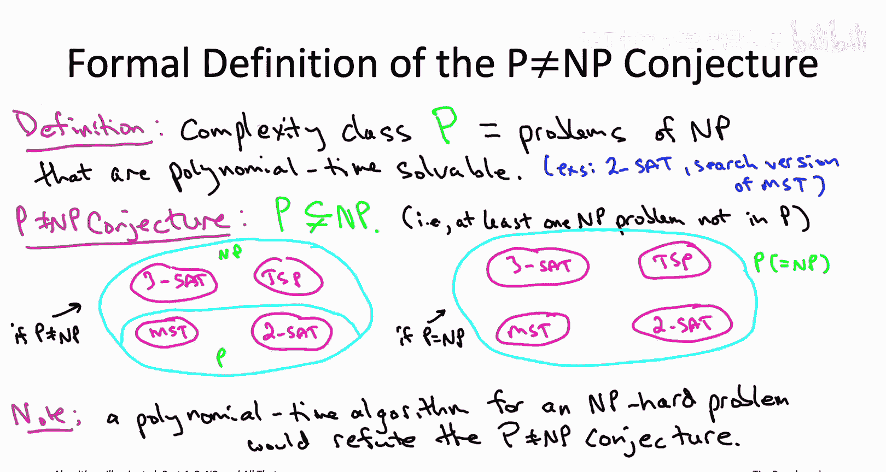
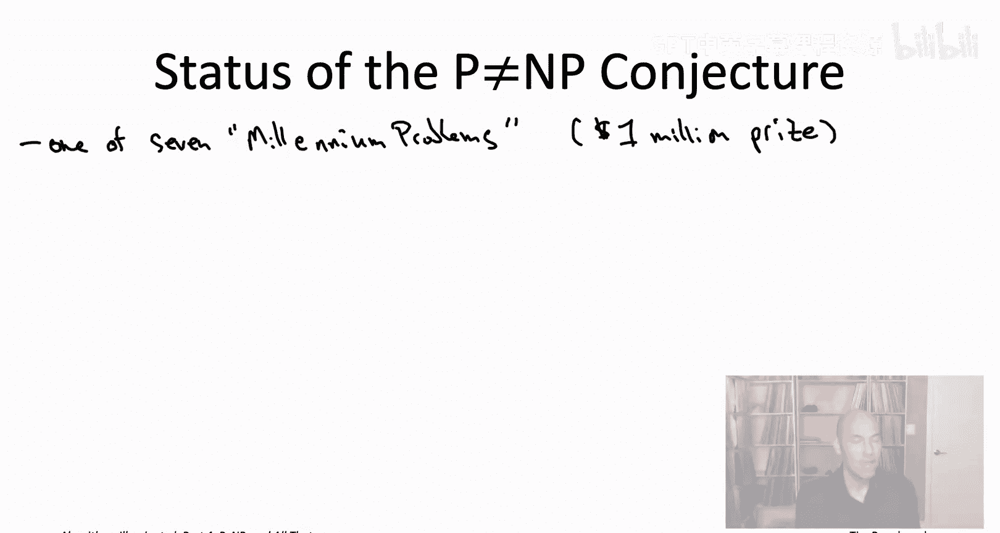
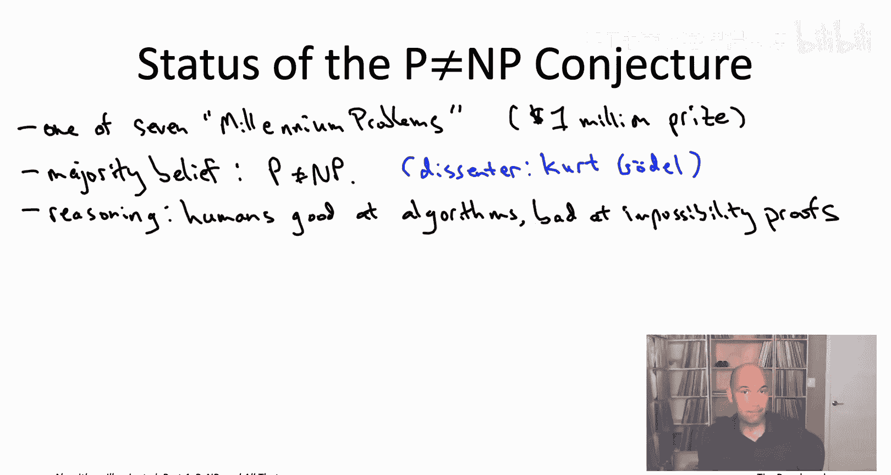
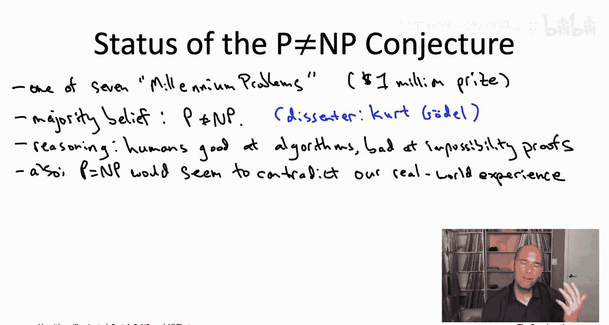

# 斯坦福大学《算法启蒙（第4册）：NP难｜Part 4 Algorithms for NP-Hard Problems》中英字幕（deepseek-R1） p35 -35-23.4_ The P!=NP Conjecture).zh_en -BV1FAVUzXEum_p35-

Hi everyone and welcome to this video that accompanies Section 23。

4 of the book algorithmgorithms illuminated Part4 section about the famous P not equal to NP conjecture。

 So way back in the fourth video of this video playlist。

 we gave an informal definition of the P not equal to NP conjecture。

 We said that it basically means that checking someone's work。

 checking an alleged solution to a computational task can be fundamentally easier then coming up with your own solution from scratch。

 So we are now finally in a position to define that conjecture formally。

We know now exactly what the NP stands for when we talk about the P not equal to NP conjecture。

 right those are the search problems with efficiently recognizable solutions。

 So what about the P in the P not equal to NP conjecture， Well those are just the problems in NP。

 the problems that not only have efficiently recognizable solutions， but in fact。

 can be solved in polynomial time。

We've seen plenty of examples of members of this complexity class P， so for example。

 if we think not about threeSAT， but we think about two SAT。

 so satisfiability where each constraint is the disjunction of at most two literals。

 that problem we know can be solved in polynomial time， even in linear time。

 one way to do it is by a reduction to computing the Strly connected components of a suitable directed graph。

Or think about the minimum span tree problem Now on the one hand。

 the MST problem is an optimization problem and remember NP that's only search problems and here we're defining P is a subset of NP so P is also only search problems so we wouldn't say that the MST belongs to this complexity class P but we would say that the search version of the minimum spanry problem belongs to this set P that would be a correct statement。

So now you know what the P and NP stand for in the Pna NP conjecture NP are the problems with efficiently recognizable solutions。

 P are the problems of NP that can be solved in polynomial time。 And so what is the conjecture say。

 the conjecture says that these two sets are different that P and NP are not the same set of problems。

 Now， look by definition， every problem in P also belongs to NP。 So P is a subset of NP。

 So what the conjecture says is that subset inclusion is strict。In other words。

 the conjecture is that there's at least one problem in this complexity class NP。

 there's at least one problem with efficiently recognizable solutions that is not in fact。

 polynomly time solvable。

As depicted in the cartoon on the slide， there are two possible states of the universe。

 and again we actually don't know which one we're in each one is technically possible。

 although most people have an opinion about which one is correct。

 So if the peanut equal to NP conjecture is true that says that there exists some problem with efficiently recognizable solutions that cannot be solved in polynomial time So that would be like on the left part of the figure。

 So we have some problems we can solve in polynomial time。

 like the minimum sanitity problem or the twoat problem。

 but then there'll be other harder problems within N like3s and the trans exhalment problem which cannot be solved in polynomial time。

 that's the state of the world。 if， in fact， the peanut equal to NP conjecture is true。

 and just to be clear， when I write MSt and TSP on the slide。

 I'm referring to the search versions of those two problems so that a type checks to speak about them being members of the complexity class NP。

On the other hand， if in the sort of less plausible case。

 that P and NP coincide where the only prerequisite for polynomially time solvability is to just be able to efficiently know a solution when you see one。

 then we have this case on the rights where P and NP become the same thing and in particular。

 P is not just confined to the MST and twoat problems， P grows to capture everything in NP。

 for example， including the threeat and the search version of the traveling salesman problem。

Let's note that if you ever had a polynomial time algorithm for an NP hard problem。

 you would be refuting the peanut equal to NP conjecture。

 if you remember all the way back to our opening sequence of videos corresponding to chapter 19。

 this is the bottom of the slide， this was actually our provisional definition of an NP hard problem we hadn't inform formally defined the peanut equal to NP conjecture。

 but just without that informal understanding， we use this provisional definition On this slide。

 now that we have formal definitions， both of NP hard problems and of the peanut equal to NP conjecture。

 this is now a precise mathematical statement。 The claim is that a polynomial time algorithm for any NP hard problem would refute the peanut equal to NP conjecture。

Why， well for the usual reasons， suppose you had a problem like the TSP that was NP hard。

 What does that mean by definition， what it means is that every single problem in the complexity class NP。

 every search problem with efficiently recognizable solutions。

 every NP problem reduces to that NP hard problem reduces， for example， to the TSP。

Now reduction spread tractability， so if you had aable algorithm。

 a polynomial time algorithm for the hard problem for the TSP。

 that would immediately translate into aable into a polynomial time algorithm for all of the search problems in the complexity class NP that would imply that P equals NP and that's what it means to refute the Pile equal to NP conjecture。

Let's conclude this video by talking a little bit about the current status of this peanut equal to NP conjecture so this conjecture is rightfully viewed as possibly the deepest open question in all of computer science and one of the most important questions in all of mathematics For example。

 back in the year 2000 the Clay Institute identified seven millennium problems which they thought were sort of the most important problems moving forward to the 21st century and they offered a reward of $1 million to anybody who could solve one of these seven open problems and the peanut equal to NP problems was one of the seven on that list。

If you're wondering about the other six， they were the Rimon hypothesis， the Na Stokes equationqu。

 the Poncaray Conjecture， the Hodge Conjecture， the Burergein Swniine Dre conjecture。

 and the Yang Mill's existence and mass G problem。 So as of the time of this recording。

 which is in the year 2020。 only one of the7 millennium prize problems has been solved。

 and that was the Poncaray conjecture， which was proved by Gregory Pearlman back in 2006， who， also。

 as you may have heard， famously refused the $1 million in prize money。

Now speaking of the $1 million， I mean， I don't mean to blittle it， obviously that's a lot of money。

 but I still actually think that amount undersells the importance to both science and society of making progress on these open questions。

 the leap in humankind's understanding in order to resolve questions of this depth is very hard to put a price on that kind of a dance in scientific knowledge。

Now while nobody actually knows whether or not the P equal to NP conjecture is true。

 almost everybody has an opinion about it， and almost everybody thinks that the conjecture is true。

 so I've written here the majority belief is that P is not equal to NP， but it's not a 51% majority。

 it's more like a 90 something percent a majority of theoretical computer scientists fully expect this conjecture to someday be proved。

One quite notable figure who placed a bet in the opposite direction was the famous logician Kurt Gdle。

 maybe you've heard， for example， about Grdle's completeness or incompleness theorems。

 This is the same girdle。 So in 1956， he wrote a letter to John Von Neumann and maybe the most accomplished mathematician of the 20th century。

 It was in 1956 a little bit before Von Neuumman passed away。In this letter。

 Gerrdo was talking about whether you could， in an automated way， compute proofs。

 proving statements that are not too much longer than the shortest possible proof。

 And this turns out to be equivalent to the P versus NP question。

 And Gerrdle actually conjectured that there should be an automated procedure for coming up with short proofs when they exist。

 which is equivalent to the conjecture that P equals NP。 So who knows。Girdle aside， most experts。

 you know， 90 some odd% of experts believe that P is not equal to NP。

 Where does that belief come from？Well， first of all。

 humans seem really crafty at coming up with efficient algorithms when they exist。

 And we've seen many， many， many examples in this book series。

 So if there really was some efficient algorithm out there for something like the traveling salesman problem。

 it would be pretty surprising that somehow with all the human ingenuity with designing algorithms。

 we haven't yet figured that out。 On the other hand。

 humans seem quite bad at proving inossibility results for proving limitations on what algorithms can do。

 So in the event that P is different than NPp， it's maybe not so surprising that we haven't yet figured out how to go about proving it。

😊。

The second reason is just the prospect of P and NP being the same of efficient recognition being sufficient for efficient search。

 efficient solvelvability just kind of doesn't really jive with， you know our experience in reality。

 right we have we all know from firsthand experience tasks where checking someone's solution appears to be much easier than coming up with your own from scratch。

 even just kind of like a difficult Sudoku puzzle I would put in that category。

But if P were to equal NP， that would in effect， say that the creativity that appears necessary to solve difficult problems。

 that that creativity can be efficiently automated。 So for example， if P equals NP。

 then at least in principle， you could generate a proof of from that last theorem automatically in time polynomial and the length of the proof。

But what if everybody's wrong， what if actually the conjecture is false and P equals NP？

One point that doesn't get discussed often enough is that there's really kind of two different versions of P winding up being equal to NP。

 The first version is that maybe it's the case that all NP problems can really be solved quickly in the real world by practical algorithms So that I find a much more implausible scenario if it were to transpire that would have huge consequences for society。

 not least it would mean the end of modern commerce as we know it。

 which is based on the hardness of problems like factoring and the discrete logarithm and if P equal NP with practical algorithms。

 then you could immediately break all of the world's cryptoyts。The second scenario。

 which is not quite as implausible， is that P happens to equal N P because every Np problem can be solved by an algorithm that technically runs in polynomial time。

 but is too complicated or slow to ever be implemented and used in the real world。

 This is a scenario that Dono Kauth himself is even speculated about。If that were the case。

 thered be few to no implications for the real world。

 rather it would just indicate that polynomial time solvability。

 that's too liberal a definition for what we really wanted to capture。

 which is a solvable and a reasonable amount of time by a concrete algorithm in the physical world。

So in 1956， Girddo conjectured something equivalent to P equals NPp， and 1967。

 Eddmonds conjectured something equivalent to P not equal to NP， which of them is right， who's right。

 Gerrdle or Edminds？

You'd hope that as the years go by， we'd be getting closer to a resolution of the Pnaquinpi conjecture one way or the other。

 But instead， as more and more mathematical approaches to the problem have been proven inadequate。

 The solution to the conjecture seems to be receding further into the distance with each passing year。

 and we definitely have to be prepared for the reality that we may not know the answer to this conjecture for a long time。

 Years definitely。Decades。Probably。Centuries。Who knows？

The next video will continue this video's theme of unproing conjectures and we'll be looking at two interesting stronger versions of the P9 equal to Nb conjecture called the exponential time hypothesis and then also the strong version of the exponential time hypothesis I'll see you there。

