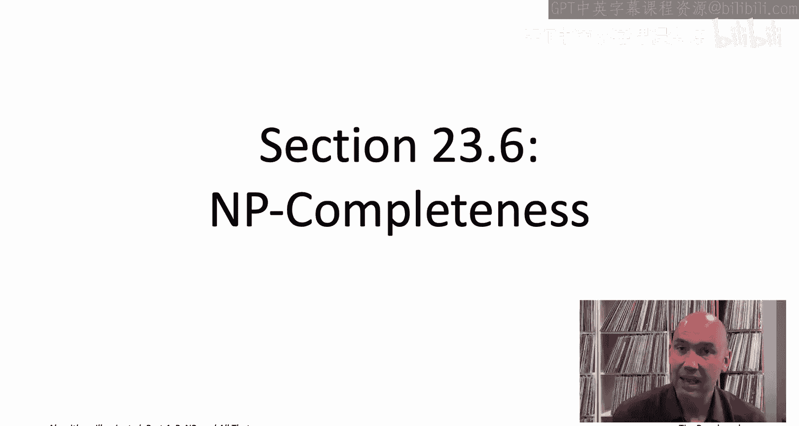
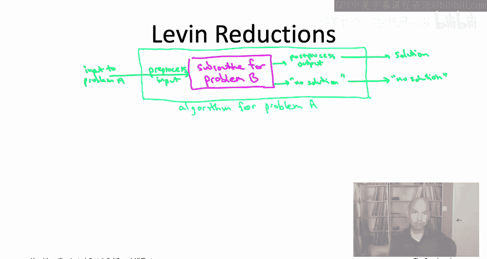
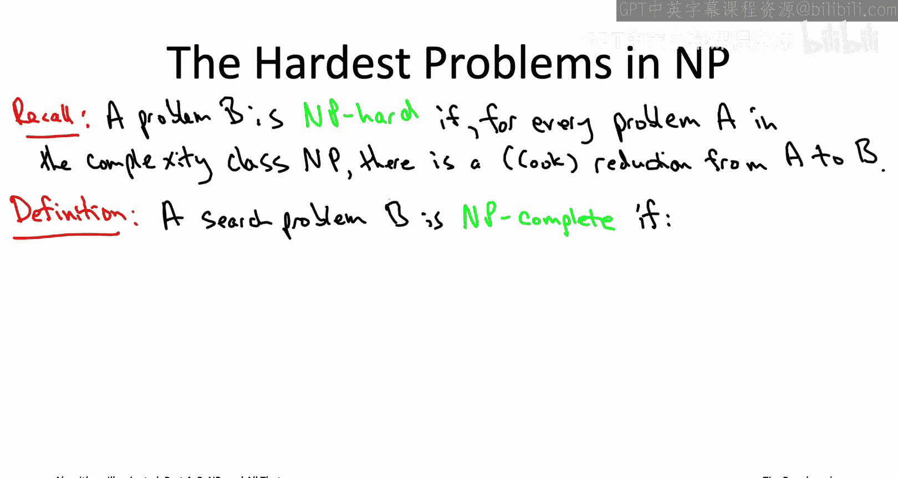
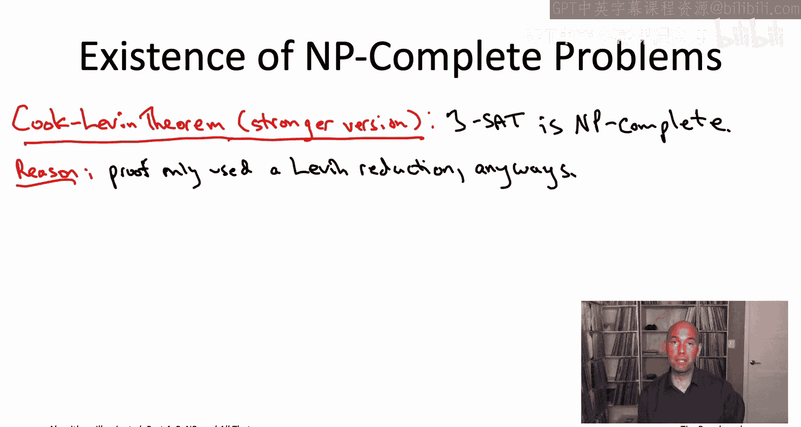
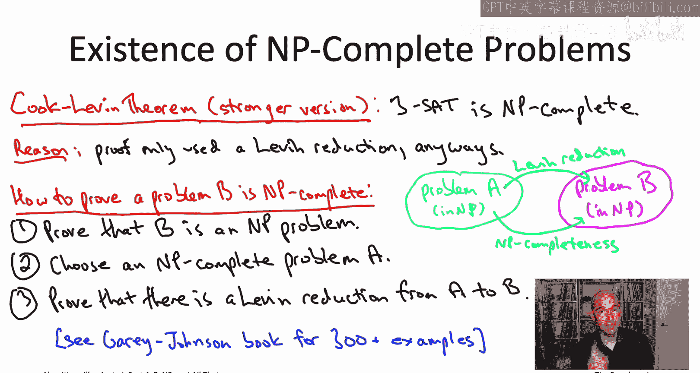

# 斯坦福大学《算法启蒙（第4册）：NP难｜Part 4 Algorithms for NP-Hard Problems》中英字幕（deepseek-R1） p36 -37-23.6_ NP-Completeness).zh_en -BV1FAVUzXEum_p36-

Hi everyone and welcome to this video that accompanies Section 23。

6 of the book algorithmrithms illuminated Part 4， this is the last section from the Opional chapterpter 23 and it's a section about NP completeness。

NP completeness is basically a specific form of NP hardness。 So， for example， the threeS problem。

 as we know that's an NP hard problem。 What does that mean that means if I gave you a polynomial time algorithm that solved the threeSaAT problem。

 you could using reductions automatically build polynomial time algorithms for all of the problems in the complexity class NP for all problems with efficiently recognizable solutions。

But in fact， we can say something more precise about3SAT and most of the other NP hard problems that we've seen。

 which is that it turns out it's actually NP complete and what that's going to mean is that actually it's not just that an efficient subrtine for3SAT is sufficient to solve every problem in NP is that actually every problem in NP is literally just a thinly disguised special case of the3SAT problem In other words。

 NP complete problems like the3SAT problem they are universal in the sense that they simultaneously encode every single problem in the complexity class NP sound pretty amazing。

 Well it is Now let's learn about it。

What do we mean when we say that one problem A is a thinly disguised version of another problem B Well we can make that idea mathematical through the use of 11 reductions。

 So 11 reduction is a special case of a cook reduction cook reductions being the reductions we've been using throughout this entire video playlist So 11 reduction is a special restricted type of cook reduction or intuitively it's only allowed to do the minimum imaginable amount of work all it can do is invoke a subroutine for the problem B once and the only other thing it can do is preprocess its input to feed it into B and preprocess B's output to return that as its final solution。

So let's redraw our usual cartoon to reflect these new restrictions imposed by 11 reduction first I should say at the outset。

 11 reductions only even make sense when you're talking about a pair of search problems so think about we're reducing some search problem A to some other search problem B like the threeSa problem in the search version of the TSP。

As usual， we'll be imagining that we're given an efficient subroutine solving the problem B。

 the problem that we're trying to prove is hard， that's the magenta box。

 and then the responsibility of the reduction is to build the light blue box to show how to use that magenta box in the service of actually solving problem A as well。

 the known hard problem。Now， unlike a cook reduction。

 which is allowed to invoke its magenta box any polynomial number of times and is also allowed to use the results of those polynomial many subroutine calls。

 however it wants， the leaven reduction is has its hands tied much more tightly。 So first of all。

 it's only allowed to invoke the magenta box once。 So the beginning of the reduction。

 pretty much the only thing it can do is take its input to the problem A。

 It's tasked with solving and then preprocesed to transform it into some input of the problem B that it can then feed into the magenta box。

Moreover，11 reduction is required to use the output of the magenta box in a very specific way。

Now remember we're dealing with search problems， so the magenta box will either say here's a feasible solution to the instance of problem B that you gave me or the magenta box will say there was no solution to the instance of problem B that you gave me。

And the blue box in 11 reduction is then required to just copy the answer。

 So if the magenta box comes back and says there was no solution。

 then the light blue box is forced to say my opinion， in my opinion。

 there's no feasible solution to the instance of a that I would started with。 On the other hand。

 if the magenta box returns a feasible solution to the instance of B it was given。

 then with polynomial amount of postpro， the leave reduction has to at that point transform it into a feasible solution of the instance of A that it was given。

So we've been seeing a whole lot of reductions throughout this video playlist。

 so the question you should now be asking is， well were we really using the full power of cook reductions or were we inadvertently just kind of using len reductions anyways？

The answer is， technically we weren't always doing leaven reductions。

 but kind of morally we really were。What do I mean Well。

11 reduction is only defined for a pair of search problems。 And if you go back to the reductions。

 we've seen many of them involved optimization problems。 However， if you go back to those reductions。

 like say the NP hardness of the traveling salesman problem。

 And instead of looking at the optimization version of the traveling salesman problem。

 you look at the search version of the traveling salesman problem。

 we were also given a target to cost capital T then all of a sudden that reduction does become 11 reduction。

 One reduction we had that was between two pairs of search problems where I think this format is super clear。

 was the second of the four big ones that we did in chapter 22。

 So that was a reduction from the threeat problem to the directed Hamiltonian path problem。

 And if you go back and look at that， or maybe you sort of remember， at least vaguely。

 we were given the threeet instance， all we did was construct a big somewhat complicated directed graph or whatever we constructed a directed graph。

 we just fed it into our directed Hamiltonian subroutine。 If it said there's no Hamiltonian path。

 we reported that there's no satisifiable assignment。 If it gave us。

iltonian path we extracted from it a satisfying assignment。

 so that is an absolutely canonical example of 11 reduction。But again。

 if you go back to the reductions throughout this video playlist， and I encourage you to do this。

 and you think about the search version of all of the optimization problems that we discussed。

 all of the reductions that we've been looking at really are leaven reductions。

You now know all about cook reductions and the special case of  leave1 reductions。

 There's a third type of reduction that I'll mention briefly just because you're likely to see it in pretty much any book on complexity theory and also plenty of books on algorithms。

 which is something known sometimes it's called a carp reduction That's what'm going call it or you may see it called the many to one reduction or mapping reduction。

 So what's a carp production， car reduction is basically just 11 reduction except for decision problems instead of for search problems。

 So remember in a decision problem， all an algorithm has to do is report yes or no。

 if there's a feasible solution， the algorithm is actually not responsible for handing one to you on a silver platter And so this cartoon on this slide becomes even simpler if you have decision problems So the magenta box。

 the subroutine for B it's just going to say yes or no。

 it's not going to give you a solution in the yes case。

 and then the light blue box it's just going to parrot that answer。 the magenta box said no。

 the blue box will say no， the magenta box says yes， the blue box will say yes， again。

 the blue box for a decision problem is not。Responsible for actually constructing that feasible solution。

So for any book that talks primarily about decision problems as opposed to the search problems that we've been talking about here。

 any book that talks just about decision problems you're going to be seeing carp reductions instead of leaven reductions again。

 I'm doing this entire video playlist in terms of search problems because those are much more natural from an algorithmic viewpoint。

We are now ready to formally define NP complete problems。

 problems that are the hardest problems within NP， problems that simultaneously encode as special cases。

 all other problems that have efficiently recognizable solutions。

NP completeness is really best thought of as a specific kind of NP hardness。

 so let me just remind you about that formal definition of NP hard problems that we finally got to three videos ago。

Our formal definition of an NP hard problem is a problem B for which for every NP problem。

 every problem， every search problem with efficiently recognizable solutions。

 for every search problem A， there's a reduction from A to B。

 and again the entire video playlist you've been looking at cook reductions so a problem is NP hard。

 if given a polynomial time subroutine solving B， you would automatically get polynomial time algorithms for all of the problems in the class NP。

To qualify as NP complete that problem B has to satisfy some additional properties。 So， first of all。

 as we'll see， only search problems are going to be eligible to be N complete。

 So while the T SP in its optimization version， that's an NP hard problem。

 The T SP in its optimization version is not going to be an NP complete problem。

 It is true that the search version of the T SP will， in fact， be an N complete problem。

 So N complete only refers to search problem。Next， it should be the case that not only is B algorithmically sufficient to solve all the problems in N P。

 Actually， all the problems in N P are literally just thinly disguised versions of B。 And remember。

 we've expressed thinly disguised versions through 11 reduction。 So for N P hardness。

 we just wanted a cook reduction from every N P problem to B。 for MPpy completeness。

 We're going to insist on 11 reduction from every N P problem to B。

This first condition is basically requiring that the problem B is simultaneously encoding all problems of NP。

 all problems that have efficiently recognizable solutions。

The second condition is so that we can interpret an NP complete problem as the hardest problems among NP。

 and so for that to make sense we're going to require that B is in fact a member of NP。

 that B in fact is a search problem with efficiently recognizable solutions。

So this definition of an NP complete problem that's one of the absolute most important definitions in the entire history of the field of computer science。

 So I want to make sure that it's clear that you will。

 if you look in some books see a slightly different definition of NP completeness and I don't want you to get confused So again what we're working with here is search problems or an algorithm is responsible for handing back a feasible solution when one exists and 1 reductions where you preprocess an input feed it to the subroutine and postproces its output to get a feasible solution when one exists in many books instead they will use decision problems rather than search problems and a decision problem is a yes no problem so you don't have to construct a feasible solution you just report whether one exists and then if you're using decision problems the analog of 11 reduction is one of these carp or many to one reductions where you don't even need to bother with a postproces step you just ask them a Gen box yes or no and then you just。

That exact same answer as your own。So I say all this just to ward off any confusion。

 should you go read about NP completeness from another source and actually at this point。

 you might be kind of irritated because we have these three different types of problems。

 you decision and search and optimization with these three different types of reductions cook and len and carp。

 and it seems like you can mix and match and it's not really clear you know which pair you should use。

 but know unless you're going into complexity theory full time。

 if you're focused mostly on the algorithmic side， don't worry about the fact that there's multiple kinds of problems and there's multiple kinds of reductions as far as the algorithmic implications as far as the guidance the theory gives you about how to tackle different problems it's exactly the same no matter which of these definitions that you use。

How cool is the definition of an N complete problem。

 a single problem with efficiently recognizable solutions that simultaneously encodes every such problem。

 It's kind of amazing that an N complete problem could really exist。😊。

Wait a minute。I actually haven't shown you an example of an NP completelete problem yet。

 so do they really exist？There are such universal problems， and in fact。

 the theorem that we've touched on a couple times already shows that the cook Levin theorem When I first showed you this theorem。

 I kind of shortchan it， I said that it proved that the threeatAT problem is NP hard。

 it actually proves something stronger， it proves that the3SaAT problem is in fact NP completes。

And the reason this is true， the reason the Cooklevin theorem actually says something stronger。

 it's actually kind of evident if you go back and review the proof sketch of the Cooklen theorem that I gave to you a few videos ago。

 so back then the proof was a reduction it was a reduction from an abstract NP problem。

 which we were calling a a reduction from that problem A to the threeat problem and at the time we were only worried about having using a cook reduction because those were the only reductions we knew about up to that point。

But if you go back and look at the sketch of that reduction。

 it is a canonical example of 11 reduction。To remind you how that reduction worked。

 so you fabricate this threeSa instance， it has two sets of decision variables。

 one set of decision variables encodes candidate solutions to the instance of the problem A that you were given。

 and then there's this sort of twodisal table of state variables that are encoding the computation performed by the verification algorithm associated with that abstract NP problem capital A。

And we also had a bunch of constraints to enforce the intended semantics across the state variables。

Point being all the reduction did is take the given instance of the problem A。

 construct this big threesatAT instance and construct it in a way that there's a correspondence between satisfying assignments to that threeat instance and feasible solutions to the instance of the problem A that the reduction started with and so then what did it do it literally just invoked it's assumed subroutine for solving threesat once on the threeat instance that concocted and if the subroutine said there's no satisfying truth assignment。

 the reduction concluded that there was no feasible solution to the instance of problem A it was given on the other hand if a subroutine for threeatAT came back with a satisfying assignment。

 you could read off a feasible solution to the instance of a we were given just from the values of the solution variables and that's exactly what 11 reduction does pre-process i。

e transform an instance of this problem to a threeat instance invoke the assumed subroutine wants that's what we did and then just basically copy the results and for the case where there is a feasible solution do some post-process to translate it to a solution。

The problem that you started with。That's the stronger version of the cook Len theorem is a sketch of why it's true。

 So that' you know that's not an easy observation。 There's a reason that major prizes were awarded to cook and Levin for this work But now again。

 the good news is that once we have one NP complete problem。

 we get to stand on the shoulders of these giants and use reductions to generate further NP complete problems So we already used reductions to spread NP hardness and there we were working with cook reductions because NP completeness is all about Len reductions。

 we're going to use leaven reductions to spread NP completeness from one problem to another。

So what this means for us is that we have a very simple three step recipe for proving that a problem is NP complete。

 very much in the spirit of our two step recipe for proving the problems were NP hard。

 so remember then that two step recipe how did it work， you choose known NP hard problem A。

 and then you reduce it to the target problem B using a cook reduction。

So to spread NP completeness we're going to need to make a couple changes but not much So first of all。

 why do we need a third step Well it's because you know NP completeness remember that means not only are the reductions from all the problems in NP to U。

 but you better yourself be a member of the class NP you're supposed to be one of the hardest problems in NP if you're an NP complete problem So the extra step is just checking that the problem B that you're trying to prevent NP complete really does belong to NP because that's a prerequisite otherwise it's the same you choose a known N completes problem A and then you reduce it to the problem that you're interested in B and if you want to spread not just NP hardness but NP completeness then it's important that you use 11 reduction rather than a more general cook reduction but that is it prove that your problem in NP choose your favorite NP complete problem you can start with 3atAT and then reduce that problem using 11 reduction to your target problem if you can do those three things boom your problem B is in fact NP complete。

Now this simple three step recipe has been applied many times over， and as a result。

 we now know that thousands of natural problems are NP complete。

 including problems from all across engineering， the life sciences and the social sciences。

 For example， the search versions of almost all of the optimization problems we've discussed。

 you know including the TSP， the NApsack， maximum coverage， minimum mix span。

 the search versions of all of those optimization problems are in fact not just NP hard。

 but NP complete。If all of the NP complete problems from Cha 22 aren't enough， well。

 then you can check out that classic book I mentioned earlier by Gary and Johnson for hundreds of more examples of NP complete problems。

That concludes these videos that accompany the optional chapter 23 on P NPP and all thats thanks very much for checking them out。

 I hope you now having watched them feel much more solid mathematically you on exactly what does it mean for a problem to be NP hard。

 what's the rigorous definition， you know what's the formal definition of the P versus NP conjecture you know what's the difference between a problem being NP hard or NP complete。

 what are these fancier conjectures like the exponential time hypothesis and so on？

These videos were directed at those of you who were motivated to up your level of expertise with NP hard problems up to the highest level that we mentioned level4 so at this level you can actually have your colleagues gather around you at a whiteboard while you regale them with tails about what the P versus NP conjecture actually is so I hope after spending some quality time with these videos you feel like you've reached that level or at least are quite a bit closer to that level than you were when we started。

Coming up next are going to be the videos for the last chapter of the book， Cha 24。

 which is all about a big and exciting case study on something called the FCC incentive auction。

 which was a big complex algorithm involving tens of billions of dollars that reallocated a bunch of wireless spectrum in the United States just a few years ago。

 it turns out under the hood of the FCC incentive auction you can find an amazingly wide swath of the algorithmic toolbox that you've learned in this video playlists。

 so don't miss it， I'll see you there。

