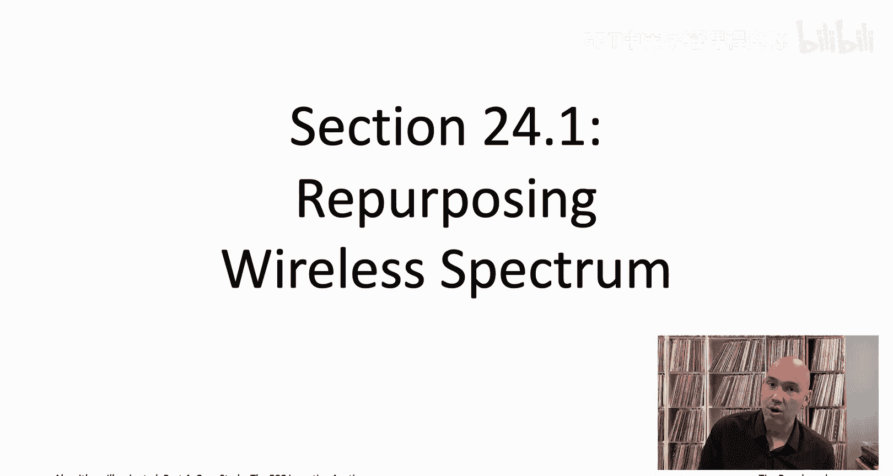
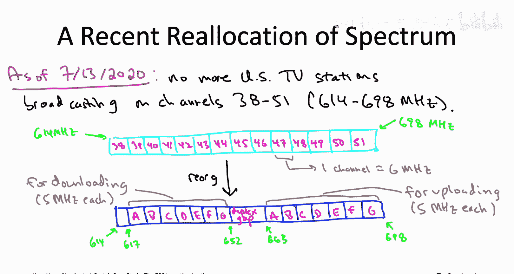

# 斯坦福大学《算法启蒙（第4册）：NP难｜Part 4 Algorithms for NP-Hard Problems》中英字幕（deepseek-R1） p37 -38-24.1_ Repurposing Wireless Spectrum).zh_en -BV1FAVUzXEum_p37-

Hi， everyone， and welcome to this part of the playlist that accompanies Chapter 24 of the bookArithms illuminated。

 Part 4。 This chapter is all about a detailed case study of our algorithmic toolbox for tackling NP hard problems in action。

So NP hardness it is not some purely academic concept。

 it really does govern your computationally feasible options when you're tackling a real world problem。

 and so in these videos we're going to see a recent illustration of the importance of NP hardness in the context of a highs stakes economic problem。

 namely reallocation of a scarce resource， specifically wireless spectrum。

The solution deployed by the US government， something known as the FCC incentive auction。

 it actually employed an amazingly wide swath of the algorithmic toolbox。

 which you have just learned from this book or from this video playlist。

 so as we go through these videos and we learn about the details of the FCC incentive auction。

 I encourage you to pause on occasion and just to appreciate the journey that we've taken together through algorithms illuminated。

 which started way back at the beginning of part1 when we struggled through carrotub multiplication and the merge short algorithm。

 how what they' have initially seemed like a cacophony of unconnected and mysterious tricks has now resolved into a symphony of interlocking algorithmic techniques。

Before we get started， I should say that if you want to read more about the FCC incentive auction from its lead designers。

 namely Kevin Laightton Brown who's a computer scientist at University of British Columbia and Paul Milgramm and Ilia Seal。

 both economists at Stanford University， I encourage you to dig into their paper。

 the economics and computer science of radio spectrumrum reallocation and if you're interested more broadly in connections between economics and computer science。

 well that happens to be one of my main research Areas。

 and I wrote a book back in 2016 called20 lectures on Alic Game The。

 so if that sounds intriguing to you， I encourage you to check it out。

Let's begin by describing the motivation for the FCC incentivecent auction。

 which was to reallocate wireless spectrum。

So a little history。 So television spread like wildfire over the United States back in the 1950s。

 And in those early days， television programming was transmitted solely over the air by radio waves sent from a station's transmitter and received by a television's antenna。

Now to coordinate station's transmissions and prevent interference between them。

 the Federal Communications Commission or FCC for short。

 divvied up the usable frequencies for broadcasting， and that's what's known as the spectrum。

 the usable frequencies， and they divided the spectrum into blocks called channels of6 meHz each。

To prevent interference， naturally， different stations in the same city would then broadcast on different channels using different frequencies。

 different colors of light。For example， what Cha 14 actually means is the frequencies between 470 MHz and 476 MHz。

 Channel 15， the next block of 6 MgaHz So from 476 to 482 MHz and so on。

Channels 14 and 15 are examples are of what are called Ul high frequency or UHF channels and they start with channel 14 at 470 meHz and they go up from there in6 meHz blocks there's also the very high frequency or VHF channels and they occupy lower frequencies so channels 713 they use frequencies from 174 to 216 meHz whereas meanwhile channels 2 to6 use the frequencies from 54 to 88 MHz and if you do the math and you're like。

 oh there's an extra 4 meHz in that range from 54 to 88 well that's for miscellaneous uses like say garage door openers。

Back in the mid 20th century， television didn't have a lot of competition for spectrum。

 and so a big block of spectrum， lots of different frequencies were reserved for over the air television broadcasting。

 also called terrestrial television broadcasting。But now fast forward to the 21st century and you know what else travels by radio waves over the air。

 all the data between exchanged between your mobile phone and the nearest base station。

So for example， right now， speaking in the year 2020。

 if you're in the United States and you're using Verizon Wi as your carrier。

 chances are you've been downloading data using frequencies between 746 and 756 megaHz and uploading data using frequencies between 777 megaHz and 787 meHtz。

You may notice that these numbers in the 700s， they're higher。

 They're higher frequencies than the ones we were talking about for television channels。

 which were in the 600s and below。 That's not an accident to avoid interference。

 The part of the spectrum reserve for cellular data does not overlap with the part of the spectrum reserve for terrestrial or over the air television。

Now as you can imagine， mobile and wireless data usage has been exploding in the 21st century and just in the last five years。

 like 2015 to 2020， it's increased by roughly an order of magnitude now the more data you want to transmit。

 the more dedicated frequencies you need and not every imaginable frequency。

 not every single color of light is useful for wireless communication so for example。

 you know if you have limited power then very high frequencies will only carry signals for short distances。

So the upshot is that spectrum is a scarce resource and modern technology is as hungry for as much as it can get。

Now， television， you know， it's still a pretty big deal。 Lots of people watch television。

 but terrestrial television， meaning broadcasting over the air that is nowhere near as big as it was back in the mid 20th century。

 So in fact， roughly 85 to 90% of households in the United States rely exclusively on cable television。

 which of course， goes via cables and needs no over the air spectrum at all。

 or alternatively by satellite television which uses much higher frequencies than typical wireless applications。

 So reserving the most valuable spectrum real estate for over the air television that made sense in the mid 20th century。

 not so much in the early 21st。

To reflect this shift in eds of spectrum over the past 70 or so years。

 as of this recording in mid 2020， a major reallocation of spectrum is nearing completion。 So。

 in fact， in the United States， after July 13，2020。

 there will no longer be any stations anywhere in the country broadcasting on what had been the highest channels。

 The channels between 38 and 51， corresponding to the frequencies from 614 to 698 MHz。

Every station that had been broadcasting on one of these 14 channels is either switching to a lower channel or seizing all terrestrial transmissions。

 while possibly still broadcasting via cable and satellite television。

Even some of the stations that were already broadcasting on channels below 38 are going off the air or migrating to different channels to make room for their comrades that are dropping down from channels 38 to 51。

And all told， 175 television stations are relinquishing their broadcasting licenses and going off the air while roughly1 thousand television stations are switching channels。

Now， switching channels， it's not quite as big a deal as it may sound because since the 2009 switchover from analog to exclusively digital broadcasting of terrestrial television switchover you may have heard about quite a bit in the news at the time。

 So since the 2009 switch to digital， a logical channel。

 meaning the channel that you see on a set top box that can be remapped to a physical channel different from the one historically associated with that channel number。

 So what that means is that stations that have their physical channel reassigned。

 they still get to keep their logical channel via this remapping。Clearing out these 14 channels。

 channels 38 to 51， it liberated 84 MHz of spectrum。 So what's happened to it？ Well。

 that spectrum has been reorganized and awarded to telecommunication companies。

 like say Tmobil D and Comcast who are expected to use that new spectrum to build out a new generation of wireless networks in the coming years。

 Tmobile， for example， as you've maybe already seen from their television commercials。

 has already flipped the switch on its new nationwide 5G network。

Where there had previously been television channels 38 to 51 after a reorganization。

 there are now seven independent pairs of 5 meHz blocks。 So that's what's denoted by the ABC D。

 E FG in the bottom figure。 So， for example， the first pair of blocks comprises the frequencies from 617 to 622 MHz that's meant for downloading to a device and then that's paired with a 5 meHz block from 663 to 668 meHz。

 which is then meant for uploading。 And then the second paired block is just sort of shifted down by 5 meHz。

 So 622 to 627 and 668 to 673， and so on for all7 of those paired blocks。

There's also an 11 MHz duplex gap from 652 MHz to 663 that separates the blocks meant for uploading and those meant for downloading then there's also at the sort of very left at the very sort of bottom of 3 MHz guard band。

 So from 614 to 617 MHz， that's to avoid interference with channel  channeln 37。

 which has long been reserved for radio astronomy and wireless medical telemetry。

Now this should all strike you as kind of a crazy messy operation right there's so many questions to answer so you had all these stations that were on the air before。

 which of them should go off the air， how do you choose for the ones that stay on the air。

 which of them should switch channels and what should those new channels be。

For the stations that go off the air and relinquish their licenses。

 what's the appropriate compensation for doing so？Then know after you've done this reorganization and you've created these seven paired blocks。

 which telecommunication companies are the lucky ones that get awarded them and what should they have to pay for them？

These were all questions that had to be answered by the FCC incentivecentive auction。

 which was basically a big complex algorithm for doing the spectrum reallocation that leaned heavily on the toolbox for tackling NP hard problems that have been described in this video playlist。

Starting with the next video， we will talk about how this algorithm actually works。

 I'll see you there。

