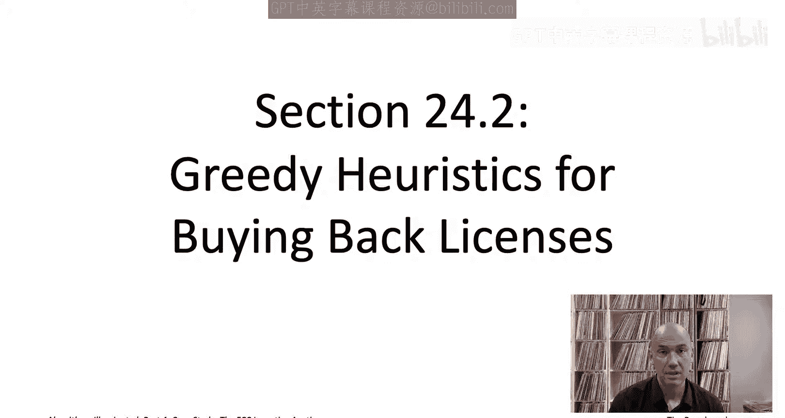
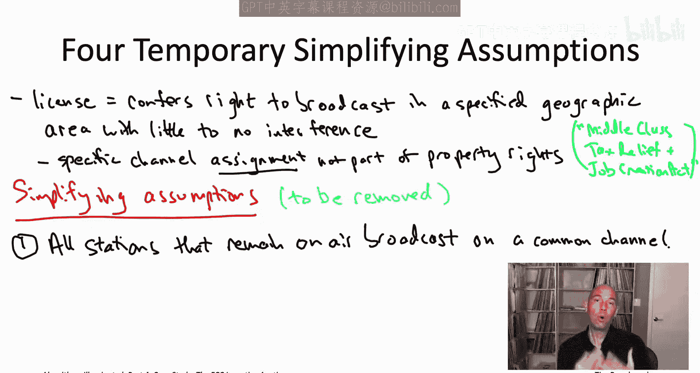
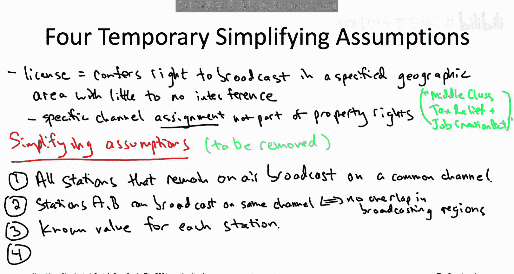
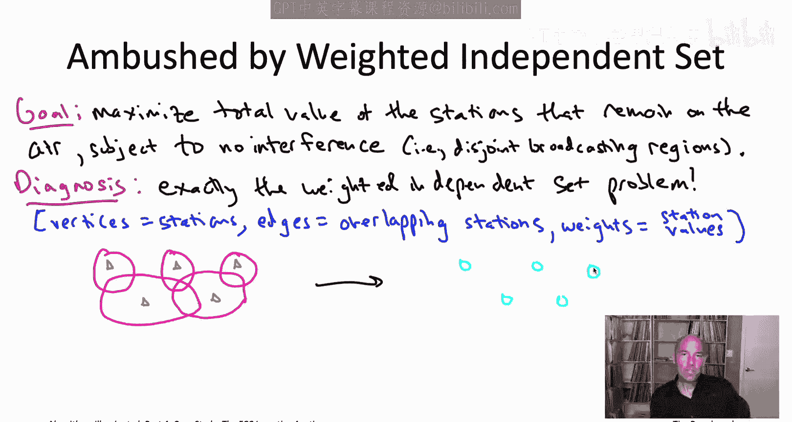
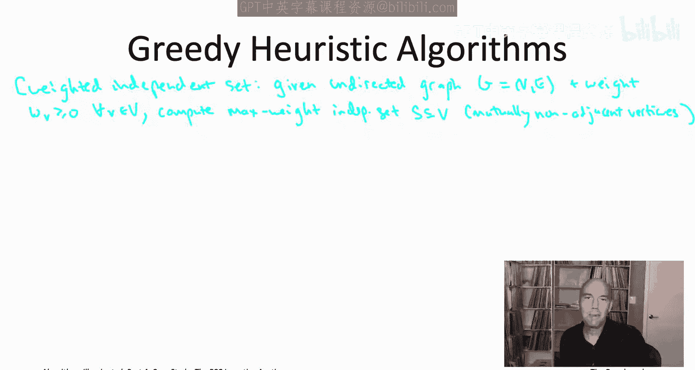
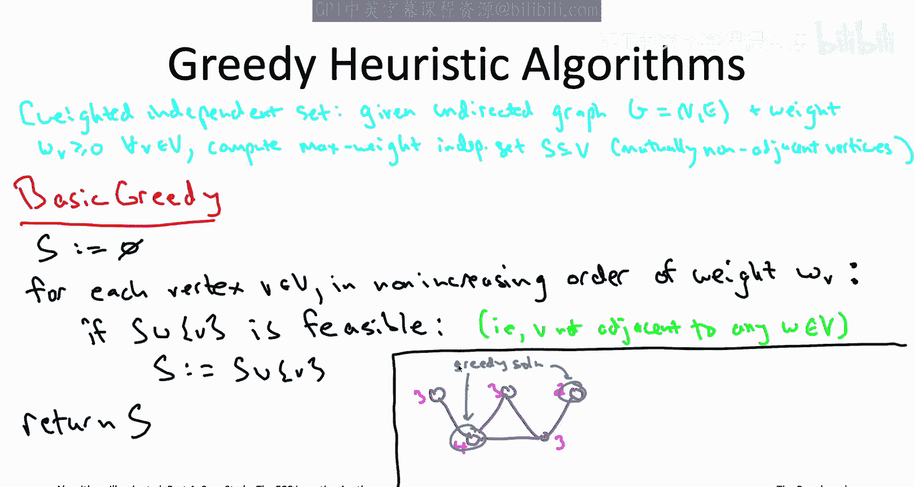
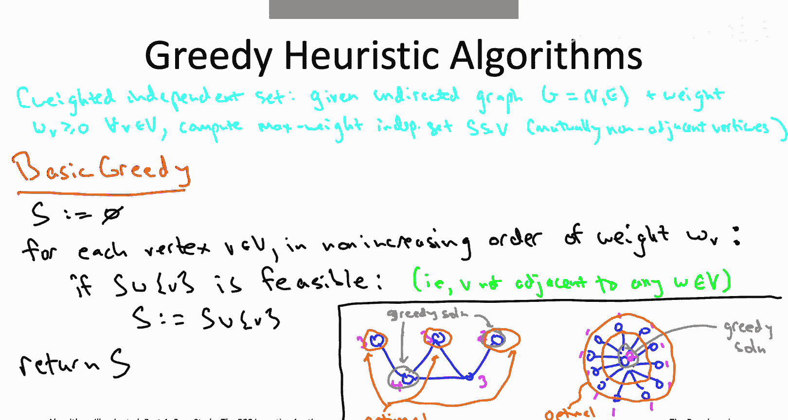

# 斯坦福大学《算法启蒙（第4册）：NP难｜Part 4 Algorithms for NP-Hard Problems》中英字幕（deepseek-R1） p38 -39-24.2_ Greedy Heuristics for Buying Back Licenses)  -Pt 1_2-.zh_en -BV1FAVUzXEum_p38-

Hi， everyone， and welcome to this video that accompanies Section 24。

2 of the book algorithmms illuminated Part 4。 It's a section about greedy heuristics for buying back licenses in the FCC incentive a。

 Now， the FCC incentive a。 It actually had two parts。 It had on the one hand， a reverse auction。

 which was responsible for deciding which stations should switch channels。

 which station should go off the air and also what was the appropriate compensation for those stations。

 and it also had a forward a responsible for deciding who would receive blocks of the newly freed spectrum and what they would pay for it。

Now the US government， actually governments of lots of different countries。

 had been running these forward auctions to in effect sell spectrum licenses to the highest bidder for quite a while for something like 25 years making small tweaks to them along the way。

 so in this case study we're going to focus on the most innovative part of the FCC incentive auction namely its unprecedented reverse auction for buying licenses back from television stations。

 so let's dive right in。

Let's first just be clear on exactly you know what it is that the government is buying back in this reverse auction from television stations。

 So if you're a television broadcaster， property rights are conferred to you by the FCC through a broadcasting license。

 and that license will authorize broadcasting over some channel in a specified geographic area。

 and the FCC assumes responsibility for ensuring that a station receives little to no interference across its broadcast area。

Now interestingly， for the purposes of the FCC incentive auction。

 the specific channel assignment of a station like Channel 41 was not considered part of the license owner's property rights。

 so an active Congress was actually required to authorize this interpretation and allow the auction to reassign stations channels as needed 2012 was not a great year for US Congress it passed only eight bills that year。

 but this was one of them， maybe the reason that this bill authorizing the FCC incentive auction passed is because it had the not exactly descriptive but possibly pretty vetoproof title。

 the middleclass tax relief and job creation Act。The goal of the reverse auction in the FCC incentive auction was to reclaim enough of these licenses from television stations to free up a target amount of spectrum。

 like say the 84 MHz tied up by channels 38 to 51。 So to get an initial feel for this problem of reclaiming enough licenses to free up a target amount of spectrum。

 let's begin with four simplifying assumptions。 These are not that reasonable。

 but they'll help us understand the problem and will remove all of these as we go along。

So first of all， a pretty ridiculous assumption and one will relax pretty soon。

 but for now let's just assume that all the stations that remain on the air all broadcast on a single channel。

 so suppose every station on the air is forced to broadcast on say channelnel 14。

The second assumption， which is approximately accurate。

 but we'll tweak it a little bit in the next video is we're going to assume that two stations can be on the air simultaneously on the same channel。

 if and only if there's no overlap among their broadcasting regions。

Third， we're going to assume that we know what the value of each station is in US dollars。

 so maybe we know this stations worth $10 million， this other one's worth $17 million and so on。

Finally， let's assume for the moment， an authoritarian government that can just unilaterally sort of take stations off the air whenever it wants。

 Now， that's not what happened。 The Government did not use eminent domain to reclaim these licenses。

 Rather， the stations going off the air relinquish their licenses voluntarily in exchange for compensations。

 We'll have to talk about that in a couple videos from now。 But for now。

 let's just imagine the government could unilaterally take stations off the air whenever it wants。

Under these four simplifying assumptions， which again we'll remove later。

 but for now making these simplifying assumptions， let's try to formulate the computational problem that we're dealing with。

So what are the decisions that we're making fundamentally。

 we're deciding which stations stay on the air and which stations have to go off the air。

What's the objective function we care about while stations have values。

 so it makes sense to have the most valuable stations stay on the air and the least valuable stations be the ones that go off of the air。

 so a natural objective function would be to maximize the total value of the stations that remain on air。

So what about the constraints Well， those are specified by these first two of the simplifying assumptions。

 so the second assumption what that does is it forbids any pair of overlapping stations from broadcasting on the same channel。

Now by our first exception， there's only one channel available。

 so that means we're only going to be able to allow stations to both remain on the air if they have disjoint broadcast areas。

Summarizing then， the optimization problem that we're really interested in under these four simplifying assumptions is to maximize the total value of the stations that remain on air。

 subject to no interference， subject to the stations remaining on the air。

 having disjoint broadcast regions。As always， when you first see a computational problem。

 you want to recognize it if it's something you've already seen or a special case of something you've already seen。

 So do you recognize this optimization problem。Well， I'm guessing some of you do。

 this is something we talked about quite recently， this is actually exactly the weighted independent set problem。

The vertices of the graph correspond to the television stations that we might want to put on the air。

 and remember in independent set， edges represent conflicts。

 and so here two stations or two vertices， they're going to conflict if they have overlapping broadcast regions。

So for example， if you imagine the following five stations with each circle representing the broadcast area of that station。

The little gray triangles are meant to indicate the transmitters。

 so I'm showing off kind of the limits of my artistic abilities here。

So this picture is going to correspond to a graph with five vertices。

 one for each of the five stations。And an edge for each pair of circles that overlap。

The values of these stations would translate over into weights for the vertices。

Now recognizing this problem is really just being weighted independent set in disguise。

 that's not necessarily good news for us right so back in the videos corresponding to chapter 22。

 we proved that the independent set problem is NP hard。

 even when all the vertices just have a common weight， a weight equal to one。

Now we did see back in part three in our dynamic programming boot camp that you can solve the weighted independence set problem on path graphs or more generally on tree graphs。

 but if you think about it， the interference patterns of television stations are not at all treelike so for example。

 literally every station in New York City interferes with every other station in New York City so that's going to be this big clique in the graph so a bunch of vertices that are all mutually adjacent。

 very， very different than a tree。So we've now recognized our problem as basically being weighted independence set and it does not appear to be a polynomial timeslvable special case of the independent set problem。

 but you know no reason to give up， remember the whole point of this video playlist is that NP hardness is not a death sentence so we now have this rich toolbox lots of different things we can throw at this version of weighted independence set to try to solve it in practice。

So we could start with the most ambitious goal of trying to solve this problem exactly like really finding the subsidtive stations with disjoint regions that maximizes the total value。

 So are we going to be able to do that in a tolerable amount of time。

 So let's say in maybe like a week or less of computation。Well。

 the answer to that as always is going to depend on how big a problem size you're dealing with right so if we only had like 30 stations we could even just use exhaustive search to find the maximum value subset of stations with no interference。

But unfortunately， in the United States， there's more like thousands of stations to deal with and tens of thousands of interference constraints。

 so that's way above the pay grade of exhaustive search or even the dynamic programming techniques that we talked about in the videos corresponding to chapter 21。

This means that if we really want an exact algorithm。

 there's sort of one tool we have left at the bottom of our toolbox that we can try。

 which would be the semi reliable magic boxes that we discussed。

 So we're dealing with an optimization problem maximizing the total social value。

 station value subject to no interference， and so for optimization problems the first magic box you should think about would be a mixed integer programming solver。

And indeed， the weighted independence at problem is very easy to encode as a mixed integer program。

 I encourage you to think through what that formulation would look like。

 it's really quite straightforward and indeed using a mixed integer programming solver is exactly the first thing of the FCC tried。

Unfortunately， the problem faced by the FCC， these thousands of stations and tens of thousands of interference constraints。

 that proved too big， and even the latest and greatest mixed integer programming solvers choked on it。

 or to be fair， the latest and greatest solvers choked on the harder multichannel version of the problem that we'll discuss in a couple of slides。

With all the options exhausted for a 100% correct algorithm， at that point。

 the FCC had no choice but to compromise on correctness and instead use a fast heuristic algorithm。

For the weighted In head problem， as with so many other NP hard problems。

 the greedy algorithm design paradigm is the perfect place to start brainstorming about fast heuristic algorithms。

 And like with many problems it's easy to come up with multiple greedy algorithms that you could use。

 maybe the first one you'd think of if you wanted to tackle the weighted independent head problem using a greedy algorithm。

 it be to mimic the idea behind crustesco's algorithm。

 So Crusco makes a single pass over the edges from most attractive to least attractive。

 was including it in the solution as long as it preserves feasibility。

 we could do the same thing here。 Now we're picking vertices。

 So we'll do a single passover the vertices of the graph。 Most attractive means highest weight。

 least attractive means lowest weight。 So we'll go in descending order of vertex weight。

 and then we'll just include the current vertex in our solution as long as it doesn't mess up feasibility As long as that vertex is not adjacent to some vertex that we committed to in a previous iteration。

Let's call that algorithm the basic greedy algorithm and again it takes as input some instance of weighted independent sets that's going to be an undirected graph along with a nonneg vertex weight for each vertex and its responsibility is to output an independent set that's a subset of vertices that are all non-adjacent so you're not allowed to pick both endpoints of the same edge and then subject to being an independent set you're supposed to do as well as you can maximizing the total weight of the independent set。

This basic greedy algorithm is probably the most natural starting point。

 We're not necessarily expecting it to be the most amazing。

 fastturistic algorithm we might expect to do better。

 This is really just the start of our brainstorming。

 but it's going to help us understand the intricacies of the problem a bit better by exploring what it does on some examples。

 So let's start with with a five vertex example and see what this algorithm does。

This is the exact same graph we used in our example showing the correspondence between the station selection problem and the independent set problem I've labeled each of the five vertices in magenta with their weight。

So what is the basic greedy algorithm going to do if it's given this graph as input what's going to do a single pass through the vertices starting with the one with highest weight and concluding with one the lowest weight So here the highest weight vertex is that one in the lower left it has weight for Now of course the greedy algorithm starts with the empty set so there's no conflicts between the first vertex and what it's already chosen so far because it hasn't chosen anything so far So the greedy algorithm will always select the vertex from that first iteration so in this example it'll definitely select that weight for vertex。

Now in the second， third and fourth iterations， the algorithm is going to consider the three weight 3 vertices in some arbitrary order。

 but the order actually doesn't matter because now that we've already committed to the weight 4 vertex。

 that's adjacent to all three of the weight 3 vertices So second iteration。

 third iteration4 iteration when we ask when we ask the test。

 could we include this new vertex into our current solution without destroying feasibility。

 the answer is no， if we tried to include one of these weight 3 vertices。

 it would destroy feasibility because each of those vertices has an edge connecting it to the weight4 vertex that we already chose。

So in the fifth iteration， the last one， the greedy algorithm considers the lowest weight vertex。

 the weight2 vertex， and you'll notice that that vertex actually is not adjacent。

 is not a neighbor of the weight4 vertex， so it's safe to include the weight2 vertex and that will conclude the greedy algorithm so it'll pick the lower left and the upper right vertices in its solution。

The output， therefore， the basic greedy algorithm is an independent set that has total weight 6。

 pretty easy to see that's not an optimal solution。 That's not the maximum weight independent set。

 because if we pick all three of the vertices on top， that's also an independent set。

 And that one's going to give us a total weight of 8。 And that turns out to be the optimal。

 The maximum weight independent set。

So how should we feel about this example Well， it's not really clear right， I mean。

 the weighted independence set problem as we know is an NP hard problem。

 this basic greedy algorithm quite obviously runs in polynomial time。

 so we are fully expecting examples of this type where its output is not optimal if there were no inputs of that type。

 we would have refuted the P equal to NPB conjecture and that's not something we're expecting to happen。

But here's a more troubling example which suggests we might actually want to revisit the greedy algorithm and use a different one。

So in this example we have a star graph， so there's a center vertex which has weight two。

 and then there's a bunch of spokes， so there could be any number of spokes on the slide here there's 11 spokes and each of the vertices on the perimeter has a weight of one。

So what is the basic greedy algorithm going to do here。

 well it's going to start with the highest weight vertex， which is the center vertex with way2。

 and it's going to pick it， it's going to commit to it。

 thereby precluding it from picking any of the spoke vertices。

And that's a pretty terrible outcome for this greedy algorithm。

 It just outputs this independent set that's a single vertex。 It has weight 2。

 What do we wish it had done， We wish it had instead chosen all of the spokes。 So in this case。

 it would have had a total weight of 11 to choose the independent set consisting of all of the spoke vertices。

What went wrong with this example， The reason the basic greedy algorithm did so poorly is its single minded focus just on the weight of a vertex without thinking about other ramifications of committing to a vertex in your solution。

 So particularly， the basic greedy algorithm did not take into account that choosing this center vertex would block from future consideration all of the spoke vertices。

 So how can we tweak this algorithm so that we do have the option of taking into account。

 the degree of a vertex， the number of other vertices that it would block if it were chosen。

To avoid the errors of the basic greedy algorithm， we can discriminate against vertices that have high degree that have many neighbors who would knock a bunch of other vertices out of consideration if we chose them。

 So， for example， we could do a cost benefit analysis。 We could take a vertex。 We could say， oh。

 okay， if we pick this vertex， we get its weight， whatever it is， you know，10。On the other hand。

 if we pick this vertex it knocks out from consideration a bunch of vertices。

 so V in particular won't ever be considered again。

 but also all the neighbors of V will be knocked out of contention from being chosen in the future。

 so we use up the degree of v plus one vertices， the plus1 is for V itself。

 we use up the degree of v plus1 vertices getting a benefit of w sub V that vertex is weight so rather than just doing a single passage with the vertices from high weight to low weight。

 we could look at the bang per buck so the weight that you get for the vertex per vertex that gets knocked out of future consideration that would be an alternative greedy algorithm that would discriminate against high degree vertices。

More generally， the greedy algorithm can compute vertex specific multipliers howeverever it wants in a pre processing step。

 then scaling the vertex weights by those multipliers and proceeding to visit the weights in non- decreasingecreing order of their scaled weights。

 that's what we're going to call the general greedy algorithm。

I've been calling this a greedy algorithm right but really this is a whole family of greedy algorithms for each formula for how you might compute the betaus of vs。

 you get a different greedy algorithm， So the basic greedy algorithm that we discussed to that correspondence to setting beta sub v equal to1 for every vertex v。

 we also discussed the possibility of discriminating against high degree vertices by setting beta sub v equal to1 plus the degree of the vertex v。

 but you try you could play around with other formulas as well。So the question then is okay。

 of all these greedy algorithms。 Which one should you use。

 What's the best choice of these vertexspecific multipliers Now。

 keep in mind that no matter how smart a formula you use for computing the betaus of vs there's going to be examples where the greedy algorithm does not return a maximum weight independence set where it return something suboptimal I say this assuming that the beta of v can be computed in polynomial time so that the entire algorithm runs in polynomial time and as usual。

 assuming that the p equal to NP conjecture is true。

 But for any reasonable beta these you might possibly think about you're not expecting the greedy algorithm to be correct in all cases。

 So how should you choose among the different competing ways to define the betaus of these。Well。

 the best choice is going to depend on the problem instances that tend to show up in the application that you're interested in。

 which means that the best way to figure out which betas of these to use is empirically。

 really just by trying a whole bunch of different possibilities on representative instances and this really kind of ties into some general advice when you're tackling NP hard problems in a real application which is exploit as much domain specific knowledge as you can so hopefully you have some representative instances for your application。

 those can be used to tune these vertex specificific multipliers in the best possible way。

Now in the FCC incentive auction， one thing that the designers had going for them is that they really did have representative instances。

 so they really did have domain knowledge about what instances of weighted independence set they cared about including for the multichannel generalization that we'll start talking about on the next slide and you can already see part of why that's true so like what is the graph and these independent set problems the vertices correspond stations so they knew about all the stations in advance that were going to be participating in the FCC incentive auction and then the edges of the graph are derived from interference constraints overlapping broadcast regions and those were also fully known in advance those were specified by all the station's existing licenses Now there are these vertex weights wasn't totally clear you know what those are。

 those are sort of known to the owners of the license not necessarily to the FCC in advance but you can make educated guesses and try a range of possibilities about reasonable station values informed by historical data like what licenses had sold for in the past。

They then used these representative instances to tune the parameters。

 to choose how to compute beta sub V， and what they discovered is that it was possible to carefully tune those parameters so that on their representative instances。

 this greedy algorithm was routinely returning solutions with total weight quite close to the maximum possible。

 quite close to optimal， like well over 90% in most cases。

You might be well wondering how were these parameters beta sub V actually set in the real FCC incentive auction Well I put the formula for the real beta sub V's down here at the bottom of the slide。

 so in the FCC incentive auction beta sub V for a station V was defined as the square root of the degree of that station。

 meaning the number of stations with which it overlaps the number of stations which it would block from being assigned to the same channel。

 times the square root of the population served by that station。

We've already seen the point of allowing the beta to depend on the degree of a vertex or of a station that's used to discriminate against vertices with high degree or equivalently here stations that overlap with many other stations would block many other stations from being on the air we're penalizing high degree vertices less severely here by taking the square root than we were in the original formula。

 but still that's what this does discriminates against stations with many overlapping stations。

 The point of the second term， the square root of pop term that was more subtle。

 and frankly more controversial as well。 its effect was actually to decrease the compensation paid by the government to small television stations that were likely to go off the air in any case。

 and it did indeed have that intended effect。

