# 斯坦福大学《算法启蒙（第4册）：NP难｜Part 4 Algorithms for NP-Hard Problems》中英字幕（deepseek-R1） p39 -41-24.3_ Feasibility Checking)  -Pt 1_2-.zh_en -BV1FAVUzXEum_p39-

Hi everyone and welcome to this video that accompanies Section 24。

3 of the book algorithmrims illuminated Part4， this is a section about feasibility checking in the FCC incentivecent Auction。

So in the last video we developed a greedy heuristic algorithm for the value maximization problem so packing the most valuable stations on the air on a given number of channels subject to no interference between them what we saw is that in each loop of that greedy algorithm we needed to do a feasibility check which basically boiled down to a graph coloring problem which of course is an NP hard problem But one takeaway from that video is that if we only had a magic box that could perform feasibility checking for us。

 then we could actually run that greedy algorithm and hopefully at least after carefully tuning those station specific multipliers reliably generate solutions with total value close to the maximum possible Now know it's fine to talk about magic boxes but our dreams of magic boxes have already been thwarted once in this case study remember that the original value maximization problem was too tough for the latest and greatest mixed integer programming solvers so I understand if you ask why should we expect to do any better this time？

Well， what we've got going for us is that the subroutine required by that FCC greedy algorithm。

 it's only responsible for feasibility checking so given a graph figuring out whether or not it's k colorable whereas before we were talking about the optimization problem which we correspond to I give you a graph and among all of the Kcolable subgraphs of that graph find me the one that has the total value so that's a harder problem so that raises the hope that for the easier if still in' be hard the easier feasibility checking problem。

 maybe we could have a magic box even though we were not able to have a semi-reliable magic box for the harder optimization problem and this pivot from thinking about optimization as we did at the beginning to thinking about feasibility checking as we are now given that we're committed to this greedy approach to the value maxim problem that pivot suggests changing the language and technology that we're using so moving away from the arithmetic and mixed integer programming solvers that we started with and moving to。

The language of logic and satisfiability solvers instead。Now。

 the first time we encountered the graph coloring problem。

 it was in that video talking about satisifiability solvers and in that video we showed how you could encode the graph coloring problem。

 how to encode checking whether or not a graph is K colorable as an instance of satisfiability So that formulation is immediately relevant here in the FCC incentive a。

 let me just remind you about that formulation。

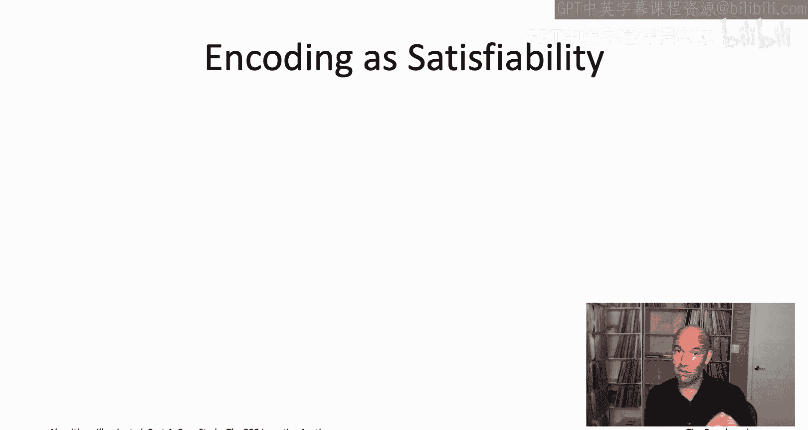

First， what is it we're trying to encode。 It's an instance of graph coloring。

 So we're given an undirected graph G and a number of colors K。

 we want to encode this as satisfiability。 So let me remind you the ingredients of in the satisfiability instance。

 So first of all， you've got decision variables and their super simple decision variables。

 They're forced to be booleant So they can only take on the values true or false。

 And then the other ingredient is constraints。 And again。

 the constraints are forced to be super simple。 Just these disjunctions of literals or a disjunction just means logical or and a literal just means either a decision variable or it' negation。

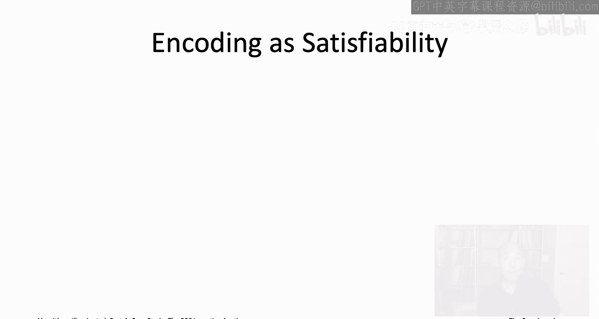

Now， at first， it may seem like an awkward marriage graph coloring with satisfiability。

 because with graph coloring， it seems like what you really want is not a boolean variable。

 but a K valued variable for each vertex specifying which color it is assigned。

 whereas insatiisfiability， We're stuck with these simple， true false variables。

 But you might recall there a very simple fix， which is for each vertex。

 we're not going to have just one decision variable， but K decision variable。

 So at one decision variable per vertex v and per color I。

 And the intended semantics of that variable or that X V I should be equal to true in a truth assignment。

 that should mean that the vertex V receives the color I。

 if it receives any other color then X V I should be false。😊，So for the first set of constraints。

 we're going to have k constraints for each edge of the input graph。

 So suppose as's an edge between the vertices U and V。

 we're going to have K constraints where the Ih constraint rules out both U and V getting the color I。

 And then if we have k of those constraints1 per color together those K constraints will force U and V to get different colors。

 it will be ruled out that they get the same color。How do we do that？ Well。

 for a given edge U V and a given color I， we just have we just have the constraint。

 not X V or not X U I。 Remember， you know， when we you have a disjunction of literals。

 there's only one way to fail to satisfy them， which is when you do the opposite of every single one of their variable assignment requests。

 So this constraint is asking us to set either X U or X V to false。

 the way to not satisfy as to said both of those to true。

 and that corresponds exactly to coloring both U and V the color I。

 So this first family of constraints prevents any pair of endpoints from from being assigned to the same color。

 exactly what we want in graph coloring。

Now， that can't be the whole story because it's actually very easy to satisfy all of these constraints。

 Naly， if you just set every single variable to false。

 these constraints are all going to be satisfied， meaning if。

 if you don't color the vertices anything， you're not worried about an edge having two endpoints that are the same color。

 So we need another set of constraints to force each vertex to get a color。

 So we want to rule out that for a vertex v， all K of the decision variables， know X v1 up to XVk。

 they should not all be false。 So that's just this disjunction of X v1 or X v2 or dot dot dot X Vk。

These constraints do leave open the possibility that more than one of these variables will be set equal to true corresponding to a vertex receiving more than one color。

 but in that case， no matter how you pick one of the colors assigned to each of the vertices。

 you're going to get a K coloring because this first family of constraints rules out conflicts between any of the colors assigned to a vertex U and any of the colors assigned to a vertex V。

Alternatively， if it bothers you that more than one of these variables might be set equal to true。

 we can add an additional a third family of constraints that rule out a given vertex V being given simultaneously two different colors I and J。

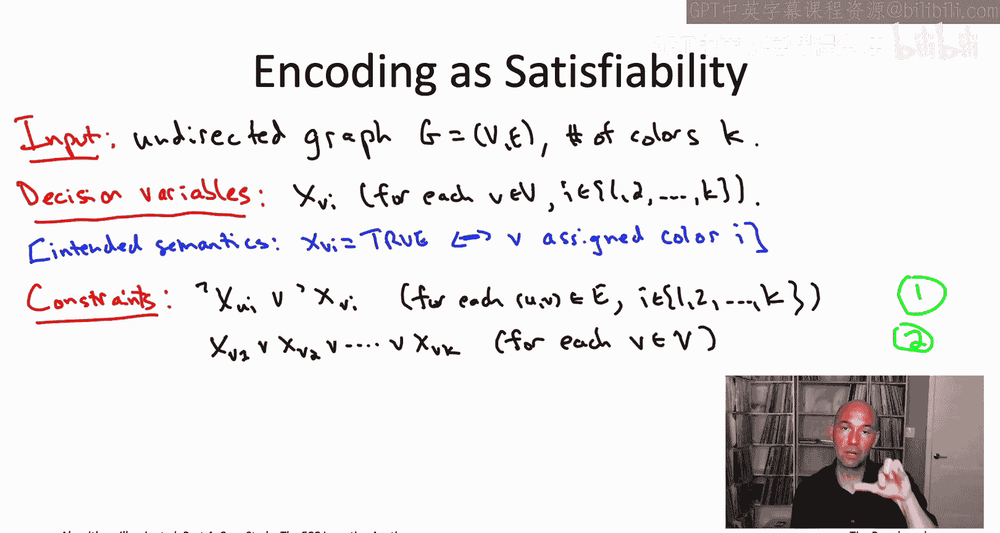

And that is it， that is the entire encoding of the graph coloring problem as an instance of satisfiability。

 and as we saw back in that video on Sa solvers， this is exactly the kind of format you can just feed into the latest and greatest SA solvers and see how well they do。

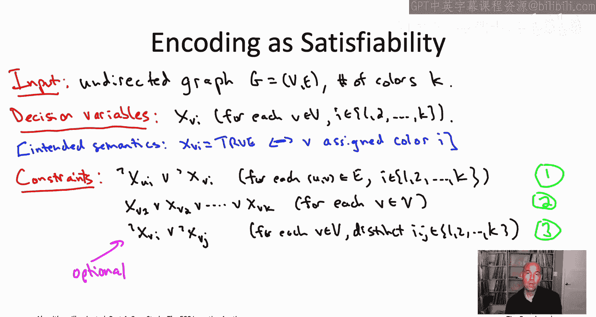

Now， in the actual FCC incentive auction， the feasibility checking subroutine。

 which it needed it was basically a graph coloring problem， but not exactly a graph coloring problem。

 There were a couple of twists。 I want to tell you about on this slide。

 which we're going to need to then incorporate into our satisfiability formulation。

 This also goes back and involves dropping the second of our four assumptions from our four simplifyimpling assumptions。

 We already dropped the first one。 remember， our first assumption was the ridiculous assumption that there's only one channel for all stations to go on Now we have K channels where K might be 23。

 Our second simplifying assumption was that there was a very easy test to know whether or not there was interference between two stations。

 namely， we've been assuming that two stations interfere if and only if they are assigned to the same channel and they're broadcast areas overlap。

To first order that explains most of what's going on with interference。

 but there's some complications。 So depending on the exact pair of stations and the exact pair of channels。

 sometimes it's also not kosher to assign overlapping stations adjacent channels like Channel 14 and channeln 15 So in some cases for some pairs of stations you need a gap of at least two between the different channels that they get and unfortunately it's actually pretty idiosyncratic exactly which pairs of stations and which pairs of channels are going to lead to interference。

 So the way this was handled in the FCC incentive option this problem of figuring out who would interfere with whom on which pairs of channels that was outsourced to a different team and that team had to work pretty hard。

 they compiled this list and the list said exactly for each pair of stations which pair of channel assignments were forbidden which channel pair assignments would create interference and that list while not easy to compile once it had been put together and passed over to the team responsible for building the feasibility checking。

Very， very easy to incorporate into the satisfiability formulation that we've already been using。

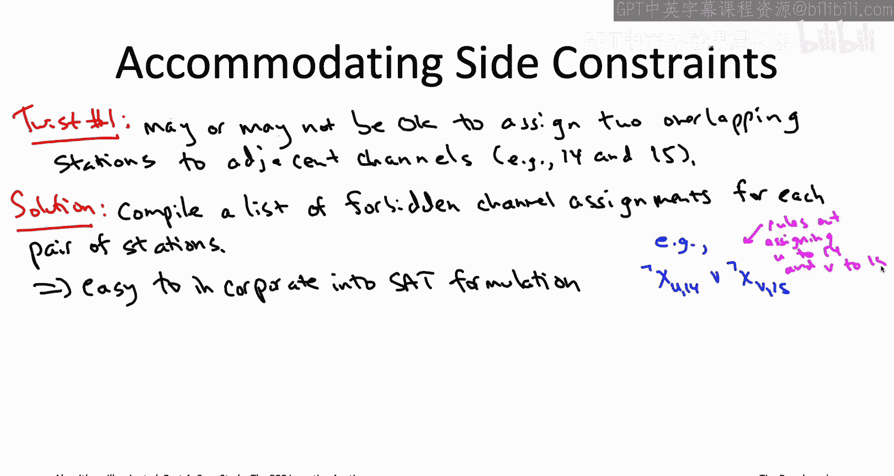

Specifically， let's remember the first family of constraints in the basic satisfiability formulation。

 One of those constraints has the form not X U I or not X V I。

 What does a constraint like that accomplish， It makes sure that it is not the case that station U is assigned to channel I and also station V is assigned channel I。

But if you think about it， that exact same constraint makes perfect sense if instead of I and I you have I and J for two different channels。

 I and J so for example， the constraint not X u comma 14 or not x V comma 15。

 that would preclude assigning station U to channel 14 while also assigning station V to the adjacent channel 15。

So given that this other group was compiling this list of forbidden pairs of channel assignments for each pair of stations。

 know while they had to work pretty hard to put together that list。

 it translates immediately into the satisfiability formulation for each line item in their list。

 you literally just have one constraint of this form with two literals ruling out that that particular pair of stations receives that particular pair of channel assignments。

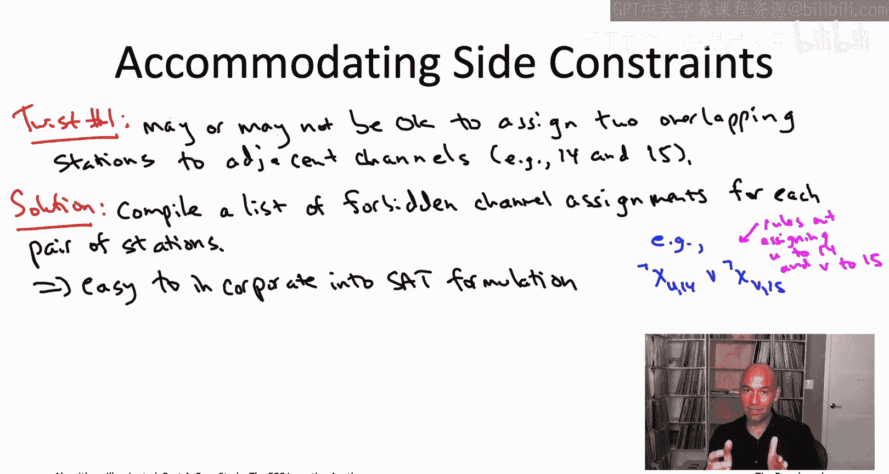

So that's how we get rid of that second of the four simplifying assumptions。

 We started with this very simple assumption of when it is the two stations interfere。

 It's actually quite complicated， but can be compiled into this list。

 and it's that complicated list that we actually use in in the real satisfiability formulation Now there's one other twist I want to tell you about on this slide which is in a graph coloring instance。

 any vertex can receive any of the K colors and that's actually not quite right in the application in the FCC incentive auction。

 It was not the case that all of the television stations were eligible for all of the possible 23 channels。

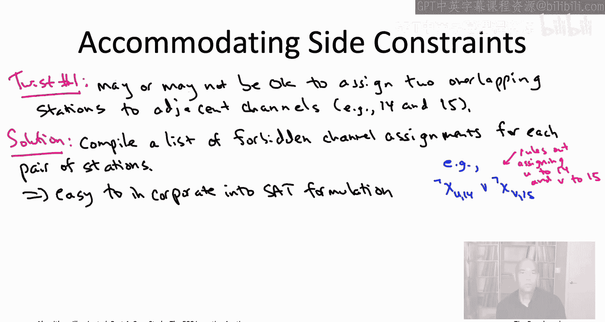

Why not？ Well， for example， stations that bordered Mexico could not be assigned to a channel that would interfere with an existing station on the Mexican side of the border。

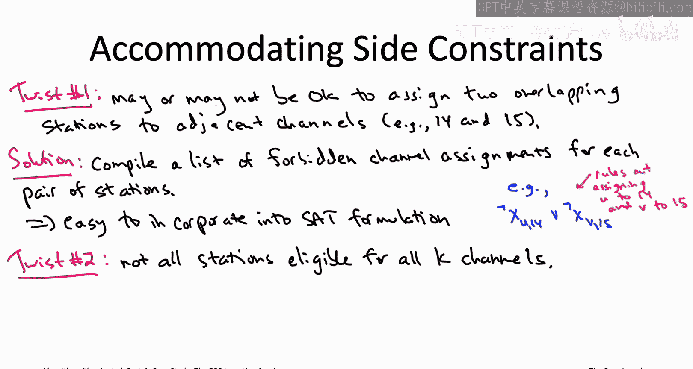

The second wrinkle is even easier to accommodate intersatiisfiability formulation。

 right all we need to do is whenever there's a station V。

 which is forbidden from receiving some channel I， we just omit that decision variable X VI from the formulation。

 so there's no opportunity to assign that station to channel I， and that's it。

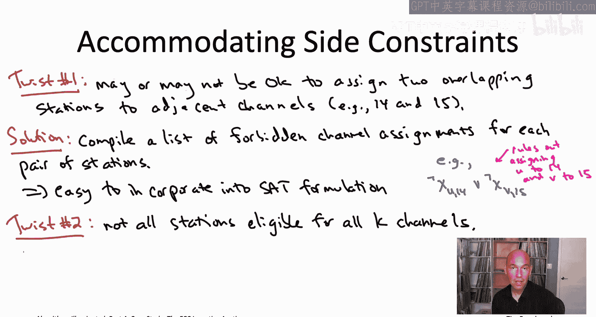

The fact that it was so easy to tweak our basic satisfiability formulation of the graph coloring problem to accommodate these quirky side constraints that showed up in this particular application。

 that's actually illustrating what' sort of a general principle， not always true but often true。

 which is that often semi-reliable magic boxes like Mi and Sa solvers that can be more flexible than an algorithm which is designed specifically for the particular problem at hand。

 it's often easy to sort of tweak a mi formulation to accommodate side constraints as we've done here。

 whereas sometimes adding side constraints can kind of really screw up a problem specific algorithm and force you to go back to the drawing board and sort of think again about how to design the algorithm。

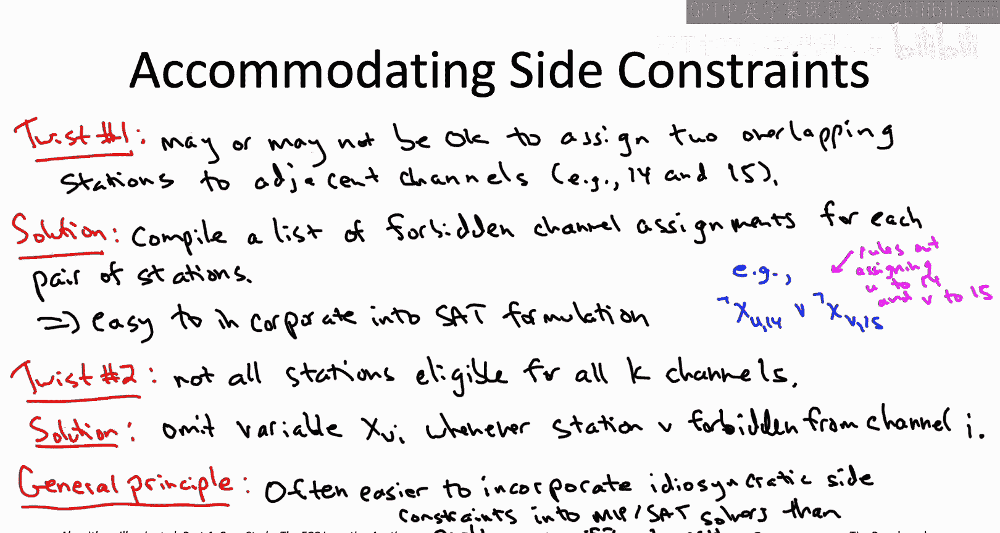

At this point， I've told you everything you need to know about the definition of the feasibility checking problem。

 which really did have to be solved by the FCC incentive auction。

 It's almost a graph coloring problem， but not quite because of the side constraints that we mentioned on the previous slide。

 so let's give this feasibility checking problem， its own name， the repacking problem。

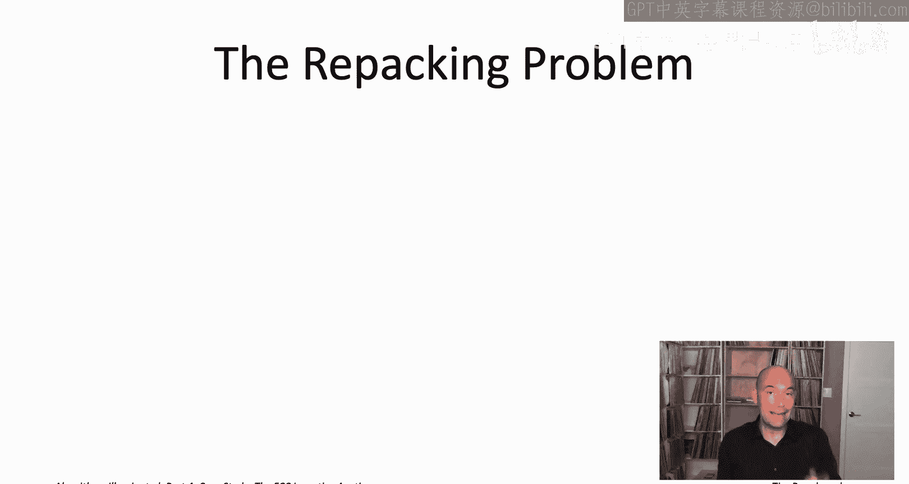

So something we mentioned back when we were discussing tuning those station specificific multipliers。

 those beta subvs using representative instances， we discussed how actually a lot of aspects of the repacking problem were known in advance。

 So for example， known in advances， all of the possible television stations that you might have to be dealing with that's a few thousand for each of those stations。

 you know exactly which of the 23 channels that station can be assigned to， what is's eligible for。

 And furthermore， because of this list of pairwise interference constraints that this other team developed。

 you also know in advance for each pair of stations U and V。

 exactly which pairs of channel assignments they're allowed to receive。 So， for example。

 maybe they could receive any pair of channels as long as the two channels were separated by at least one channel in between。

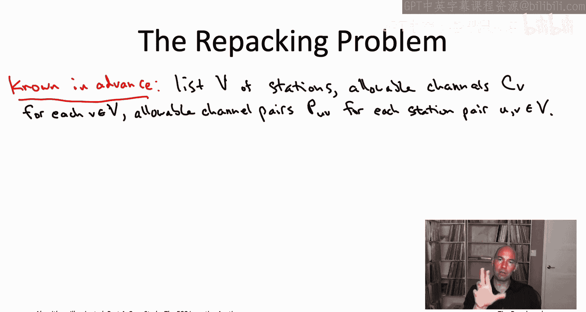

All that stuff is known in advance。 So I encourage you to think of that as just really being baked into the algorithm rather than part of the input per se。

 but something you don't know in advance is exactly what is the sequence of repacking instances that are going to show up as you do your single passover the stations in the FCC greedy algorithm because the set of stations that you're checking the feasibility for that's going to depend on what happened and all of your previous feasibility checking problems So that's really an input to the problem in the sense that we've meant all throughout this video playlist In real time。

 the algorithm is going to be given a subset of stations and is responsible for figuring out if it can be repacked or not。

Given a set of stations in real time， what the algorithm has to do is figure out whether they can all be on the air at the same time That is。

 is it possible to assign each one a channel and the channel it's assigned should be one of the ones is eligible for so a channel in the set capital C sub V so that all of the pairwise constraints are respected so that for every pair of stations U and V。

 their pair of channel assignments is one of the permitted ones， One of the ones in capital P subuV。

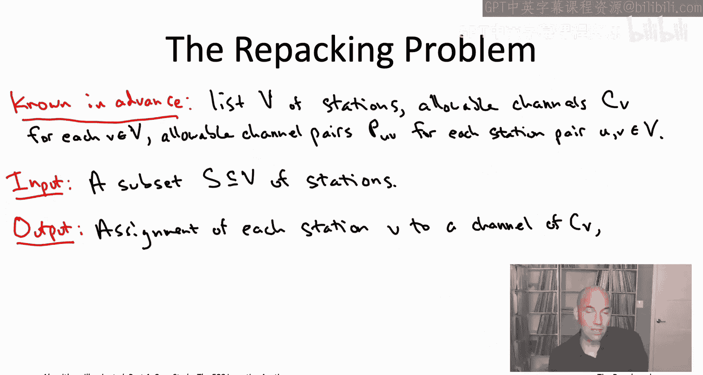

If there is such an assignment， if the stations can indeed all be repacked without interference using K channels。

 then the algorithm's responsibility is to return an assignment with that property， if there isn't。

 then the algorithm's responsibility is to correctly report that the set of stations is unpackable。

 that is there's no way to put them all on the air without interference。

This repacking problem is exactly what the FCC greedy algorithm is responsible for solving in each of its loop iterations。

So how are we going to do it Well as we've seen， we can formulate it as satisfiability and whenever you have a feasibility checking question like this one that naturally is encoded a satisfiability。

 you should try throwing the latest and greatest SA solvers at it and see how they do。All right。

 so how big are the problem instances， well again， we're talking about thousands of stations。

 tens of thousands of interference constraints， and given that we have 23 channels。

 after you go through that satisfiability formulation that we just talked about。

 we're talking about satAT instances that have tens of thousands of decision variables and over a million constraints。

So that's pretty big， that's a pretty big instance of satisfiability。

 tens of thousands of decision variables over a million constraints， still。

 if nothing else just to sort of draw a line in the sand to calibrate yourself。

 you could throw the latest and greatest sat solvers at them and see how they do。

And they did pretty well， still pretty impressive， given how big the SA instances were。

 but pretty frequently the off the self solvers from the latest Sa competition needed 10 minutes or more to solve the representative repacking instances。

And that actually wasn't good enough for the FCC。 the FCC had some very ambitious algorithmic aspirations。

 They wanted to solve the repacking problem， not in 10 minutes or more， but in one minute or less。

 which again， is pretty crazy when you have tens of thousands of variables in over a million constraints。

So one of the reasons why they didn't have much time to solve a repacking problem you've already seen。

 which is that you're not just solving a repacking problem once and that FCC greedy algorithm。

 you're solving one in each iteration and there were thousands of iterations We'll see in the next video when we talk about implementing the FCC greedy algorithm as a descending clock option we'll see that actually the real number of instances of repacking that had to be solved was more like 100000。

So that's why the time budget that the FCC was willing to grant was so small that also partially explains why the auction took so long to run。

 it took many months to complete because you had to solve 100，000 repacking instances along the way。

So how do we close this gap between how far we've gotten and what we need between the 10 plus minutes that the latest and greatest off the shelf SAT solvers need to solve these problems and the one minute that we're shooting for。

 Well， to do better， we're going to have to throw the kitchen sink at the problem。

 That's coming up next。

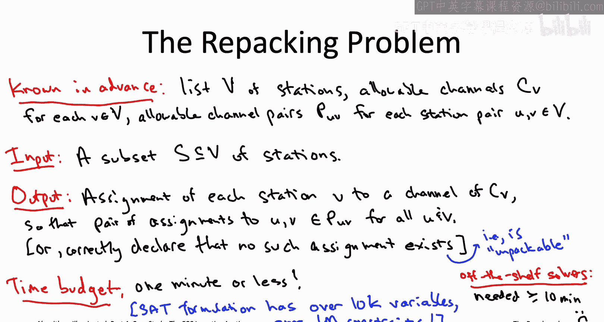