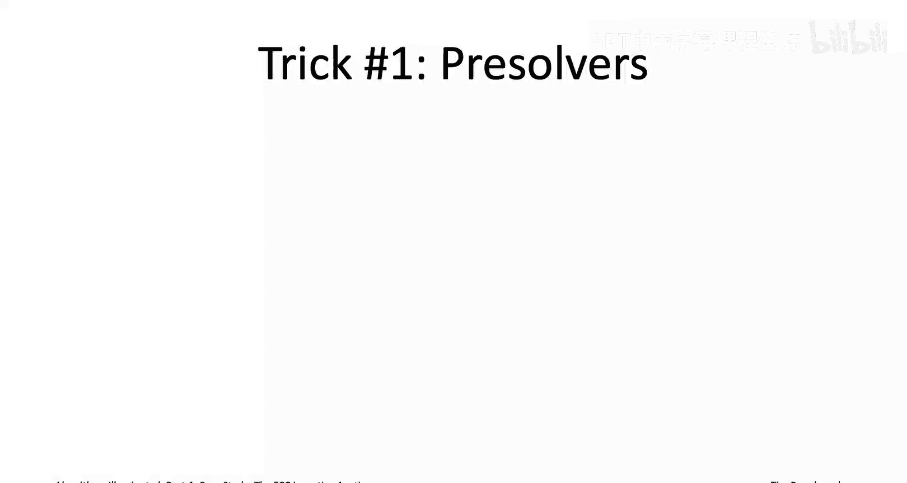
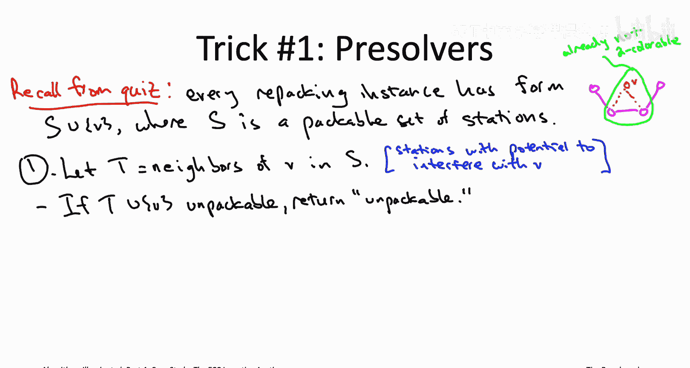
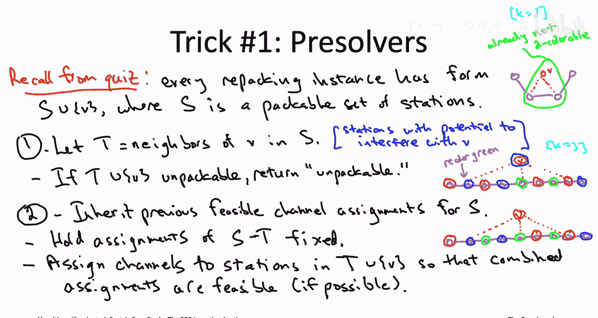
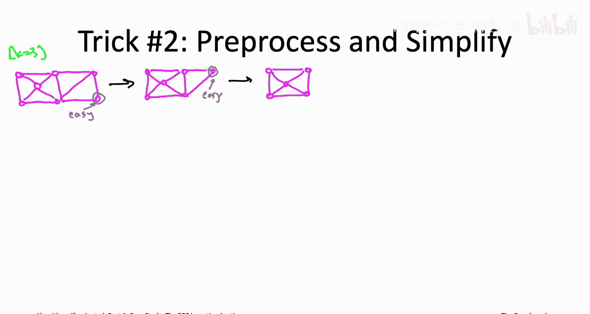
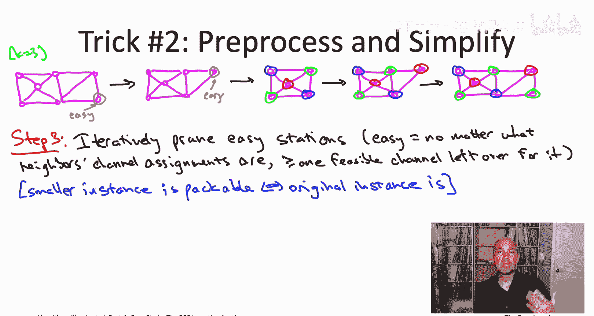
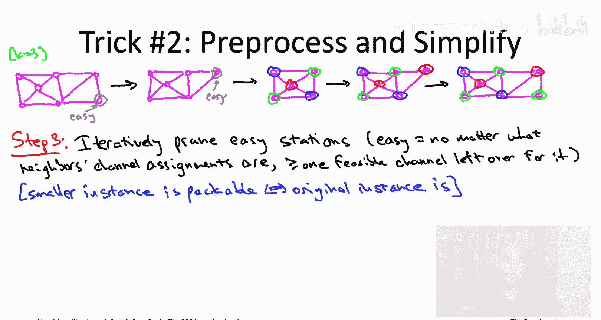
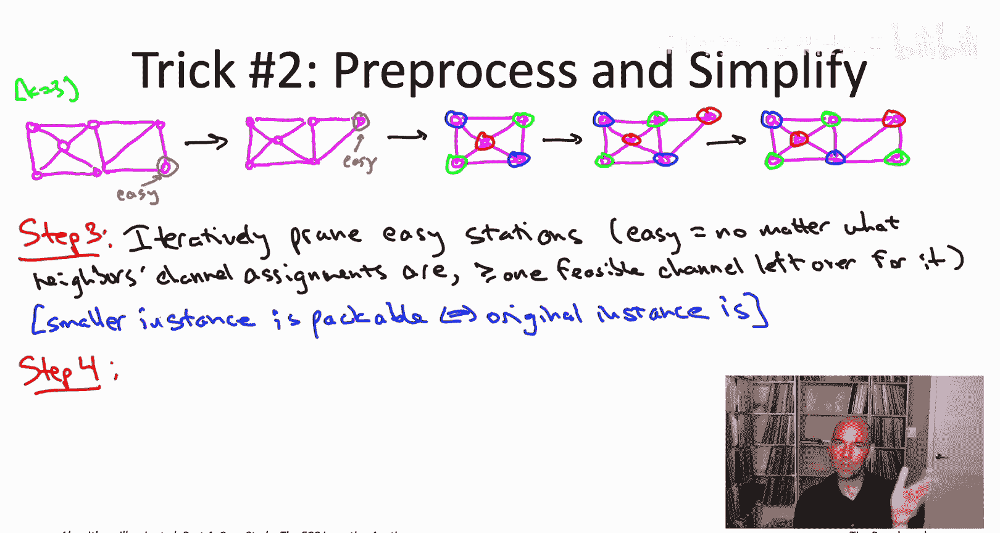
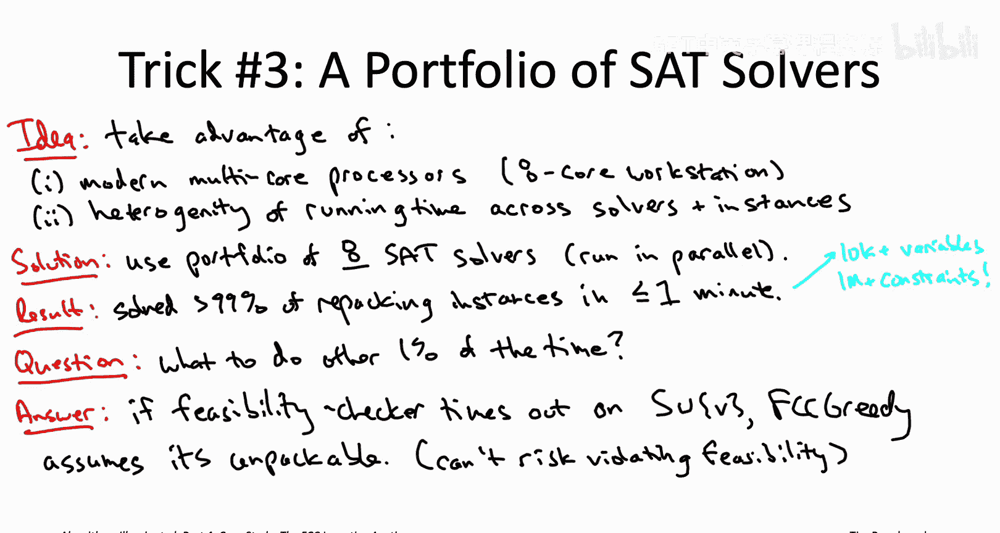

# 斯坦福大学《算法启蒙（第4册）：NP难｜Part 4 Algorithms for NP-Hard Problems》中英字幕（deepseek-R1） p40 -42-24.3_ Feasibility Checking)  -Pt 2_2-.zh_en -BV1FAVUzXEum_p40-

Let me now tell you about three different techniques the designers of the FCC incentivecent auction used to reliably solve repacking instances in a minute or less。

The first of the three is going to be presolvers， and so these are kind of quick and dirty checks for feasibility or infeasibility to quickly ferret out easy instances。

 obviously packable or obviously unpackable instances。

 these pre-s solvevers are going to exploit the nested structure of the feasibility checking instances that arise over the course of the FCC greedy algorithm So we had a quiz on that nested structure in the previous section。

 but let me just briefly remind you how each repacking instance relates to what has already been solved in previous iterations。

The FCC greedy algorithm maintains a solution so far， a subset of stations， capital S。

 and each iteration of the main loop asks whether the next station substation V can be added to S and stay feasible。

 So at all times throughout the course of that algorithm， the solution so far。

 capital S that corresponds to a packable set of stations。

 And we're asking is it possible to pack not just capital S， but also this one new station V as well。

Presr number one is going to be a quick and dirty check for in feasibility where we're going to ask the question。

 you know suppose we look at an easier problem and suppose， you forget about all of capital S。

 let's just worry about the stations in capital S that might conceivably interfere with the station V。

 So it's going to be sub subset capital T of S。 unless let's ask is it at least possible to pack the new station V together with its neighbors in capital S together with the stations in capital T。

 And if not， if even that subset is unpackable， then certainly the bigger set of stations can't be packed either。

If we had a pure graph coloring instance， what this would correspond to is we have a graph。

 we know it's K colorable， we add in one new vertex and we want to see if it remains k colorable。

 what we do is we just look in the neighborhood of that new vertex V so we just look at V and we look at its neighbors and we say。

 well at least is this subgraph K colorable because of course if it's not K colorable。

 then neither is the bigger graph。

If indeed T union V is unpackable， we're done， we can correctly conclude that S union V is unpackccable。

 In the other case， if T union V is packable， ambiguity remains S union V。

 it might also be packable or it might not maybe there's enough channels to accommodate T union V。

 but once you throw the rest of S in there， you don't have enough channels anymore and and it's unpackable So we don't know if this winds up being packable。

 could go either way。In the second pre solver we're going to explicitly use the fact that the set capital S is a packable set of stations。

 and in fact， we're going to use that the last time we ran the feasibility checker it actually handed us a bunch of channel assignments for the stations in capital S so that all of the constraints were satisfied。

What we want to then do is extend the feasible channel assignments for the stations in capital S that we inherited from a previous iteration to extend those so that also V has a channel assignment and so that everything is still feasible。

 but we're going to try to do that in kind of a lazy way we're only going to allow ourselves a limited number of degrees of freedom。

 we're going to say you for any stations that don't even neighbor this new station V let's just hold their channel assignments fixed。

 so we'll just require that they stay exactly the same as they were in the channel assignments that we inherit it。

But meanwhile， we will allow ourselves to assign and reassign channels locally in the neighborhood of V in attempt to find feasible channel assignments and attempts to pack all of the stations。

 so again we let capital T be the stations in capital S that might potentially interfere with station V。

 and then we ask the question holding channel assignments and S minus t fixed。

 can we find channel assignments to T union V so that the combined channel assignments are feasible meet all of the constraints。

Now， if we succeed， if we actually do manage to find assignments of channels to the stations in T plus the new station V that are compatible with each other and also compatible with the fixed channel assignments and S minus T that we inherited。

 then we're done， then we know this is a reacable instance because we've proved it ourselves we've actually exhibited a channel assignment for all of the stations in S union V so that all of the constraints are satisfied so that's a great way to quickly ferret out a packable instance。

Now， if this second preolr fails， meaning if it says actually there's no way to assign channels to t union v while holding the stations in S minus t fixed to satisfy all the constraints。

 it may or may not be the case that S union V is packable because it's totally possible that under this extra constraint that you have to hold the stations in S minus t fixed。

 totally possible that that version of it is unpackccable。

 but then once I take away that constraint and you're allowed to reassign channels to the stations in capital S also perhaps without additional freedom。

 all of a sudden it becomes a packable instance。Let's look at an example in the pure graph coloring context。

So in this picture on the right we have a magenta path， so nine vertices。

 eight edges that corresponds to our set capital S and the interference constraints between those stations and then the orange vertex v that's the new station we're trying to accommodate in addition I'm going to assume here the K equals three So there's three channels or three colors that we're working with So the set S has to be feasible。

 so it has to be three colorable and it comes when we inherit a three coloring of that graph from a previous iteration So I've shown you that three coloring here each of the vertices in the path is circle either is colored red or blue or green and each of the edges has endpoints with distinct colors So now we add V into the picture Again we want to know does is the graph still three colorable after we've added in V and again we want to be lazy about it we want to just sort of extend the previous coloring so that it includes V in the easiest way possible。

 The first thing you'd try is you say， well maybe we can just color of V something。

And it won't conflict with anybody else and will be done but that's not going to work right so if you colored V red。

 it would conflict with the eighth vertex on the path， if you colored it green。

 it would conflict with the middle vertex， the fifth vertex of the path and if you colored it blue。

 it would conflict with the second vertex of the path so you can't just hold all of s the same and find a color for V that's compatible with it。

However， I mean that's not what the pre solvever is。

 We have a little more flexibility in the presver。 We can also recolor the neighbors of the new vertex V if we want。

 And with that additional freedom， actually we can extend this three coloring that we inherited into a threecoling of the whole set。

 So do that， for example， we could just take that second vertex， the blue vertex。

 We can toggle its color to green。 Both of its neighbors are red。 So that's fine。

 It can be green doesn't violate any edges。 And now from vertex v's perspective。

 two of its three neighbors have a colored green and one is red。

 so that frees up the color blue to color of V。 So that gives us a bona fide three coloring。

 including V。 So in this case， the second preolver would succeed。

 It would extend the inherited three coloring into a three coloring for the entire graph。

 including the new vertex。😊，Now let's look at the exact same example。

 an example which we now know is three colorable， so the exact same example。

 but let's look at a different possibility for the three coloring of the magenta path that we might wind up inheriting。

You'll notice that literally the only change I made is for the third vertex in the path。

 I changed this inherited color from red to green。 That's totally allowed。

 This is another threecoling of the path。 so that's something we might inherit from the previous feasible subroutine。

 But now actually all of a sudden this presver is going to fail。

 There's not any way to locally recolored to extend this to a threecoling of the whole graph。

 even though we know the graph isn' indeed threecolorable So why not， Well。

 look at the three neighbors of V right It's first neighbor， the second vertex。

 it's blue and its two neighbors are red and green。 So it's forced to be blue。

 given its two neighbors。 same thing with the fifth vertex。

 these' second neighbor It neighbors are blue and red。

 So it's forced to be green and then the last of these neighbors。

 the eighth vertex is colored red and it has to be so because its neighbors are green and blue。

 So there's no flexibility in how to recolor these neighbors and as we discussed。

 V itself can't take on any of the three colors without reing one of its neighbors。

That's an example of the second preolver failing okay so there actually was a packable set of stations。

 but this pre solvever was unable to prove its packability because it restricted itself just to assigning and reassigning channels locally in the neighborhood of the new station。

Just in case it wasn't clear， so the motivation for focusing on the neighboring stations of the new station V。

 so focusing on capital T rather than all of capital S that so that we only had to solve a repacking instance with size equal to the number of stations in T along with V as opposed to all of the stations in capital S along with V Capital S might well have thousands of stations。

 that's why this is a potentially hard repacking instance whereas typically the neighbors of the capital T that would be in the single digits or maybe in the double digits。

 So just determining the packability status of T union V and either of the two pre- solvevers that could be done quickly using an off the shelf sat solver because those instances were so small。

 so that's why these pre- solvevers you could more or less do for free to ferret out the obviously packable and obviously unpackable instances。

Speaking of for free， the second batch of ideas is very much in the spirit of the four free primitives that I've been trying to impress upon you throughout this book series throughout these video playlists。

 so remember of what is a for free primitive it's a sub routineout which is blaazingly fast。

 so linear time are very close to linear time so that the time needed to execute it barely exceeds the time you're spending anyways to read the input。

And the point is that once you have a subroutine that's so blazingly fast， at that point。

 you as well just sort of apply it， even if you don't quite understand how it's going to be helpful。

 so maybe sort the data， that's a for free primitive。

 maybe it'll help or if you have a graph problem， maybe compute the connected components。

And both of the steps I'm going to tell you about on this slide。

 they're both preprocess steps and they're designed to take a hard instance of the repacking problem。

 one that already passed through both of the pre solveverrs and simplify it and or reduce its size。

So the first idea is to prune away from the input any stations that are sort of so unconstrained as to be irrelevant This idea is probably simplest to understand initially with an example。

 so let's just look at a pure graph coloring instance。

 let's suppose we're trying to come up with a three coloring for the following graph。

So in this graph， notice that every vertex has degree three or more， except for one of them。

 except for that vertex in the lower right corner。And this is a vertex that is so unconstrained as to be irrelevant for the purposes of computing a three color right right because it only has two neighbors。

 doesn't matter what you color those two neighbors， you know， red and green， whatever。

 there's going to be a third color left over that we can always assign to this bottom right vertex like green。

So whatever are we going to do， we're just going to throw out that easy vertex。

 we can just worry about that at the end， we know there's going to be some color left over that we can always assign to it。

In the original graph， that bottom right vertex was the only one that had degree2 or less。

 But now something interesting has happened。 right。

 So now that we've sort of peeled away that bottom right vertex。

 Now there's a new vertex that has degree only two。 The one in the upper right。 So， again。

 this is now a vertex that we can prune。 doesn't matter how you how you color the other five vertices。

 There's always going to be some third color left over that we can use for this upper right vertex。

Now， once we remove that upper right vertex， we're left with five vertices， and now in fact。

 all of them have degree three or more。 So there's no longer a vertex which is sort of obviously irrelevant that we can just prune。

 So this is where we get stuck。 And so now we really are going to be responsible for checking whether or not this graph is threecolable。

 but two pieces of good news。 So first of all， this graph is going to be threecolable if and only if the graph we started with was three colororable。

 but so obviously if the smaller graph is not threecolorable。

 and you certainly can't threecolor the bigger graph。 But as we'll trace through in a second。

 if we do successfully three color of the smaller graph。

 we'll be able to extend that coloring to the original graph just by putting the easy vertices back in of the reverse order in which we prune them。

 and the second piece of good news is that this graph is smaller than the one that we started with it has fewer vertices and so hopefully whatever algorithm we use to compute the three coloring that's going to run considerably faster on the pruned graph then it would have on the graph that we started with。

So for example， suppose we invoke some three coloring subroutine and it comes back with the three coloring of these five vertices。

 alternating blue and green around the perimeter and then saving the color red for the middle。

 So now we're going to reintroduce the vertices that we pruned in reverse order。

 So next comes the upper right vertex。 We put that back in， we need to give it a color。

 But again this was an easy vertex gets two neighbors have the colors red and blue So this upper right vertex when we reintroduce it。

 we're just going to give it the color red and avoid all the conflicts with its neighbors。

Now we can go ahead and reintroduce that first vertex that we prune to the bottom right vertex。

 It neighbors have been colored blue and red， but again it had degree too。

 so we know this' color left over， it happens to be green。

 so we're just going to give that bottom right vertex the color green and boom。

 we extended the three color angle of the small graph to one for the entire graph。

This will be our third step in the feasibility checker。

 So for any repacking instance that passes the first two presvers and makes through them。

 then we're going to do this pruning。 So we're going to look for stations that are easy in the sense that no matter how you assign channels to the stations that might interfere with it as neighbors。

 no matter how there assigned channels there's always going to be some channel left over that you can assign to this easy station and if you have an easy station。

 you prune it and then you repeat the process all over again because now a new station might have been made easy by the removal of this previous one So you keep going。

 you keep pruning easy stations until none remain， then that repacking instance you're actually responsible for solving So you solve it。

 But the good news is the packability status of that smaller instance is the same as the one that you started with。

So if the smaller instance is unpackable， then there's no question that the bigger instance。

 which is only harder， that's also unpackable， and meanwhile。

 if it is packable and you're giving back some feasible channel assignment for the subset of stations that are not easy。

 then just like in this example， you can reintroduce the easy stations one by one。

 always giving them the assured channel that will prevent interference with all of their neighbors。

To motivate step 4， you know， let's again think about the case of a pure graph coloring problem like checking three colorability。

 So suppose I asked you if I gave you a graph and I wanted to know if it's three colorable。

 and you noticed it was actually a disconnected graph It had multiple connected components。 Well。

 for coloring those connected components cannot interfere with each other because there's no edges between distinct connected components。

 So you may as well just solve the three coloring problems separately on each connected components。

 If everyone one turns out to be three colorable， then the original graph is three colorable just by taking the union of the color assignments。

 if at least one of the connected components is not three colorable， then of course， the whole graph。

 which is only harder， is also not three colorable。

And you can do exactly the same thing for the repacking problem right so what do condened components mean in the context of a bunch of stations while you just think of the stations as a graph with one vertex per station and an edge between two stations。

 if they have the possibility of interfering so if there is some joint channel assignment to them which is forbidden。

So that gives you a graph you can connect its connected components。

 different connected components have no edges between them which means stations and different connected components have no possibility of interfering with each other so again the repacking problem just completely separates into these independent subproblem corresponding to the connected components and then what you do is you're just going to solve each of those connected components separately if you manage to repack all those subsets of stations you can just return the union of those channel assignments if you fail to repack even one of the connected components then you can correctly deduce that it's not a packable set of stations because if the small set is unpackable then so is the big set of all the stations。

So that is the second of the preprocessing steps so you take the output from step3。

 so step 3 is pruned away all the easy stations you're left with just a bunch of not so easy stations。

 you compute these connected components and then you solve the repacking instances separately for each of the connected components Now why did this decomposition step help After all。

 the algorithm is still on the hook for solving all of these subproblem corresponding to these connected components and the combined size of these subproblems is exactly the same as the repacking instance that you started with but don't forget that when you have an algorithm that runs in super linear time and you'd certainly expect a sat solver to run in super linear time most of the time it's always going to be faster to solve an instance in pieces than all at once。

 So for example， imagine you had a quadratic time algorithms。

 some algorithm that ran in time and squared on size n instances。

Now imagine that you had a size n instance， which was actually two independent size n over two instances。

 and then you could just invoke this quadratic time algorithm separately on each of the two subins。

Well， then the running time on each of those two instances would be n over2 squared。

 so the input size n over2 squared that gives you the running time that would be n squared over four。

 you have to do that twice once for each of the subproblems。

 but that still gives you a factor two speedta， you would be solving the two independent subprom in n squared over two time rather than the n squared time you would need if you solve the original instance in one shot。

Now， the toughest of all the repacking instances， they actually survived all four of these steps。

 They survived the gauntlet of the pre solvers and the pre processing steps and awaited more sophisticated tools。

 So what about using a Sa solver。 Once you've boiled it down to one of these sort of really tough instances。

 Well， the state of the art SaAT solvers used off the shelf。

 All of them had success on like a decent fraction of representative instances。

 But none of them met the mandate set forth by the FCC of reliably solving repacking instances in a minute or less。

 So we need a couple more ideas。The designers of the FCC incentivecent auction next took advantage of two things。

 first thing， probably something you're already well aware of。

 which is the awesomeness of modern computer processors and in particular multicore processors。

 so they used eight core workstation and so the a cores allowed them to run eight algorithms in parallel。

So how is this helpful， what were the eight programs that you're going to run in parallel in the FCC incentive auction Well this brings us to the second and kind of more interesting empirical observation。

 which is that if you look at the latest and greatest satisfiability solvers。

 there's tremendous heterogeneity in running time performance and I mean that in two senses So first of all。

 if you look at a fixed Sa solver and you look at different repacking instances。

 you will see orders of magnitude difference in the running time that that solver needs to solve that particular instance of satisfiability。

Also， if you fix the instance， the repacking instance and vary across sat solvers。

 you will again discover orders of magnitude difference in running time across the solvers。

 even just for this one fixed instance。 So the point being is the different solvers are kind of incomparable。

 You know， some do really well in certain kinds of instances and struggle on some others。

 And then some other set solver， it'll be a different set where it does well and a different set where it does poorly。

😊，And this solver heterogeneityductvetails very nicely with the fact that it's pretty much for free to run eight of these things in parallel。

 So why put all your eggs in one basket and just commit to one sat solver。 No。

 instead they used a portfolio of 8 sat solvers to be run in parallel。

 wheneverever they had a repacking instance。 So as soon as one of those8 solvers successfully saw the repacking instance。

 boom， you're done， you can return that answer。😊。

So that is a pretty neat idea。 Use the fact that different solvers have their own kind of regions of expertise among the landscape of repacking instances and get the best of both worlds are actually really the best of eight worlds by running8 of them in parallel。

 in case you're wondering how did they actually settle on what's in this portfolio。

 how did they settle on which8 satAT solvers to use in parallel， Well， kind of amazingly。

 they were chosen using a greedy heuristic， which is more or less exactly the same as the greedy heuristic that we studied in chapterpter 20。

 both for the maximum coverage problem， where we kept adding a new subset to cover as many new elements as possible and the generalization in the influence maximization problem。

 where we kept adding vertices to boost the influence as much as possible。 So these8 satAT solvers。

 they were chosen sequentially， and each sat solver was chosen to maximize the marginal running time improvement on representative instances relative to the solvers that had already been put。

In the portfolio。 so really just the exact same type of greedity heuristic that we studied for maximum coverage and influence maximization。

I should also mention that if there's any big fans of local search out there who are kind of distraught over its apparent absence from this case study。

 don't worry， it turns out that of the eight SaAT solvers in this portfolio。

 several of them were in fact local search algorithms。

 algorithms that maintained a truth assignment and made small changes to the truth assignment in each step to satisfy more and more of the constraints。

 so local search also played a fundamental role in the FCC incentive a。

And now putting together all of the ideas that we've discussed， the pre solvers， the preproces。

 this portfolio of SAAT solvers， that wound up being sufficient algorithmic firepower to solve over 99% of the repacking instances faced by the FCC incentive auction within the target of one minute each。

And don't forget， we're talking about instances of satisfiability with tens of thousands of variables and over a million constraints。

 So this is pretty amazing。

Now， solving over 99% of the repacking instance in this very ambitious goal of one minute。 I mean。

 that sounds impressive at all， but you might be wondering like。What about the other 1%， I mean。

 did the FCC auction just sort of spin its wheels helplessly while eight SaAT solves fumbled around desperate for a satisfying assignment？

Well， another remarkable feature of this FCC greedy algorithm that we're working with is it's highly tolerant of failures by its feasibility checking subroutine so imagine the context of when the feasibility checking subroutine fails。

 What does that mean So in the FCC greedy algorithm it's doing the single pass over the stations it's maintaining its solution so far capital S that's a bunch of stations it's committed to putting on the air and so that's going to maintains the invariant that that's a packable set of stations。

 they really do fit on the air in the given K channels And so in a current iteration of the greedy algorithm。

 basically the algorithm's going to ask its feasibility checker it says hey look。

I've got these stations capital S。 I know they're packable。

 What if I also tried to fit this additional station V onto the K channels。

 Would S Union V again be a packable set of stations。

So the subberoutine is going to think about it and in the failure mode。

 a minute's going to expire and the subroutine is going to time out。

 and in effect the subberroutine will tell the greedy algorithm。

 I do not know whether the cetestation's S plus V is packable or unpackable so how should the greedy algorithm respond and proceed when its feasibility checking subroutine times out？

Well， an ironclad constraint of this application is that if you designated a set of stations capital S to stay on the air。

 it better be feasible that they stay on the air。 It better be a packable set of stations。

 You cannot afford to return an unpackable set of stations as your final output。

So that means that in the absence of an assurance of feasibility from the feasibility checker。

 the greedy algorithm has to say， well， I've got to play it safe。

 I can't risk possibly creating an infeasible set， so I'm just going to assume that you cannot pack V in addition to the station's capital S that I've already committed to。

And that's potentially a bummer because maybe actually you could pack V in addition to all of capital S。

 and in that case， this algorithm is potentially foregoing some of the value that it could have otherwise obtained。

But you know the good news is this greedy algorithm is's going to finish in a predictable amount of time。

 but it's going to run for 2 to 3000 iterations， each it will take it most a minute。

 so you know when it's going to finish， you have an ironclad guarantee that it's going to finish with a feasible solution。

 a bunch of stations that really do fit on the air and K channels and more。

 as long as these timeouts are infrequent as they were in the actual FCC incentive auction。

 you're probably losing a little bit of value but with infrequent timeouts that should be quite modest。

So that concludes the part of this video sequence， detailing all of the really nice algorithmic ideas that are built in under the hood in the FCC incentive auction。

 I still have to tell you about how you put the auction into the FCC incentive auction。

 That's coming up next。 I'll see you there。

