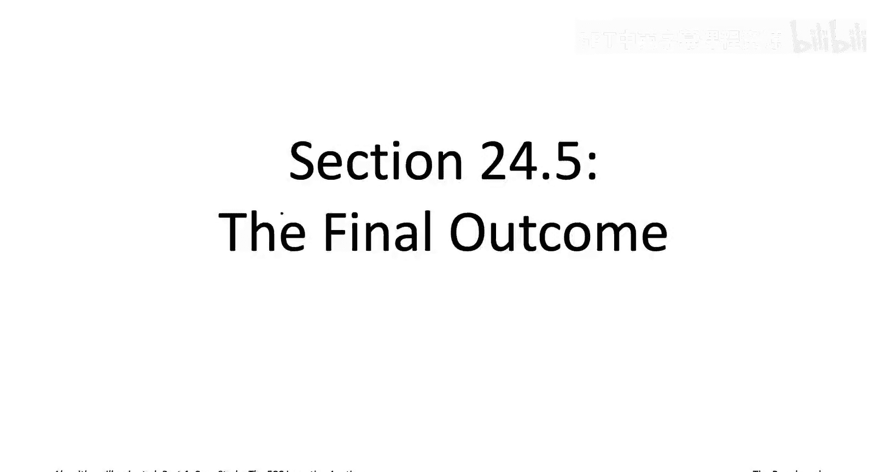
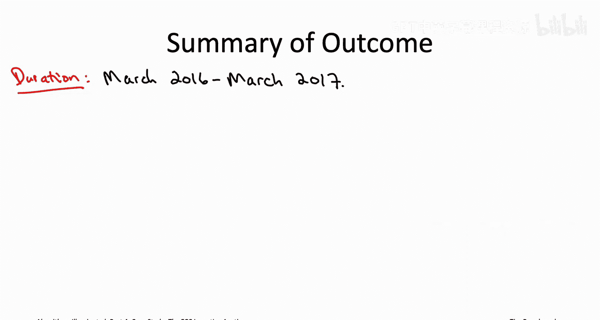
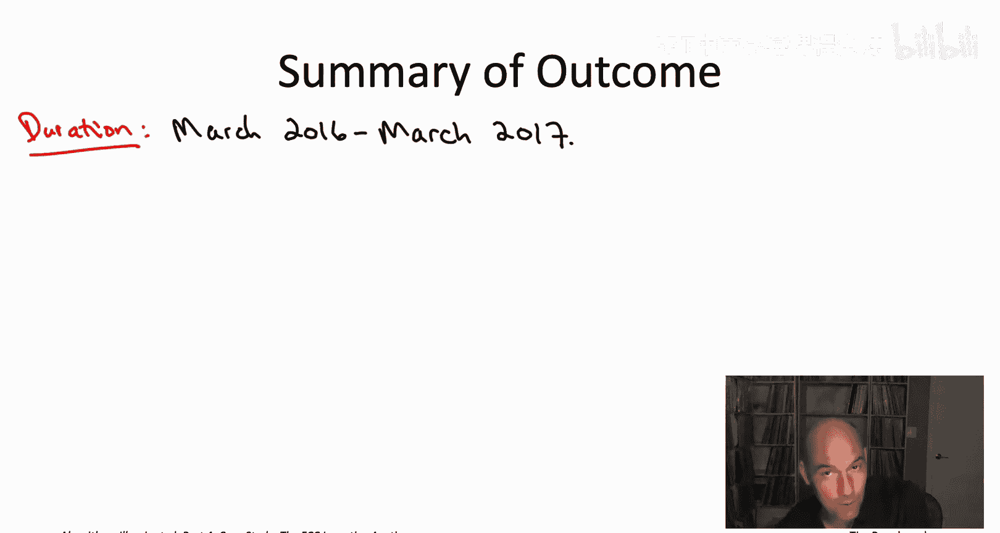
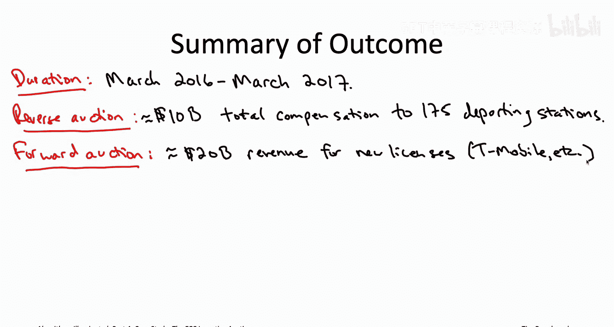
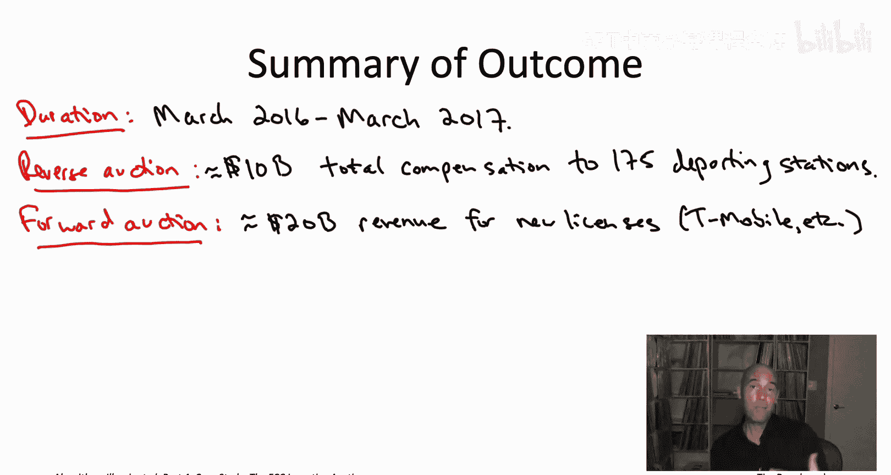
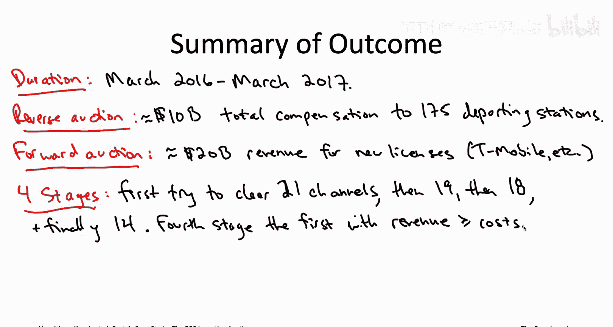
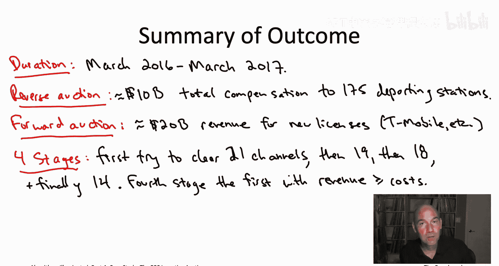

# 斯坦福大学《算法启蒙（第4册）：NP难｜Part 4 Algorithms for NP-Hard Problems》中英字幕（deepseek-R1） p41 -44-24.5_ The Final Outcome).zh_en -BV1FAVUzXEum_p41-

Hi everyone， and welcome to this video that accompanies Section 24。

5 of the book Algorithms Iuminated Part4， a section that summarizes the final outcome of the FCC incentivecent auction。

So from the previous three videos you now know the guts of what was happening under the hood of the FCC incentive a。

 you know exactly how it put to use many parts of the algorithmic toolbox that we've learned from this video playlist。

 so I hope that's been very satisfying to see the techniques you have been discussed in a real application probably this still has burning question you have which is all right。

 but like what actually happened。

Well， the FCC incentive auction ran for a long time， pretty much a year。

 started in March of 2016 and wrapped up in March of 2017。

In the reverse auction that we've been talking about of the FCC incentivecent auction。

 there were almost 3000 participating stations，175 of which relinquished their licenses and agreed to go off the air in exchange for an overall compensation between them all totaling roughly $10 billion。

 a lot of money， an average of roughly 50 million or so per license。

 although with very high variances across different regions of the country。

Roughly 1000 stations also had their channel reassigned。

Meanwhile， moving on to the forward auction where the government is selling a spectrum to the highest bidder。

 So there's 84 MHz of liberated spectrum， as we discussed in the opening video from the sequence。

 it got reorganized。 So it used to represent the channels 38 through 51 it got reorganized into 7 pairs of five MHz blocks。

 one of the blocks of a pair being intended for uploading the other 5 MHz block of the pair being intended for downloading。

 So as far as the goods for sale in the forward auction where you have these telecom companies competing for spectrum there was one of each of these 7 paired licenses and each of 416 regions across the country known as partial economic areas。

 that LED to roughly 3000 licenses being sold all simultaneously in that forward auction。

The total revenue of the forward auction，$20 billion dollars。

So that means that this FCC incentive action actually cleared close to $10 billion in profit and what that meant is that even after the auctions costs were covered and a couple of their earmarks were taken care of there was over $7 billion left over。

 which was applied directly to reduce the US deficit That was the plan all along that's probably one of the reasons why Congress was able to pass the bill authorizing this auction as one of their only eight bills that they passed in 2012。

Now you see these numbers and maybe you're thinking， you know。

 it's a lucky thing that the forward auction revenue of roughly 20 billion just happened to exceed the procurement costs of roughly 10 billion in the reverse auction。

 good thing the government got lucky and it didn't wind up in the red。So actually。

 this point relates to another question you might have。

 which is who decided that 84 megahertz or 14 channels was the perfect amount of spectrum to clear？

So， in fact， the actual FCC incentive auction had an additional outer loop beyond what I've told you about to this point。

 and this additional outer loop searched downward for the best number of channels to clear。

 This is another one of the reasons why the auction took almost a year because it had all of these phases。

 all of these stages investigating different clearing targets。

 So in its first iteration or its first stage， the auction very ambitiously attempted to free up 21 channels。

 so that would be 126 MHz， which would be sufficient to create 10 paired licenses per region for sale in the forward auction。

This stage failed badly as the procurement costs totaled around $86 billion。

 so $86 billion if you wanted to free up $21 channels， and meanwhile。

 you were still only getting like roughly $23 billion in the forward auction。

 So the SEC incentive auction therefore proceeded to a second stage the government was not interested in just losing $60 billion。

 So in the second stage you had a reduced clearing target now not 21 channels， but only 19。

 So 114 meHz， which is enough for 9 paired licenses per region。

 and then in the second stage the auction just resumed the reverse in the forward auctions where they left off when the first stage halted。

So eventually the auction halted after the fourth stage， that was the one that cleared 14 channels。

 the channels from 38 to 51 that I've been telling you about why the fourth stage because that was the first one in which its revenue covered the cost indeed the revenue exceeded the costs。

 it turned out by $10 billion in that fourth stage。

You now know pretty much everything there is to know from an algorithmic perspective about the FCC incentive auction。

 So this auction was a smashing success。 It repurposed wireless spectrum from relatively low value use for terrestrial television to much higher value use for a future broadband application。

 Indeed， in the years to come when we enjoy our 5G networks。 Many of those networks will， in fact。

 be using the spectrum that was freed up in this very incentive auction that we just learned about on top of all that。

 the auction cleared billions of dollars that went to reduce the government's deficit。

 And what I hope is obvious from watching the sequence of videos is that this success never would have been possible without a cutting edge algorithmic toolbox for tackling N hard problems in practice。

 a toolbox that you can now having reached the end of this book， the end of this video playlist。

 a toolbox that you can now claim as your。😊。

