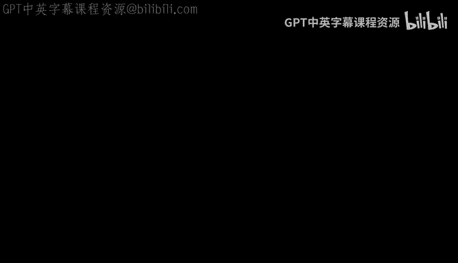
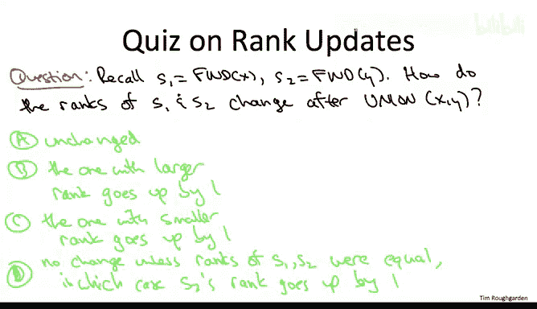

# 数据结构与算法：25：按秩合并优化



## 概述

在本节中，我们将深入探讨并查集数据结构的一种“惰性合并”实现方法。我们将重点关注第一个关键优化——**按秩合并**，它通过智能选择合并方向来避免生成低效的链状结构，从而提升操作性能。

---

## 回顾：惰性合并的基本思想

上一节我们介绍了并查集的基本概念。在惰性合并实现中，每个对象维护一个**父指针**，而非直接指向组领袖。这些指针共同构成一系列有向树，每棵树代表当前分区中的一个组。

树的根节点（指向自身的对象）即为该组的领袖。与“积极合并”要求树深度仅为1不同，惰性合并允许树生长得更深。

**初始化**时，每个对象自成一组，父指针指向自己，均为根节点。

**查找（Find）** 操作通过从给定对象`X`开始，沿父指针向上遍历，直至找到根节点（父指针指向自身的对象），该根节点即为组领袖。

**合并（Union）** 操作给定两个对象`X`和`Y`：
1.  分别对`X`和`Y`执行`Find`，得到其根节点`S1`和`S2`。
2.  将`S1`或`S2`之一设置为另一个的子节点（即进行一次指针更新）。

目前，我们尚未规定在合并时如何选择父子关系。

---

## 问题：随意合并的性能缺陷

如果我们在合并时随意选择将哪个根节点作为另一个的子节点，可能导致最坏情况下的性能问题。

考虑以下场景：我们持续将单元素组合并到已构建的组中，且每次都将新加入的单元素设为新根。经过一系列合并后，我们可能得到一个长度为线性级别的链。

在这种情况下，对链底部的对象执行`Find`操作需要线性时间。由于`Union`操作内部调用了两次`Find`，因此其运行时间也将是线性的。

这提示我们需要一种更智能的合并策略。

---

## 优化：引入秩（Rank）的概念

为了避免生成链状结构，我们引入**秩**作为每个对象的第二个字段（第一个是父指针）。秩是一个整数值。

**当前，我们可以将秩理解为**：从对象`X`所在树的任意叶子节点到`X`本身所需经过的最大跳数（即路径上的指针遍历次数）。特别地，对于根节点，其秩等于整棵树的深度。

**初始化**时，每个对象的秩为0。

**示例**：考虑一个包含两个组的并查集状态。叶节点的秩为0（空路径）。某些内部节点的秩为1。较大树的根节点秩为2。通常，一个节点的秩等于其所有子节点中最大秩加1。

---

## 策略：按秩合并（Union by Rank）

按秩合并的核心思想是：在合并两棵树时，**将秩较小的树的根节点，作为秩较大的树的根节点的子节点**。这样做的目的是避免加深原本已经较深的树。

如果两棵树的根节点秩相等，则任意选择一方作为新根，另一方作为其子节点。

以下是按秩合并的伪代码框架：

```pseudo
function Union(x, y):
    s1 = Find(x) // 找到x的根
    s2 = Find(y) // 找到y的根
    if s1.rank > s2.rank:
        s2.parent = s1 // s2成为s1的子节点
    else if s1.rank < s2.rank:
        s1.parent = s2 // s1成为s2的子节点
    else: // 秩相等
        s1.parent = s2 // 任意选择，这里让s1成为s2的子节点
        s2.rank = s2.rank + 1 // 新根的秩需要加1
```

---

## 秩的更新规则



在执行合并操作后，我们需要考虑秩的维护。首先，只有直接参与指针重连的两个根节点`S1`和`S2`的秩可能发生变化，其他所有对象的秩保持不变。

以下是秩的具体更新规则：

1.  **如果两树根节点秩不同**：将秩较小的根节点挂到秩较大的根节点下。合并后，**两者的秩均保持不变**。因为新树的深度（即新根的秩）等于原来较深那棵树的深度。
2.  **如果两树根节点秩相同**：任意选择一方作为新根。合并后，**新根的秩需要增加1**，而成为子节点的那个根节点的秩不变。这是因为合并后出现了一条更长的从叶子到新根的路径。

**示例说明**：
*   **情况一（秩不同）**：假设`S1`秩为2，`S2`秩为1。将`S2`作为`S1`的子节点。原来`S1`树中存在需要2跳的路径，`S2`树中最长路径为1跳。合并后，从原`S2`树中的叶子到新根`S1`的路径最多为`1（到S2）+ 1（到S1）= 2`跳，未超过原`S1`树的深度，故`S1`秩不变。
*   **情况二（秩相同）**：假设`S1`和`S2`秩均为`R`。将`S1`作为`S2`的子节点。原来`S1`树中存在需要`R`跳的路径。合并后，该路径需要额外一跳才能到达新根`S2`，即需要`R+1`跳。因此，新根`S2`的秩必须增加为`R+1`。

---

## 总结

本节课我们一起学习了并查集惰性合并实现中的第一个关键优化——**按秩合并**。

我们首先分析了随意合并可能导致链化，从而使`Find`和`Union`操作退化为线性时间。接着，我们引入了**秩**的概念来量化树的深度。最后，我们制定了**按秩合并**的策略：总是将秩较小的树合并到秩较大的树下，仅在秩相等时增加新根的秩。这一优化有效地控制了树的生长，避免了最坏情况的发生，为后续实现高效操作奠定了基础。