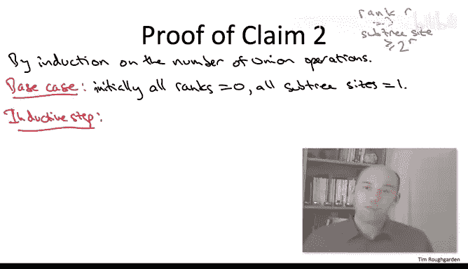

# 算法：26：按秩合并分析-进阶选学 📚

在本节课中，我们将深入分析并查集数据结构中“按秩合并”优化策略的有效性。我们将证明，通过这种优化，`find`和`union`操作的最坏情况运行时间可以被限制在对数级别。这是理解并查集高效性的关键一步。

---

## 数据结构回顾 🔍

上一节我们介绍了“惰性合并”方法。本节中，我们来看看其具体实现和关键属性。

在惰性合并的实现中，每个节点维护一个父指针。这些父指针共同构成了一组有向树。每棵树的根节点（即父指针指向自身的节点）被定义为其所在集合的代表元（领导者）。

*   **`find`操作**：要查找对象`X`的领导者，只需沿着父指针链向上遍历，直到到达根节点。因此，`find`操作的最坏情况运行时间取决于从任意对象到其根节点所需遍历的最长父指针路径长度。
*   **`union`操作**：给定两个对象`X`和`Y`，需要合并它们所在的树。首先对两者调用`find`找到各自的根，然后将一棵树的根作为另一棵树根的子节点。

如果不加优化地随意合并，可能导致树变得非常不平衡（例如形成长链），从而使操作退化为线性时间。

---

## 按秩合并优化 ⚙️

为了防止树变得过于“细长”，我们引入了“按秩合并”优化。其核心思想是：在合并两棵树时，总是将**较浅**的树的根节点，作为**较深**的树的根节点的子节点。

以下是具体规则：
1.  每个节点`X`维护一个**秩**（`rank`）。在当前（未引入路径压缩时），我们保持一个不变式：节点`X`的秩等于从其某个叶子节点到`X`所需遍历的指针的最大数量。因此，所有节点中的最大秩，就是从任意叶子到任意根的最长路径长度，这也就是`find`操作运行时间的上界。
2.  执行`union(X, Y)`时：
    *   找到`X`和`Y`的根节点`root_x`和`root_y`。
    *   比较`root_x.rank`和`root_y.rank`。
    *   如果秩不同，将**秩较小**的根作为**秩较大**的根的子节点。**秩不更新**。
    *   如果秩相同，则任意选择一方（例如`root_y`）作为新根，将另一方（`root_x`）作为其子节点。此时，**新根（`root_y`）的秩需要增加1**（`root_y.rank = root_y.rank + 1`），以反映树深度的增加。

---

## 分析目标与简单属性 🎯

我们的目标是证明：在使用按秩合并优化后，任何节点的最大秩始终以 **O(log n)** 为界，其中`n`是数据结构中的对象总数。由于`find`的最坏情况时间由最大秩决定，而`union`操作包含两次`find`和常数时间指针重连，因此两者都将具有对数级的时间复杂度。

首先，我们从不变式和操作规则中推导出几个简单但至关重要的属性。

以下是三个基本属性：
1.  **秩只增不减**：对象的秩只会随着`union`操作（当它成为新根时）增加，永远不会减少。`find`操作不改变任何秩。
2.  **非根节点秩冻结**：只有根节点的秩可能增加。一旦一个对象成为非根节点（即拥有一个非自身的父节点），它的秩将在此后永久冻结，不再改变。
3.  **沿路径秩严格递增**：根据秩的定义（父节点秩 = 1 + 子节点最大秩），在从叶子到根的路径上，节点的秩是**严格递增**的。即对于任意父子关系，有 `parent.rank > child.rank`。

---

## 核心引理：秩引理及其证明 📖

上述属性引出了一个更强大、也是本次分析核心的结论——**秩引理**。它不仅对证明当前的对数界至关重要，在后续引入路径压缩并证明更优界限时也会反复使用。

**秩引理**：考虑对数据结构执行任意一系列`union`操作（`find`操作不影响结构，可忽略）。对于任意非负整数`r`，在**任何时刻**，秩恰好为`r`的对象的数量最多为 **n / 2^r**。

**推论**：取 `r = ⌊log₂n⌋`，则秩为 `⌊log₂n⌋` 的对象最多有1个，且不存在秩更大的对象。因此，**最大秩 ≤ ⌊log₂n⌋**，从而证明了操作的对数时间复杂度。

为了证明秩引理，我们将其分解为两个子论断。

### 论断一：同秩子树不相交

**论断**：如果两个对象`X`和`Y`具有相同的秩`r`，那么它们的子树（即所有能通过父指针到达该对象的节点集合）是**不相交**的。

**证明**（反证法）：
假设存在对象`Z`，同时位于`X`和`Y`的子树中（即从`Z`出发可以到达`X`和`Y`）。由于父指针形成树结构，从`Z`到其根节点的路径是唯一的。因此`X`和`Y`必须都在这条路径上，其中一个必然是另一个的祖先。根据属性3（路径上秩严格递增），祖先的秩严格大于后代的秩。这与`X`和`Y`秩相同的前提矛盾。因此，假设不成立，子树必然不相交。

### 论断二：子树大小下界

**论断**：任何秩为`r`的对象，其子树大小（即子树中包含的对象数量）至少为 **2^r**。

**证明**（归纳法）：
我们对已执行的`union`操作数量进行归纳。
*   **基础情况**：0次`union`时，每个对象都是独立的根，秩为0，子树大小为1 = 2^0。论断成立。
*   **归纳步骤**：假设在`k`次`union`后论断成立，考虑第`k+1`次`union`。
    *   **简单情况**：如果本次`union`没有改变任何节点的秩。那么所有节点的秩不变，而子树大小只会增加（因为合并了树）。根据归纳假设，原先满足“子树大小 ≥ 2^秩”，现在依然满足。
    *   **关键情况**：本次`union`导致某个节点的秩增加。这只会发生在合并两个秩相同的根节点时。设两个根节点为`S1`和`S2`，秩均为`r`。合并后，假设`S2`成为新根，其秩增加为`r+1`。
        我们需要验证`S2`的新子树大小是否满足至少 `2^(r+1)`。
        *   `S2`的新子树由原来的子树和`S1`的整个子树合并而成。
        *   根据归纳假设，在合并前，`S1.subtree_size ≥ 2^r`，`S2.subtree_size ≥ 2^r`。
        *   因此，合并后`S2`的新子树大小 ≥ `2^r + 2^r = 2^(r+1)`。
        论断在归纳步骤中依然成立。

根据归纳法，论断二得证。

### 完成秩引理证明

固定一个秩值`r`。根据论断二，每个秩为`r`的节点都“拥有”至少`2^r`个不同的对象（在其子树中）。根据论断一，这些子树彼此不相交。由于对象总数为`n`，因此最多能有 `n / 2^r` 个这样的不相交集合，即最多有 `n / 2^r` 个秩为`r`的节点。秩引理得证。

---

## 总结 🏁

本节课中，我们一起学习了并查集“按秩合并”优化策略的严格性能分析。

1.  我们首先回顾了惰性合并与按秩合并的规则，并指出了分析目标：证明最大秩为 **O(log n)**。
2.  接着，我们推导了数据结构的三个基本属性：秩单调递增、非根节点秩冻结、路径上秩严格递增。
3.  然后，我们引入并证明了核心的**秩引理**：秩为`r`的节点数不超过 `n / 2^r`。通过将其分解为“同秩子树不相交”和“子树大小下界”两个子论断，并分别用反证法和归纳法完成了证明。
4.  秩引理直接推出**最大秩 ≤ ⌊log₂n⌋**。由于`find`操作耗时与路径长度（即所涉节点的秩）成正比，而`union`操作主要耗时在于两次`find`，因此我们得出结论：在使用按秩合并优化后，`find`和`union`操作的**最坏情况时间复杂度均为 O(log n)**。

这为并查集数据结构的效率提供了第一个坚实的理论保证，是理解其强大功能的重要基石。在后续课程中，我们将看到如何通过“路径压缩”优化，进一步改善其均摊时间复杂度。