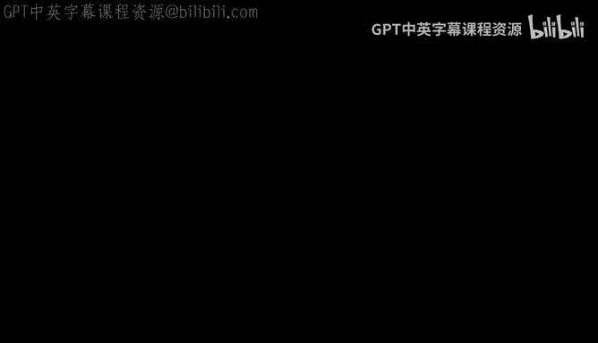
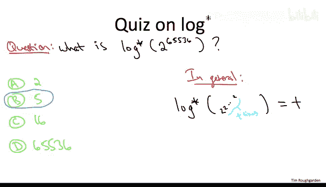

# 算法：27：路径压缩进阶选学



## 概述
在本节课中，我们将学习并查集数据结构的一个关键优化技术——路径压缩。我们将了解其工作原理、如何与按秩合并结合使用，并探讨它如何将操作的平均时间复杂度降低到一个极小的值——迭代对数函数 log* n。

## 路径压缩的动机
上一节我们介绍了按秩合并，它保证了树的高度为 O(log n)。本节中我们来看看如何通过路径压缩进一步优化查找操作的性能。

我们的目标是避免重复的、冗余的工作。在按秩合并的并查集中，最坏情况的查找操作需要从叶子节点遍历到根节点，可能需要进行 O(log n) 次指针跳转。如果反复对同一个叶子节点进行查找，我们就会反复遍历相同的路径。

路径压缩的核心思想是：既然在一次查找操作中我们已经遍历了从节点到根节点的整条路径，为什么不顺便“压缩”这条路径，让路径上的所有节点都直接指向根节点呢？这样，后续的查找操作就会快得多。

## 路径压缩的工作原理
路径压缩在 `find` 操作中实施。当从某个节点 `x` 开始查找其根节点 `r` 时，我们会遍历从 `x` 到 `r` 路径上的所有节点。

以下是路径压缩的步骤：
1.  正常执行查找操作，找到根节点 `r`。
2.  在回溯过程中，将路径上遇到的每个节点（除了根节点 `r`）的父指针直接重定向到根节点 `r`。

用伪代码描述如下：
```python
def find(x):
    if parent[x] != x:
        parent[x] = find(parent[x])  # 递归查找并压缩路径
    return parent[x]
```
或者用迭代方式：
```python
def find(x):
    root = x
    # 第一步：找到根节点
    while parent[root] != root:
        root = parent[root]
    # 第二步：路径压缩，将路径上所有节点指向根
    while parent[x] != root:
        next_node = parent[x]
        parent[x] = root
        x = next_node
    return root
```

从树的角度看，路径压缩使得树变得更浅、更“茂盛”。从数组表示法的角度看，我们直接更新了相关索引的父指针值，使其指向根节点。

## 路径压缩与按秩合并的配合
一个关键点是，**路径压缩优化不改变任何节点的秩（rank）**。

我们回顾一下秩的维护规则：
*   初始化时，每个节点的秩为 0。
*   秩仅在 `union` 操作中可能改变：当合并两个秩相同的树时，新根的秩会加一。
*   在 `find` 操作中进行路径压缩时，我们只重写父指针，不修改任何节点的秩。

这意味着，引入路径压缩后，秩不再精确等于节点的子树高度，但它仍然是一个有效的**上界**。秩所代表的是一种“潜力”或“历史高度”，它保证了树的结构不会变得太差。

以下是一个重要的推论：所有**仅关于秩的引理**（例如上一节证明的“秩为 r 的节点最多有 n/2^r 个”），在引入路径压缩后依然成立。因为无论是否进行路径压缩，我们对秩的修改方式是完全相同的。

## 路径压缩的性能分析
路径压缩的益处显而易见：它加速了后续的 `find` 操作。但其理论上的性能提升究竟有多大呢？

1973年，Hopcroft 和 Ullman 证明了以下定理：
> 考虑一个包含 n 个对象的并查集，使用**按秩合并**和**路径压缩**优化。对于任意长度为 m 的 `union` 和 `find` 操作序列，处理整个序列的总时间复杂度为 **O(m · log* n)**。

这里的 **log* n** （读作“log star n”）是**迭代对数函数**。它的定义是：对数字 n 反复应用以 2 为底的对数运算，直到结果小于或等于 1 所需的次数。

这个函数增长得极其缓慢：
*   log* 2 = 1
*   log* 4 = 2
*   log* 16 = 3
*   log* 65536 = 4
*   log* (2^65536) ≈ 5

事实上，对于所有在现实宇宙中可能出现的 n 值（例如，远小于宇宙原子总数 10^80），log* n 的值都不会超过 5。这意味着，在并查集的实际应用中，经过路径压缩优化后，每个操作的平均时间成本几乎可以看作一个**非常小的常数**。

这远远优于我们之前仅使用按秩合并得到的 O(log n) 单次操作时间复杂度。

## 总结
本节课中我们一起学习了并查集的终极优化技巧——路径压缩。
*   **动机**：避免在反复查找同一节点时重复遍历相同路径。
*   **操作**：在 `find` 操作中，将路径上所有节点的父指针直接指向根节点。
*   **配合按秩合并**：路径压缩不修改节点的秩，所有关于秩的引理依然有效，这为分析其卓越性能奠定了基础。
*   **性能**：Hopcroft-Ullman 定理证明，结合按秩合并与路径压缩的并查集，处理 m 次操作的总时间复杂度为 O(m · log* n)。由于 log* n 增长极慢，这使得每个操作的平均时间成本在实际应用中近乎常数。



至此，我们获得了一个近乎完美的并查集实现，它简洁、高效，并能应对海量数据操作，是许多算法（如 Kruskal 最小生成树算法）的核心组件。在接下来的课程中，我们将基于这些思想进行更深入的理论分析。