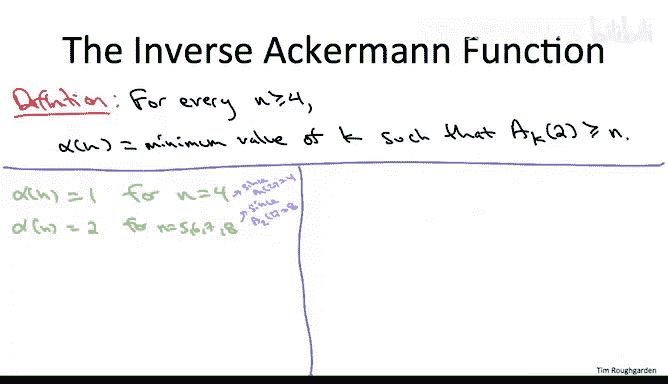

# 算法：105：Ackermann函数进阶选学 📚

在本节课中，我们将深入探讨Ackermann函数及其逆函数。这些函数在计算机科学中，特别是在分析并查集（Union-Find）数据结构的性能时，扮演着重要角色。我们将从定义开始，逐步理解其惊人的增长特性，并将其与之前学过的log*函数进行对比。

## Ackermann函数的定义 📖

Ackermann函数是一个具有两个参数的递归函数，通常记作 **A(k, r)**，其中 **k ≥ 0**，**r ≥ 1**。它的定义如下：

*   当 **k = 0** 时，对于任意 **r**，有 **A(0, r) = r + 1**。这被称为后继函数。
*   当 **k > 0** 时，**A(k, r)** 表示将函数 **A(k-1, ·)** 连续应用 **r** 次到参数 **r** 上。用数学公式表达为：
    **A(k, r) = A(k-1, A(k-1, ... A(k-1, r)...))** （共 **r** 次应用）

虽然定义简洁，但要真正理解这个函数的增长行为，我们需要通过具体的例子来感受。

## 探索Ackermann函数的增长 🚀

上一节我们介绍了Ackermann函数的递归定义，本节中我们来看看当固定 **k** 值时，它作为 **r** 的函数表现如何。

以下是当 **k=1** 时，函数 **A(1, r)** 的行为：
*   **A(1, r) = 2r**。因为 **A(1, r)** 是将后继函数（加1）应用 **r** 次，从 **r** 开始，最终得到 **r + r = 2r**。

接下来，我们看看 **k=2** 的情况。

以下是当 **k=2** 时，函数 **A(2, r)** 的行为：
*   **A(2, r) = r * 2^r**。因为 **A(2, r)** 是将“加倍函数” **A(1, ·)** 应用 **r** 次，这相当于乘以 **2^r**。

现在，让我们进入 **k=3** 的领域，这里开始展现出爆炸性的增长。

以下是 **A(3, 2)** 的计算过程：
*   **A(3, 2) = A(2, A(2, 2))**。
*   首先计算 **A(2, 2) = 2 * 2^2 = 8**。
*   然后计算 **A(2, 8) = 8 * 2^8 = 2048**。
*   因此，**A(3, 2) = 2048**。

对于一般的 **r**，**A(3, r)** 是将函数 **A(2, ·)**（即 **r * 2^r**）应用 **r** 次。其结果至少是一个高度为 **r** 的“2的幂塔”（例如，2^2^...^2）。这种增长已经远超指数级。

当我们来到 **k=4** 时，增长变得难以直观想象。

以下是 **A(4, 2)** 的计算思路：
*   **A(4, 2) = A(3, A(3, 2)) = A(3, 2048)**。
*   这意味着我们需要计算 **A(3, 2048)**，而 **A(3, r)** 本身至少是高度为 **r** 的幂塔。
*   因此，**A(4, 2)** 至少是一个高度为2048的幂塔。这个数字之大，已经超出了任何实际计算的范围。

## 逆Ackermann函数 🔄

理解了Ackermann函数的惊人增长后，我们自然要问它的逆函数是怎样的。逆Ackermann函数，记作 **α(n)**，在算法分析中至关重要。

我们固定参数 **r = 2**，定义 **α(n)**（对于 **n ≥ 4**）为：使得 **A(k, 2) ≥ n** 成立的最小整数 **k**。

换句话说，**α(n)** 回答了“需要多‘高级’的Ackermann函数（从 **A(1,·)** 开始数），才能将数字2提升到至少 **n**”这个问题。

让我们通过具体数值来感受 **α(n)** 的增长是多么缓慢。

以下是 **α(n)** 函数的部分取值：
*   **α(4) = 1**，因为 **A(1, 2)=4 ≥ 4**，而 **A(0,2)=3 < 4**。
*   对于 **n = 5, 6, 7, 8**，有 **α(n) = 2**，因为 **A(2, 2)=8** 是第一个达到或超过这些值的函数。
*   对于 **n** 从 **9** 到 **2048**，有 **α(n) = 3**，因为 **A(3, 2)=2048**。
*   对于 **n** 从 **2049** 直到一个高度为2048的幂塔，有 **α(n) = 4**。

事实上，对于任何在现实物理宇宙中可想象、可表示的数字 **n**，**α(n)** 的值都不会超过 **5**。它的增长比我们之前认为已经极慢的 **log* n** 函数还要慢得多。

## 与 log* 函数的对比 ⚖️

为了凸显逆Ackermann函数的增长之慢，我们将其与迭代对数函数 **log* n** 进行对比。**log* n** 表示需要对 **n** 连续取多少次以2为底的对数，结果才能小于等于1。

以下是两个函数增长率的直观对比：

| 逆Ackermann函数 **α(n)** | 迭代对数函数 **log\* n** |
| :--- | :--- |
| **α(n) = 1** 对应 **n = 4** | **log\* n = 1** 对应 **n = 2** |
| **α(n) = 2** 对应 **n ≤ 8** | **log\* n = 2** 对应 **n ≤ 4** |
| **α(n) = 3** 对应 **n ≤ 2048** | **log\* n = 3** 对应 **n ≤ 16** (即 2^2^2) |
| **α(n) = 4** 对应 **n ≤ 一个高度为2048的幂塔** | **log\* n = 4** 对应 **n ≤ 65536** (即 2^2^2^2) |
| **α(n) = 5** 对应难以想象的巨大数字 | **log\* n = 5** 对应 **n ≤ 2^65536** |

通过对比可以发现，让 **log* n** 增长到4（对应n约6.5万）所需的 **n**，在 **α(n)** 的尺度下，仅仅处在 **α(n)=3** 的范围内。而 **α(n)** 要增长到4，所需的 **n** 是一个高度为2048的幂塔，这个数字大到需要写满2048行“2的幂塔”表达式才能描述，这远远超过了 **log* n** 在任何可想象范围内的值。这清晰地表明，**α(n)** 是一种在渐进意义上增长得无比缓慢的函数。

## 总结 📝

本节课中我们一起学习了Ackermann函数及其逆函数。
*   我们首先定义了双参数的Ackermann递归函数 **A(k, r)**，并通过计算 **k=1,2,3,4** 的例子，切身感受到了其超越指数、超越幂塔的爆炸性增长。
*   接着，我们定义了其逆函数——逆Ackermann函数 **α(n)**，它表示将2提升到至少 **n** 所需的最小Ackermann函数“等级”。
*   最后，通过将其与 **log* n** 函数对比，我们认识到 **α(n)** 是一种增长极其缓慢的函数，对于所有有意义的输入，其值实际不超过5。这个函数在并查集数据结构的紧致性能分析（Tarjan定理）中扮演着核心角色，标志着其时间复杂度几乎是线性的。