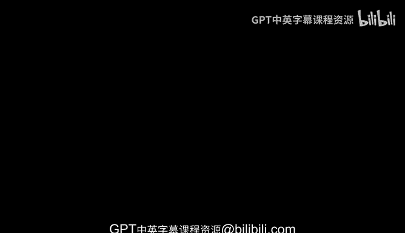
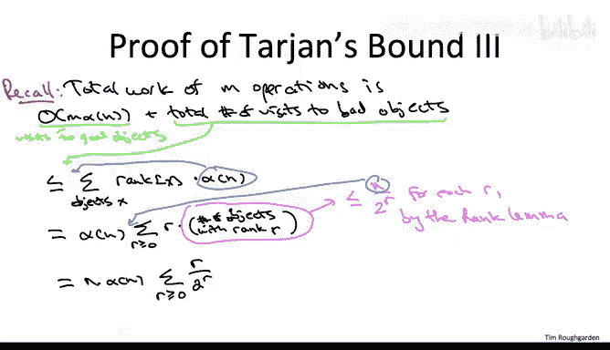

# 斯坦福大学《算法（分治／排序／搜索／随机算法、图搜索／最短路径／数据结构、贪心算法／最小生成树／动态规划、最短路径／NP）｜Algorithms》中英字幕 - P107：32_02_09_路径压缩-Tarjan分析二-进阶选学.zh_en - GPT中英字幕课程资源 - BV1Rx4y1U7sZ

So just like in the Hocroft Omen analysis， we're going to think about the total amount of work done by our union find data structure as constituting two pieces。

 work done， visiting good nodes and work done visiting bad nodes。

 the previous quiz says that we have a bound on visits to good nodes even on a per operation basis at most inverse ackermen of N good nodes are visited every single operation What remains is to have a global bound on the number of visits to bad nodes。

The argument will be to show that over an arbitrary sequence of M find and union operations。

 the total number of visits to bad nodes is mounted above by big O of n times alpha of n。

So here is the crux of the argument。 Here is why when you do a visit to a bad node。

 the subsequent path compression massively increases the gap between that object's rank and the rank of its parent。

So let's freeze the data structure at the moment where a fine operation makes a visit to a bad object。

 called that bad object X。 Let's think about what the world with the data structure must look like in this scenario。

So we've got our bad object X。 it may or may not have node pointing to it。 We're not going to care。

By virtue of it being bad and meeting the third criterion， we know the rank of x is at least two。

 its delta value could be anything， whatever it is， let's call it K。So because x is not a root。

 it has some parent call that parent P。And not only does x have ancestors。

 but because it meets the fourth criterion， we actually know it has an ancestor y。

 who has the same delta value as x， that is it has an ancestor y with delta of y equal to K。

It is possible that P and Y are the same object or they could be different。

 it's not going to matter in the analysis。So recalling that the statistic delta is only defined for non roots。

 we can conclude that y is also not the root， it must then have some parent call it P prime。

P prime might be a root or it might not， we don't care。

So now let's understand the effect of the path compression。

 which is going to happen subsequent to this fine operation X's parent point is going to be rewired to the root of this tree。

 The root of this tree is either at P prime or even higher than that。Given that fact。

 let's understand how much bigger the rank of X's new parent P Prime or higher is compared to the rank of its old parent P。

So the rank of x's new parent is at least the rank of P prime， so if p prime is in fact the root。

 then the rank of x's new parent is just the rank of P prime。

 otherwise this new parent is even higher than P prime and since ranks only increase going up the tree。

 that means it would be only higher than the rank of P prime。

How does the rank of P prime compare to its child that of its child Y Well and here's a key point because delta of y is equal to K。

 remember what the definition of delta is， it quantifies the gap between the rank of an object and that of its parent we're going to use that here for y and its parent P prime。

 it means the rank of p prime is so big， it's at least the function a sub K applied to Y's rank。

So our third and final inequality is the same as the first one。

 So it could be the case that y actually is the same as P。 It actually is x's old parent。

 In that case， the rank of x' as old parent is precisely the rank of y。 Otherwise。

 y is even higher up than x's old parent P。 and therefore， by the monotonicicity of rank。

 the rank of y is even bigger than the rank of x is old parent。So now， in this chain of inequalities。

 I want you to focus on the leftmost quantity and the rightmost quantity。

 What does this say at the end of the day， it says when you apply path compression to X。

 it acquires a new parent and the rank of that new parent is at least the a sub K function。

 applied to the rank of its old parent。 Again， path compression at the very least applies the a sub K function to the rank of X's parent。

So now let's suppose you visit some bad object X， not just once， but the same object X。

 while it's bad over and over and over again， this argument says that every such visit to the object X。

 while it's bad， applies the function a sub K to the rank of its parent。So in particular。

 let's use R to denote the rank of this bad object X and again。

 by virtue of it being bad R has to be at least two。

 Imagine we do a sequence of R visits to this object X while it's bad each of those visits will result in acquiring a new parent and that new parent' rank is much bigger than the rank of the previous parent。

 it's at least a sub K applied to the rank of the previous parent。

 so after R visits that's applying the function a sub K R times to the rank of x's original parent。

 which of course has rank at least that of X at least R。Well。

 we have another name for applying the function A sub K R times to R。 Remember。

 this is just by definition of the ackerman function， a sub K plus1 applied to R。

So what does this mean， Well， this means that after our visits to a bad object X that has rank R。

 the rank of X's parent has to have grown so much that that growth is reflected in our statistic delta that measures the gap in the rank between an object and the object's parent。

So remember how we define delta of x， it's the largest value of k so that the rank of x is parent is even bigger than a sub K applied to the rank of x。

 So what the inequality shows is that every R parent pointer updates to x allow you to take K to be even bigger than before。

 You can bump up K by1 and still have this inequality be satisfied。

 That is every R visits to a bad object of rank R delta has to increase by at least1。

But there's only so many distinct values that the statistic delta of x can take on。

 It's always non negative。 It's always an integer。 It can only increase。

 and it's never bigger than the inverse acroman function， Alpha of n。 So therefore。

 the total number of visits to an object X， while it's bad over an arbitrary sequence cannot be more than R。

 the number of visits needed to increment deelta of x times the number of distinct values。

 which is alpha of n， the inverse acroman function。So now we've done all the hard work。

 We're almost there。 We just need one final slide， putting it all together。All right。

 so to see how all of this comes together， let's first recall that all that we need to do is bound the total number of visits to bad objects over this entire sequence of union and find operations。

So in the previous slide we show that for a bad object X with rank R。

 the total number of times it's visited while it's bad is bounded above by r times the inverse akron function of n。

 so let's sum that over all of the objects to get our initial bound on the total number of visits to bad objects。

So now we have to be a little careful here because there are n objects X and ranks can be as large as log n。

 so a naive bound would give us something like n times log n times alpha of n and that's not what we want。

 we really want n times alpha of n So we need to use the fact that not all nodes can have big rank and that's exactly what the rank lemma says So to rewrite this in a way that we can apply the rank limma bounding the number of objects with a given rank let's bucket the objects according to their rank so rather than something over the objects we're going to sum over possible ranks R。

 and then we're going to multiply times the number of objects that have that rank are。

While I'm at it， let me pull the alpha of n factor。

 which doesn't depend on the object out in front of the sum。For every value of R。

 the rank lemma tells us there are most n over2 to the R objects with that rank。

So this factor of n is independent of the rank R。 So let me pull that out in front of the sum。

And when the best settles， we get n times the inverse acromen function of n times the sum over non negative integers R of r divided by2 to the。

 So we've seen this kind of sum without the r in the numerator， just a geometric sum1 over2 to the R。

 we know that's bounded by a constant and more generally throwing an r in the numerator。

 Well that's no match for this exponentially decreasing denominator。

 So this sum still evaluates to a universal constant。

 I'll let you check that in the privacy of your own home。

And so that's give us a bound of big O of n times the inverse acromen function of n on the total number of visits to bad objects since we also have a per operation bound of alpha of n on the number of visits to good nodes。

 combining the work of the two cases we get o of n plus n times inverse acromen function of n and again the interesting case here is when M is big Oomega of n。

 otherwise you can just do this analysis separately for each tree in the data structure。

And there you have it， you now understand in full detail one of the most amazing results in the history of algorithms and data structures。

So Tn's bound is unimaginably close to being linear without actually being linear。

 it's off by this inverse ackerman function factor Now from a practical perspective for any imaginable value of n。

 the alpha of n is at most four， so this gives you a linear time bound for imaginable values of n。

 in fact， even the hotcroft oman log star bound， log stars at most5 for any imaginal value of n。

 so that also is in essence， linear time bound for all practical purposes。

 but theoretically speaking， we have not proven a linear time bound on the amount of work done by the union find data structure。

So the Pavlavian response of any algorithms researcher worth their salt would be to ask。

 can we do better？ and we could ask that question in a couple different senses。

 The first sense would be， well， maybe we can have a sharper analysis of this exact data structure。

 Maybe union by rank and path compression is sufficient to guarantee a linear amount of work。

 After all， we didn't need to change the data structure。

 We only needed to change the analysis to sharpen the log star bound to an alpha of N bound。

So this question， remarkably， Taarjan answered in the negative in his original paper。

 He showed that if you use this exact data structure， union by rank and path compression。

 then there are arbitrarily large sequences of unions and fines on arbitrarily large collections of objects so that this data structure actually performs asymptotically M。

 the number of operations times the inverse ackerman function of n。 the number of objects。

 amount of work that is keeping the data structure fixed。

 This analysis cannot be asymptotically improved。 This data structure fundamentally has worse case performance governed by this insane inverse ackermen function。

So this is already a mindboggling fact and indeed Ta in the conclusion of his paper notes that it's remarkable to have such a simple algorithm with such a complicated running time。

 but you can also ask the question， could we do better perhaps by improving or changing the data structure After all by adding path compression。

 we got a qualitative improvement in the average operation time， it dropped from log to alpha of n。

 perhaps there's yet another optimization out there waiting to be discovered that would drop the amount of work per operation over a sequence down to constant time per operation linear work overall。

Targeent in his paper made the bold conjecture that there is no linear time method。

 no matter how clever you are。 and remarkably， that conjecture has since been proved。

 it was proved for certain classes of data structures。

 both in Tan in his original paper and in a follow up paper in 79。

 But the final version of this conjecture was proven by Fredman and Saacks back in 1989。

 no matter how clever you are， no matter what union fine data structure you come up with。

 there will be arbitrarily long sequences of operations。

 so that the average amount of work you do per operation is the inverse acumen function of the number of objects in the data structure。

 Pret unbelievable。So let me just wrap up with a historical comment。

 so full disclosure I wasn't quite alive when this result came out。

 but and reading about it and talking to senior researchers about it。

 my sense is that it was really sort of a watershed moment for the field of data structures and algorithms。

Specifically， it confirmed the belief of people working in algorithms and data structures that the field possessed surprising depth and beauty。

 There had， of course， been earlier glimpses of this。 we mentioned in the optional material in Part1。

 Kanuth's analysis of linear probing back in the early 1960s。

 but this was really something for the worst case analysis of algorithms and data structures。

So the fact that such a practical and naturally arising problem in algorithms and data structures requires necessarily the understanding of the Ackerman function in its inverse。

 a function mind you which was first proposed and defined back in the 1920s and the service of recursion theory almost 10 years before Turing was doing his work on models of computation was a real eye opener and it showed that this field is something that would keep many generations of scientists quite busy for many years to come。

