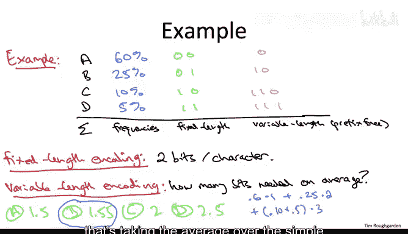

# 斯坦福大学《算法（分治／排序／搜索／随机算法、图搜索／最短路径／数据结构、贪心算法／最小生成树／动态规划、最短路径／NP）｜Algorithms》中英字幕 - P108：33_03_02_引言与动机.zh_en - GPT中英字幕课程资源 - BV1Rx4y1U7sZ

So this set of lectures will be our final application of the greedy algorithm design paradigm。

 it's going to be to an application and compression。

 specifically I'll show you a greedy algorithm for constructing a certain kind of prefix free binary codes known as Huffman codes。

So we're going to spend this video just sort of setting the stage。

 so let's begin by just defining a binary code。So a binary code is just a way to write down symbols from some general alphabet in a manner that computers can understand。

 that is it's just a function mapping each symbol from an alphabet capital sigma to a binary string。

 a sequence of zeros and ones。So this alphabet capital sigma could be any number of things。

 but you know as a simple example， you could imagine it's the letters A through Z。

 say in lowercase plus maybe the space character and some punctuation。

 so maybe for a set of size 32 overall。And if you have 32 symbols you need to encode in binary。

 well an obvious way to do it is there happens to be 32 different binary strings of length5。

 so why not just use one of each of those for your symbols？

So this would be a fixed length code in the sense we're using exactly the same of rubbits。

 namely five to encode each of the symbols of our alphabet。

 this is pretty similar to what's going on with ASCI codes。

And of course it's a mantra of this class to ask when can we do better than the obvious solution。

 so in this context when can we do better than fixed linked codes， sometimes we can。

 in the important case when some symbols are much more likely to appear than others。

 in that case we can encodeing information using fewer bits by deploying variable linked codes。

And this is in fact a very practical idea variable linked codes are used all the time in practice one example is in encoding MP3 audio files。

 so if you look up the standard for MP3 encoding there's this initial phase in which you do analog to digital conversion。

 but then once you're in the digital domain you do apply Huffman codes what I'm going to teach you in these videos to compress the length of the files even further and of course as you know compression especially lossless compression like Huffman codes is a good thing you want to download a file you want it to happen as fast as possible well you want to make the file as small as possible。

So a new issue arises when you pass from fixed length codes to variable length codes。

 so let me illustrate that with a simple example， supposeose our alphabet sigma is just four characters ABCD。

 So the obvious fixed length encoding of these characters would just be 00，01。

10 and 11 Well suppose we wanted to use fewer bits and we wanted to use a variable length encoding an obvious idea would be to try to get away with only one bit for a couple of these characters。

So I suppose instead of using a double zero for a， we just use a single zero。

 and instead of using a double one for D， we just use a single one。So that's only fewer bits。

 so that seems like that can only be better。 But now here's the question。

 Suppose someone handed you an encoded transmission consisting of the digits0，01。

 What would have been the original sequence of symbols that LED to that encoded version。All right。

 so the answer is D， there is not enough information to know what 001 was supposed to be an encoding of。

The reason is is that having passed to a variable length encoding， there is now ambiguity。

 there is more than one sequence of original symbols that could have led under this encoding to the output 001。

Specifically， answers A and C would both lead to 001。The letter A would give you a0。

 the letter B would give you a zero1， that would give you double 01。On the other hand。

 AA would also give you 0，01。 So there's no way to know。 Contrast this with fixed length encoding。

 if you're given a sequence of bits with a fixed length code， of course。

 you know where one letter ends and the next one begins。 For example。

 if every symbol was encoded with5 bits。 you would just read 5 bits。 You'd know what symbol it was。

 you'd read the next five bits and so on。 with variable length codes without further precautions。

 it's unclear where one symbol starts and the next one begins。

 So that's an additional issue we have to make sure to take care of with variable length codes。

So to solve this problem that with variable length codes and without further precautions it's unclear where one symbol ends and where the next one begins。

 we're going to insist that our variable length codes are prefix free。

 so what this means is when we encode a bunch of symbols。

 we're going to make sure that for each pair of symbols I andj from the original alphabet sigma the corresponding encodings will have the property that neither one is a prefix of the other so going back to the previous slide you'll see that that example was not prefix free for example we used0 was a prefix of01 that led to ambiguity similarly one。

 the encoding for D was a prefix of 10 the encoding for C and that also leads to an ambiguity so if you don't have prefixes for each other and we'll develop this more shortly then there's no ambiguity then there's a unique way to decode to reconstruct what the original sequence of symbols was given just the zeros and ones。

So le do you think this is too strong a property， certainly interesting and useful variable length codes exist that satisfy the prefix free property。

 so one simple example again just to encode the letters ABCD。

 we can get away with encoding the symbol A just using a single bit just using a zero now of course to be prefix free it better be the case that are encodings of B and C and D all start with the bit1 otherwise we don't we're not prefix free。

 but we can get away with that so let's encode a B with one and then a zero。

And now both C and D better have the property that they start neither with zero nor with 10。

 that is they better start with 11， but let's just encode C using 110 and D using 111。

So that would be a variable length code， the number of bits varies between one and three。

 but it is prefixed free。And again， the reason we might want to do this。

 the reason we might want to use a variable lengthcoding is to take advantage of nonuniform frequencies of symbols from a givenbb alphabet。

 so let me show you a concrete example of the benefits you can get from these kinds of codes on the next slide。

So let's continue with just our four symbol alphabet， A， B， C， and D。

And let's suppose we have good statistics in our application domain about exactly how frequent each of these symbols are。

 so in particular， let's assume we know that A is by far the most likely symbol。

 let's say 60% of the symbols are going to be A's。Whereas 25% are B's， 10% are C's and 5% are D's。

So why would you know these statistics， well in some domains you're just going to have a lot of expertise in genomics you're going to know the usual frequencies of As C's。

 G's and T's for something like an MP3 file， where you can literally just take an intermediate version of the file after you've done the analog digital transformation and just count the number of occurrences of each of the symbols and then you know exact frequencies and you're good to go。

So let's compare the performance of the just sort of obvious fixed length code where we use two bits for each of the four characters with that of the variable length code that's also prefix free that we mentioned on the previous slide。

 and we're going to measure the performance of these codes by looking on average。

 how many bits do you need to encode a character where the average is over the frequencies of the four different symbols。

So for the fixed length and coding， of course， it's two bits per symbol。

 we don't even need the average， just whatever the symbol is it uses exactly two bits。

So what about the variable length encoding that's shown on the right in pink。

 how many bits on average for an average character。

 given these frequencies of the different symbols are needed to encode a character of the alphabet sigma？

Okay so the correct answer is the second one， it's on average 1。55 bits per character。

 so what's the computation well 60% of the time it's going to use only one bit and that's where the big savings comes from one bit is all that's needed whenever we see an A and most of the characters are A's。

We don't do it too bad when we see a B either， which is 25% of the time we're only using two bits for each B。

Now it is true that season D's were paying a price， we're having to use three bits for each of those。

 but there aren't very many， only 10% of the time is it a C and 5% of the time is it a D。

And if you add up the result， that's taking the average over the symbol frequencies。

 we get the result of 1。55。

So this example draws our attention to a very neat algorithmic opportunity。

 so namely given a alphabet and frequencies of the symbols which in general are not uniform。

 we now know that the obvious solution fixed length codes need not be optimal we can improve upon them using variable length prefix free codes so the computation problem we want to solve is which one is the best how do we get optimal compression which variable length code gives us the minimum average encoding length of a symbol from this alphabet so Huffman codes are the solution of that problem will start developing them in the next video。

