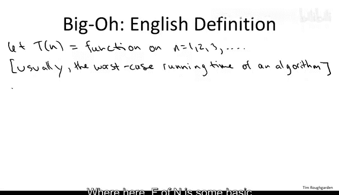
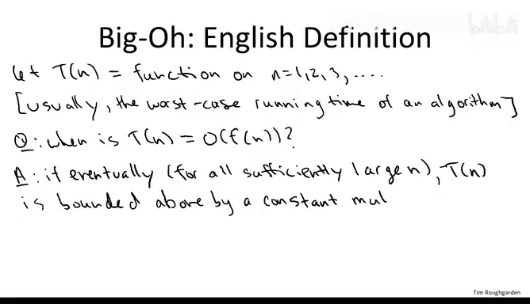
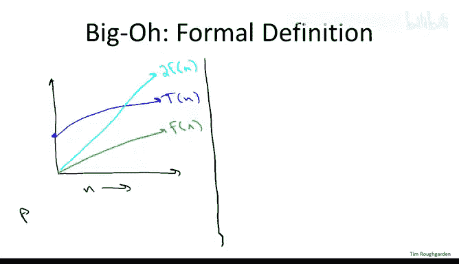
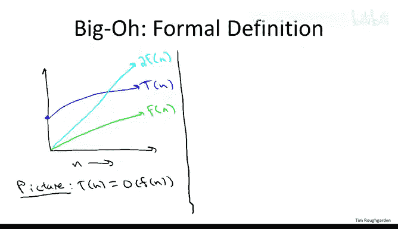
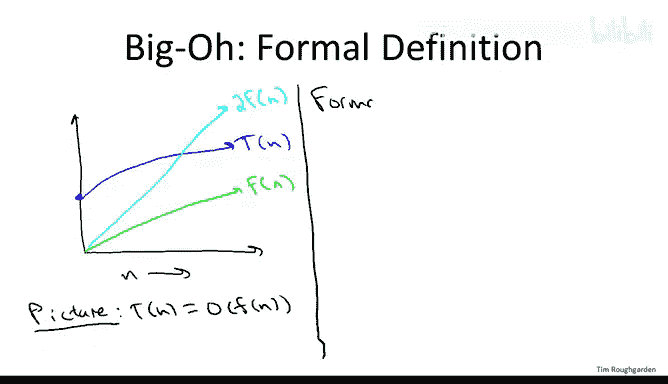
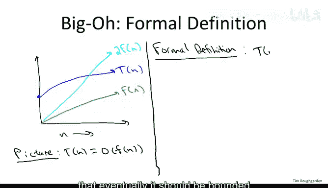
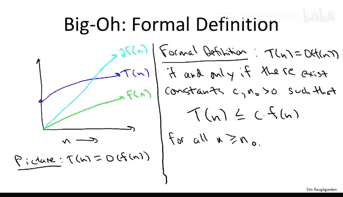
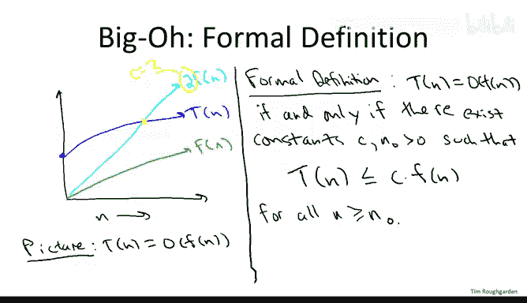

# 斯坦福大学《算法（分治／排序／搜索／随机算法、图搜索／最短路径／数据结构、贪心算法／最小生成树／动态规划、最短路径／NP）｜Algorithms》中英字幕 - P10：10_01_02_大O记号.zh_en - GPT中英字幕课程资源 - BV1Rx4y1U7sZ

In the following series of videos， we'll give a formal treatment of asymptotic notation in particular bigot notation。

 as well as work through a number of examples。Viiggo notation concerns functions defined on the positive integers。

 we'll call it T of n。We'll pretty much always have the same semantics for T of N。

 and we're going to be concerned about the worst case running time of an algorithm as a function of the input size n。

So the question I want to answer for you in the rest of this video is what does it mean when we say a function T of n is big O of F of n where here F of n is some basic function like。

 for example， and log N。

So I'll give you a number of answers， a number of ways to think about what bigO notation really means。

 but for starters let's begin with an English definition。

 what does it mean for a function of a bigO of F of n。

 it means eventually for all sufficiently large values of n。

 it's bounded above by a constant multiple of F of n Let's think about it in a couple other ways。

So next I'm going to translate this English definition into a picture and then I'll translate it into formal mathematics so pictorially you could imagine that perhaps we have T of n denoted by this blue function here。

And perhaps F of n is denoted by this green function here， which lies below T of n。

 but when we double F of n， we get a function that eventually crosses T of n and forevermore is larger than it。

So in this event， we would say that T of N indeed is big O of F of n。

The reason being that for all sufficiently large and once we go far enough outright on this graph。

 indeed a constant multiple times f of n twice F of n is an upper bound on T of n。So finally。

 let me give you an actual mathematical definition that you could use to do formal proofs。

 So how do we say in mathematics that eventually it should be bounded above by a constant multiple of F of N。

We say that there exist two constants， which I'll call C and M not。

 so that T of n is no more than C times F of n。For all n that exceed or equal and not。

So the role of these two constants is to quantify what we mean by a constant multiple and what we mean by sufficiently large in the English definition。

 C obviously quantifies the constant multiple of F of N and N not is quantifying sufficiently large。

 that's the threshold beyond which we insist that C times F of n is an upper bound on T of n。

So going back to the picture， what are CNN not， well， C of course， is just going to be2。

And and not is the crossing point。 So if you look at where2 F of n and T of n cross。

 and then we drop the asytote， this would be the relevant value of。

And not in this picture。 So that's the formal definition。

 The way to prove that something's big O of F of n。

 you exhibit these two constants C and n not and better be the case that for all n at least n not C times F of n upper bounds T of n。

 One way to think about it， if you're trying to establish something is big O of some function。

 It's like you're playing a game against an opponent and you want to prove that this inequality here holds and your opponent wants to show that it doesn't hold for sufficiently large n you have to go first。

 your job is to pick a strategy in the form of a constant C and a constant and not and your opponent is then allowed to pick any number n larger than n not。

 So the function is big O of F of n， if and only if you have a winning strategy in this game。

 if you can upfront commit to constants C and n not so that no matter how big an n your opponent picks this inequality holds。

 if you have no winning strategy， then it's not big O of F of n no matter what C and n not you choose your opponent can always flip this inequality by choosing suitable suitable large value of n。

I want to emphasize one last thing， which is that these constants， what do I mean by a constant。

 I mean they are independent of n。So when you apply this definition and you choose your constant C not it better be that n does not appear anywhere。

 so C should just be something like100 or a million。

 so' constant independent of N So those are a bunch of ways to think about bigot notation in English you want to have a bound above for sufficiently large numbers N I've shown you how to translate that into mathematics I give you a pictorial representation and also a sort of game theoreticaloretic way to think about it Now let's move on to a video that explores a number of examples。

