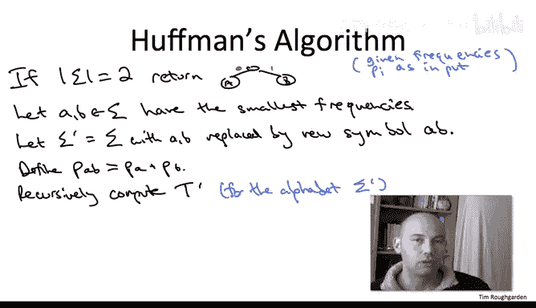

# 斯坦福大学《算法》课程：第35讲：贪心算法


在本节课中，我们将学习霍夫曼算法，这是一种用于构造最优前缀无歧义二进制编码的贪心算法。我们将从问题定义开始，逐步理解算法的设计思路、具体步骤，并最终看到其实现方式。

## 概述

我们面临的计算问题是：给定一个字母表及其每个符号的出现频率，需要构造一个**前缀无歧义**的二进制编码，使得编码的平均长度最小。这种编码可以对应一棵二叉树，其中每个叶子节点代表一个符号，其编码长度等于该叶子节点的深度。

## 从分治到贪心：构建树的思路

上一节我们介绍了如何用树来表示编码。本节中我们来看看如何构建这棵树。

一种自然的想法是采用**自顶向下**的分治策略：将符号集分成两组，递归地为每组构建子树，然后将它们合并。然而，这种方法（称为香农-范诺编码）并非最优。

霍夫曼在他的学期论文中发现，**自底向上**的贪心方法才是构建最优编码树的正途。这种方法不仅保证最优性，而且算法速度极快。

## 自底向上合并：核心操作

以下是自底向上构建树的基本思想：

我们从一个包含所有符号的叶子节点集合开始。然后，我们反复执行**合并**操作：选择两个现有的子树，将它们作为左右孩子连接到一个新的内部节点下。经过 n-1 次合并后，我们就得到了一棵完整的树。

那么，关键问题在于：在每一步中，我们应该合并哪两棵子树？一个短视的贪心选择标准是什么？

## 合并的代价与贪心准则

为了理解合并的影响，我们需要分析合并操作如何影响最终的平均编码长度。

每次合并都会引入一个新的内部节点。对于参与合并的两棵子树中的所有符号来说，这个新节点将成为它们从叶子到根路径上的一个新节点，这意味着这些符号的编码长度都将**增加1位**。

因此，如果我们希望最小化加权平均编码长度，一个合理的贪心策略是：在每一步，**合并当前频率最低的两个符号（或子树）**。因为增加低频符号的编码长度，对总平均长度的负面影响最小。

这引出了我们的递归策略。

## 递归子问题与霍夫曼算法

基于上述贪心思想，我们可以递归地定义算法。以下是算法的核心步骤：

1.  **基础情况**：如果字母表只有两个符号，则直接用一个0和一个1编码它们。
2.  **递归步骤**：
    *   找到频率最低的两个符号，记为 `a` 和 `b`。
    *   将它们从当前字母表中移除，并添加一个新的“元符号” `ab`，其频率为 `freq(a) + freq(b)`。
    *   递归地为这个新的、规模更小的字母表（少了一个符号）构建最优编码树 `T‘`。
    *   在树 `T‘` 中，找到代表元符号 `ab` 的叶子节点，将其“分裂”：替换为一个新的内部节点，该节点的左右孩子分别是代表 `a` 和 `b` 的叶子节点。
    *   返回这棵修改后的树 `T` 作为原问题的解。

## 算法示例

让我们通过一个具体例子来演示霍夫曼算法。假设有符号 `A, B, C, D`，频率分别为 `60, 25, 10, 5`。

1.  初始状态：四个叶子节点 `(A:60), (B:25), (C:10), (D:5)`。
2.  合并频率最低的 `C` 和 `D`，生成元符号 `(CD:15)`。现在集合为 `(A:60), (B:25), (CD:15)`。
3.  合并频率最低的 `B` 和 `CD`，生成元符号 `(BCD:40)`。现在集合为 `(A:60), (BCD:40)`。
4.  合并最后两个符号 `A` 和 `BCD`。此时达到基础情况（两个符号），递归开始返回。
5.  从递归返回时，逐步“分裂”元符号：
    *   将代表 `A` 和 `BCD` 的树中的 `BCD` 叶子分裂，得到 `B` 和 `CD` 作为其孩子。
    *   再将代表 `CD` 的叶子分裂，得到 `C` 和 `D` 作为其孩子。
6.  最终得到编码树：`A` 的编码为 `0`，`B` 为 `10`，`C` 为 `110`，`D` 为 `111`。

## 算法伪代码

以下是霍夫曼算法的伪代码描述：

```
function Huffman(Sigma, frequencies):
    if |Sigma| == 2:
        return a tree with two leaves labeled with the two symbols
    else:
        let a, b be the two symbols with the smallest frequencies
        // 创建新字母表 Sigma'
        Sigma' = Sigma - {a, b} ∪ {meta-symbol ab}
        freq(ab) = freq(a) + freq(b)
        // 递归求解
        T' = Huffman(Sigma', frequencies')
        // 将元符号 ab 分裂为 a 和 b
        In T', find the leaf labeled 'ab'
        Replace that leaf with an internal node having two children:
            left child = leaf labeled 'a'
            right child = leaf labeled 'b'
        return the modified tree T
```

## 总结



本节课中我们一起学习了霍夫曼算法。我们了解到，通过采用**自底向上**的贪心策略，在每一步**合并频率最低的两个符号/子树**，并递归地将问题规模缩小，可以高效地构造出最优的前缀无歧义编码树。算法的直觉在于，让低频符号承受编码长度增加的代价更为划算。虽然算法的正确性需要严格的证明（这将是下一节的内容），但其设计思路清晰而优雅，是贪心算法设计的经典范例。