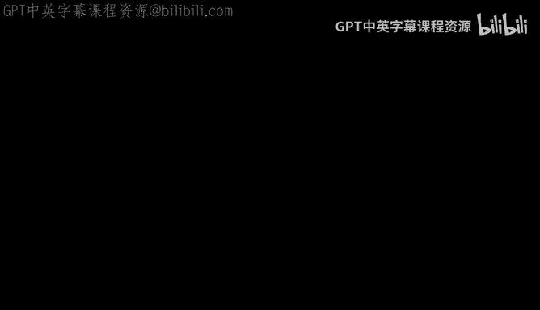
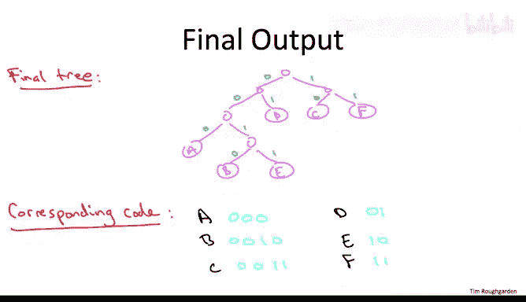

# 斯坦福大学《算法（分治／排序／搜索／随机算法、图搜索／最短路径／数据结构、贪心算法／最小生成树／动态规划、最短路径／NP）｜Algorithms》中英字幕 - P111：36_03_05_复杂示例.zh_en - GPT中英字幕课程资源 - BV1Rx4y1U7sZ

To make sure that Huffman's greedy algorithm is clear， let's go through a slightly larger。

 more complicated example。

So let's work with a six character alphabet。 Let's call the letters ABC， D， E F。

 and let's assume that we're given the weights 3，2，6 and 8，2，6 for these six characters。 Remember。

 this problem is well defined， even if the weights don't add up to one。

 if you prefer working with actual probabilities， feel free to divide these six numbers by 27。

In the first step of Huffman's greedy algorithm， we find the letters that have the smallest weights。

 the smallest frequencies。 So in this example， that would be the letters B and E。

 Both of them have weight 2。 Now， what we do is we merge these two letters into a single metal letter in effect。

 committing right now to having B and E B siblings in the final tree。After this merger。

 our alphabet is down to five symbols， the symbols B& E being replaced by the merge symbol B E。

 and the weight of a B E is the sum of the weights of B and E， namely4。

We can imagine our tree slowly taking shape through these iterations。 So after step1。

 we know that B and E are going to be siblings， and we know that just AC。

 D and F are going to be leaves。 That's all we know thus far。In the next iteration， we again。

 look for the two symbols that have the smallest weight。 And here， the smallest weight symbol is a。

 It has weight 3， and the runner up is the merge symbol B sub B。 Its combined weight is 4。

 And that second overall for these five symbols。 So in this step， we merge A with B， E。

Now our alphabet is down to four symbols， the merged symbol A B E， which has cumulative weight 7。

 and then the original symbols C， D and F， which have their original weights 6，8 and6。

As far as our tree， we have now committed to the symbol A， appearing as a uncle of the siblings。

 B and E， and again， C DNF， we just know they' leaves somewhere in the final tree。In step3。

 we're going to again pick the two symbols that have the smallest weights。 in this case。

 the two symbols with the smallest weight are C and F each of weight 6。In our new alphabet。

 we still have our symbol A B， E， it still has weight 7， we still have the symbol D。

 it still has weight 8， but now we have a new merge symbol C， and its new weight is 12。

As far as our tree， in addition to the information we already know， new。

 we're now committing to having C and F be siblings in the final tree。In step 4。

 we merge the two symbols with the smallest weight， so that would be A B。

 E with its weight of 7 and D with its weight of 8。So this leaves us with only two symbols， A， B， D。

 E， and CF， and now we know what both of these subtrees of the roots of the final tree are going to look like。

Now that we're down to two symbols， the only thing we can do is fuse these two symbols into one。

fuse these two subtes into a single one by uniting them under a common root。

 That gives us the following final output of Huffman's algorithm。

What prefix free code does this tree correspond to， Well， as usual。

 let's label all of the left branches with zero and all of the right branches with ones。And now。

 as usual， the encoding of a character is just the symbols of zeros and ones that you see when you traverse a path from the root to that leaf。

 So， for example， a will be encoded with 0，0，0， B with 0，0，1，0， C with 1，0， D with 0，1， E with 0，0，1。

1， and f with 1，1。

