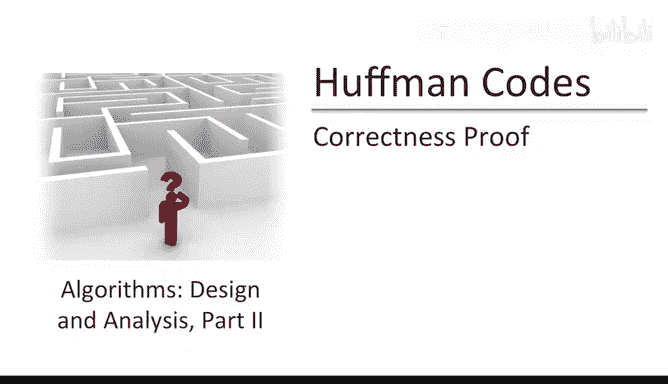
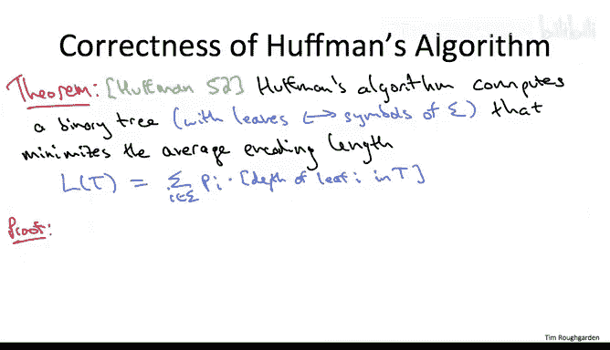
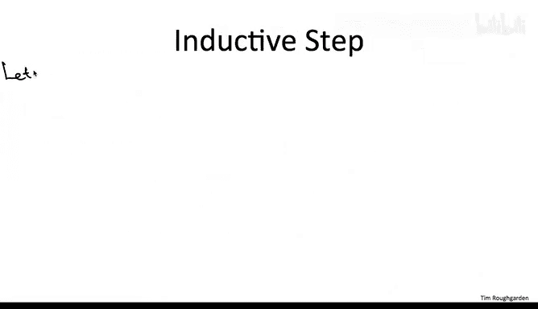
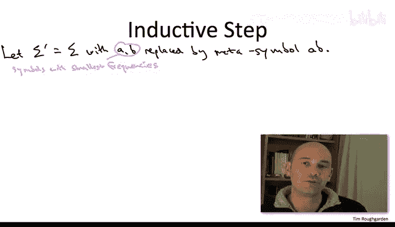
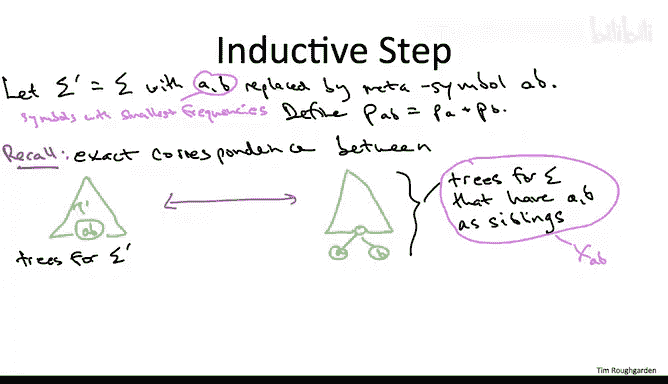

# 算法：37：霍夫曼算法正确性证明（第一部分） 🧩

在本节课中，我们将学习如何证明霍夫曼算法的正确性。具体来说，我们将证明这个贪心算法总能计算出平均编码长度最小的前缀自由二进制码。

## 证明概述

我们将通过数学归纳法来证明霍夫曼算法的正确性。证明的核心思想是：首先处理基础情况，然后利用归纳假设，通过“交换论证”来证明算法的每一步合并操作都是最优的。

## 符号与表达式

首先，我们回顾一下平均编码长度的表达式。对于一个给定的树 **T**，平均编码长度定义为：

\[
\text{Average Encoding Length} = \sum_{i \in \Sigma} p_i \cdot \text{depth}(i)
\]

其中：
- **Σ** 是字母表。
- **p_i** 是符号 **i** 的频率（作为输入的一部分给出）。
- **depth(i)** 是树 **T** 中对应符号 **i** 的叶节点的深度。

这个表达式在证明中会频繁使用。

## 归纳法结构

我们将对字母表的大小 **N** 进行归纳证明。这与我们在第一部分证明迪杰斯特拉算法正确性时使用的归纳法有相似之处：我们假设算法在较小的输入上正确，然后证明在当前输入上也正确。

### 基础情况

当字母表大小为 **2** 时，霍夫曼算法会输出一个简单的树：用一个比特 **0** 编码一个符号，用比特 **1** 编码另一个符号。这是最优的，因为每个符号至少需要一个比特来编码，而该树恰好为每个符号使用了一个比特。因此，霍夫曼算法在这个平凡的特殊情况下是最优的。

### 归纳步骤

现在，我们关注字母表大小至少为 **3** 的任意问题实例。归纳假设是：霍夫曼算法在任何较小的输入（即字母表更小的问题）上都能返回正确的解。

为了从归纳假设（算法在较小输入上正确）过渡到归纳步骤（算法在当前输入上正确），我们需要仔细研究原始输入（字母表 **Σ**）与通过合并两个符号生成的小子问题（字母表 **Σ'**）之间的关系。

## 算法步骤与符号对应关系

回顾霍夫曼算法的伪代码，算法会选取频率最小的两个符号，我们称之为 **A** 和 **B**，并将它们合并为一个新的“元符号” **AB**。这个新符号的频率是 **A** 和 **B** 频率之和：**p_AB = p_A + p_B**。

上一节我们介绍了算法的直觉：合并两个符号 **A** 和 **B**，相当于承诺在最终输出的树中，**A** 和 **B** 作为兄弟节点出现（即它们拥有相同的父节点）。

因此，存在一种一一对应关系：
1.  一方面，是叶子节点标记为 **Σ'** 符号的树 **T'**（其中没有单独的 **A** 和 **B** 叶子，只有一个标记为 **AB** 的叶子）。
2.  另一方面，是叶子节点标记为原始字母表 **Σ** 的树 **T**，但要求 **A** 和 **B** 恰好是兄弟节点。

给定一个如左图所示的树 **T'**（叶子标记为 **Σ'**），我们可以通过分裂标记为 **AB** 的叶子节点，创建一个内部节点并赋予其两个标记为 **A** 和 **B** 的子节点，从而得到右图形式的树 **T**。反之亦然。

我们将这种特殊的、**A** 和 **B** 为兄弟节点的 **Σ** 字母表树集合记为 **X_AB**。

## 目标函数值的对应关系

这种子问题解与原始问题特定形式解之间的对应关系，有一个重要性质：它（几乎）保持了目标函数值，即平均编码长度。

考虑任意一对匹配的树 **T'** 和 **T**（**T** 是由 **T'** 分裂 **AB** 叶子得到的）。让我们计算它们平均编码长度的差值。

**T** 的平均编码长度**：**
\[
L(T) = \sum_{i \in \Sigma} p_i \cdot \text{depth}_T(i)
\]

**T'** 的平均编码长度**：**
\[
L(T') = \sum_{j \in \Sigma'} p_j \cdot \text{depth}_{T'}(j)
\]

由于 **Σ** 和 **Σ'** 几乎相同，唯一的区别是 **Σ'** 有元符号 **AB**，而 **Σ** 有单独的符号 **A** 和 **B**。同时，树 **T** 和 **T'** 也几乎相同，唯一的区别是 **T'** 有一个 **AB** 叶子，而 **T** 在下一层有两个对应的 **A** 和 **B** 节点。

因此，当我们计算差值 **L(T) - L(T')** 时，除了涉及 **A**、**B** 和 **AB** 的项，其他所有项都相互抵消了：

\[
L(T) - L(T') = [p_A \cdot \text{depth}_T(A) + p_B \cdot \text{depth}_T(B)] - [p_{AB} \cdot \text{depth}_{T'}(AB)]
\]

现在，我们利用已知关系进行简化：
1.  **频率关系**：**p_AB = p_A + p_B**
2.  **深度关系**：设 **AB** 在 **T'** 中的深度为 **d**。由于 **T** 是通过分裂 **AB** 叶子得到的，那么 **A** 和 **B** 在 **T** 中的深度都是 **d + 1**。

代入这些关系：

\[
\begin{aligned}
L(T) - L(T') &= [p_A \cdot (d+1) + p_B \cdot (d+1)] - [(p_A + p_B) \cdot d] \\
&= (p_A + p_B)(d+1) - (p_A + p_B)d \\
&= p_A + p_B
\end{aligned}
\]

关键结论是：对于任何这样一对匹配的树 **T'** 和 **T**，它们的平均编码长度之差是一个**常数** **p_A + p_B**。这个常数**不依赖于**我们所选择的特定树的结构。

这意味着，在树 **T'**（对应子问题 **Σ'**）和树 **T**（对应原始问题 **Σ** 且 **A、B** 为兄弟）之间，最小化平均编码长度的问题是等价的，只差一个固定的偏移量。这为我们的归纳证明奠定了坚实的基础。

---

本节课中，我们一起学习了霍夫曼算法正确性证明的第一部分。我们建立了证明的框架，使用归纳法并定义了关键符号。最重要的是，我们证明了原始问题的最优解（要求 **A、B** 为兄弟）与子问题的最优解之间，其目标函数值只相差一个常数。在下一节中，我们将利用这个关系来完成归纳步骤的证明。