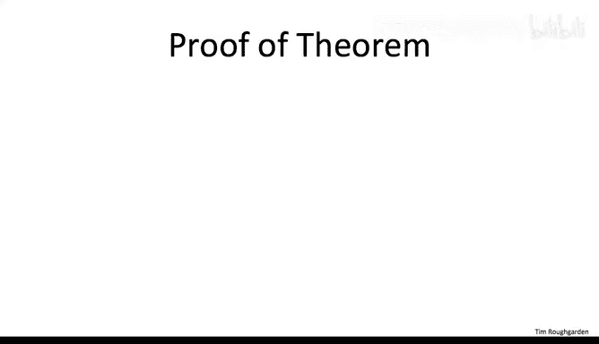
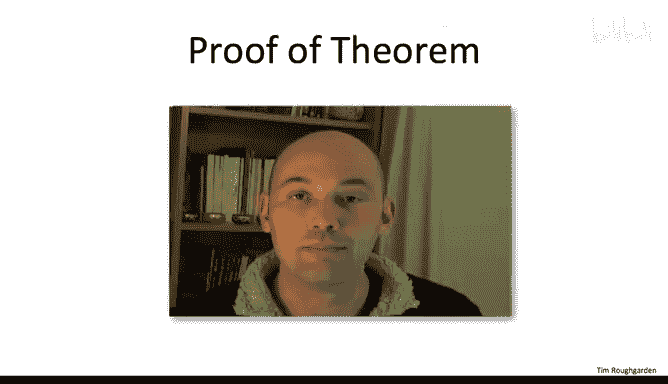
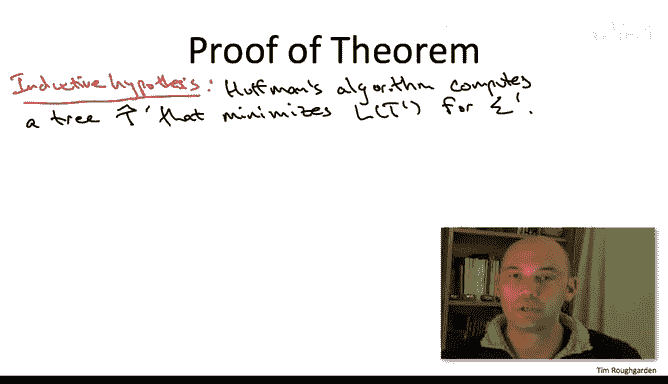
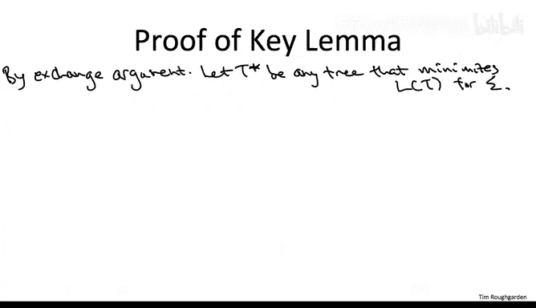
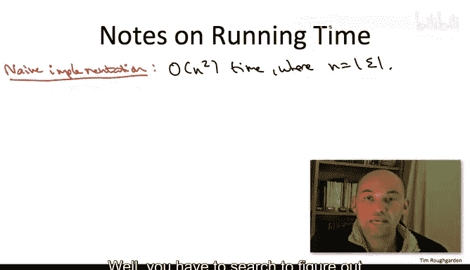
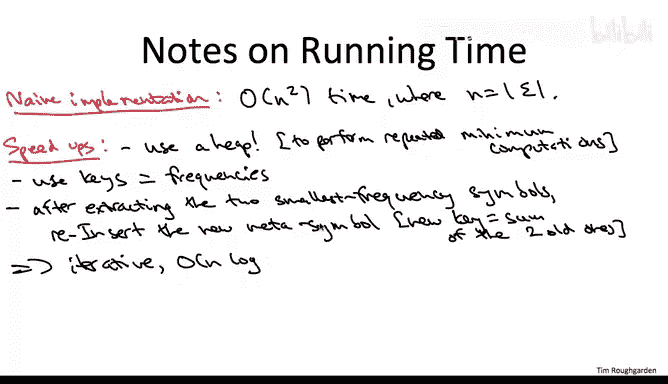

# 斯坦福大学《算法（分治／排序／搜索／随机算法、图搜索／最短路径／数据结构、贪心算法／最小生成树／动态规划、最短路径／NP）｜Algorithms》中英字幕 - P113：38_03_07_正确性证明二.zh_en - GPT中英字幕课程资源 - BV1Rx4y1U7sZ

So I know you're probably catching your breath from that last computation。

 so let's zoom out let's make sure we don't lose the forest for the trees and see that we're actually mostly there。

 we're just one lemma away from finishing the proof of the theorem。

 the proof of correctness of Huffman's algorithm。

So what do we have going for us Well first of all we got the inductive hypothesis remember in any proof by induction you better rely very heavily on the inductive hypothesis。

 what does it say it says when Huffman's algorithm recurs on the smaller subproblem with a smaller alphabet sigma prime it solves it optimally。

 it returns a tree which minimizes the average encoding length with respect to the alphabet sigma prime and the corresponding frequencies。

So we're going to call that tree the output of the recursive call T prime hat。

So let me amplify the power of this inductive hypothesis by combining it with the computation we did in the last slide So what do we know so far we know for the smaller subproblem。

 which frankly we don't care about in its own right。

 but nevertheless for the smaller subproblem with alphabet sigma prime。

 the recursive call solves it optimally it returns to us this tree T hat prime and among all trees with leaves label according to sigma prime。

 this tree is as good as it gets， it minimizes the average encoing length。

But what did we learn on the last slide， We learned that there's a one to one correspondence between feasible solutions。

 between trees for the smaller subpro with the alphabet sigma prime and feasible solutions to the original problem。

 the one we care about that have a certain form in which it just so happens that A and B are siblings that they share a common parent Moreoverover。

 this correspondence preserves the objective function value， the average andcoding length。

 or at least it preserves it up to a constant， which is good enough for our purposes。

 So the upshot is in minimizing average encoding length over all feasible solutions for the smaller subproble。

 our recursive call is actually doing more for us， it's actually minimizing the average encoding length for the original problem with the original alphabet sigma over a subset of the feasible solutions。

 the feasible solutions in which A and B are siblings。

Now， does this do us any good， Well， it depends。 What was our original goal。

 Our goal was to get the smallest average encoding length possible over all feasible solutions in the world。

 And so what have we just figured out， we figured out well we're getting the best possible scenario amongst some solutions。

 those in which A and B happen to be siblings。 So we're in trouble if there is no optimal solution in which A and B are siblings。

 then it doesn't do as any good to optimize only over these crappy solutions。On the other hand。

 if there is an optimal solution lying in this set X A B， in which A and B are siblings。

 then we're golden， then there's an optimal solution in the set。

 where our recursive call is finding the best solution in the set。

 So we're going to find an optimal solution， So that's really the big question。

 Can we guarantee that it was safe to merge A and B in the very first iteration。

 Can we guarantee there is an optimal solution， a best possible tree that also has that property。

 that also has A and B as siblings。So the key lemma。

 which I'll prove on the next slide and which willll complete the proof of the correctness of Puffman's theorem。

 is indeed there is always an optimal solution in the set XAB， an optimal solution in which A and B。

 the two lowest frequency symbols are indeed siblings。

So I'll give you a full blown proof of this keyma in the next slide。

 but let me first just orient you and develop your intuition about why you'd hope this keylemma would be true。

The intuition is really the same as that when we developed the greedy algorithm in the first place。

 namely， when you which symbols do you want to incur the long encoding lengths， well。

 you want them to be the lowest frequency symbols since you want to minimize the average So if you look at any old tree there's going to be some bottommost layer there's going to be some deepest possible leaves and you really hope that A and B the lowest frequency leaves are going to be in that lowest level Now they might both be in the lowest level and and might not be siblings。

 but if you think about it amongst symbols at the same level。

 they're all suffering exactly the same encoding length anyways。

 so you can permute them in any way you want and it's not going to affect your average encoding length So once you put A and B at the bottommost level。

 you may as well put them as siblings and it's not going to make any difference。

 So the final punch line being you can take any tree like say an optimal tree and by swapping exchanging the lowest frequency elements A and B to the bottom and to be common siblings。

 you can't make the tree worse you' can only make it better and that's going to show that there is an optimal tree with the desired property where A and B are inf fact siblings。

All right， so that's reasonably accurate intuition， but it's not a proof， here is the proof。

So we're going to use an exchange argument， we're going to take an arbitrary optimal tree a tree minimizing the average and codinging length。

 let's call it a T star there may be many such trees just pick anyone， I don't care which。

And the plan is to show an even better tree or at least as good tree。

 which satisfies the properties that we want where A and B show up as siblings。

So let's figure out where we're going to swap the symbols A and B2。

 so we've got our tree T star and let's look at the deepest level of T star and let's find our you know any pair of siblings at this deepest level。

 call them X and Y。So in this green tree on the right we have two choices of pairs of siblings at the lowest level。

 it doesn't matter which one we pick， so let's just say pick the leftmost pair call them X and Y so A and B you have to be somewhere in this tree let me just pick a couple of the leaves to be examples for where A and B might actually be in T star。

And so now we're going to execute the exchange， we're going to obtain a new tree T hat from T star merely by swapping the labels of the leaves。

 X and A， and similarly swapping the labels of the leaves Y and B。

So after this exchange we get a new valid tree， so once again the leaves are labeled with the various symbols of sigma。

 and moreover， by our choice of X and Y， we've now via this exchange。

 forced the tree to conform to the property， we've forced A and B to be siblings。

 they take the original positions of X and Y which were chosen to be siblings。

So to finish the proof we're going to show that the average encoding length of T hat can only be less than T star since T star was optimal。

 that means the T hat has to be optimal as well， since it also satisfies the desired property that A and B or siblings。

 that's going to complete the proof of the keylemma and therefore the proof of the correctness of Huffman's algorithm。

The reason intuitively is that when we do the swap。

 A and B inherit the previous depths of x and y conversely x and y inherit the old depth of A and B。

 so A and B can only get worse and x and y can only get better and X and Y are the ones with a higher frequencies so the overall cost benefited analysis as a net wind and the tree only improves but to make that precise let me just show you the exact computation so let's look at the difference between the average encoding length given by the tree T star and that after the swap given by the tree T hat。

So analogously to our computation on the previous slide most of the stuff cancels because the trees T star and T hat。

 frankly just aren't all that different， the only things that are different are the positions of the symbols A B。

 X and Y， so we're going to have four positive terms contributed by T star for these four symbols and we're going to have four negative terms contributed by the tree T hat again for these exact same four symbols。

 so let me just show you what happens after the dust settles and after you take away all the cancellation you can write the eight terms that remain in a slightly sneaky but clarifying way as follows。

So we're going to have one product representing the four terms involving the symbols A and X and then an analogous term for the four terms involving B and Y so in the first film we look at the product of two differences on the one hand we look at the difference between the frequencies of X and A remember those are the two things that got swapped with each other and then we also look at the difference between their depths in the original tree T star。

And then because B and Y got swapped， we have an entirely analogous term involving them。

The reason I rewrote this difference in this slightly sneaky way is it now becomes completely obvious what role the various hypotheses play。

 specifically why is it important that A and B have the lowest possible frequencies。

 we actually haven't used that yet in our proof， but it's fundamental to our greedy algorithm Secondly。

 why did we choose x and Y to be in the deepest level of the original tree T star Well let's start with the first pair of products。

 the differences between frequencies So the frequency of x minus the frequency of a and similarly between Y and B Well because A and B have the smallest frequencies of them all。

 these differences have to be non-neg， the frequencies of x and Y can only be more。

The second pair of differences also must be non negative。

 and this is simply because we chose X and Y to be at the deepest level。

 their depths have to be at least as large as that of A and B in the original treat T star。

Since all four differences are non-negative， that means this sum of their products is also non-neative。

 that means the average encoding length of T star is at least as big as T hat。

 so that's where T hatt has to also be optimal， it in addition satisfies the desired property that A and B are siblings and so that means our recursive call。

 even though we've committed to merging A and B we've committed to returning a tree in which their siblings。

 that was without loss that was a safe merge， that's why Huffman's algorithm at the end of the day can return an optimal tree when it minimizes the average encoding length over all possible binary prefix free codes。

So let me just wrap up with a few notes about how to implement Huffkin's algorithm and what kind of running time you should be able to achieve。

So if you just naively implement the pseudocode that I showed you。

 you're going to get a not particularly great quadra time algorithm that moreover uses a lot of recursion。

So why is it going to be a quadratic time Well you have one recursive call each time and you always reduce the number of symbols by one。

 so the total number of recursive calls is going to be linear in the number of symbols in your alphabet in and how much work you do in each recursive call not counting the work done by later calls while you have to search to figure out the lowest frequency symbols A and B so that's basically some minimum computation so that's going to take linear time for each of the linear recursive calls。

Now the fact that we keep doing these repeated minimum computations each recursive call。

 I hope triggers a light bulb that maybe a data structure would be helpful。

 which data structures a reasonison detra is to speed up repeated minimum computations。

 well as we've seen， for example， in Dykester's and Pris algorithms， that would be the heap。

So of course when you define a heap you have to say what the keys are。

 but since we always want to know what the symbols with the smallest frequencies are。

 the obvious thing to do is to use frequencies as keys so the only question then is what happens when you do emerge merge well the obvious thing is to just to add the frequencies of those two symbols and reinsert into the heap。

 the new meta symbol with its key equal to the sum of the keys of the two elements that you just extracted from the he so not only is that going to work great it's going to be n log n time it's very easy to implement an iterative manner so that's starting to be a really blazingly fast implementation of Huffman's algorithm。

In fact， you can do even better， you can boil down an implementation of Huffman's algorithm to a single invocation of a sorting subroutine。

 followed by a merely linear amount of work。Now， in the worst case。

 you're still going to be stuck asymptotically with an N log N implementation because you can't sort better than N log N if you know nothing about what you're sorting。

 but in this implementation， the constants are going to be even better。 And as we discussed in part1。

 there are sometimes special cases where you can beat N log N for sorting。 So for example。

 if all of your data is representable with a small number of bits。

 then you can do better than N log N。So I'm going leave this even faster implementation as a somewhat non-trivial exercise。

 I'll give you a hint though， which is if you do sorting as a preprocessing step。

 you actually don't even need to use a heap data structure for this implementation。

 you can get away with an even more primitive data structure of a Q you might however。

 want to use two cues。 So next time you find yourself in line for coffee。

 That's a nice thing to think about how do you implement Huffman's algorithm merely with one invocation to sorting so that the symbols are sorted by frequency followed by linear work using two Qes。

