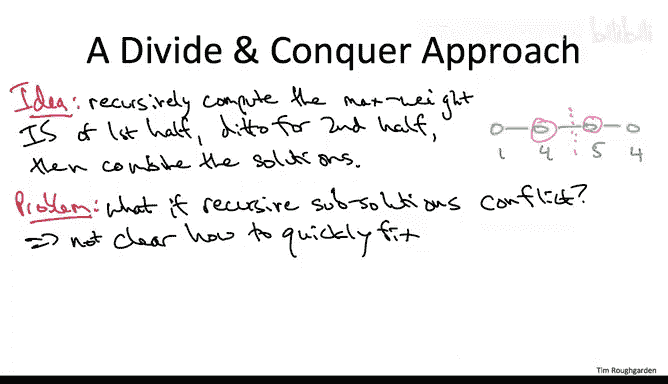

# 算法设计：39_03_01：引言-路径图中的加权独立集


在本节课中，我们将开始学习动态规划这一重要的算法设计范式。我们将从一个具体的计算问题——在路径图中寻找最大权重独立集——入手，逐步推导出解决方案。通过这个过程，我们将自然地引出动态规划的核心思想。

## 问题定义

我们首先来明确要解决的问题。这是一个图论问题，但图的结构非常简单：我们只关注**路径图**。路径图由 `n` 个顶点组成，这些顶点排成一条直线，每个顶点只与它的前一个和后一个顶点相连（如果存在的话）。

除了图结构，输入还包括每个顶点的一个**非负权重**。例如，下图是一个包含4个顶点的路径图，其顶点权重分别为1、4、5、4。

```
顶点:  1 -- 2 -- 3 -- 4
权重:  1    4    5    4
```

算法的任务是输出一个**独立集**。独立集是顶点的一个子集，其中**没有两个顶点是相邻的**。在路径图中，这意味着不能选择任何一对连续的顶点。

例如，在4个顶点的路径图中，有效的独立集包括：空集、仅顶点1、仅顶点2、仅顶点3、仅顶点4、顶点1和3、顶点2和4、顶点1和4。而顶点2和3则不能同时被选择，因为它们是相邻的。

我们的目标不是找到任意一个独立集，而是找到**总权重最大**的那个独立集，这就是**最大权重独立集问题**。

接下来，我们将回顾已学过的算法设计范式，看看它们是否能有效解决此问题。这将为我们引入动态规划这一新方法做好铺垫。

## 现有范式的局限性

### 暴力搜索 🔍

最直接的方法是**暴力搜索**，即枚举所有可能的独立集，并记录总权重最大的那个。这种方法无疑是正确的，但效率极低。即使在路径图中，独立集的数量也是顶点数 `n` 的指数级。因此，对于大规模问题，暴力搜索并不可行。

### 贪心算法 🤔

我们刚刚学完贪心算法，很自然会想到它。一个直观的贪心策略是：每一步都选择当前**权重最高**且不与已选顶点相邻的顶点。

让我们用之前的4顶点例子测试这个算法：
*   最优解是选择顶点2（权重4）和顶点4（权重4），总权重为8。
*   贪心算法会先选择权重最高的顶点3（权重5）。之后，由于顶点2和4都与3相邻，唯一可行的选择只剩下顶点1（权重1）。最终得到总权重为6，并非最优。

这个例子提醒我们，贪心算法虽然简单，但常常无法保证得到最优解。对于此问题，目前没有已知的贪心算法能保证正确性。

### 分治算法 🧩

分治法是我们早期学习的一个强大范式。对于路径图，一个自然的想法是：将路径从中间“切开”，递归地求解左半部分和右半部分的最大权重独立集，然后尝试合并结果。

然而，这种方法存在一个根本性问题：**子问题的解可能在边界处发生冲突**。

再次考虑4顶点的例子：
*   左半部分（顶点1,2）的最优解是选择顶点2（权重4）。
*   右半部分（顶点3,4）的最优解是选择顶点3（权重5）。
*   当我们尝试合并这两个解时，发现顶点2和3是相邻的，违反了独立集的定义。

虽然在这个小例子中修复冲突看似容易，但在大规模问题中，如果两个子问题的解在分割点附近发生冲突，要快速、正确地合并它们以获得全局最优解，是非常困难的。

分治法可以解决这个问题（例如达到 `O(n^2)` 时间复杂度），但效率不够高。我们即将开发的动态规划算法将在**线性时间** `O(n)` 内解决它。

## 总结

本节课我们一起学习了最大权重独立集问题的定义，并回顾了暴力搜索、贪心算法和分治算法在解决此问题时的局限性。我们发现，这些现有范式要么效率太低，要么无法保证最优解，要么在合并子问题时面临困难。



这促使我们需要一种新的思路。在接下来的课程中，我们将从这个问题出发，逐步推导出一种更高效、更系统的解决方案——动态规划算法。我们将看到，动态规划如何通过巧妙地组织子问题并避免分治法的合并难题，从而优雅地解决此类优化问题。