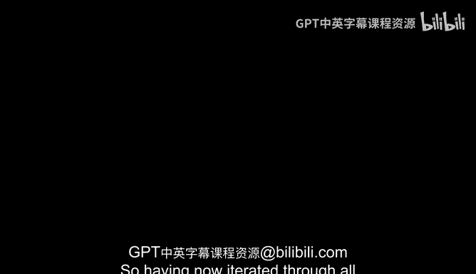
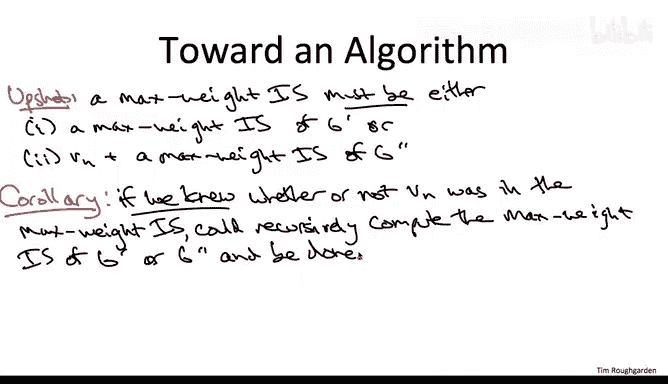

# 算法设计：40_03_02：路径图中加权独立集的最优子结构 🧩

在本节课中，我们将学习一种新的算法设计范式——动态规划。我们将通过解决“路径图中加权独立集”这个具体问题，来理解动态规划的核心思想：分析最优解的结构。我们将看到，最优解必然由更小子问题的最优解以特定方式构成。

---

## 从已知范式到新思路

上一节我们回顾了分治、贪心等算法设计范式，发现它们都不太适合高效计算路径图的最大权重独立集。

本节中，我们将为一种新范式——动态规划——奠定基础。这种范式的关键方法是：首先推理最优解的结构。

我们所说的“推理最优解的结构”，是指寻找以下形式的陈述：无论最优解具体是什么，它都必须具备某种特定形式，并且必须以规定的方式从子问题的最优解构建而成。

事实上，在我们讨论分治和贪心算法时，这种推理是隐含的。而在动态规划中，我们将使其系统化。例如，许多分治算法正确性的隐含前提就是：整个问题的最优解必须能够以规定的方式，由更小子问题的解来表达和构建。

那么，进行这种思想实验、试图理解最优解可能样子的动机是什么呢？计划是：我们将把最优解的候选范围缩小到一个相对较小的集合。对于一个小的候选集，我们可以通过暴力搜索来选出最好的一个。

一旦你精通动态规划，就会学到一课：对你试图计算的对象本身进行推理，这绝非循环论证。请记住，我们的目标是设计一个算法来计算最优解。而现在，我建议你进行一个思想实验，假设你已经计算出了最优解，或者有人把它放在银盘上递给了你。这种“白日梦”可能非常有成效：思考一下，如果我确实有一个最优解，我能对它说些什么？它会是什么样子？这种形式的观察实际上可以为计算那个确切对象照亮道路，我们将在接下来的视频中看到这一点。

好了，哲学讨论到此为止。让我们具体一点。

---

## 问题定义与符号说明

我们有一个路径图。顶点带有权重。我们想要找到最大权重的独立集。

让我们再次进行这个思想实验。假设有人把最优解递给了我们。我们能对其结构说些什么？

在推理这个最大权重独立集时，我们将使用以下符号：
*   **S** 表示那个最优解（即最大权重独立集）中的顶点集合。
*   **v_n** 表示输入图最右边、最后一个顶点。

这是一个不言自明的陈述：路径的最后一个顶点 v_n，要么在 S 中，要么不在。这将为我们推理最优解时提供两种情况。

---

## 情况一：最优解不包含最后一个顶点

让我们从 v_n 被排除在最优解 S 之外的情况开始。

令 **G'** 表示从原图 G 中移除最右边的顶点 v_n 后得到的路径图。

首先，我们做几个简单的观察：
1.  集合 S 是 G 中的一个独立集，并且它不包含最后一个顶点。因此，我们同样可以将集合 S 视为较小图 G' 的一个独立集。如果它在 G 中不包含连续顶点，那么在 G' 中也不会。
2.  但事实上，我们可以说得更多：S 不仅是 G' 中任意一个旧的独立集，它必须是 G' 中的一个**最优**（即最大权重）独立集。

为什么？因为如果在 G' 中存在比 S 更好的独立集（称为 S*），我们可以将这个完全相同的独立集 S* 视为 G 中的一个独立集，它当然在 G 中仍然比 S 更好。但这与我们假设 S 是 G 的最大权重独立集相矛盾。

**总结**：如果原路径图 G 的最大权重独立集 S 不包含最右边的顶点，那么它可以简单地用一个更小子问题的最优解来描述：它**就是**少一个顶点的路径图 G' 的一个最大权重独立集。

---

## 情况二：最优解包含最后一个顶点

情况一为情况二做了热身，情况二类似但稍微复杂一些。

现在，我们假设最大独立集 S 确实使用了最后一个顶点 v_n。

根据独立集的定义，不能选择两个相邻的顶点。因此，由于选择了最右边的顶点 v_n，S 在这种情况下**绝对不能**包含倒数第二个顶点 v_{n-1}。

我们记 **G''** 为从 G 中移除最右边的两个顶点后得到的路径。

现在，让我们尽力模仿情况一中的论证。在情况一中，我们说 S 也必须是 G' 的一个独立集。在这里，这说不通，因为 S 包含了最后一个顶点，所以我们甚至不能谈论它是任何更小图的子集。

然而，如果我们考虑集合 S 去掉最后一个顶点 v_n 的部分（即 S \ {v_n}），它实际上是 G'' 的一个独立集，因为请记住，S 不能包含倒数第二个顶点。

与情况一类似，我们可以说得更强一些：去掉 v_n 的 S 不仅是 G'' 中任意一个旧的独立集，它实际上必须是 G'' 中的一个**最优**独立集，必须具有最大可能的权重。

推理是相似的：假设去掉 v_n 的 S 不是 G'' 中可能的最佳独立集，那么存在另一个称为 S* 的独立集，它甚至更好，权重更大。我们如何得出矛盾呢？如果我们只是将这个位于 G'' 中的、甚至更大的独立集 S* 加上 v_n，我们就得到了整个图 G 的一个合法的独立集，其总权重甚至比 S 的还要大。但这与 S 的最优性相矛盾。

例如，你可以想象这个所谓的最优解 S 总权重为 1100，由两部分组成：来自 G'' 中顶点的权重为 1000，而 v_n 本身的权重为 100。在矛盾论证中，你会说：假设在 G'' 中存在一个独立集，其权重甚至超过 1000，比如 1050。那么，我们只需将最后一个顶点 v_n 加到这个集合上，就得到了原图 G 中一个权重为 1150 的独立集。但这与 S 本应是权重约 1100 的最优解这一事实相矛盾。

请注意，我们在这个论证中使用图 G'' 的原因是为了确保：无论 S* 是什么，无论 G'' 的这个独立集是什么，我们都可以放心地加上 v_n，而不必担心可行性问题。因为 S* 可能拥有的最右边的顶点是倒数第三个顶点 v_{n-2}。所以，当我们通过添加最右边的顶点 v_n 来扩展它时，无需担心可行性。

---

## 归纳最优解的结构

为了确保你不至于只见树木不见森林，让我提醒你我们的高层计划是什么，并指出我们实际上在这个问题中已经相当成功地执行了这个计划。

计划是：缩小最优解可能是什么的候选范围，推理最优解的形式，并论证它必须以特定的方式呈现。

我们在上一页证明了什么？我们证明了最优解实际上只能是以下两种情况之一：
1.  它排除最后一个顶点，并且它**就是** G' 的最大权重独立集。
2.  或者，如果它包含最右边的顶点，那么它必须是 G'' 的最大权重独立集**加上**这个最后一个顶点 v_n。

对于最优解可能是什么样子，只有两种可能性，并且都是用更小子问题的最优解来描述的。

---

## 从推理到算法思路

这个推理的一个推论是：如果有一只“小鸟”告诉我们处于哪种情况（即 v_n 是否在最优解中），我们就可以通过在适当的子问题上递归来简单地完成求解。
*   如果小鸟告诉我们最优解不包含 v_n，我们就在 G' 上递归。
*   如果小鸟告诉我们 v_n 在最优解中，我们就在 G'' 上递归，然后将结果加上 v_n。

当然，并没有这样的小鸟，我们也不知道这个最右边的顶点是否在最优解中。

但是，嘿，只有两种可能性，对吧？这里有一个想法，也许听起来有点疯狂，但为什么不两种可能性都尝试一下，然后返回更好的那个呢？

为什么我说这可能听起来疯狂？因为如果你盯着这个想法思考，并考虑在递归遍历图时尝试两种可能性所带来的影响，这可能会开始感觉有点像暴力搜索。事实上，它**就是**。这只是暴力搜索的一种递归组织形式。

然而，正如我们将在下一个视频中看到的，如果我们能巧妙地消除冗余，我们实际上可以用线性时间来实现这个想法。

---

## 本节总结

本节课中，我们一起学习了动态规划思想的起点：分析最优解的结构。我们以路径图的最大权重独立集问题为例，证明了最优解必然属于两种明确的结构之一：要么不包含最后一个顶点，等同于少一个顶点的子图的最优解；要么包含最后一个顶点，等同于少两个顶点的子图的最优解加上该顶点。这个关键的观察将问题分解成了更小的子问题，为我们下一节设计高效的动态规划算法奠定了基础。