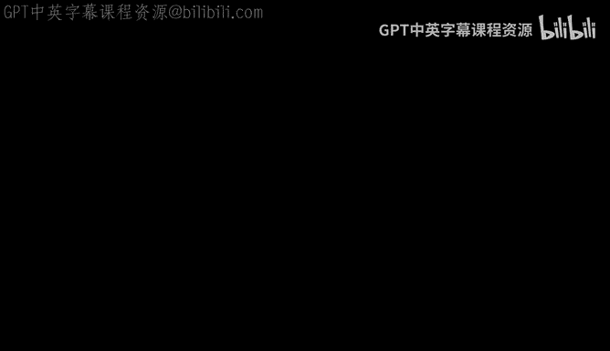
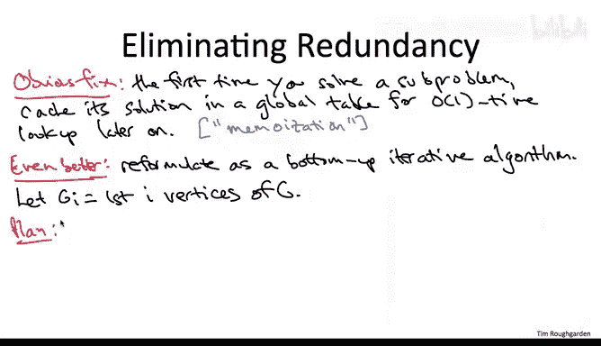

# 算法：41_03_03：路径图中加权独立集的线性时间算法 📈



在本节课中，我们将学习如何为路径图（Path Graph）设计一个计算最大权重独立集（Maximum Weight Independent Set）的线性时间算法。我们将从一个直观但低效的递归思路出发，通过识别并消除其巨大的冗余计算，最终得到一个高效、简洁的动态规划算法。

上一节我们通过思想实验，精确分析了路径图中最优解（最大权重独立集）必须满足的结构。本节中，我们将把这一分析转化为一个高效的线性时间算法。

## 从递归思路到指数时间算法

首先，快速回顾上一节的核心结论。我们论证了两点：
1.  如果路径图的最大权重独立集**不包含**最右侧的顶点 `V_n`，那么它必然是去掉 `V_n` 后得到的子图 `G'` 的最大权重独立集。
2.  如果最大权重独立集**包含**最右侧的顶点 `V_n`，那么在移除 `V_n` 后，剩余部分必然是去掉最右侧两个顶点后得到的子图 `G''` 的最大权重独立集。

因此，如果我们能知道处于哪种情况，就可以递归地计算 `G'` 或 `G''` 的最优解，然后相应地返回结果（对于 `G''` 的情况，需将 `V_n` 加入结果中）。由于我们无法预知是哪种情况，一个自然的想法是尝试两种情况。

以下是这个递归算法的伪代码描述：

```python
def mwis_recursive(G):
    if G is empty:
        return 0, []
    if G has only one vertex v:
        return weight(v), [v]

    # 情况1：不包含最右顶点 V_n
    opt1, set1 = mwis_recursive(G_without_last_vertex)

    # 情况2：包含最右顶点 V_n
    opt2, set2 = mwis_recursive(G_without_last_two_vertices)
    opt2 += weight(V_n)
    set2.append(V_n)

    # 返回权重更大的那个解
    if opt1 >= opt2:
        return opt1, set1
    else:
        return opt2, set2
```

这个算法的好消息是它是正确的，能保证返回最大权重独立集。其证明可以通过归纳法完成，与分治算法的证明模板类似。

然而，坏消息是，这个算法需要指数时间，本质上与暴力搜索无异。原因在于，在每次递归调用之前，我们只排除了一个或两个顶点（进展甚微），却产生了两个递归分支。这种“进展小、分支多”的模式导致了指数级的运行时间。

## 关键洞察：子问题的本质

这引出了一个关键问题：在这个产生指数级递归调用的算法中，所有不同的子问题总共有多少个？

答案是：**仅有线性个（O(n)）不同的子问题**。

尽管递归调用数量是指数级的，但我们实际需要解决的子问题类型却很少。因为在整个递归过程中，无论经过怎样的调用序列，你得到的子问题总是原始图的一个**前缀**（即由前 `i` 个顶点导出的子图，`i` 从 0 到 n）。因此，最多只有 `n+1` 个本质上不同的子问题。

由此我们得出结论：先前算法的指数运行时间，完全源于对**完全相同**的子问题进行了一遍又一遍的重复求解。

## 动态规划：消除冗余，实现线性时间

上述观察为我们实现线性时间算法提供了可能。一旦解决了一个子问题，我们就记住答案，后续需要时直接查表即可，无需重复计算。这种方法被称为**记忆化（Memoization）**。

更清晰、更高效的实现方式是采用**自底向上（Bottom-up）** 的动态规划方法，系统地从小问题解决到大问题。

具体步骤如下：



1.  定义子问题：令 `G_i` 表示由前 `i` 个顶点构成的子图。
2.  创建数组：设数组 `dp[0...n]`，其中 `dp[i]` 存储子图 `G_i` 的最大权重独立集的总权重。
3.  初始化边界情况：
    *   `dp[0] = 0` （空图）
    *   `dp[1] = weight(v1)` （只有一个顶点）
4.  递推计算：对于 `i` 从 2 到 `n`，根据上一节的分析，`G_i` 的最优解有两种可能：
    *   不包含顶点 `v_i`：则最优解等于 `dp[i-1]`。
    *   包含顶点 `v_i`：则最优解等于 `weight(v_i) + dp[i-2]`（因为不能包含相邻的 `v_{i-1}`）。
    因此，递推公式为：
    **`dp[i] = max(dp[i-1], weight(v_i) + dp[i-2])`**
5.  最终，`dp[n]` 即为整个图的最大权重独立集的总权重。若要重构出具体的顶点集合，可以反向追踪决策过程。

以下是该算法的核心循环代码描述：

```python
def mwis_dp(weights): # weights[1...n] 存储顶点权重
    n = len(weights)
    dp = [0] * (n + 1)
    dp[0] = 0
    dp[1] = weights[1]

    for i in range(2, n + 1):
        dp[i] = max(dp[i-1], dp[i-2] + weights[i])

    return dp[n]
    # 可通过额外数组记录决策来重构独立集
```

## 算法分析与总结

**运行时间**：该算法有一个从 2 到 n 的简单循环，每次迭代执行常数时间操作，因此总运行时间为 **O(n)**，即线性时间。

**正确性**：算法的正确性基于上一节对最优解结构的严格分析。递推公式 `dp[i] = max(dp[i-1], weight(v_i) + dp[i-2])` 穷举了 `G_i` 最优解的两种可能情况，并选取更优者。由于我们以自底向上的方式确保 `dp[i-1]` 和 `dp[i-2]` 已是最优解，因此 `dp[i]` 也能得到最优解。

本节课中，我们一起学习了如何为路径图上的加权独立集问题设计线性时间算法。我们从递归思想出发，发现了子问题数量有限的特性，进而通过动态规划消除了指数级冗余，最终得到了高效、优雅的解决方案。这个例子清晰地展示了动态规划的核心思想：**定义重叠子问题，存储子问题解，避免重复计算**。