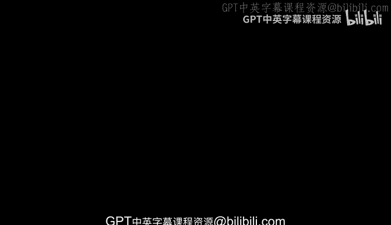
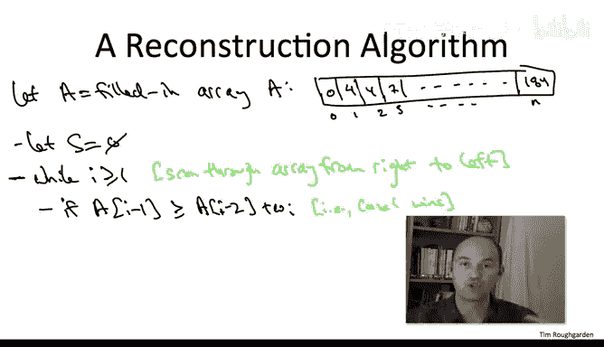

# 斯坦福大学《算法（分治／排序／搜索／随机算法、图搜索／最短路径／数据结构、贪心算法／最小生成树／动态规划、最短路径／NP）｜Algorithms》中英字幕 - P117：42_03_04_路径图中加权独立集的重构算法.zh_en - GPT中英字幕课程资源 - BV1Rx4y1U7sZ

So we now have an algorithm， a very elegant one that solves the weighted independent set problem in path graphs。

 Moreover， the algorithm runs in linear O of N time， clearly the best possible。

 But before we do a victory lap， I want to point out that there is something this the algorithm doesn't do that you might want it to do。

 namely hand you the actual optimal solution， not merely the value of that optimal solution。

 So the point of this video is to show you how we can reconstruct an optimal solution。

 given the table filling algorithm from the previous video。

So let me just write that algorithm back down， it's so short it won't take me too long。

Now when this algorithm completes what do we have in our hands。

 we have an array and this array is filled with numbers so in particular in the last entry the array is a number like 184。

 so that's great that tells us that the maximum weight that any independent set possesses is 184。

 but in many applications we're going to want to know not just that information。

 but actually which vertices constitutes that independent set with total weight 184。

So perhaps the first hack that comes to mind to address this issue is to augment the array so that each entry stores not just the value of an optimal solution to the subpro induced by the graph G subI。

 but also an actual set of vertices achieving that value and I'll leave it for you to if you want。

 rework the previous pseudocode so that when you fill in a new entry。

 you fill in not just the value of an optimal solution， given solutions to the previous subproblem。

 but in fact also the solution itself。This hack， however。

 is not generally how things are done in dynamic programming。

 it unnecessarily wastes both time and space， and a much smarter approach is to reconstruct from the filled in table an optimal solution as needed。

So if you think about it， it's kind of cool that this is even possible that our one line algorithm doesn't cover its tracks that it leaves in us clues for us as detectives to go back and examine and reconstruct what the optimal solution is。

The following key point articulates exactly why this is indeed possible。

So the starting point of this observation is the correctness of our algorithm， our oneline algorithm。

 which of course we established in the previous video， and by correctness， I mean。

 what's guaranteed that this algorithm will populate each entry of the array correctly。

 the number in the Ih entry is indeed the maximum weight of an independent set in the graph GI。

So remember our thought experiment about what the optimal solution could possibly look like。

 we concluded it could only be one of two things and we really wound up wishing we had a little birdie that could tell us whether or not the rightmost vertex V sub n was in the optimalim solution or not if we knew which case we' were in we could just recursively compute the of the solution from a graph that has either one or two fewer vertices So here's the point。

This filled in table。That's our little birderie。Here's what I mean Well what's the reasoning that our algorithm goes through to fill in this last entry of this array and don't forget。

 we've already proven that our algorithms correct。 We did that in our last video Well it does a comparison between the two possible candidates vying for the optimal one on the one hand it computes the case one solution it looks up the optimal value of a solution from the graph of the one fewer vertex and it compares that to the case two solution including Vn the last vertex and adding that to an optimal solution with two fewer vertices and in this max operator in the line of code。

 it's explicitly comparing which is better case1， the solution which excludes v sub n or case2。

 the solution which includes v sub n so whichever one of those was the winner whichever one of those cases was used to fill in that last entry that exactly tells us whether or not v sub n is in the optimal solution if we use the first case that means v sub n is not in the optimal solution it gets excluded if the second case was the winner then we know V sub n is in the optimal solution。

That was the winner if we have a tie， then there's an optimal solution either way。

 there's one that includes Vienn and there's one that includes ViN。

So those are the tracks in the mud left for us by the forward direction of the for loop。

 we can just go back and look which case was used to fill in each entry of the array。

 again for the ones that used case1 that corresponds to excluding the current vertex for those that used case two to fill in the entry that corresponds to including that vertex in the solution。

So the reconstruction algorithm will take as input the filled in array that was generated by our oneline algorithm on the previous slide and what it's going to do is it's going to trace through this array from right to left and at each step of the main loop it's going to say it's going to look at the current entry and it's just going to compute explicitly which of the two candidates were used to fill in this array entry if you want you can also cache the results of these comparisons on the forward pass that's an optimization that will be useful later for harder problems but for now if you want you can just think about redoing the comparison saying hey。

 there were two possible ways that we could have filled in this entry let's just check which of the two were used。

So if in fact the preceding array entry is at least as large as the one from two back plus the weights of the current vertex。

 that corresponds to case1 winning to the subsolution that excludes the current vertex being better than the one that includes it so in that case we just skip the current vertex v sub I and we decrease the array index by one in our scan。

If the other case wins， that is if we fill in the current entry if an optimal solution to the current graph G sub I comprises the current vertex of v sub plus the optimal solution to the graph with two fewer vertices。

 in this case we know we better include v sub that's part of an optimal solution to the current subproble Moreover that's the case where we need to look up the optimal solution with two fewer vertices。

 so we include the current vertex and we decrease the array and index by  two。So formally。

 we have a correctness claim， which is that the final output capital S returned by the reconstruction algorithm is as desired a maximum weight independent set of the original graph G。

 we've already talked about all the ingredients necessary for a formal proof for those of you who are interested Of course it proceeds by induction and in the inductive step you use the same case analysis we've been using over and over again the optimal solution in a given point it has only two possible candidates。

 the algorithm explicitly figures out which of the two that it is and that is what triggers whether or not to include or exclude the current vertex The running time it's even easier we have a while loop it runs at most any iterations we do constant work in each of the iterations so just like the forward pass this backwards pass is really just a single scan through the way it's going to be lightning fast linear time。

