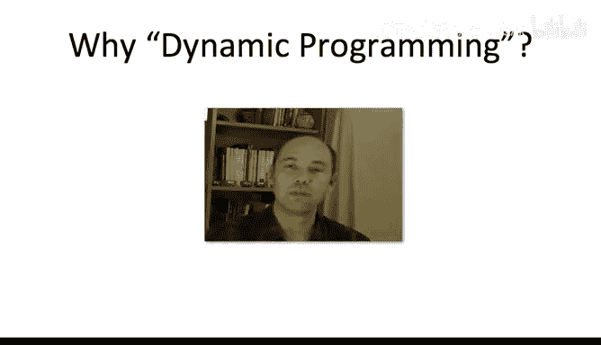

# 算法：43：动态规划原理 🧩


在本节课中，我们将学习动态规划范式的一般原理。我们将通过回顾路径图中最大权重独立集问题的线性时间算法作为具体实例，来阐述这些核心原则。

## 概述

动态规划是一种通过将复杂问题分解为一系列相互关联的子问题，并系统地解决这些子问题来求解原问题的方法。其关键在于定义合适的子问题，并找到它们之间的递推关系。

## 子问题的性质

一个有效的动态规划算法依赖于一组精心选择的子问题。这些子问题需要满足几个关键性质。

### 性质一：子问题数量可控

子问题的总数不应过大，因为算法至少需要处理每个子问题一次。在最佳情况下，解决每个子问题需要常数时间，因此子问题的数量直接决定了算法时间复杂度的下界。

在最大权重独立集的例子中，我们做得很好：我们只有 `n+1` 个子问题（对应图的每个前缀），从而实现了线性时间复杂度。

### 性质二：存在递推关系

这是动态规划的核心。必须存在“较小”子问题和“较大”子问题的概念。算法从最小的子问题开始，逐步解决更大的子问题。关键在于，对于任何一个给定的子问题，我们能够利用所有更小子问题的解，快速且正确地推导出当前子问题的解。

这种关系通常通过一个**递推式**来表达，它定义了当前子问题的最优解如何由更小子问题的最优解组合而成。

在我们的独立集算法中，递推关系如下：设 `OPT[i]` 为前 `i` 个顶点构成的子图 `G_i` 的最大权重独立集的总权重。那么：
```
OPT[i] = max(OPT[i-1], OPT[i-2] + w_i)
```
其中 `w_i` 是第 `i` 个顶点的权重。这个递推式表明，`G_i` 的最优解要么不包含顶点 `i`（继承 `G_{i-1}` 的解），要么包含顶点 `i`（则不能包含顶点 `i-1`，因此继承 `G_{i-2}` 的解并加上 `w_i`）。

一旦有了这样的递推式，它自然引出一个**填表算法**：我们创建一个表格，其中每个表项对应一个子问题的最优解，然后按照从小到大的顺序，利用递推式填充整个表格。

### 性质三：能解答原问题

在解决了所有子问题之后，我们必须能够从中得到原始问题的答案。这个性质通常会自动满足，因为在大多数情况下，原始问题本身就是最大的那个子问题。

在独立集的例子中，最大的子问题 `G_n` 就是原始图本身。因此，当我们填满表格后，最后一个表项 `OPT[n]` 就是我们要的答案。

## 设计动态规划算法的关键

以上概念目前可能有些抽象，我们将在后续课程中看到更多例子来加深理解。所有例子都将展示动态规划范式的强大力量和灵活性，这是你必须掌握的一项技术。

当你尝试设计自己的动态规划算法时，关键在于找出正确的子问题定义。如果你找准了子问题，其他步骤通常会以相当程式化的方式迎刃而解。

对于动态规划的初学者而言，与其凭空想象子问题，不如模仿我们在独立集问题中的推理过程：通过分析最优解的结构，来思考如何首次发现这些子问题。这是一个你可以复用的过程，以便将这种范式应用到你自己项目中出现的问题上。

## 关于“动态规划”名称的由来

你或许会好奇，为什么这种方法被称为“动态规划”。这里的“规划”并非指编写代码，它与“数学规划”或“线性规划”中的“规划”是同一个意思，更接近于“计划过程”的含义。



让我们听听动态规划的发明者之一，理查德·贝尔曼（我们将在课程稍后学习他的贝尔曼-福特算法）的解释。他在自传中谈到20世纪50年代发明此方法时的背景：

> 那时对数学研究来说并不是好年头。我在兰德公司工作。我们在华盛顿有一位非常有趣的绅士，名叫威尔逊，他是国防部长。实际上，他对“研究”这个词有一种病态的恐惧和憎恨……我不是随便用这个词，我用得很精确。如果有人在他在场时使用“研究”这个词，他的脸会涨红，变得很激动。
>
> 你可以想象他对“数学”这个词会有什么感觉。兰德公司受雇于空军，而空军的上司实质上是威尔逊。因此，我觉得我必须做点什么，来掩盖我在兰德公司内部实际上是在做数学这一事实。
>
> 用什么标题？什么名字？首先，我对计划和决策制定感兴趣。但是，“计划”这个词由于各种原因并不好。因此，我决定使用“规划”这个词。
>
> “动态”作为一个形容词有一个非常有趣的属性：你不可能用“动态”这个词来表达贬义。试着想一些组合，看能否让它有贬义的意思。这是不可能的。
>
> 因此，我认为“动态规划”是个好名字。这是一个连国会议员都无法反对的东西。所以我就用它来涵盖我的活动。

## 总结

本节课我们一起学习了动态规划的一般原理。我们了解到，动态规划的成功依赖于定义一组数量可控、且能通过递推关系联系起来的子问题。算法通过系统地解决从最小到最大的所有子问题，并最终从最大子问题的解中得到原问题的答案。掌握动态规划的关键在于学会如何通过分析问题结构来定义合适的子问题。在接下来的课程中，我们将通过更多实例来巩固这一强大的算法设计范式。