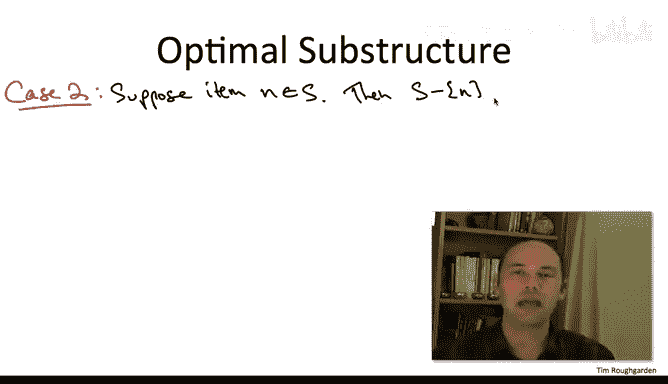

# 算法：44_04_02：背包问题 🎒

在本节课中，我们将学习动态规划的第二个应用实例：著名的**背包问题**。我们将展示如何沿用计算路径图最大独立集时使用的相同方法，来推导出这个问题的经典动态规划解法。

## 问题定义

背包问题的输入由 **n** 个物品组成。

每个物品 **i** 都有一个价值 **vᵢ**（对我们来说越大越好）和一个大小 **wᵢ**。

我们假设这两个值都是非负的。对于物品大小，我们额外假设它们是**整数**。

除了这 2n 个数字，我们还给定一个称为**容量**的数值 **W**。我们同样假设它是非负整数。

这些整数假设的作用将在后续说明。

在背包问题中，算法的任务是选择一个物品的子集。

我们的目标是最大化所选物品的总价值，即 **∑ vᵢ**。

那么，是什么阻止我们选择所有物品呢？限制在于，所选物品的总大小必须**不超过**背包容量 **W**。

虽然可以想象一个窃贼带着容量为 W 的背包入室行窃的故事，但这实际上低估了该问题的重要性。背包问题非常基础，经常作为更大任务的子程序出现。本质上，每当你有一定量的资源预算，并希望以最聪明的方式使用它时，这就是一个背包问题。

## 设计动态规划算法

现在，让我们按照开发动态规划算法的步骤来思考。

动态规划解决方案的关键在于找出正确的**子问题集合**。我们将像处理最大独立集问题一样，通过对最优解进行思想实验，来推导背包问题的子问题。

这个思想实验的最终成果将是一个**递推关系式**，它告诉我们一个子问题的最优值如何依赖于更小子问题的最优值。

### 思想实验

首先，固定一个背包问题的实例，并让 **S** 表示一个最优解（即价值最大的可行解）。

我们之前的思想实验从一个内容无关的陈述开始：路径的最后一个顶点要么在最优解中，要么不在。那么，在背包问题中，什么是“最右顶点”的类比呢？与路径图不同，给定的物品没有内在的顺序性，它们只是一个无序集合。但将物品按 1, 2, 3, ..., n 的顺序来思考实际上是有用的。那么，“最右顶点”的类比就是**最后一个物品 n**。

因此，我们这里要使用的内容无关陈述是：**要么最后一个物品 n 属于最优解 S，要么不属于**。

我们将再次从简单的情况开始：当它**不属于**时。

在路径图问题中，我们论证了在类似情况下，如果我们从图中删除最右边的边，那么该图的最大权重独立集必须是最优的。这里的类比主张是：如果我们从背包实例中删除最后一个物品 n，集合 **S** 应该仍然是最优的。

论证过程完全相同，几乎是一个微不足道的反证法：如果在前 n-1 个物品中存在一个不同的解 S*，其价值比 S 还大，那么我们可以将其视为包含所有 n 个物品的、更优的背包可行解，但这与 S 的最优性假设相矛盾。

接下来，我们通过一个小测验来一起分析稍微复杂一些的**情况二**。

假设背包最优解确实使用了这最后一个物品 n。

现在，我们希望讨论这个解如何由某个更小子问题的最优解组合而成。如果我们打算删除最后一个物品，就不能直接讨论 S，因为 S 包含最后一个物品。因此，在讨论其最优性之前，我们需要从 S 中移除最后一个物品。这类似于独立集问题中，在讨论更小子问题的最优性之前，我们从最优解中移除最右边的顶点。

那么问题是：如果我们取最优解 S 并移除物品 n，那么剩余的解在什么意义上是**最优**的？换句话说，对于**哪种**背包实例（如果有的话），它是一个最优解？

正确答案是 **C**。

回到独立集问题，我们说如果移除最右边的顶点，那么剩下的部分对于移除最右边两个顶点后得到的残差独立集问题是最优的。在这里，当我们从最优解 S 中移除物品 n 时，结论是：我们得到的结果对于涉及**前 n-1 个物品**且**剩余背包容量为 W - wₙ** 的背包问题是最优的。也就是说，原始的背包总容量中，为第 n 个物品预留（或扣除）了空间。

在给出简要证明之前，让我先解释一下为什么其他几个选项不正确。

*   **选项 B**：希望你能快速排除。它不符合单位检查。W 是背包容量，单位是大小；vₙ 是物品价值，单位是货币。谈论这两者的差值没有意义，就像苹果和橘子。
*   **选项 D**：如果你担心可行性问题。从 S 中移除物品 n 后，剩余物品的总大小最多为 W - wₙ。因此，S - {n} 对于这个减少后的剩余容量 W - wₙ 确实是可行的。
*   **选项 A**：这是一个非常自然的猜测，但结果是**不正确**的。可能存在比 S - {n} 更聪明地使用前 n-1 个物品的方法，如果你拥有完整的背包容量 W 可以使用的话。这是一个更微妙的点，你可以作为一个很好的练习来说服自己 A 是错误的。

那么，为什么**选项 C** 是正确的呢？其精神与我们加权独立集思想实验中的情况二相同。

证明采用通常的反证法，类似于我们在加权独立集问题中情况二的论证。

假设存在一个比 S - {n} 更好的解 S*，用于剩余容量为 **W - wₙ** 的子问题。那么我们可以做什么来得出矛盾呢？

我们只需取 S*（它只涉及前 n-1 个物品），然后**将物品 n 加入其中**。由于 S* 的总大小最多为 W - wₙ，而物品 n 的大小为 wₙ，因此结果的总大小最多为 W。所以，将 S* 扩展加入物品 n 是一个可行解。

如果 S* 的价值大于 S - {n}，那么包含 n 的 S* 的价值就大于 S。例如，如果 S 的总价值是 1100，其中 100 来自物品 n，那么 S - {n} 的价值是 1000。如果 S* 更好，价值为 1050，那么我们把 n 加回去，总价值就是 1150，这就与 S 的最优性（总价值仅为 1100）相矛盾。

请注意这里发生了什么：在考虑残差问题之前，我们从背包容量中扣除 wₙ，实际上是在**为物品 n 预留缓冲空间**。这就是为什么当我们把 n 加回解 S* 时，我们知道它是可行的。这类似于在独立集问题中，为了确保当我们把顶点 n 加回去时的可行性，我们删除了倒数第二个顶点作为缓冲。

## 思想实验的意义

这个思想实验的意义何在？其意义在于说明：**最优解，无论它是什么，都只能有两种形式之一**。

我们已经将候选解的范围缩小到两种可能性：
1.  你直接继承**少一个物品**但**容量相同**的子问题的最优解。
2.  你查看**少一个物品**且**容量减少 wₙ** 的子问题的最优解，然后**将其扩展加入物品 n**。

只有这两种可能性。

因此，如果我们**知道**这两种情况中哪一种是正确的，如果我们**知道**物品 n 是否在最优解中，那么我们就能以某种方式递归地计算出解的其他部分。

正如这足以让我们开始为加权独立集设计动态规划算法一样，对于背包问题也是如此。我将在下一个视频中向你展示。

## 总结

本节课中，我们一起学习了背包问题的定义，并通过思想实验分析了其最优解的结构。我们发现，最优解要么不包含最后一个物品，直接继承前 n-1 个物品在容量 W 下的最优解；要么包含最后一个物品，由前 n-1 个物品在容量 **W - wₙ** 下的最优解加上物品 n 的价值构成。这个关键的观察为我们下一节推导动态规划递推式奠定了基础。