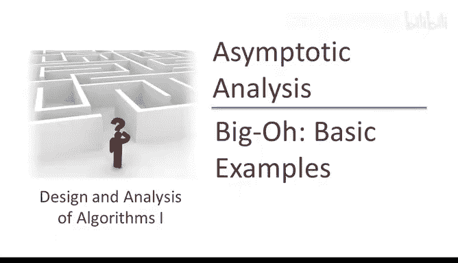
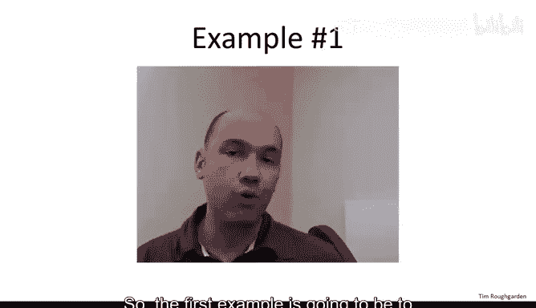
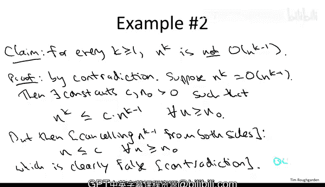

# 算法分析：11：基础示例 🧮

在本节课中，我们将通过两个基础示例来学习如何正式地证明一个函数是另一个函数的大O，以及如何证明它不是。我们将运用大O记法的定义，并理解它如何忽略常数因子和低阶项。

---

## 多项式的大O证明

上一节我们介绍了大O记法的正式定义，本节中我们来看看如何应用这个定义。第一个示例是证明一个多项式函数的大O记法。

**核心概念**：对于一个k次多项式 `T(n)`，其最高次项 `n^k` 决定了其渐近增长率。即：
`T(n) = O(n^k)`

**证明过程**：
假设 `T(n)` 是一个k次多项式：
`T(n) = a_k * n^k + a_{k-1} * n^{k-1} + ... + a_1 * n + a_0`
其中 `k` 是正整数，系数 `a_i` 可以是任意实数（正或负）。

为了证明 `T(n) = O(n^k)`，我们需要找到常数 `C` 和 `n_0`，使得对于所有 `n ≥ n_0`，都有 `T(n) ≤ C * n^k`。

以下是证明步骤：

1.  我们选择 `n_0 = 1`。
2.  我们选择常数 `C` 为所有系数绝对值的和：
    `C = |a_k| + |a_{k-1}| + ... + |a_1| + |a_0|`
3.  现在，对于任意 `n ≥ 1`，我们推导 `T(n)` 的上界：
    `T(n) = a_k * n^k + ... + a_1 * n + a_0`
    `≤ |a_k| * n^k + ... + |a_1| * n + |a_0|` （将系数替换为其绝对值，因为 `n ≥ 0`，值只会增大或不变）
    `≤ |a_k| * n^k + ... + |a_1| * n^k + |a_0| * n^k` （因为对于 `n ≥ 1`，有 `n^k ≥ n^{k-1} ≥ ... ≥ n ≥ 1`，用 `n^k` 替换所有更低的幂次，值只会增大）
    `= (|a_k| + ... + |a_1| + |a_0|) * n^k`
    `= C * n^k`

因此，我们证明了对于所有 `n ≥ 1`，都有 `T(n) ≤ C * n^k`。根据大O定义，`T(n) = O(n^k)` 成立。

这个证明验证了大O记法的核心目的：对于多项式，我们只需关注最高次项。

---

## 证明“不是”大O

理解了如何证明“是”大O之后，我们来看看如何证明一个函数“不是”另一个函数的大O。我们将证明 `n^k` 不是 `O(n^{k-1})`。

**核心概念**：不同幂次的多项式在渐近意义上是不同的。`n^k` 的增长严格快于 `n^{k-1}`。

**证明方法**：反证法。

**证明过程**：
假设结论不成立，即 `n^k = O(n^{k-1})`。

根据大O定义，这意味着存在常数 `C` 和 `n_0`，使得对于所有 `n ≥ n_0`，都有：
`n^k ≤ C * n^{k-1}`

对于 `n ≥ 1` 且 `k ≥ 1`，我们可以在不等式两边同时除以 `n^{k-1}`（这是一个正数），得到：
`n ≤ C`，对于所有 `n ≥ n_0`。

这个结论显然是错误的，因为它声称所有足够大的正整数 `n` 都被一个固定常数 `C` 所限制。例如，取 `n = C + 1`，就与 `n ≤ C` 矛盾。

因此，我们的初始假设 `n^k = O(n^{k-1})` 是错误的。这证明了 `n^k` 不是 `O(n^{k-1})`。

这个示例巩固了我们的理解：大O记法能够区分不同增长率的多项式。

---

## 总结

本节课中我们一起学习了两个基础但重要的示例：
1.  **证明“是”大O**：我们通过为多项式 `T(n)` 构造合适的常数 `C` 和 `n_0`，正式证明了 `T(n) = O(n^k)`，展示了如何应用定义并忽略低阶项和常数因子。
2.  **证明“不是”大O**：我们使用反证法证明了 `n^k ≠ O(n^{k-1})`，验证了大O记法能够正确区分不同增长级别的函数。

这些练习帮助我们熟悉了大O记法定义的正式运用，为后续分析更复杂算法的效率打下了基础。