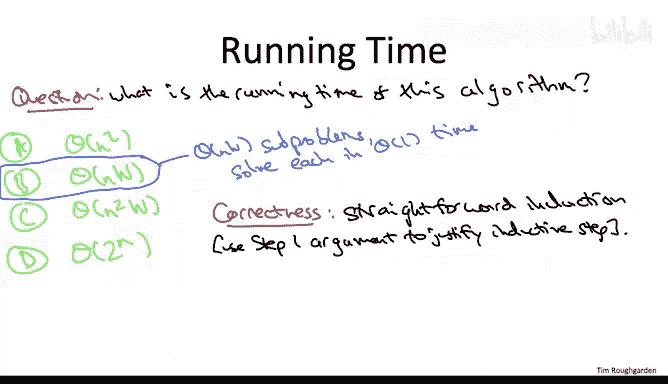

# 算法课程：45_04_03：动态规划算法 🧠


在本节课中，我们将学习如何将背包问题的最优子结构转化为递推关系，并最终实现一个动态规划解决方案。我们将从定义子问题开始，逐步构建递推公式，并最终通过伪代码实现算法。

---

## 子问题定义与递推关系

上一节我们讨论了最优解必须由更小子问题的最优解构成。现在，我们将其转化为递推关系。

首先，引入一些符号。用 **V(i, x)** 表示仅使用前 **i** 个物品，且总容量不超过 **x** 时，能获得的最大价值。这与独立集问题中的 **G_i** 类似，但这里我们使用两个索引，因为子问题可以通过减少物品数量或减少剩余容量两种方式变小。

根据上一节的讨论，最优解有两种可能形式：
1.  直接继承少一个物品（即前 **i-1** 个物品）且容量不变（仍为 **x**）时的最优解。
2.  决定使用第 **i** 个物品，获得其价值 **v_i**，然后将其与“使用前 **i-1** 个物品，且容量减少为 **x - w_i**（**w_i** 为第 **i** 个物品的重量）”时的最优解组合。

因此，递推关系如下：
**V(i, x) = max( V(i-1, x), v_i + V(i-1, x - w_i) )**

一个边界情况是：如果第 **i** 个物品的重量 **w_i** 大于当前允许的容量 **x**，则无法选择它，此时 **V(i, x) = V(i-1, x)**。

---

## 确定子问题范围

在第一步中，我们思考了最优解结构并推导出递推关系。现在，第二步是精确确定我们需要关心的所有子问题。

与路径图上的最大加权独立集问题类似，每次递归查找子问题解时，我们总是从物品列表的末尾移除物品。因此，我们需要考虑所有可能的前缀，即对于所有 **i** 值，考虑前 **i** 个物品构成的子问题。

然而，对于背包问题，子问题变小的第二种方式是减少剩余容量。回想我们的思维实验案例2，当我们想知道一个保证使用当前物品 **i** 的最优解时，必须在查找对应的子问题最优解之前减少容量。

这里我们利用输入假设：所有物品大小和背包容量 **W** 都是整数。因此，每次我们“剥离”掉的容量也是整数。在最坏情况下，我们需要考虑所有可能的剩余容量值：0, 1, 2, ..., 直到原始背包容量 **W**。

至此，我们明确了子问题的范围：它们由索引 **i**（物品数量）和 **x**（剩余容量）共同定义。

---

## 实现动态规划算法

现在我们已经完成了前两步：明确了子问题并找到了计算更大子问题解的公式。剩下的就是创建一个表格，并系统地使用递推关系填充它，从最小的子问题开始，直到解决最大的子问题。

以下是算法的伪代码。我们将使用一个二维数组 **A** 来存储子问题的解，因为子问题由两个索引定义。

```pseudocode
初始化二维数组 A[0..n][0..W]
// 初始化：没有物品时，价值为0
For x = 0 to W:
    A[0][x] = 0

// 系统地填充表格
For i = 1 to n:
    For x = 0 to W:
        // 情况1：不选第 i 个物品
        case1 = A[i-1][x]
        // 情况2：选第 i 个物品（前提是能装下）
        if w_i <= x:
            case2 = v_i + A[i-1][x - w_i]
        else:
            case2 = -∞ // 或一个很小的数，表示不可行
        A[i][x] = max(case1, case2)

返回 A[n][W]
```

**关键点**：当我们需要求解特定 **i** 和 **x** 的子问题时，我们已经计算并存储了所有所需更小子问题的解（在之前的外层循环迭代中）。因此，我们可以通过常数时间查找来使用它们。

当双重循环完成后，数组 **A** 中 **A[n][W]** 位置的值就是我们想要的答案：在可以使用任何物品且总容量为 **W** 的条件下，能获得的最大价值。

---

## 算法分析与扩展

### 时间复杂度分析

算法的运行时间分析很简单：我们计算子问题的数量，并查看每个子问题需要做多少工作。
*   子问题由 **i** 和 **x** 索引。
*   **i** 有 **n+1** 种选择（0 到 n）。
*   **x** 有 **W+1** 种选择（0 到 W）。
*   因此，总共有 **Θ(n * W)** 个子问题。
*   对于每个子问题，我们只对先前计算出的解进行一次比较（常数时间工作）。
*   所以，总体运行时间为 **O(n * W)**。

### 正确性与解的重构

正确性的证明遵循与之前动态规划算法相同的模板：通过对问题规模进行归纳，并使用我们的案例分析（思维实验）来形式化地证明归纳步骤。

与之前的独立集算法类似，这个算法计算的是最优解的值，而不是最优解本身（它返回一个数字，而不是物品的子集）。但是，我们可以通过回溯填充好的数组 **A** 来重构出一个最优解。

**重构思路**：从最大的子问题（**i=n, x=W**）开始，查看填充该表项时使用了哪种情况（情况1或情况2）。
*   如果使用了情况1，则知道应该排除最后一个物品（第 **n** 个）。
*   如果使用了情况2，则知道应该包含最后一个物品，并且知道接下来应该回溯到哪个子问题（**i=n-1, x=W - w_n**）继续这个过程。

建议你在实践中尝试实现这个重构算法，这将帮助你更好地掌握动态规划范式中的解重构环节。

---

## 总结



本节课中，我们一起学习了如何为背包问题设计动态规划算法。我们从分析最优子结构并建立递推关系 **V(i, x) = max( V(i-1, x), v_i + V(i-1, x - w_i) )** 开始。然后，我们确定了需要解决的子问题范围是所有 **i**（0到n）和所有 **x**（0到W）的组合。接着，我们通过一个双重循环系统地填充二维表格来实现算法，最终在 **A[n][W]** 中得到最优解的值。我们还分析了算法的时间复杂度为 **O(n * W)**，并简要讨论了如何通过回溯来重构出具体的物品选择方案。