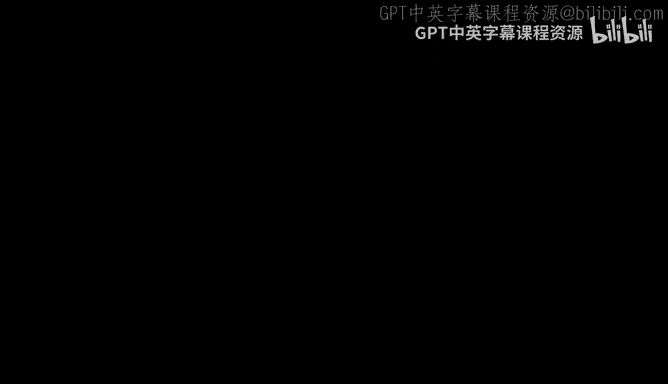
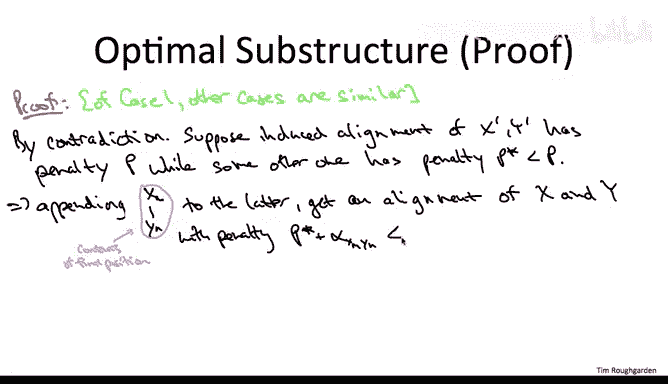

# 斯坦福大学《算法（分治／排序／搜索／随机算法、图搜索／最短路径／数据结构、贪心算法／最小生成树／动态规划、最短路径／NP）｜Algorithms》中英字幕 - P122：47_04_01_最优子结构.zh_en - GPT中英字幕课程资源 - BV1Rx4y1U7sZ

At the beginning of the course we talked about the sequence alignment problem。

 a problem which is fundamental to modern computational genomics。

 and we talked about the need for an efficient algorithm for solving that problem for finding the best alignment of two strings。

 I'm pleased to report that at this point we're well prepared to give such an algorithm Indeed such an efficient solution will readily fall out of the dynamic programming recipe that we now have quite a bit of practice with。

So let me briefly jog your memory about the sequence alignment problem。

 so the goal here is to compute a similarity measure between strings。

 a similarity measure defined as the total penalty of the best alignment。

 also known as the Needleman Wounch score。So for example， if you're given as input the strings。

 A G G GCT， and A G GCA， natural candidate alignment would be to stack them one on top of the other。

 inserting a gap in the shorter string after the two G's that in some sense represents the missing G。

This is a pretty good alignment that suffers from merely two flaws。 So， first of all。

 we did resort to adding a gap in the second string。 Second of all。

 there is a mismatch in the final column。 the A and the T get mismatched。In general。

 we evaluate the alignment by summing up the penalties of all of the flaws。

 and there's some penalty per gap， and there's some penalty per mismatch。So a bit more precisely。

 as input in this computational problem we're given two strings。

 I'm going to call them capital X and capital Y。 I'm going to use little X and little Y to denote the individual characters of these strings。

 Let's say the first string， capital X has length M and the second string Y has linked n。

In addition to the two input strings we assume were given as input the values for the various types of penalties so that we know exactly how much it costs each time we insert a gap。

 and for each possible mismatch we need to know exactly what's the cost of that mismatch。

In principle， you could be given a penalty for matching a letter with itself。

 but typically that's going to be a penalty of zero。

The space of feasible solutions are just the ways of inserting gaps into the two strings so that the results have equal length。

I should emphasize that you're allowed to insert gaps into both of the strings in the example we only inserted into one of the two strings。

 but in general you might have an input where one string is seven characters longer than the other。

 and it might turn out that in the optimal alignment the best thing to do is insert three gaps at various places in the longer string and 1 gaps at various places into the shorter string。

And the goal， of course， is just to compute amongst all of the exponentially many alignments。

 the one that minimizes the total penalty， where total penalty is just the sum of the individual penalties for the inserted gaps and the various mismatches。

So let's not be unduly intimidated by how fundamental this problem is and let's just apply the dynamic recipe。

 the programming recipe that we've been using all along Now remember the really key insight in any dynamic programming solution is figuring out what's the right collection of subproblem and if you're feeling like you're up to the black beltt level and dynamic programming you might just want to try to guess what are the right collection of subproblem for sequence alignment but I don't expect you to be able to do that at this point and so as usual we're going to derive the correct collection of subproblem and we're going to do it by reasoning about the structure of an optimal solution。

 narrowing it down to a small number of candidates composed in various ways from solutions to smaller subproblem。

Once we've figured out the small number of possibilities for what the optimal solution could look like in terms of solutions to smaller subproblems。

 we'll be able to derive a recurrence， which in effect just does brute force search through the small number of candidates and from the recurrence we'll be able to back out。

 we'll be able to reverse engineer what are the various subproblems that we actually care about and that we have to solve。

So let's do a thought experiment， what does the optimal solution have to look like and again remember this is exactly what it is that we're trying to compute。

 but that's not going to stop us from reasoning about it if someone handed to us on a silver platter or the optimal solution。

 what would it have to look like？So consider any old pair of strings。

 capital X and capital Y and an optimal alignment of them。

 let's visualize this optimal alignment as follows。

 let's write down the string X plus whatever gaps get inserted into it on top and right beneath it we'll write down the string Y with whatever gaps are inserted into it these two things have exactly the same length。

So to figure out the various cases of the structure for this optimal solution let's reason by analogy with the problems we've already solved so back when we were looking at independent sets of line graphs。

 our case analysis was well either the final vertex。

 the rightmost vertex of the path is in the optimal solution or it's not and the Napsack problem we said well either the last item is in the optimal solution or it's not so we always looked at sort of the last part of the optimal solution in some sense the rightmost position and happily staring at this alignment we see we can once again focus just on the action in the rightmost in the final position。

So now I have a question for you so in the independent set problem there were two cases。

 the last vertex was either in the optimal solution or it's not in the Napsack problem。

 there were also two cases， the final item was either in the optimal solution or it's not so my question for you is in the sequence alignment problem when we focus on what's going on in the final position of the optimal alignment。

 how many relevant cases do we have to study。So the answer I'm looking for is B3 relevant possibilities for the contents of the final position。

 Let me explain my reasoning。 Let's start with the upper part of the final position。

 observeve that if that's a character of this string capital X。

 it can only be the very last character。 It can only be little X sub M。

 That's because that's where this string ends。 Now we don't know that little x sub M is in the final position。

 there might be a gap。 Similarlyly， in the bottom part of this final position。

 there's two possibilities， there's a gap or if it's a character of y。

 it has to be the final character， little y sub n。 So that would seems to suggest four possibilities。

 two options for the top two options for the bottom。

 but the hint of talking about relevant possibilities is that it's totally pointless to have a gap in both the top and the bottom。

 Y， well， the penalty for gaps is non negative。 So if we just deleted both of those gaps。

 we get an even better alignment of x and Y。 And in studying an optimal solution。

 we can therefore assume that we never have。Two gaps in a common position。

 so that leaves exactly three cases。It could be there's no gaps at all that in fact。

 this alignment matches the character， a little x sub M with little y sub n。

Or it could match the final character of capital X with a gap。

Or could match the final character of capital Y with a gap。

So the hope behind this case analysis is that we're going to be able to boil down the possibilities for the optimal solution to merely three candidates。

 one candidate for each of the three possibilities for the contents of the final position that would be analogous to what we did in both the independent set and NApsack problems where we boiled the optimal solution down to just one of two candidates corresponding to whether either the final vertex or the final item as the case may be was in the optimal solution。

Another way of thinking about this is we'd like to make precise the idea that if we just knew what was going on in the final position。

 if only a little Bertie would tell us which of the three cases that were in。

 then we'd be done by just solving some smaller subpro recursively。

So let's now state for each of the three possible scenarios for the final position。

 what is the corresponding candidate for the optimal solution。

 the way in which it must necessarily be composed with an optimal solution to a smaller subpro。

So who are going to be the protagonist in our smaller subpro Well the smaller subprom is going to involve everything except the stuff in the final position。

 so it's going to involve the strings capital X and capital Y possibly with one character remaining so let's let x prime be X with its final character peeled off Y prime is going to be Y with its final character peeled off。

So let me just remind you how I numbered the three cases。

 so case one is when the final position contains the final characters of both of the two strings。

 that is when there's no gaps。Case two is when x little x sub n gets matched with a gap and case3 is when little y sub n gets matched with the gap。

All right， so suppose the case one holds， this means that the contents of the final position includes both of the characters。

 little X of M and little y sub n。So now what we're going to do is we want to look at a smaller subproblem and we want to look at the subprom induced by the contents of all of the rest of the positions。

 I'm going to call that the induced alignment。Since we started with an alignment。

 two things that had equal length and we peeled off the final position of both。

 we have another thing that has equal length， so we're justified in calling it an alignment Now what is it an alignment of Well。

 if we're in case1， that means what's missing from the induced alignment are the final characterss little x sub M and little y sub n。

 which means the induced alignment is a bona fide alignment of x prime and y prime。

And certainly what we're hoping is true is that the induced alignment is in fact。

 an optimal alignment of these smaller strings x prime and Y primem。

This would say that when we're in case1， the optimal solution。

 the original problem is built up in a simple way from an optimal solution to a smaller sub problem。

We're of course hoping that something analogous happens in cases two and three。

 the only change is going to be that the protagonists of the subprom will be a little bit different in case2。

 the thing which is missing from the induced alignment is the final character of x。

 so it's going to be induced alignment of x prime and y， similarly in case3。

 the induced alignment is going to be an alignment of x and y prime。So this is an assertion。

 this is a claim， it's not completely obvious， though the proof isn't hard as I'll show you on the next slide。

 but assuming for the moment that this assertion is true， it fulfills the hope we had earlier。

 it says that indeed the optimal solution can only be one of three candidates that one for each of the possibilities for the contents of the final position。

 alternatively it says that if only we knew which of the three cases we were in， we'd be done。

 we could recursse or we could look up a solution to a smaller subproble and we could extend it in an easy way to an optimal solution for the original problem。

So let's now move on to the proof of this assertion why is it true that an optimalum solution must be built up from an optimalum solution to the relevant smaller subproblem well all of the cases are pretty much the same argument so I'm just going to do case one。

 the other cases are basically the same I invite you to fill in the details。

So it's going to be the same type of simple proof contradiction that we used earlier when reasoning about the structure of optimal solutions for the independent set NApsack problems。

 we're going to assume the contrary， we're going to assume that the induced solution to the smaller subprom is not optimal and from the fact that there is a better solution for the subprom we will extract a better solution for the original problem。

 contradicting the purported optimality of the solution that we started with。

So when we're dealing with case1， the induced alignment is of the strings x prime and y prime X and y with the final character peeled off。

 and so for the contradiction， let's assume that this induced alignment， it has some penalty。

 say capital P， let's assume it's not actually an optimal alignment of x prime and y prime that is supposed that we started from scratch。

 we can come up with some superior alignment of x prime and y prime， with total penalty p star。

 strictly smaller than p。But if that were the case。

 it would be a simple matter to lift this purportedly better alignment of X prime and y prime to an alignment of the original strings X and Y。

 namely we just reuse the exact same alignment of X prime and Y prime。

 and then in the final position we just match XM with Yn。

So what is the total penalty of this extended alignment of all of x and Y。

 well it's just the penalty incurred in everything but the final position and that's just the old penalty P star plus the new penalty incurred in the final position。

 and that's just the penalty corresponding to the match of the character is X M and YN。

P star being less than P。 of course， P star plus alpha XM，Y N is less than P plus alpha XM， Y N。

But the second term is simply the total penalty incurred by our original alignment of x and y。

 right that alignment incurred penalty capital P just in the induced alignment of x prime y prime。

 and its total penalty was just that plus the penalty in the final position。

 which is this alpha xM Y N。But that furnishes the contradiction。

 we suppose that we started with an optimal alignment of x and Y， yet here is a better one。

 so with that contradiction it completes the proof of the optimal substructure claim。

