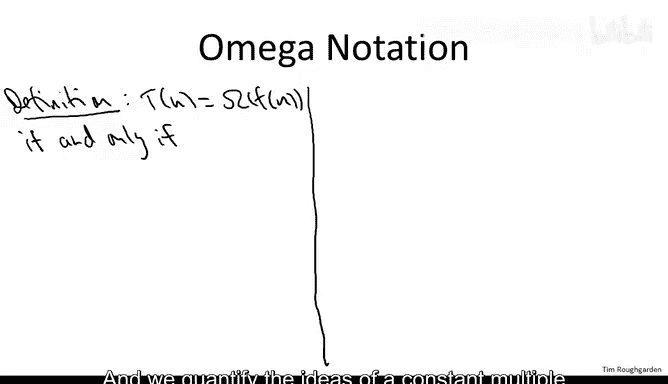
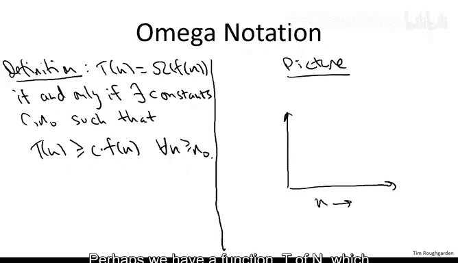
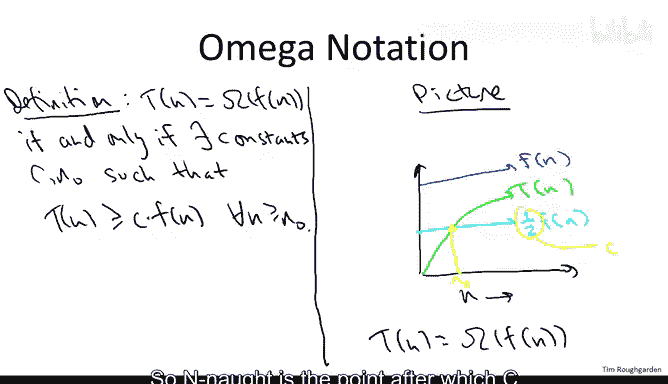
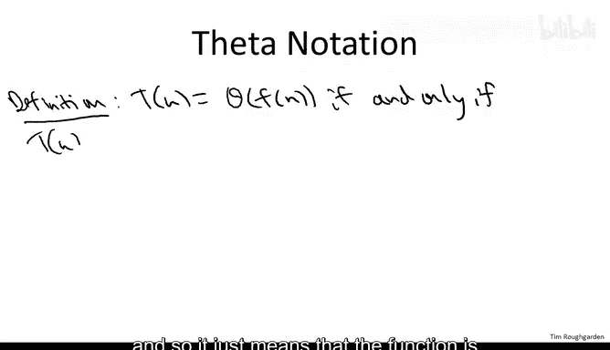
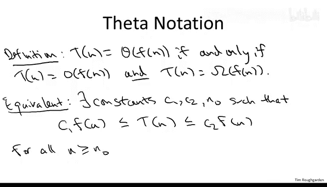
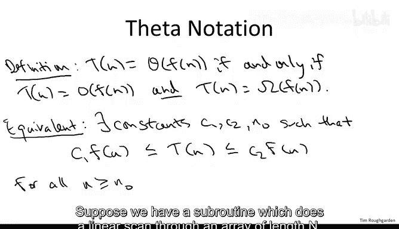
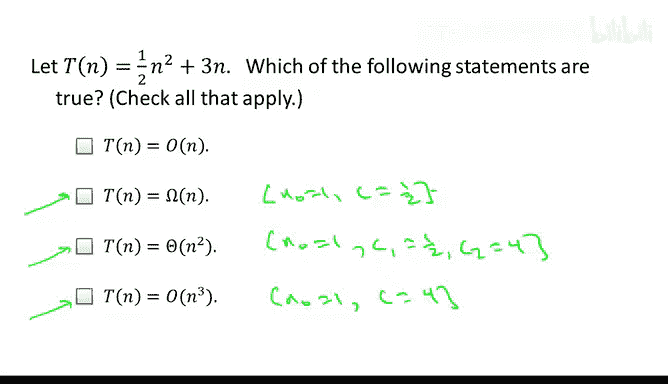
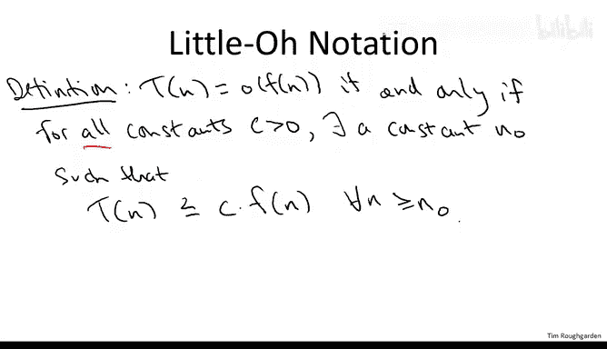
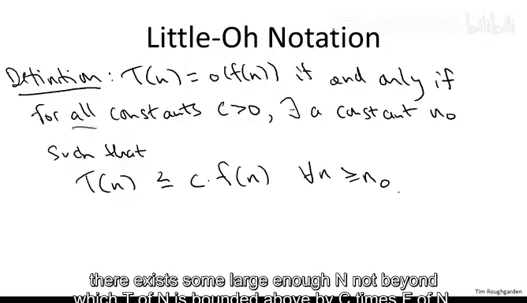
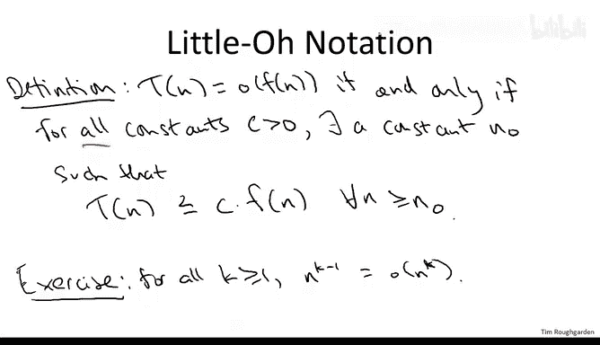

# 斯坦福大学《算法（分治／排序／搜索／随机算法、图搜索／最短路径／数据结构、贪心算法／最小生成树／动态规划、最短路径／NP）｜Algorithms》中英字幕 - P12：12_01_04_大Ω与Θ记号.zh_en - GPT中英字幕课程资源 - BV1Rx4y1U7sZ

In this lecture we'll continue our formal treatment of asymptotic notation。

 we've already discussed bigO notation， which is by far the most important and ubiquitous concept that's part of asymptotic notation。

 but for completeness I do want to tell you about a couple of close relatives of bigO。

 namely omega and theta if big O is analogous to less than or equal to then mega and theta are analogous to greater than or equal to and equal to respectively。

 but let's treat them a little more precisely。The formal definition of omega notation closely mirrors that of big O notation。

 We say that one function T of n is big omega of another function f of n if eventually that is for sufficiently large n。

 it's lower bounded by a constant multiple of f of n and we quantify the ideas of a constant multiple and eventually in exactly the same way as before。

 namely y explicitly giving two constants C and n， such that t of n is bounded below by C times f of n for all sufficiently large n that is for all n。

At least and not。 There's a picture just like there was for big O notation。

 Perhaps we have a function T of n， which looks something like this green curve。

 And then we have another function。 F of n， which is above T of n。

 But then when we multiply F of n by one half， we get something that' eventually is always below T of n。

 So in this picture， this is an example where T of n is indeed big omega of F of n。

As far as what the constants are， well the multiple that we use C is obviously just one half。

 that's what we're multiplying F of n by and as before and not is the crossing point between the two functions。

 so n not is the point after which C times F of n always lies below T of n forevermore。

So that's big omega Theta notation is the equivalent of equals and so it just means that the function is both big O of f of n and omega of f of n an equivalent way to think about this is that eventually T of n is sandwiched between two different constant multiples of f of n I'll write that down and I'll leave it to you to verify that the two notions are equivalent that is one implies the other and vice versa。

So what do I mean by T of n is eventually sandwiched between two multiples of FFN。

 why just mean we choose two constants， a small one C1， and a big constant， C2。

 and for all n at least and not T of n lies between those two constant multiples。

One way that algorithm designers can be quite sloppy is by using O notation instead of theta notation。

 So that's a common convention and I will follow that convention often in this class。

 Let me give you an example。 supposeupp we have a subroutine。

 which does a linear scan through an array of link n it looks at each entry in the array and does a constant amount of work with each entry So to merge subroutine would be more or less an example of a subroutine of that type So even though the running time of such an algorithm。

 a subroutine is patently theta of n it does constant work for each of n entries。

 so it's exactly theta of n。 We'll often just say that it has running time O of n。

 we won't bother to make the stronger statement that it's theta of n。

 The reason we do that is because know as algorithm designers what we really care about is upper bounds we want guarantees on how long algorithms are going to run So naturally we focus on the upper bounds and not so much on the lower bound side So don't get confused once in a while there'll be a quantity which is obviously theta of f of n and I'll just make the weaker statement that it's O of F of n。

The next quiz is meant to check your understanding of these three concepts。

 big omega and big theta notation。So the final three responses are all correct。

 and I hope the high level intuition for y is fairly clear。

 T of n is definitely a quadratic function。 We know that the linear term doesn't matter much as it grow as n grows large。

 So since it has quadratic growth， then the third response should be correct。

 It's theta of n squared， and it is omega of n so omega n is not a very good lower bound on the asymptotic rate of growth of T of n。

 but it is legitimate indeed as a quadratic growing function。

 it grows at least as fast as a linear function。 So it's omega of n。

 for the same reason big O of n cubed， it's not a very good upper bound， but it is a legitimate one。

 it is correct。 The rate of growth of T of n is at most cubic， In fact， it's at most quadratic。

 but it is indeed at most cubic。Now， if you wanted to prove these three statements formally。

 you would just exhibit the appropriate constants， so for proving that it's big omega of n。

 you could take n not equal to1 and c equal to12。For the final statement， again。

 you could take n not equal to one。And C equal to say four。And to prove that it's theta of n squared。

 you could do something similar just using the two constants combined， so n not would be1。

 you could take C1 to be12 and C2 to B4。And I'll leave it to you to verify that the formal definitions of big omega big theta and big O would be satisfied with these choices of constants。

 One final piece of asymptotic notation， we're not really going to use this much but you do see it from time to time so I wanted to mention it briefly。

 this is called a little O notation in contrast to big O notation So while big O notation informally is a less than or equal to type relation。

 little O is a strictly less than relation， so intuitively it means that one function is growing strictly less quickly than another。

So formally， we say that a function T of n is little o of F of n。

If and only if for all constantsancy。There is a constant and not beyond which T of n is upper bounded by this constant multiple C times F of n。

 So the difference between this definition and that a big notation is that to prove that one function is big O of another。

 we only have to exhibit one measly constant C such that C times F of F of n is a upper bound eventually for T of N。

 By contrast， to prove that something is little O of another function。

 we have to prove something quite a bit stronger， we have to prove that for every single constant C。

 no matter how small for every C， there exists some large enough and not beyond which t of n is bounded above by C times F of n。

 So for those of you looking for a little more facility with little O notation。

 I'll leave it as an exercise to prove that。

As you'd expect， for all polynomial powers， K， in fact， end of the K -1。Is little o of end to the K。

There is an analogous notion of little omega notation expressing that one function grows strictly quicker than another。

 but that one you don't see very often， and I'm not going to say anything more about it。

 So let me conclude this video with a quote from an article back from 1976 by my colleague Don Cannuuth widely regarded as the grandfather of the formal analysis of algorithms and it's rare that you can pinpoint why and where some kind of notation became universally adopted in the field。

 but in the case of oenttotic notation indeed it's very clear where it came from。

 The notation was not invented by algorithm designers or computer scientists it's been in use in number theories since the 19th century but it was Don Kauth in 76 that proposed that this become the standard language for discussing rate of growth and in particular for the running time of algorithms So in particular he says in this article on the basis of the issues discussed here I propose that members of SG act。

 this is the special interest group of the ACM which is concerned with theoretical computer science in particular the analysis of algorithms so I propose that the members。

SGAC and editors in computer science and mathematics journals adopt the O omega and theta notations as defined above unless a better alternative can be found reasonably soon。

 so clearly a better alternative was not found and ever since that time this has been the standard way of discussing the rate of growth of running times of algorithms and that's what we'll be using here。

