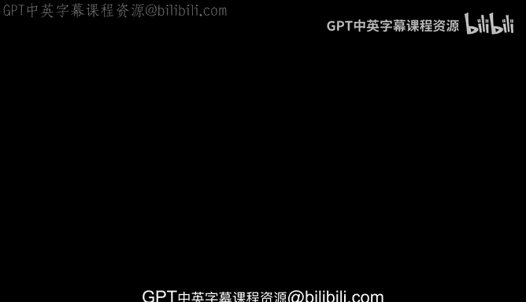
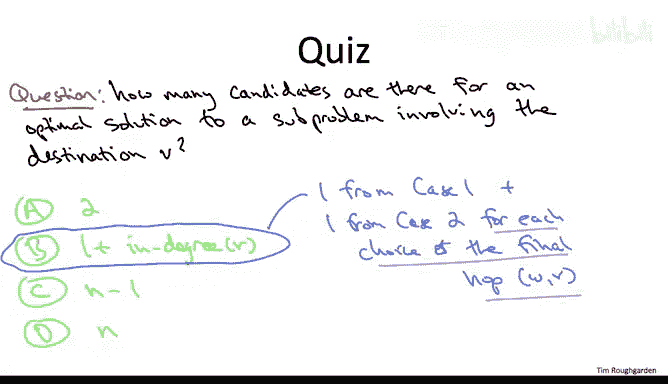

# 斯坦福大学《算法（分治／排序／搜索／随机算法、图搜索／最短路径／数据结构、贪心算法／最小生成树／动态规划、最短路径／NP）｜Algorithms》中英字幕 - P130：02_01_05_最优子结构.zh_en - GPT中英字幕课程资源 - BV1Rx4y1U7sZ

In this video， we'll start developing the Belman Ford algorithm as an instantiation of the dynamic programming paradigm will develop it in the usual way by understanding how optimal solutions must necessarily be composed of optimal solutions to smaller sub problems。

So let me just quickly review what we learned from the subtleties of the previous video。

 in particular， let me be precise about what I mean by solving the single source shortest path problem when the input graph can have negative edge costs。

So the input as usual is a directed graph every edge has an edge cost CB。

 we're allowing those edge costs to be negative， and we're given a source for a text S。

So what do we want to compute， Well， ideally， we'd like to compute the shortest path distance from S to all other destinations V。

 where as usual， the length of a path is just the sum of the edge costs。

Now in the previous video we discussed how the goal is problematic for input graphs that have a negative cycle if you allow cycle paths to contain cycles。

 then this isn't even defined in some sense shortest path length is minus infinity and if you don't allow cycles then it's computationally intractable it's an NP hard problem so if you fail to compute shortest paths。

 then at least tell us an excuse， output a negative cycle in the input graph as the reason for your failure to compute shortest path distances。

So for this video， I'm just going to develop development For algorithm。

 for input graphs that do not contain negative cycles， and of course。

 these are the cases in which we better actually output the correct shortest paths。

Once we've got the Belman Ford algorithm up and running for inputgraphs that do not have negative cycles。

 we'll see that it's a fairly easy matter to extend it to the general case。

 and four input graphs that have negative cycles we'll be able to output such a cycle without affecting the running time of the basic algorithm。

So with an eye toward a dynamic programming algorithm for the shortest path problem。

 let's start thinking about optimal substructure， the way in which optimal solutions that is shortest paths must necessarily be composed of optimal solutions that is shortest paths to smaller subpro。

 Now， the formal optimal substructure Lemma is going to be a little bit cumbersome to state。

 So let me just spend a slide kind of telling you you know what the deal is how to think about it。

It's often tricky to figure out how to apply the dynamic programming paradigm to graph problems。

 One of the reasons for that is that graphs aren't really naturally sequential objects。

 They're not ordered in any obvious way。 We're just given some unordered set of vertices and some unordered set of edges。

 Now， one special case， of course， would be path graphs。

 our very first example of dynamic programming， there there is an obvious ordering on the vertices of the graph。

 But unlike， say， alignment sequences where again， there's an obvious ordering from left to right。

 in a graph problem， it's not so clear how to order things。For this particular graph problem。

 however， it seems like we've got something going for us。

 which is the sequentiality of our output right paths are certainly sequential objects。

 so that gives us hope we can state and prove an optimal substructure lemma talking about how optimal solution shortest paths must be built up from in some sense smaller shortest paths。

Unfortunately， it's still far from obvious how to really define smaller and larger subproblems。

 so for example， you'd love to have some intelligent ordering on which you process the possible destinations V。

 but it's not at all clear how to do that without knowing the shortest path distances in the first place。

 So this is a subtle issue that I encourage you to think hard about in the privacy of your own home so you can better appreciate what's non-trivial about the Belman Ford solution。

So the key idea in the Belman Ford algorithm and it's a good one is to introduce additional parameter that gives us an unambiguous definition of subproblem size so what this parameter is going to do for a given destination V iss going to control how many edges we allow in paths from the source S to this destination V that we're looking at to explain this。

 let's look at the following green graph that has five vertices on the right hand part of the slide。

So in the Melman Ford algorithm， we're going to have one subpro for each possible destination and each possible restriction on the number of edges in a path。

 So， for example， suppose we we're looking at S and we're looking at destination T and we think about paths that only have two edges or less。

 Well in that case， the shortest path length subject to that constraint from S to T in this graph has length4 The bottom path which has three edges is not an option we're only permitting two edges or less in this current subproble Now if we bump up the edge budget to3 then the corresponding shortest path distance drops from four to three because all of a sudden we can make use of this threeho path on the bottom And again。

 the point here is that it gives us an unambiguous notion of subproblem size。

 the more edges you're allowed to use in your paths from a source to a given destination。

 the bigger that subproble。All right， so that discussion was deliberately vague to give you some context for the following formal statement of the optimal substructure limitma。

So we're going to go ahead and state and prove this optimal substructure limitmma in full generality。

 we're going to be working with arbitrary input graphs， they might have a negative cycle。

 they might not。So like all of these optimal substructure limitss。

 the statement is going to have the form that the optimal solution to a sub problemble has to lie has to be one of a small number of candidates that are composed in simple ways from optimal solutions to smaller subpro。

 So how do we index a given subproble， Well there's going to be a destination V that we care about。

 And as we said in the last slide， there's going to be a budget on how many edges you're allowed to use in a path from S to V。

 And we're going to use I to denote that budget。So for every possible destination V。

 and so for every possible edge budget， there's going to be a positive integer， one or bigger。

Suppose that P is an optimal solution， meaning amongst all paths that started S that ended V and the contain at most I edges。

 amongst all of those paths， P has the minimum sum of edge cost， the minimum length。

So a subtle point， because we're proving this lemon。

 it' full generality that is also for input graphs that might have negative cycles。

 we need to go ahead and allow this path P to use cycles if it wants。

 including potentially to use a negative cycle multiple times that is allowed Notice we're not worried about this path using a cycle an infinite number of times。

 because we have a finite budget I on how many edges it can contain。So with that setup。

 what are the possible candidates for what capital P could possibly be Well we're going to have our usual sort of trivial case1。

 which is that if this path P doesn't bother to use up its full edge budget。

 that is if it has I minus1 edges or less， well then naturally P better B the shortest SV path that has at most I minus-1 edges。

So the nontrivial case is when the shortest path with the most I edges from S to V actually uses its full budget。

 uses all I of its edges。 So now， by analogy with all of our previous dynamic programming algorithms where we think about plucking off the final part of an optimal solution here。

 we're going to pluck off the final edge from the path P。

 What do we get where we get a path with one fewer edge So that's good。

 it's going to correspond to some smaller sub problem because it has the most I-1 edges。

 on the other hand， notice that if we take a path from S to V， and we pluck off the final edge。

 we get a path from S to somewhere else。 So we're going to call that somewhere else W。

So plucking off the final edge from capital P gives us a path P prime that starts at S that ends a w that has at most I minus1 edges。

 and I hope you can guess that the claim is that it's not just any old path from S to W with the most I minus1 edges。

 it is， in fact a shortest such path。Now， in this case too。

 notice that we of course know that p prime has exactly I -1 edges， not merely and most I -1 edges。

 but it's going to be useful to have the stronger assertion claimed here that p prime is optimal amongst all paths that have I -1 edges or possibly fewer。

Allright right， so this is one of those lemons that's actually harder to state than it is to prove。

 So let's just quickly sort of talk through the proof。

 It's the same as the previous optimal substructure lemons that we've seen。Case1 is totally trivial。

 It's the obvious contradiction that we've seen in many of our other case1s。

Case 2 is going to be one of our usual cut and paste contradictions。

So suppose there is some path Q better than P prime。 That is Q starts at S。

 N of W contains I -1 edges or less， And the sum of its edge costs is even smaller than that of P prime。

Well， then if we just tack on the final hop of P， that is the edge WV。

 we get a path that starts at S that goes to V that has at most I edges and the total sum of edge costs in this path Q plus WV is strictly less than that an original path P。

 but that contradicts the reported optimality of P amongst all paths starting at S ending at V and having a most i edges。

So that's the proof of the optimal substructured lemma， it's simple enough。

 and as usual the next step is going to be to compile this lemma into a recurrence where informally what the recurrence is going to do is brute for search amongst the possible candidates for the optimal solution。

 So to make sure you understand what just happened， let's move on to a quiz。And the question is。

 for a given destination V of some input graph， how many candidates are there for the optimal solution of a sub problemblem that involves V。

The correct answer is the second one。The answer depends on which destination V you're talking about and what governs the number of subproblem is the in degree of this vertex。

 that is the number of edges of the input graph that have V as their head。Why is this true， Well。

 case1 contributes one possible candidate， it's possible that for a given eye and a given V。

 all you do is inherit the optimal solution to destination V with a budget of one fewer edge。

Case 2 may seem like only one other candidate， but actually case 2 comprises a number of them one for each choice of that final hop W comma V。

 specifically for a given choice of W， that contributes a candidate optimal solution that's the shortest path from S to that choice of W that uses the most I-1 edges plus that edge W V tacked on。

