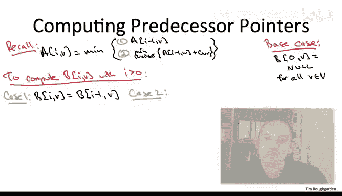

# 斯坦福大学《算法（分治／排序／搜索／随机算法、图搜索／最短路径／数据结构、贪心算法／最小生成树／动态规划、最短路径／NP）｜Algorithms》中英字幕 - P134：06_01_09_空间优化.zh_en - GPT中英字幕课程资源 - BV1Rx4y1U7sZ

So we've talked a bit about various running time optimizations of the basic Belman Ford algorithm。

 now let's talk about optimizing the space required by the algorithm。

To orient ourselves， let's just think about how much space is needed by the basic algorithm we've been studying thus far。

All right， so the correct answer here is the first one， A。

The space required by the basic Bell4 algorithm is quadratic in the number of vertices。

 it's theta of n squared why well the space is dominated by the 2D array that we fill in and there's only a constant amount of space per subproblem and there's n squared subproblem remember one index is the budget on how many edges we're allowed to use I ranges from0 to n minus1 and then the other index is just the destination and there's n of those。

So in this video， we will talk about how you can do better。

 how you can get away with only a linear space， not quadratic space。

The initial observation is a simple one， let's just return to the formula that we use to populate all of the entries of the array。

So we always take a bunch of a whole bunch of candidates。 What are the candidates。

 Well either we can inherit the solution from last iteration I A I1 v or we can choose something to be the last top Wv。

 and then we just paste together the best solution to W from last iteration。

 So AI -1 W plus we pay for the last top， the length of the edge W V。

 But here's the point staring at this formula， which subproblem values do we care about。 Well。

 not that many of them。 And in particular， the trait shared by all of the interesting candidates are there all from the last iteration。

 The first index in everything on the right hand side is always I-1。As a consequence。

 as soon as we've finished one batch of subproblem for some value of I， we've computed AIV for all V。

 we can throw out the results of all of the previous rounds of subproblem， AI minus1。

 AI minus2 and so on all we need is the freshest batch。

 the most recent iteration to correctly proceed。If we do that。

 the only sub problems we're keeping track of are the ones that we're filling in in the current round I。

 and we're remembering the solutions from the previous round I minus-1。

 That means any given moment in time， we're only keeping track of big O of n different sub problems。

And this linear space bound is even more impressive than it might appear at first。

 And that's because if you think about the responsibility of our algorithm in this problem。

 we have to output a linear number of things。 right， We're not just outputting one number。

 We're outputting n numbers。 shortest path distance from S to every possible destination。

 So the space is really constant per statistic that we have to compute。

One thing I'm not going to discuss explicitly but I think would be a good exercise for you go back to all of the other dynamic programming algorithms we've discussed and of course by now there are many and see which ones you can do a comparable optimization。

 which subproblems do you need to keep around to compute the new ones and if you throw out all the ones that you're not going to need anymore what does that reduce the space to for many of the problems we've just studied you're going to see a big improvement in the space required？

So this would be a good time to pause and stop for a few seconds and think about possible negative consequences of this space optimization。

 So suppose we do this， either in the context of shortest path Beling For or some other dynamic programming algorithm。

 we throw out the values of old subprom solutions that we seemingly don't need anymore more to push the recurrence further。

 Are there any drawbacks to this space optimization。

So the answer depends if all you care about is the value of an optimal solution and not the optimal solution itself。

 then you may as well just throw out all of these old subproble that you don't need anymore to push the recurrence further。

 It's not going to hurt you at all。 If however， you want the optimal solution itself and not just its value。

 Well， how did we actually accomplish that in the past， we had these reconstruction algorithms。

 How did the reconstruction algorithms work， You took the entire filled in table and you traced backward through it。

 And each entry of the filled in table， you looked at which of the candidates won which comparison came out the winner when you filled in this entry that told you a piece of what the optimal solution have to look like and then you go backward through the table and repeat the process。

 If you've thrown out most of your filled in table。

 how are you going to run this reconstruction algorithm in the context of the Belmon Ford algorithm。

 How are you going to reconstruct shortest paths if you haven't remembered all of the subproblem of all of the previous iterations。

And you can certainly imagine in a routing application， for example。

 you don't just want to know that the shortest path has linked 17。

 you want to know what route should we take to get from point A to point B。

So in the rest of this video， I'm going to describe a solution for the Belman Ford algorithm。

 I'm going to show you how we can retain the constant space per vertex guarantee while recovering the ability to reconstruct shortest paths。

So the idea is for a given value of I and a given destination V。

 we're going to keep track of not just the one piece of information。

 the length of the shortest path from SV that uses the most eye edges。

 but also a second piece of information， which is the second to last vertex on such a path。

 so it's still going to be just constant space per subpro。

So we're going to call this second two dimensional array B。

 we're going to call it entries predecessor pointers。

 again the cementman are this pointer points to the predecessor of this destination V on a shortest path from S toV that has the most eye edges。

 of course if I is sufficiently small there may be no such path from S toV and in that case we just have a null predecessor pointer。

So for a moment， let's just forget about the space optimization that we're trying to attain。

 and let's just observe that if we correctly computed these capital Bs。

 then simply traversing predecessor pointers would reconstruct shortest paths。So why is this true。

 Well， two reasons， reasons that you've seen explain other things as well。

 So the first reason is remember we're assuming that the input graph has no negative cost cycle。

 therefore shortest paths have at most n1 edges， therefore the Bn-1 vs actually store in them the final hop of a shortest path period with no edge budget from S to V So in the Bn minus1 vs。

 the final batch of predecessor pointers if we correctly compute them they are telling us the last hop on a shortest path to V。

 Now the other part of the correctness comes from the optimal substructure limo。

 So remember way back when you started talking about shortest path and their optimal substructure。

 we said， well if only we had a little birdie， which told us what the last hop of a shortest path was then the shortest path would just be that last hop concatenated with the shortest path from S up to the penultimate vertex W and these predecessor pointers are exactly this little birdie we're storing at V what the last hop is Wv And so we know that。

Just that last hop， were the shortest path back to S from W and by traversing。

 that's exactly what you do， you just reconstruct the rest of the path apart from S to W。

So if we correctly compute predecessor pointers， then they enable the simple reconstruction of shortest paths just by traversal after the fact。

 so that leaves us with a task of correctly computing these predecessor pointers It's not hard I think many of you could just fill in the details yourself。

 but let me just give a quick rundown。So remember in general， we have this 2D array capital B。

 it's indexed by the edge budget I and it's indexed by the destination V。

 and we're supposed to fill in BV with the final hop on the shortest path from S to V that uses at most i edges and if no such paths exist。

 then it's just null for the base case that's when I equals zero and here everybody's predecessor pointer is null。

So the way we're going to fill in the entry BIV is going to depend on which of the candidates won in the competition to be the shortest path for AIV in essence。

 this predecessor pointer BIV is's just cashching the results of the competition we ran to find the shortest path for AIV。

So to make this precise， let's just recall the formula that we use to compute AIV given the solutions to the last batch of sub problems。

Case1 is where you inherit the solution from the last round AI minus1 v。In addition。

 each possible choice for a last hop W comma V furnishes another candidate for the optimal solution of this round。

 you what you're going to pay， you're going to pay the optimalim solution to the subproblem I minus-1 w plus the length of the edge WV。

So we're going to fill in the BV array basically just to reflect what happens when we computed the solution to AIV In essence。

 what we're doing in the 2D array B is remembering the most recent vertex W that's responsible for furnishing a new shortest path from S to V。

So in case1， the boring case， where at iteration I， we just inherit the solution from the last round。

 Of course， in the B entry， we just inherit the last hop of the previous round。That is。

 if we use case1 to fill an AIV， then we just set B I V to be B I -1 v。

So the interesting case is when A IV is filled in using case2 of the formula。

 That is when the shortest path from S to V suddenly improves。

 given a budget of i hops as opposed to just I-1 hops。 In that case。

 we're just going to cache the results of the brute force search that we did to evaluate the formula that is we just remember the choice of the penultimate vertex W that achieved the minimum in this round。

Now notice that just like the formula that we use to populate the capital A array。

 the original array to compute these BVs， all we need to know is information from the last round。

 information from round I minus1， so just like with the ARA。

 we can throw out all of the predecessor pointers that date back before yesterday before the previous round。

 therefore we again need only constant space per destination V to maintain both the shortest path distance from S toV with the most i hops and the predecessor pointer。

So this is great for input graphs that don't have negative cost cycles。

 we can not merely compute the shortest paths in constant space per destination。

 we can also compute the predecessor pointers in that same space。

 which allows the reconstruction of shortest paths。

The one other thing you might want is to handle graphs that do have negative cost cycles。 Now。

 in a separate video， we showed that just checking whether an input graph has a negative cost cycle or not is easily addressed by a simple extension of the Belman Ford algorithm。

 you tack on one extra iteration of the outer four loop， you let I range not just up to n -1。

 but all the way up to N and if you see for some destination V。

 an improvement in the extra iteration when I equals in。

 then that guarantees that there is a negative cost cycle and it's if and only if。

 But in the same way， you might want to actually have the shortest path， not merely of their value。

 you might want to actually have a negative cost cycle and not merely know that one exists。

It turns out you can solve the reconstruction problem for negative cost cycles as well。

 using the Belman Ford algorithm and predecessor pointers。

 In exactly the way we've been maintaining them here。

 I'm not going to talk through all of the details of the solution。

 I'll leave it to you as a somewhat nontrivial exercise to think through how this really works。

 But the gist is as follows。 So you run the Belman Ford algorithm。

 you maintain predecessor pointers as on this slide。

 And if the input graph does have a negative cost cycle。 Then at some iteration。

 you will see a cycle amongst the predecessor pointers。 Furthermore。

 that cycle of predecessor pointers must be a negative cost cycle of the original input graph。

 This means that detecting a negative cost cycle。 If one exists。

 reduces to checking for a cycle and the predecessor pointers， which， of course。

 you can solve using depth for search at every iteration。

